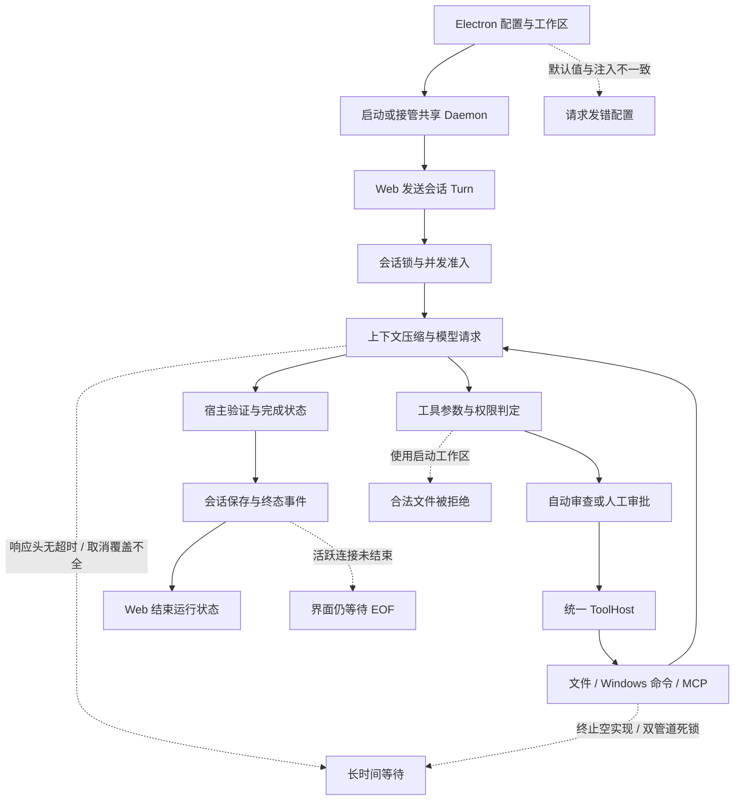

# Agent 任务执行可靠性审查与优化方案（Electron 主入口）

> 后续扩展审查：[项目非桌面链路与 CLI 进度审查及优化方案](项目非桌面链路与CLI进度审查及优化方案-2026-10-10.md)，覆盖 CLI/TUI、Daemon、Goal、Workflow、Automation、Cloud、备份与契约检查。

> 审查日期：2026-10-10（Asia/Shanghai）
>
> 源码基线：`c45cd2575b2ceae0cc1b7875362398f17e39c7d0`。
>
> 用户确认的入口：Electron 桌面客户端。审查范围为 `agent-sdk/`，未修改产品源码、根目录历史输入法工程或用户已有文件。
>
> 本文是当次源码审查与轻量验证结论，不是当前安装包、真实模型任务或桌面真机的最终验收报告。

## 1. 核心判断

项目已经具备真正的 Agent、工具宿主、审批、持久化事件、Daemon 和 Team 编排实现。“经常无法执行任务”不能简单归因于模型不够聪明或功能没有实现。

当前更值得优先处理的是执行链的可靠性：**命令终止接口空实现、Windows 输出管道可能死锁、配置展示与实际模型配置分裂、会话工作区与权限工作区不一致，以及多个等待阶段没有完整的超时和取消闭环。** 这些问题会使用户看到“执行中”“等待审批”“模型未配置”“路径越界”，或等待很久却没有文件结果。它们发生在主执行路径上，加大模型调用额度或增加 Agent 数量不能解决。

本次没有拿到一条具体失败任务的完整日志，也没有启动用户实际使用的安装包，因此不能把用户所有历史失败归到某一个原因。以下清单给出确定的源码缺陷、受控输入下已复现的桌面问题，以及需要进一步实测的风险；不填报未经测量的失败率。

优先级定义：

- **P0**：正常任务的基础执行路径存在严重阻断，优先于新功能开发和发布。
- **P1**：特定场景下任务卡住、误拒绝、取消不生效、状态或结果不可靠。
- **P2**：性能、诊断、兼容性或验收能力缺口，需在基础闭环修复后收敛。

证据标记：

- **R**：本次使用当前 JavaScript 实现和合成输入复现；不等同于 GUI 或云端实测。
- **S**：当前源码及实际调用链能确认；涉及 Rust 的运行表现尚未在本次执行。
- **V**：源码表明存在风险或证据缺口；频率、耗时、资源影响需实测。
- **H**：仓库历史运行记录；只说明记录中的版本和样本。

## 2. 本次验证与限制

### 2.1 实际执行的检查

| 检查 | 本次结果 | 能证明的范围 |
| --- | --- | --- |
| 工作树与提交身份 | 已读取；保留所有既有修改和未跟踪文件 | 审查基线和修改边界 |
| Electron 纯逻辑测试 | 38/38，通过，Node 退出码 0 | 壳监管、配置桥、工作区状态等现有契约 |
| 任务执行相关 Web 定向测试 | 130/130，通过，Node 退出码 0 | API、终态、重放、恢复、模型路由、权限等已有测试 |
| Web 完整测试，58 个文件 | 680/684 通过；4 项失败，Node 退出码 1 | 首次完整检查的真实结果 |
| 4 项 HTTP 测试单独诊断 | 全部为 `connect EACCES 127.0.0.1` | 失败发生在受限环境的本机连接阶段 |
| 同 4 项在宿主环境复验 | 4/4，通过，Node 退出码 0 | 本机 HTTP 测试在允许连接的环境可通过 |
| 审查探针 | 6/6 观察成立，退出码 0 | 配置分裂、环境残留、超时变量分裂、日志仅配对脱敏、无数据流等待、终态后等 EOF |
| Rust 编译、Rust 测试、clippy | 未运行 | 本文不声称 Rust 运行回归通过 |
| 真实模型、Electron 可见窗口、安装包 | 未验收 | 本文不声称真实任务成功或发布完成 |

完整前端测试的 4 项失败**不列为产品缺陷**：隔离复验已找到 EACCES 原因，宿主复验全部通过。也不把分环境复验写成“第一次完整套件全部绿色”。38、130、684 之间有覆盖重叠，不能相加为独立案例总量。

资源检查复用仓库 `scripts/ci-shared.ps1`：当时内存探测返回 `status=unknown, ok=false`，不能确认满足 Rust 资源门；D 盘约 124.6 GiB 可用只是工作树卷信息，不代表实际 Cargo 构建卷。本次以审查文档为交付物，没有启动 Rust 构建，不存在可填报的 Cargo 成功或资源拒绝退出码。

### 2.2 证据文件

证据目录：[task-execution-audit-20261010](qa/evidence/task-execution-audit-20261010/README.md)。

- [check-summary.json](qa/evidence/task-execution-audit-20261010/check-summary.json)：测试分组、退出码、环境限制。
- [probe-results.json](qa/evidence/task-execution-audit-20261010/probe-results.json)：6 个合成输入探针的结果。
- [source-manifest.json](qa/evidence/task-execution-audit-20261010/source-manifest.json)：27 个关键源码文件的 SHA-256 与行数。
- `electron.log`、`web_execution_contracts.log`、`web_full_suite.log`、`boot-http-isolated.log`、`boot-http-host.log`：原始检查输出。

探针中的开放流只观察了 120ms；这不是延迟基准。其用途是证明当前代码直到流关闭才推进完成或重放，结合源码缺少相应看门狗定位控制流缺口。所有输入均为合成数据，云端调用数为 0。

## 3. Electron 实际执行链与失败传播



几个典型的故障组合比单个问题更危险：

1. **大量 stderr → 输出死锁 → 60 秒超时 → manager.kill 返回假成功 → 再 await 等待任务 → 会话锁一直占用。**
2. **显示已选择 Ollama → 没向核心注入本地默认端点 → 核心落到云端默认 → 没凭据或模型不匹配 → 用户认为本地模型不能执行。**
3. **旧会话位于项目 A → 新选择项目 B 重启服务 → 打开 A 会话 → 绝对路径按 B 的 Policy 校验 → 文件读写被拒绝。**
4. **流式请求连接成功但不发响应头 → 核心无阶段超时 → 浏览器等待持续 → 刷新断开只在后续事件时被核心发现 → 新提交可能持续收到会话忙。**
5. **已输出 Final 或 turn_stats → 核心/传输尚未关闭 → Web 等 EOF 才 finish → 用户看到结果但仍不能发下一条。**

## 4. 问题总表

| 编号 | 优先级 | 问题 | 证据 | 首要归属 |
| --- | --- | --- | --- | --- |
| F-01 | P0 | Windows 管理器终止进程为空实现，超时仍可能无限等待 | S | tool-safety、core command |
| F-02 | P0 | 默认 JobOnly 分支串行读取 stdout/stderr，可能管道死锁 | S | tool-safety |
| F-03 | P0 | Provider 展示默认值与核心环境注入不一致 | R+S | Electron |
| F-04 | P1 | 超时/温度配置未接入主模型请求，清空值有残留 | R+S | Electron、gateway |
| F-05 | P1 | 模型响应头、结束标记和流解析的等待边界不完整 | S | gateway |
| F-06 | P1 | Web 开放流无无进展恢复，收到终态仍等 EOF | R+S | desktop/web |
| F-07 | P0 | Policy 仍用启动工作区，文件执行用会话工作区 | S | policy、core、server |
| F-08 | P1 | 取消与 Deadline 未贯穿串行工具、压缩及审批模型 | S | core runtime |
| F-09 | P1 | 命令固定资源/时间限制缺少任务级协商与诊断 | S+V | command、policy |
| F-10 | P1 | 半开熔断探测取消后可能永远占用探测槽 | S | gateway resilience |
| F-11 | P1 | 启发式安全审查对惰性代码/说明文字误拒绝 | S | autoreview、policy |
| F-12 | P1 | 审批先发布后登记，超时拒绝缺少明确原因 | S | core、server approval |
| F-13 | P1 | 切项目/保存模型配置会重启核心并中断其他任务 | S | Electron、Daemon lifecycle |
| F-14 | P1 | 无行动结果也可 response_complete，UI 混为完成 | S | completion、desktop/web |
| F-15 | P1 | 断连、部分输出与 Session 恢复之间仍有断点 | S+V | turn、session、desktop/web |
| F-16 | P1 | MCP 写工具超时后盲目重连重试，可能重复副作用 | S | MCP、ToolHost |
| F-17 | P2 | MCP/技能/工具快照与配置生命周期不统一 | S+V | registry、serve、settings |
| F-18 | P2 | 每个增量同步写 SQLite，其他层仍可累积输出 | S+V | event store、core、sandbox |
| F-19 | P1 | Provider 方法的 fallback 语义不一致，缓存先构造再查 | S | gateway resilience |
| F-20 | P2 | 失败用量、未知 usage 与价格缺失的表达不完整 | S | gateway、usage、protocol |
| F-21 | P1 | Electron 明文落盘凭据，日志只脱敏 pairing | R+S | Electron、credentials、logging |
| F-22 | P2 | Electron 构建身份比较口径错误，接管可见性不足 | S | Electron、build-info |
| F-23 | P2 | Team 多处状态投影和注册表构建错误信息丢失 | S+V | WorkSwarm、server |
| F-24 | P2 | Team 尚无稳定收益证据，增加额度不能替代质量闭环 | H+V | ProductEval、Team policy |
| F-25 | P2 | 默认宿主仍携原生感知和评测依赖，验证成本高 | S+V | Cargo features、server/cli |
| F-26 | P2 | 测试与诊断缺少关键故障场景，成熟度未形成验收闭环 | S+V | QA、protocol、capabilities |

## 5. 详细问题、影响与修复方案

### F-01：Windows 终止接口返回成功却没有终止进程（P0，S）

**源码证据**：[sandbox/windows.rs](../crates/owo-agent-tool-safety/src/sandbox/windows.rs) L1163–1165 的 `WindowsSandboxExecutor::kill` 直接返回 `Ok(())`；[sandbox/mod.rs](../crates/owo-agent-tool-safety/src/sandbox/mod.rs) L750–757 的 `SandboxManager::kill` 调用它并记录“Killed”。[tools/command.rs](../crates/owo-agent-core/src/tools/command.rs) L266–289 超时后调用 manager.kill，再 `wait_task.await`。L95–111 的 kill_shell 同样经 manager，随后无条件把 done 设为 true。

**触发与表现**：进程一直等待网络、锁或输入时，60 秒超时不能结束等待；kill_shell 可能显示已停止但进程仍在。CPU 上限限制的是 CPU 时间，不能终止主要处于等待中的进程。虽然 `WindowsProcess::kill/drop` 有真实 OS 终止实现，它不等于 manager 对外使用的句柄终止路径已接通。

**修复**：由执行器持有受控进程/Job 的可终止句柄映射；manager.kill 必须定位本宿主创建的目标，调用真实终止并核实结束。使用退出/终止状态机，避免把“请求已发送”当“进程已结束”。超时后的清理等待也必须有独立上限，失败返回 `executor/cleanup_failed` 和任务身份；不得无限 await。

**验收**：真实 Windows 主进程和子进程树，在超时、用户取消、kill_shell、Daemon 退出时均于清理预算内结束；注入 kill 失败时不得报告 killed=true。测试必须覆盖 manager.kill，不能只测 `SandboxProcess::kill`。

### F-02：默认命令分支可能发生 stdout/stderr 死锁（P0，S）

**证据**：[tools/registry_support.rs](../crates/owo-agent-core/src/tools/registry_support.rs) L143–150 将工具执行设为 JobOnly；[sandbox/windows.rs](../crates/owo-agent-tool-safety/src/sandbox/windows.rs) L566–604 使用 piped stdout/stderr 并返回 StdChild；L1014–1022 先把 stdout 读到 EOF，再读 stderr。另一个 OsChild 分支 L1035–1042 已并行读取，问题在默认命令使用的 StdChild 路径。

**触发**：编译器、包管理器或测试把大量内容写到 stderr，stderr 管道满；子进程等待管道被读取，宿主等待 stdout EOF，而 stdout 要等子进程退出才能关闭。再叠加 F-01，超时不能可靠解锁。

**修复**：两个分支统一为并发排空 stdout/stderr；由同一个受控进程任务管理 reader、退出、取消和 Job 生命周期。持续排空但只保留有界预览，完整输出写有界日志或 Artifact。不能通过少捕获 stderr、扩大缓冲或放宽超时解决。

**验收**：只写 stderr、交替写两个管道、子进程保留管道句柄、输出超过预览上限、取消期间仍持续输出，都不能卡死或无限分配。

### F-03：显示的 Provider 默认值没有进入实际启动环境（P0，R+S）

**证据**：[shell-commands.js](../desktop/electron/src/main/shell-commands.js) L74–85、L124–147 按 provider 解析展示默认端点/模型；[main.js](../desktop/electron/src/main/main.js) L356–359 只在文件字段非空时设置 OPENAI_BASE_URL/OPENAI_MODEL。shell-commands.js L283–286 的配置 patch 没有把展示默认值归一到启动配置。

**复现**：仅提供 `provider=ollama`，base_url/name 为空，状态显示本地端点且 ready=true；当前 coreEnv 没有注入本地端点和模型。若也没有外部环境覆盖，Rust 将读取内置云端默认；若继承了旧环境，则可能继续使用旧端点。探针并未实际调用 Ollama 或云端。

**修复**：一个纯函数生成 `ResolvedProviderConfig`，由状态展示、配置校验、环境注入和请求诊断共用。Ollama 要查询或选择确实存在的模型，不能把“local”这类显示默认值当成已安装模型的证明。切换 provider 时同时处理 `OWO_PROVIDER` 等实际协议选择变量。

**验收**：每个 provider 的省略字段、显式字段、清空字段、继承环境、无凭据、本地自定义端点，对展示状态和实际请求端点/模型逐项对账；凭据只比较存在性，不输出正文。

### F-04：配置可见但主请求不消费；清空配置无法清除旧环境（P1，R+S）

**证据**：[main.js](../desktop/electron/src/main/main.js) L361–374 注入 OWO_MODEL_TIMEOUT_SECS 与温度等变量；[agent/config.rs](../crates/owo-agent-core/src/agent/config.rs) L73–77 读入 AgentConfig。主 [gateway/provider.rs](../crates/owo-agent-core/src/gateway/provider.rs) L618–623 消费的是 OWO_MODEL_REQUEST_TIMEOUT_SECS / OWO_MODEL_STREAM_IDLE_TIMEOUT_SECS；L387–404 的请求体没有 temperature。request_timeout_secs 在 WorkerRuntime 有消费者，主 Turn 没有相同接线。

coreEnv L349 先继承 process.env，随后只覆盖正数/非空字段，清空 timeout/base_url/name 并不会删除继承值；切换 UI provider 也不清理继承的 OWO_PROVIDER。探针已验证残留以及超时变量分裂。

**影响**：用户调整设置却看不到变化，设置页与真实执行行为不一致；输入大于 600 秒的主网关超时按网关解析回退，而壳校验允许的 timeout 范围另有口径，也没有明确诊断。

**修复**：定义配置字段表，逐项指定“未设置、继承、明确清除”的语义；输出有效值及来源。主调用与 Worker 用统一 ProviderConfig，但区分连接、响应头、首事件、无进展和工具预算。温度只对支持的 provider 下发，禁用或未支持时明确展示。删除无人消费的字段，或完成真实接线。

**验收**：保存后的真实受控请求捕获必须证明 timeout 和 temperature 有效；清空、重启、切 provider 后不能保留不符合用户意图的旧配置。

### F-05：模型等待阶段和结束语义不完整（P1，S）

**证据**：[gateway/provider.rs](../crates/owo-agent-core/src/gateway/provider.rs) L127 仅设置 connect_timeout；L239–268 只给非流式请求设置总 timeout；L662 等待 post_chat 返回后，L676 才开始 stream idle timeout。默认 [agent/config.rs](../crates/owo-agent-core/src/agent/config.rs) L144 的 turn_deadline=None。

[stream.rs](../crates/owo-agent-core/src/gateway/stream.rs) 收到 DONE 只设置 saw_done；provider 仍读取直到 EOF，再检查结束原因。按原始网络 chunk 重置空闲计时，也不能辨别只有心跳而无模型进展的响应。

**触发**：已建立连接但一直没有响应头；错误响应体一直不结束；兼容服务发送 DONE 后保留连接；持续发送注释/心跳而不输出正文或工具调用。后两种场景有网络活动，却没有业务进展。

**修复**：分别为 response_headers、first_semantic_event、semantic_idle 和可选的任务截止时间设预算；收到明确结束标记后进入协议规定的收尾，允许获取必要 usage，但不等无限 EOF。对错误体读取设大小和时间上限。保留合法长输出能力，不给整个流统一套一个固定短墙钟限制。

**验收**：本地故障 Provider 分别注入上述场景，要求阶段码、可取消性、终态唯一及部分结果保留均符合契约。

### F-06：Web 流消费在无数据和已终态后都可能继续等待（P1，R+S）

**证据**：[turn-sse.js](../desktop/web/core/turn-sse.js) L96–126 始终 reader.read 到 EOF；只有离开 read 循环才开始 durable replay 或 completion.finish。[app-domain.js](../desktop/web/app-domain.js) L1088–1139 也只有 consumeResponse 返回后才从 activeTurns 清除。

**复现**：开放且无数据的 ReadableStream 不进入 replay；已收到 final 和合法 turn_stats 的开放流仍 pending，close 后才结束。现有终态测试多数用已关闭 Response，未覆盖“收到终态但连接未关闭”。

**修复**：客户端增加传输无进展检测，先查询权威任务状态再决定重放/重新订阅；让宿主最终状态可结束任务视图，明确终态后的日志/审计事件是否还允许追加。不要仅靠 final 停止，也不要盲目重发 POST turn。新协议以持久 Turn 状态为完成依据，兼容历史保存失败尾事件。

**验收**：无数据但 active、有心跳无进展、已持久终态但连接不关、EOF 缺终态、后续保存失败、重放分页、重复事件、刷新后重新接管。

### F-07：文件权限和文件执行使用不同工作区（P0，S）

**证据**：服务只构造一份 Policy，见 [CLI support](../crates/owo-agent-cli/src/support/mod.rs) L158–162；[turn.rs](../crates/owo-agent-core/src/agent/turn.rs) L636–640 用 self.policy 判定。[permissions.rs](../crates/owo-agent-policy/src/permissions.rs) L660–670 对 read_file/write_file 仍相对 Policy.workspace 校验，而 [registry_support.rs](../crates/owo-agent-core/src/tools/registry_support.rs) L67–95 已改成以 ctx.workspace，也就是 Session.workspace 为边界。

**表现**：会话 A 与服务启动目录 B 不相同，读取/写入 A 的绝对路径会被 Policy 拒绝；同一操作换成相对路径可能按 B 校验、按 A 执行。list_dir/search_files 又走另一种判定，表现不一致。这是历史“路径越界”修复的剩余断点，不能说它已完全解决。

**修复**：在统一 ToolHost 内以会话已验证的 canonical workspace 构造 request-bound 权限上下文；Policy 的档位、deny、grant 等规则可共享，路径基座及授权身份必须跟 Session 一致。文件、命令 cwd、Grant.workspace_id、Artifact 根同步核对。不要用 Unrestricted 掩盖错误。

**验收**：服务在 A 启动，A/B 两个会话分别执行相对/绝对路径读写；允许合法会话内操作，拒绝 ../、符号链接逃逸和未授权越界。跨会话授权不得串用。

### F-08：取消和预算没有覆盖全部 await（P1，S）

**证据**：主模型请求在 [turn.rs](../crates/owo-agent-core/src/agent/turn.rs) L199 附近有 abort select，并发读工具也有；串行工具 L1014–1036 只有可选 Deadline，没有 abort select。[agent/mod.rs](../crates/owo-agent-core/src/agent/mod.rs) L588–591 的压缩模型请求没有传入 abort；turn L645–650 的自动审批模型直接 await，L696 的人工等待虽然能检查 abort，但前面的模型审批阶段没有同样覆盖。

**影响**：点击停止时，模型阶段能停止，串行命令/MCP、压缩或审批模型却可能继续等待。某些阶段使用固定请求重试，取消不及时释放会话与并发槽。设了 turn_deadline 也不等于所有阶段都已遵守它。

**修复**：把 CancellationContext 与 DeadlineContext 传到 Provider、ToolHost、压缩、Reviewer、MCP 和执行器。对命令不仅 drop future，还必须终止并等待 OS 进程；spawn_blocking 已启动任务不会因丢弃 JoinHandle 自动停止。收尾要单独有界，收据记录“取消请求/已停止/清理失败”。

**验收**：在每个阶段设置可控阻塞点，测量取消确认和进程回收时间；取消后不得启动新请求、执行新写入或保留审批槽。

### F-09：命令硬预算限制缺少可解释的任务配置（P1，S+V）

**证据**：[tools/command.rs](../crates/owo-agent-core/src/tools/command.rs) L138–158 固定墙钟最多 60 秒、CPU 60 秒、Job 内存 1024 MB、活动进程最多 16。后台执行虽然早返回，也沿用这类资源策略。当前模型不可通过普通工具 schema 请求更长墙钟；宿主超时即便更大也被 clamp 到 60000ms。

**影响**：大型 Rust 编译、安装依赖或重原生链接可能超过合法资源预算；用户只能看到通用失败，模型随后反复重试。是否是用户实际任务的主因，本次未测量。

**修复**：保留硬资源限制，但提供任务级预算准入和可见拒绝原因。短命令、构建验证和后台服务采用受信宿主认可的不同配置，未经授权不能自行放宽。仓库内 Rust 任务应调用现有 ci-shared 管理的 runner，遵守 -j、测试线程、内存/磁盘和心跳规则。前端显示具体是哪一项上限触发，而不是建议反复增加模型额度。

**验收**：超预算正确拒绝、长验证经宿主授权成功执行、失败保持真实退出码；取消和输出限制仍有效，不能通过 background 绕预算。

### F-10：半开熔断探测被取消后可能永久占槽（P1，S）

**证据**：[resilience.rs](../crates/owo-agent-core/src/gateway/resilience.rs) L158–170 的 HalfOpen 探测通过 AtomicBool 抢槽，只有 record_success / record_failure / reset 释放；L612–660 请求执行依赖未来返回结果后更新。外层 Turn 的 abort select 会直接丢弃该未来。

**触发**：连续失败打开熔断；冷却后允许一个探测；用户在探测未结束时取消。没有 Drop guard 清理 half_open_probe，后续请求可能持续被拒绝，即使已过冷却时间。等待下一次 cooldown 本身不能释放这个标志。

**修复**：以 RAII ProbePermit 绑定探测生命周期；取消/超时/drop 后归还槽，并区分取消和 Provider 失败。熔断按有效配置/端点隔离，配置修复后不继续受旧实例错误影响。

**验收**：closed/open/half-open 每种状态下取消、panic、Deadline、并发探测；下一次合法请求可按政策进入，不会永久拒绝。

### F-11：启发式预筛可能误伤正常 Agent 开发任务（P1，S）

**证据**：[autoreview.rs](../crates/owo-agent-core/src/autoreview.rs) L35–117 将工具名、reason、完整 args 和 context 拼成字符串后用 contains；黑名单包含“system prompt”“ignore previous instructions”“powershell -enc”等。默认服务总是挂启发式链，见 [support/mod.rs](../crates/owo-agent-cli/src/support/mod.rs) L225–251。沙箱 deny_hit 也是子串匹配，默认 deny_programs 包含“format”，见 [sandbox/mod.rs](../crates/owo-agent-tool-safety/src/sandbox/mod.rs) L107–110、L206–213。

**触发**：正常写一个讨论 system prompt 的文档、包含注入检测样例的测试，或运行包含 format 文本的普通命令。惰性文件内容与真实指令效果没有区分。turn 传给 Reviewer 的 context 取 session.messages.last，也未明确绑定本次完整用户意图。

**修复**：保留 deny 优先和独立审查，把“执行行为、数据内容、引用样例、可信用户意图”分开建模；命令解析到程序和关键参数再匹配危险动作。低置信命中转到解释充分的人工审批，真正危险操作仍硬拒绝。拒绝应返回 rule_id、命中类型和可修复方向，不输出秘密。

**验收**：合法安全测试/说明文字不被当指令执行；真实注入、危险外泄、破坏性命令仍被拒；已授权的正常任务不因无关旧上下文误伤。

### F-12：审批生命周期存在发布与登记竞态（P1，S）

**证据**：[turn.rs](../crates/owo-agent-core/src/agent/turn.rs) L689–696 先 emit PermissionRequest 再 await approver.decide；[approval.rs](../crates/owo-agent-server/src/turn_api/approval.rs) L116–137 才注册 pending oneshot 和 session 关联。两个 HashMap 也不是一次原子发布。[handlers.rs](../crates/owo-agent-server/src/turn_api/handlers.rs) L511–534 响应端查不到登记即 404。L139–158 超时、通道关闭、取消都归入 Decision::Deny。

**影响**：在事件传输与多线程响应交错时，快速响应可先于登记；超时后的旧卡也无法区分“已作废”和“未登记”。300 秒等待不是无限等待，但在多工具串行审批时仍很长。写/执行不能生成复用 Grant 是当前安全契约，不应为了减少等待直接改成长期放行。

**修复**：宿主先原子创建 PendingApproval，再发布事件；绑定 session/turn、expiry 和状态，响应幂等。区分 user_denied、timeout、aborted、channel_closed、policy_denied。在订阅重连时提供有效 pending 快照，过期事件不能复活审批。

**验收**：同步收到事件就立即响应、并发重复响应、超时边界响应、取消与响应竞争、页面刷新、跨会话错误响应，全有确定结果与审计。

### F-13：修改项目或模型配置会中断其他运行中的任务（P1，S）

**证据**：[main.js](../desktop/electron/src/main/main.js) L1255–1276 的 applyModelConfig / setWorkspaceTarget 均 userInitiated startCore；L594–596 先 killCore。killCore L544–560 请求 shutdown 后 1.5 秒强杀兜底，而 [serve.rs](../crates/owo-agent-cli/src/commands/serve.rs) 的服务关闭路径允许约 30 秒 drain。新启动并不 await 旧进程完整退出。

**影响**：用户只是给新会话换目录，或调整输出参数，旧会话仍可能被杀；重启 UI 导航导致流断开和草稿状态变化。新旧服务竞争数据目录/启动锁，也增加偶发失败。该行为会放大 F-07 的跨会话工作区问题。

**修复**：会话工作区不应通过重启全局 Daemon 实现。模型配置采用校验后的配置版本热切换，只影响新的模型请求；必须重启的原生变更先展示受影响任务并 drain。管理生命周期要 await stop → 回收 → start，并协调同一数据根的唯一实例锁。

**验收**：A 正在执行时创建 B、切换 B、保存模型配置；A 不丢回合。必要重启有可读状态、可取消和明确恢复规则。

### F-14：回答结束与任务完成的区分仍不足（P1，S）

**证据**：[completion.rs](../crates/owo-agent-core/src/completion.rs) L81–95 在没有 candidate 变更时返回 ResponseComplete；[single_completion.rs](../crates/owo-agent-core/src/agent/single_completion.rs) L124–144 无当前变更且无计划时不检验本次行动是否完成。[app-domain.js](../desktop/web/app-domain.js) L1095–1099 把 response_complete/candidate 等都映射成 completed，只有 unverified/blocked 是 failed。摘要卡会展示 candidate 等标签，但主运行状态仍可能混淆。

**影响**：模型只说“可以这样做”，宿主能证明回答结束，却不能证明用户要求的文件/命令/产物已完成。工具曾被拒绝而无 candidate 时，也可能出现 response_complete。代码已完成但未验收又是不同情况，不应统一显示失败。

**修复**：请求入口建立 `TaskIntent` 与明确交付项：纯问答可 response_complete；行动任务必须有已执行收据/产物/验证，或明确 blocked/no_action。UI 展示“回答结束”“变更待验收”“已交付”“阻断”“已停止”，并显示最后可执行的恢复动作。不依赖简单关键词推断所有任务，更不能让模型自报成功替代宿主证据。

**验收**：要求创建文件但没写、工具全部拒绝、只读分析、源码候选、验证成功、验证失败，分别得到准确的完成状态。

### F-15：断连检测、部分输出与恢复状态没有完全贯通（P1，S+V）

**证据**：[queue.rs](../crates/owo-agent-server/src/turn_api/queue.rs) L65–72 只有 push 时检查消费者消失；[handlers.rs](../crates/owo-agent-server/src/turn_api/handlers.rs) L276–288 才设置 abort。若正等待无输出的模型响应头，就没有新 push 来触发。主 Turn 的 delta 进入事件而不是即时进入 messages，错误分支 [turn.rs](../crates/owo-agent-core/src/agent/turn.rs) L238–253 提交已有 messages；失败 Trace 在 [trace.rs](../crates/owo-agent-core/src/trace.rs) 使用空 events。持久事件虽存在，Web 活跃回合只保存在内存 activeTurns，当前 sendPrompt 的 replay 依赖在途响应头中的 turn_id。

另一个状态风险：[handlers.rs](../crates/owo-agent-server/src/turn_api/handlers.rs) L103 在获取会话执行锁之前 clone Session，L171–180 才抢锁。上一回合恰好在这段窗口结束时，新回合有机会获得锁但拿着旧快照，造成历史或元数据覆盖。

**修复**：由独立连接守卫/任务生命周期处理断连，产品上明确“继续后台执行”还是“请求取消”，不要用是否又发了事件偶然决定。提供持久 active/current turn 查询，刷新后按 turn_id+cursor 重新附着。保存部分正文为 interrupted 结果并与审计事件关联。会话锁到手后再加载权威 Session，元数据更新同样采用版本/锁契约。

**验收**：首 token 前断连、token 后断连、工具写完但模型失败、刷新、双客户端交替提交、上一回合结束窗口提交。历史不丢，重复写不发生，忙状态可恢复。

### F-16：MCP 超时重试没有考虑副作用（P1，S）

**证据**：[mcp.rs](../crates/owo-agent-mcp/src/mcp.rs) L455–473 对所有 stdio tools/call 的超时统一重连并重试一次，没有工具 effect 或幂等身份。上层 [mcp_adapters.rs](../crates/owo-agent-core/src/tools/mcp_adapters.rs) 经客户端调用，但客户端的此分支不知道请求是否已经执行。

**影响**：服务可能已写文件、提交或发送外部操作，只是响应丢失；自动重试再次执行。既损坏结果，也可能制造难以解释的失败与审批记录。不是只有联网操作有这个问题，本地写工具也可能有。

**修复**：传入宿主认可的 effect、request_id 和 idempotency 语义。仅对证明无副作用的读取自动重试；写入结果不确定时进入 outcome_unknown，提供查状态/人工恢复，避免自动重放。重连恢复 transport 与重新执行 operation 要分开。

**验收**：假服务“执行写入但丢响应”，计数只增加一次；只读超时按政策可重试；取消时不得在重连完成后启动旧写操作。

### F-17：工具能力的生命周期与会话配置不一致（P2，S+V）

**证据**：[support/mod.rs](../crates/owo-agent-cli/src/support/mod.rs) L210–222 只按服务启动工作区设置注册 browser/desktop 工具；技能也在启动时发现。[turn.rs](../crates/owo-agent-core/src/agent/turn.rs) L85–90 在回合开始生成一次 tools 快照，后续模型轮次复用。MCP 已后台加载，注册可能晚于首回合。

**影响**：用户切到另一个工作区，那里启用了 browser/desktop 能力，却不一定进入当前工具注册表；回合开始时 MCP 未 ready，之后连接成功也不会自动进入该回合的模型工具清单。此时“工具不可用”可能是配置作用域或加载状态，不是模型不愿意执行。

**修复**：能力注册是宿主级，允许性和使用配置是会话级；按明确版本快照派发工具，工具变化只在安全的模型边界刷新。UI 显示未启用、正在加载、连接失败、已卸载等状态与设置来源。工具热卸载仍必须在执行前复核。

**验收**：MCP 延迟 ready、回合中卸载、不同会话能力设置、启动后安装技能，行为可解释且不能绕权限。

### F-18：SSE 已有界，但资源边界并没有覆盖所有层（P2，S+V）

**证据**：Turn HTTP 队列已有 128 事件/1 MiB 上限；全局 SSE 与 Cloud HTTP 转发也已用有界队列，不能沿用旧“转发层都是 unbounded”的结论。

剩余问题：[queue.rs](../crates/owo-agent-server/src/turn_api/queue.rs) L188–192 先同步 append_turn_event 再入 HTTP 队列；[sqlite_store/mod.rs](../crates/owo-agent-core/src/sqlite_store/mod.rs) L433–475 对每次事件拿全局连接锁、开 Immediate 事务并提交。[agent/mod.rs](../crates/owo-agent-core/src/agent/mod.rs) L1027–1033 仍把全回合事件保存在 Vec；[stream.rs](../crates/owo-agent-core/src/gateway/stream.rs) 累积全文和工具参数；[sandbox/windows.rs](../crates/owo-agent-tool-safety/src/sandbox/windows.rs) L958–977 读取完整输出到 Vec。background ShellOutput 也先读取整份日志再截预览。

**影响**：token 事件多时数据库锁/磁盘延迟进入模型回调热路径；上层队列有上限并不能阻止底层先分配大输出。长任务默认不限轮数时，累计内存和持久事件体积尤其需要控制。这里未测出实际 P95 或内存增幅。

**修复**：批量持久化小增量（例如可配置的 20–50ms 合并窗口），关键审批/工具/终态保持有序且必须确认持久化；独立 writer 有界准入，存储故障不能伪造成功。保留摘要事件而不是无限保留全文 delta；原始工具输出流向有界 Artifact。记录队列字节、写入耗时、积压和丢弃/中断原因。

**验收**：慢磁盘、慢客户端、大量 stderr、连续多轮工具、超大 JSON 参数，内存/磁盘/队列不持续无界增长，文本顺序和回放游标仍一致。

### F-19：Provider 恢复方法之间的语义不一致（P1，S）

**证据**：[resilience.rs](../crates/owo-agent-core/src/gateway/resilience.rs) 非 observed 调用遇不可重试错误会退出 provider 链；主回合使用的 observed 思考流 L649–658 只退出当前 provider 的内循环，随后仍进入后续 fallback。非流式 observed 路径有相同分支差异。

DeferredProvider L721–744 先构造新的 HTTP Provider，再查看 cached 指纹是否命中；即使最终复用旧实例，也已付出构造成本并可能因构造错误提前失败。fallback 在 from_deferred 启动时构造，主 provider 则每次热解析；配置生命周期不一致。

**影响**：预算、认证或策略拒绝本应终止，observed 方法却可能继续向其他端点请求；fallback 的模型/凭据/配置可能滞后。云端开关还应在最后发送前复核，不能只依赖某个启动配置快照。本次未启用 fallback 或验证真实出境，不宣称发生了泄漏。

**修复**：一个统一调用状态机处理 retry、fallback、partial、cancel、budget、egress 与 request observation；不可重试要终止整条链。用配置摘要先查缓存，miss 才构造，避免明文密钥组成长期缓存指纹。fallback 每项独立配置模型/凭据和允许范围，并参与当前出境策略。

**验收**：所有 Provider trait 入口在同一错误矩阵下行为一致；禁止类错误不触发 fallback；首个正文/思考/工具事件发出后的恢复不重复内容或操作。

### F-20：失败任务的用量与“未知成本”表达仍不完整（P2，S）

**证据**：[handlers.rs](../crates/owo-agent-server/src/turn_api/handlers.rs) L322–355 只在成功 outcome 中记录本回合 usage；错误分支没有同等的请求用量结算。Core 有 usage_known，但成功 TurnStats 没传相同完整性标记。输入/输出价格缺省被当成 0 进行 cost_usd 计算；部分 UI 聚合用 `cost_usd || 0` 展示。

**影响**：执行到后期失败的任务已有真实模型消耗，可能不进入 Server 会话预算；压缩、失败请求和缺失 usage 使表面统计低于真实开销。使用未知数据校准 Team 优势或预算，会得到错误结论。

**修复**：请求结束时结算观测（成功、失败、取消均覆盖）；unknown 保持 unknown，价格未设置时不填真实零成本。完成响应带 usage_complete、pricing_configured、failed_request_count。模型总预算使用请求预留和实际结算，不能依赖只有成功回合才更新的汇总。

**验收**：usage 尾帧、用量后网络失败、缺失 usage、压缩调用、取消、无价格、并发会话，账目无静默漏记或零值伪装。

### F-21：Electron 凭据落盘与仓库约束冲突，日志脱敏不足（P1，R+S）

**证据**：[main.js](../desktop/electron/src/main/main.js) L307、L327–340 将 api_key 写进 config.json；icacls 失败被忽略；L377–384 优先使用文件密钥。L230–232 的 redactSecrets 只替换 pairing。探针用非凭据 canary 验证其它文本不受处理；Provider 也可把远端原始错误体写入 debug/错误消息。

**影响**：这与“模型凭据只经环境变量注入、不写配置”的现行 AGENTS.md 冲突。明文配置还可能遮蔽已更新的环境凭据，导致持续认证失败；日志或诊断导出不能据 pairing 脱敏就声称所有秘密安全。未读取或回显用户真实密钥，未声称已发生泄漏。

**修复**：按照现行约束移除持久化 api_key，配置只保存环境变量名和存在性诊断。历史迁移必须保护原有可用配置并由用户明确决定凭据去向，不能静默删除。若产品确需系统凭据库，应先修改产品约束再接入已有 credentials 能力。集中对远端错误、Headers、URL、工具参数、日志导出脱敏，采用安全的 allowlist 字段。

**验收**：保存、重启、诊断导出、远端错误、旧配置迁移中没有秘密正文；更新环境凭据的来源能准确展示，不能被旧文件静默覆盖。

### F-22：构建身份比较不等价，接管核心缺少可见事实（P2，S）

**证据**：[main.js](../desktop/electron/src/main/main.js) L1291–1294 用核心 buildId 对比 `app.getVersion()`；[support/mod.rs](../crates/owo-agent-cli/src/support/mod.rs) L535–537 的核心 buildId 是 commit。Web 错误视图会直接比较两字符串。一个 git commit 与“0.1.0”不是同一种身份。adoptExistingCore L487、L525 仅按 API 验证且将 buildId 置空；coreCandidates L258–268 选第一个存在文件，不验证源码身份。

**影响**：正常包可能显示错配提示，旧核心接管又可能缺构建信息。源码修复与用户实际二进制是否一致难以判断。打包阶段已有 sidecar 身份检查，不能因为运行时缺口否认它，也不能据此推定用户正在用旧包。

**修复**：release manifest 中分别保存 shell_version、shell_commit、core_commit、api_version、hash；比较同一种身份。接管记录真实 health.build_id、数据根和有效配置版本，明确何时兼容、何时要求迁移/重启。开发启动也显示最终选中的 executable 与 commit。

**验收**：同源包无假警报、旧核心不会伪装同源、合法 API 兼容接管有完整诊断；发布仍核对当前源码、产物哈希和实际进程。

### F-23：Team 状态所有权和错误归因仍需收口（P2，S+V）

**证据**：[coord_run.rs](../crates/owo-agent-core/src/workswarm/coord_run.rs) L304–370 创建阶段 sub_state，L423 再构造 GoalRunner；进度与结束需要投影回 durable state。已有 epoch/attempt fencing、持久准入、预算 ledger 修复，不能再将它们描述成未实现。

[registry_builder.rs](../crates/owo-agent-server/src/workswarm_api/registry_builder.rs) build_run_registry 返回 Option，多个 load/预算/画像失败用 `.ok()?` 或 `as_u64()?` 丢掉具体原因；runtime 给出“Worker 注册表无法安全构建”，但未必能定位是哪项。角色预算目前已优先使用 resolved budget，不能直接复述 10-08 历史拓扑问题为当前未修复事实。

**风险**：多处状态与多个存储边界增加恢复/重试的维护成本，opaque None 又妨碍用户与开发者修复配置。是否在当前版本造成新执行失败需要故障注入。

**修复**：先把注册表构建返回值改成带 stable code 的 Result；再逐步迁移到唯一 RunCommand/RunEvent reducer，保留当前 epoch/attempt/租约、权限和预算约束。阶段只读投影不可成为另一状态所有者；跨存储写入采用可恢复 journal/outbox，不靠顺序写入假装事务。

**验收**：注册表每个失败点有明确原因；持久准入、取消、Human、返工、旧 attempt、部分写入崩溃与重启可重复验证。

### F-24：Team 需要收益证据，不能以更多调用额度替代（P2，H+V）

**历史证据**：[Single/Team 15 分钟实测记录](Team速度与交付质量问题解决报告-2026-10-08-实测.md) 只完成 1 组高额度配对：Single 71.530s/6 次模型调用/6 次工具/检查 6/8；Team 390.602s/24 次模型/24 次工具/检查 5/8。低额度试跑 Team 预算耗尽无交付。高额度 Team 总 usage 不完整，完整矩阵未完成。

**边界**：n=1 不能证明 Team 普遍更慢，也不能覆盖 10-09 的后续源码。它足以说明“加预算就能保证交付”“Team 已稳定更优”的结论没有依据。检查含报告标题等输出契约，不能把 6/8 直接等同于代码功能失败率。

**优化**：默认普通任务用 Single；需要并行宽度和独立评审的任务才使用合格 Team 计划。独立评审保留，失败反馈回原写者作有界返工；共享真实预算及可复用上下文，避免新增重复状态机。先建立成功率与交付证据，再调模型/角色预算和并发。

**验收**：冻结任务、验收项、模型配置、模板与预算，在相同输入条件下重复配对；报告墙钟、provider wait、工具、队列、验证、返工、token 完整性和最终交付率，保留失败格。阈值在测量前定义，结果无收益时 Auto 继续 Single。

### F-25：默认宿主的依赖与验证成本仍重（P2，S+V）

**证据**：Core 和 Perception default features 已为 []，不再沿用“Core 默认 STT”的旧结论；但 [server/Cargo.toml](../crates/owo-agent-server/Cargo.toml) 显式启用 core/stt；[perception/Cargo.toml](../crates/owo-agent-perception/Cargo.toml) 的 ort/ndarray 仍非 optional。Core 仍依赖 perception；server/cli 经 eval-facade 引入独立 ProductEval。crate 拆分未等于默认宿主构建隔离。

**影响**：普通聊天修复、检查和发布仍可能触发原生依赖或重链，降低回归频率；这属于迭代成本，不是本次已证明的任务运行根因。当前二进制大小/启动耗时和精确 feature 并集需要实际依赖图与构建验证。

**优化**：提供经过验收的基础 Daemon feature 组合；STT/OCR 等重能力通过明确 feature 或按需 worker 加载；生产宿主的评测路由采用开发构建开关。先以 cargo tree/metadata 和实际链接证据确认收益，再决定迁进程，避免继续机械拆包。

**验收**：基础 profile 在缺原生模型时可 ready 并执行文件/命令任务；高级能力健康独立可见；报告构建时间、产物身份和依赖图，不能只展示新的 Cargo.toml。

### F-26：现有绿色测试没有覆盖最危险的失败组合（P2，S+V）

本次大量前端契约通过，仍能用当前逻辑复现 6 个观察；Windows manager.kill 空实现和 StdChild 双管道等待也未被这些测试触达。已有 [os_sandbox_integration_tests.rs](../crates/owo-agent-core/tests/os_sandbox_integration_tests.rs) 等测试不能仅凭存在宣称这些路径已通过。能力目录 [capabilities.rs](../crates/owo-agent-server/src/capabilities.rs) 仍登记 5 Beta、2 Experimental、0 Stable，而且只覆盖部分能力。

**优化**：将“默认 Electron 入口下完成真实文件+命令任务”作为日常回归主线；增加少量故障注入测试覆盖本文 P0/P1 组合，静态 contains 检查只作为辅助。诊断提供任务级阶段、持续时间、错误码、恢复动作、可追踪身份，避免让用户从一堆模块面板推断为什么不能执行。

**验收**：同一版本证明入口→权限→执行→产物→审计→失败/取消/恢复；未配置与实验能力明确显示。只有本版本真实运行证据达到门槛才提升成熟度。

## 6. 为什么这些问题没有被现有测试充分暴露

1. **测试入口不同。** 纯配置函数测了显示默认值，但没有对账 main.js 的真实 coreEnv；测试进程 kill 与 manager.kill 也不是一条路径。
2. **正常流过于理想。** 已关闭 Response 让终态测试通过；真实等待时 EOF、响应头、错误体、后台管道句柄和浏览器生命周期可能不同。
3. **只校验单层边界。** HTTP 队列有界不代表整个 Agent/Provider/OS 输出有界；路径解析器修好不代表前面的 Policy 已同源。
4. **状态与执行收据含义不同。** 回答终态、工具调用成功、候选变更和最终交付需要不同证明；不能用模型的最终文字替代行动证据。
5. **验证证据跨版本。** 最近多次拆分和修复后，旧编译/测试/二进制报告不能覆盖当前工作树。当前轻量 JavaScript 检查也不能覆盖原生沙箱。
6. **缺少失败阶段的统计。** 没有 task 维度的 stage dwell、attempt、cleanup、usage completeness 和 error class，很容易把超时、误拒绝、配置失效都归成“模型不行”。

## 7. 分阶段实施方案

建议按可验收的波次实施。下列工作量仅作单人施工估算，依赖测试环境和实际回归结果，不是完成承诺；不自动启动并行 Agent。

| 波次 | 工作内容 | 对应问题 | 建议产物与退出条件 |
| --- | --- | --- | --- |
| A：基础执行止血，约 2–4 天 | 真实 Job 终止、双管道并发排空、有界收尾；Provider 配置单一解析；会话权限基座统一 | F-01/02/03/07 | Windows 真实命令结束证据；模型展示与实际请求对账；双工作区读写回归 |
| B：等待与恢复，约 3–5 天 | 接入有效超时配置；阶段看门狗；全链取消；半开探测守卫；审批先登记；持久 Turn 重新附着 | F-04/05/06/08/10/12/15 | 失败矩阵逐项得到明确终态；进程/审批/并发槽无残留 |
| C：交付与安全语义，约 3–5 天 | TaskIntent/行动证据；准确完成状态；精确 deny；MCP 重试按效果；配置热更新和受控重启；凭据约束收敛 | F-09/11/13/14/16/19/21 | 用户能解释阻断并恢复；无重复副作用、无假完成、无秘密正文 |
| D：性能与诊断，约 2–4 天 | 批量增量事件、有界输出/Artifact、失败用量、有效配置诊断、release 身份统一 | F-17/18/20/22/26 | 固定任务性能报告和故障诊断包；覆盖当前构建身份 |
| E：Team 与依赖收口，约 5–10 天 | Result 错误、唯一状态所有权、可恢复持久 journal；冻结配对任务；基础 Daemon 构建组合 | F-23/24/25 | Team 恢复/预算/交付契约通过；收益不达标不自动组队；依赖收益有测量 |

执行依赖：先修 F-01/02，之后才能可信地测命令超时和取消；先统一 F-03/04/07，之后才能做配置/跨项目验收；先完善 F-14/20，之后才比较 Single/Team 的质量与成本。不要同时重写权限策略、运行调度器和整个桌面框架。

每一波只改相关边界，保留已有 ToolHost、审计、拒绝规则、授权撤销、写租约、epoch/attempt 栅栏和幂等校验。不能用全权限、无审批或模拟成功替代验收。

## 8. 建议的运行契约

### 8.1 一个明确的 Turn 状态与配置版本

建议由 Server/持久存储维护：

```text
TurnIdentity:
  session_id, turn_id, execution_epoch, attempt_id, config_version

TurnState:
  queued → preparing → waiting_provider → running_tool
  ↔ waiting_approval / waiting_user
  → verifying → finalizing → completed / blocked / failed / cancelled

CompletionState:
  response_complete / candidate / accepted / unverified / blocked / aborted

Recoverability:
  none / retry_safe / inspect_outcome / reconnect / resume
```

运行阶段和完成质量是两个维度；不要再用一个 completed 同时表达“网络结束”和“交付验收通过”。配置版本绑定在请求边界上，不在已执行工具的途中隐式换端点或权限。

### 8.2 可解释、可恢复的错误

示例为设计建议，不是当前已有 DTO：

```json
{
  "code": "executor/process_timeout",
  "stage": "running_tool",
  "session_id": "<session>",
  "turn_id": "<turn>",
  "tool_call_id": "<call>",
  "retryable": false,
  "outcome_known": true,
  "cleanup_state": "confirmed_stopped",
  "message": "命令超过本任务预算，进程已结束",
  "recovery_action": "调整经宿主认可的验证预算后重试"
}
```

请求参数和密钥不放进错误。不能把未知执行结果说成已停止；若清理失败，必须改 code、outcome_known 和恢复建议。API 更改同步 protocol、路由契约、OpenAPI、TS 客户端及实际 Web 调用。

### 8.3 看门狗管理等待，不禁止合法长任务

普通 Agent 默认不限模型轮数/工具总量的当前产品契约继续保留。可靠性需要的是“每个不再取得进展的阶段可诊断和取消”，而不是把所有任务一律切成 60 秒。

建议首先配置并测量：

- 连接与响应头预算；首个有效模型事件预算；有效进展间隔。
- 人工审批/回答的可见有效期、取消、重新打开与过期状态。
- 任务级命令预算、实时心跳、stdout/stderr 字节上限、退出码。
- 独立 cleanup budget，结束后核验进程树、并发槽和 pending 状态。
- 可选的用户显式任务截止时间，以及 Worker/Team 各自的明确额度。

具体默认值应由固定任务测量确定；不能用合成流的 120ms 观察窗设置产品阈值。

## 9. 必须补充的回归与验收矩阵

| 场景 | 必须验证的结果 | 建议测试归属 |
| --- | --- | --- |
| 默认 JobOnly 命令持续写大量 stderr | 不死锁；输出有界；退出码真实 | core os_sandbox_integration、tools/command |
| 命令等待不退出，达到预算 | 真实终止进程树；清理有界；任务终态 | sandbox、server turn |
| kill_shell 与后台日志 | done 与 OS 事实一致，失败不冒充成功 | command、sandbox |
| 本地 Provider 只选类型、默认字段为空 | 展示、注入、请求端点/模型一致 | Electron coreEnv、受控 Provider |
| timeout/temperature 保存与清空 | 请求捕获证明生效/清除，来源正确 | Electron、gateway |
| 模型连接后不发响应头 | 对应阶段超时可取消，无永久 busy | gateway、turn |
| 模型发 DONE 后保持连接 | 正常完成，不等待无限 EOF | gateway |
| Web 收终态但流不断开 | 以权威完成结束视图，并保留审计一致性 | turn-completion、真实传输 |
| 浏览器刷新与 SSE 断连 | 可按当前 turn 重新附着，旧回合有状态 | server replay、Web recovery |
| 两会话位于不同工作区 | 合法读写均可，越界仍拒绝 | policy、server 双客户端 |
| 取消压缩/Reviewer/串行命令/MCP | 取消贯穿，进程和请求不残留 | core、MCP、Windows |
| 半开熔断探测时取消 | 下次合法探测可进入 | gateway resilience |
| 审批即时应答/过期/重复/跨会话 | 无竞态、幂等、原因明确、无授权串用 | server approval |
| 合法文档包含注入样例或 system prompt | 惰性内容不误伤，真实注入仍拒绝 | autoreview、security contract |
| 没有执行用户要求的文件操作 | no_action/blocked，不冒充已交付 | completion、Web |
| MCP 已执行写操作但响应丢失 | 不盲目重放，结果不确定可诊断 | MCP 故障服务 |
| 会话在获取锁前后刚好结束上一轮 | 新请求使用最新历史，无覆盖 | server turn/session |
| 大输出、慢磁盘、慢客户端 | 内存/队列有界，终态和顺序可靠 | store、event_stream、soak |
| 失败/取消请求已有 usage | 记账完整或明确 unknown，无伪零成本 | gateway、usage |
| 切换新会话项目/保存模型配置 | 旧会话任务继续；必要重启有序 | Electron 真机、Daemon |
| Team claim 后崩溃/返工/过期 attempt | 无重复执行或旧证据污染 | WorkSwarm recovery |
| 旧核心、同源核心、合法兼容核心 | 身份判定准确、诊断可解释 | release、Electron |

Rust 验证复用现有资源策略。每次手写 Cargo 前先 Resolve-OwoOrtEnv，再用 Invoke-CiCargo；定向纯检查最多 -j 2/测试线程 2，原生重链、完整 core/workspace/release 使用 -j 1/线程 1 与 strict。资源不足不清理、不伪报通过。初始修复各完成受影响 crate check 与 1–3 组定向契约测试，再由新风险决定是否扩大范围。

涉及路由修改必须同步 `crates/owo-agent-server/tests/route_contract_tests.rs` 并检查 OpenAPI/DTO/TS/UI。未新增路由也不能忽略现有错误及恢复语义兼容。

## 10. 真实任务验收与诊断建议

基础验收用独立、已授权的临时工作区和数据目录，固定执行：

1. 读取已知文件并回答一个可核验问题。
2. 写入一个新文本文件，核对真实内容和工具收据。
3. 修改一个小型源文件，运行有意义的行为验证，查看 diff/撤销。
4. 运行同时产生 stdout/stderr 的命令。
5. 审批允许、拒绝、超时，各有可读终态。
6. 取消正在执行的命令，再提交下一条任务。
7. 同时保持两个工作区会话，切换视图、改新会话目录，不中断旧任务。
8. 断流/刷新/重启后恢复状态，确认没有重复写操作。
9. 放入一个坏 MCP，基础任务仍可执行；MCP 失败明确 degraded。
10. 仅在 Single 黄金路径稳定后比较 Team。

每次报告绑定 source commit、代码 dirty 范围、核心 build ID/hash、壳版本、实际 executable/pid、有效配置版本。真实模型运行记录模型名、Provider 请求身份、用量完整性、错误分类与每阶段时长；不记录密钥或原始敏感载荷。

为定位用户下一次失败，建议 UI 提供一键导出的脱敏任务诊断包：

| 必要字段 | 用途 |
| --- | --- |
| session/turn/attempt/epoch | 查出确切失败的执行身份 |
| 当前阶段、进入时间、最后有效进展时间 | 区分 Provider、审批、工具、验证和保存等待 |
| 有效 Provider/模型/配置版本及来源 | 避免只看到设置页的展示默认值 |
| Session workspace 与权限 workspace | 快速定位 F-07 |
| 工具状态、退出码、清理状态、进程是否结束 | 区分失败、超时和未真正终止 |
| completion 与产物/验证身份 | 区分回答结束和交付完成 |
| 事件游标、重放/断连状态 | 判断恢复是否成功 |
| usage 完整性、重试次数、预算剩余 | 避免预算/开销误归因 |
| 当前源码/产物/壳身份 | 排除旧二进制或错配包 |

这套诊断是复用现有 Traces、Activity、审计、request ledger 和 Team metrics 的串联，不另建第二份 Agent 或会话系统。

## 11. 本轮交付与未解决项

本轮新增本文和证据目录；产品源码没有修改。现有 JavaScript 契约测试及故障探针已运行，4 项受限环境 HTTP 失败已通过宿主复验确认。

**所有 F-01 至 F-26 的修复仍是待实施工作**。本轮没有真实云端模型执行、Rust 编译/测试、Windows 沙箱进程复现、Electron 可见窗口或安装包验收，也没有证明用户历史故障的出现比例。后续应从波次 A 开始，以真实命令生命周期、模型配置与跨工作区闭环为首批验收目标。
