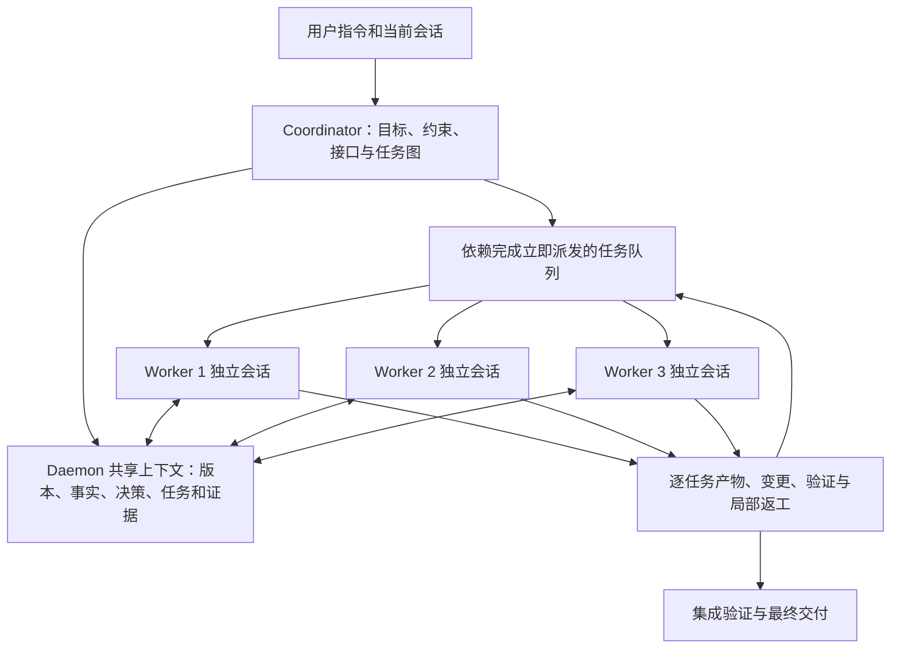

# CLI /team 自动并行开发与共享核心上下文优化方案

日期：2026-10-02
范围：agent-sdk 当前工作树，包括已有未提交修改。
状态：源码分析与实施方案；未修改业务代码、未运行 Rust 测试、未进行当前模型的并行速度实测。

## 1. 结论与目标

当前 /team 主要是“角色接力执行器”，新增 parallel 路径才提供一轮多个写角色的并发。它还没有成为自动识别工作、按依赖持续分发任务、实时共享项目记忆的开发调度器。

目标：用户只输入 /team 加开发指令。Daemon 自动理解目标和既有会话约束，建立任务图；多个 Worker 同时处理独立任务；共享一份版本化项目事实、接口约定和任务记忆；完成的任务立即解锁后续任务；中央验证与收尾保证真实可交付。

优先复用 TeamCoordinator、GoalRunner、ProjectSpace、SQLite/CAS、WorkerProfile、ToolHost 和现有恢复机制，不另建第二套 Agent 服务。不以增加角色数或放宽审批换取表面速度。

## 2. 源码确认的根因

### 2.1 默认 /team 没有把“团队”解释为并行开发

- CLI commands/repl_daemon.rs:813 默认 strategy=auto；有显式角色时才缺省强制 team。
- 服务端 workswarm_api/handlers.rs:309 仅在请求 parallel 或 settings.team.parallel/lead 角色触发时建立并行角色组。TeamSettings.parallel 缺省 None。
- builtin_team_templates.rs:92 的代码模板固定 code_analyzer → implementer → reviewer；只有一个实现者。
- workswarm/roles.rs:181 默认接力是 planner → builder → critic → leader。
- workswarm/coord_run.rs:106 给策略引擎的画像硬编码 category=None、artifact_count=1、input_count=0、normal risk；没有分析用户指令的模块数、文件耦合或工作量。
- auto 的收益 gate 可能选择 single；模板或显式角色又可能保留原编排，策略判定与实际 DAG 不是同一件事。

机械读取现有代码模板的依赖关系得到三层，每层宽度 1。调高 max_parallel 不会让串行依赖图产生并行任务。

### 2.2 并行 Worker 的权限提示与实际工具面发生矛盾

- server workswarm_api/runtime.rs:118：角色有 write_paths 时使用 WorkerProfile::explicit_writer。
- core team_prompt.rs:198：编译提示词却重新调用 WorkerProfile::for_role(ctx.role, budget)。
- w1/w2 等名字没有命中写角色关键词，for_role 将其判为只读。
- worker_profile.rs:212 的提示边界明确说“禁止写入工作区文件”，与运行器给出的写工具、真实落盘要求矛盾。

这会影响模型是否真正写文件、是否反复尝试、是否只交付说明。当前未进行模型实测，不能声称已经测出它增加多少耗时；提示与运行权限不一致是明确的源码问题。

### 2.3 并行模型配置没有完整进入真实请求

- workers.rs 解析步骤 model。
- worker_profile.rs:333 调用 Session::new(workspace, model, ...)。
- session/model.rs:124 的 new 将 model_override 初始化为 None；model 字段主要是显示值，Agent 请求使用 model_override。
- workswarm_metrics/metrics.rs:147 的 MeasuredProvider 只实现 complete、complete_stream、usage_snapshot。
- gateway/message.rs:231 起的默认 *_with_model 方法会忽略模型覆盖；Agent 主循环调用 complete_stream_with_reasoning_and_model。

因此，改了角色 model 字段并不能证明真实 HTTP 请求使用该模型。即使补上 Session 覆盖，计数装饰器仍需要完整转发模型和 reasoning 方法。此问题阻止按任务使用不同速度/能力模型的可靠优化。

### 2.4 当前并行有整批屏障，不是持续就绪调度

- coord_run.rs:510 领取一批 ready 步骤；:668 附近创建只含“已完成 + 本批”的子计划；:769 才执行；:854 在本批结束后合并状态。
- goal/mod.rs:259 计算当前 ready 列表，:287 用 JoinSet 执行并收完这批后才再次计算 ready。
- runtime.rs:322 每阶段重建注册表；下一阶段才使用新角色分配。
- roles.rs:129 的 leader 等待全部 writer。

源码已有真正并发，不能笼统说“调度没有并行”。问题是完成一个任务不能即时启动它的下游，也没有细粒度任务队列和动态补位。

说明性调度例，非模型实测：A=30 秒、B=120 秒，A2=60 秒只依赖 A，最后集成=30 秒。整批调度是 120+60+30=210 秒；就绪即启动为 max(30+60,120)+30=150 秒。两者都能让 A/B 并行，但后者避免 A2 无理由等待 B。

### 2.5 “共享 Provider”和“共享核心记忆”尚未连成闭环

- /team 创建请求没有绑定当前 REPL 会话 ID、会话修订或已有用户约束。
- coord_run.rs:418 的 TeamRun.shared_context_refs 初始化为空；此次源码搜索未发现运行侧按此字段获取共享核心上下文。
- coord_artifacts.rs:392 只组装目标、角色契约、预算和直接依赖的最终 Artifact。
- worker_profile.rs:333 为每个执行创建独立新 Session。
- WorkerProfile::build_registry 主要暴露文件、受控命令或浏览器工具，没有团队事实读取/发布/订阅和 Artifact 全文读取工具。
- team_prompt.rs 超过单 Artifact 2,400 字节或总上游 8,000 字节时摘要/只传 CAS 引用，但 Worker 工具面没有团队 CAS 读取能力。

已存在共享项目空间与产物存储，但它不是 Worker 随时可读取、更新并获得最新版本的团队工作记忆。同批 Worker 也看不到队友正在发现的事实。共享模型客户端不会自动共享模型会话的知识。

### 2.6 固定 N 份分工容易失衡，计划也缺少结构化验收

- roles.rs:104 强制 lead 把目标拆成“恰好 N 个”，每个 Worker 恰好一条；任务数量与执行容量绑定。
- 验证声明为 non_empty；apply_parallel_assignment 对条目逐项处理，缺少完整任务图 schema、任务覆盖、重复分配、空任务、跨条目写范围冲突与完成条件验证。
- 写范围重叠或未声明时范围租约会等待；这是正确的安全边界，说明拆分没有创造独立写面，不应靠删除租约提速。
- 不支持完成较快的 Worker 从队列继续领取任务，也没有任务级剩余工作重分配和有界局部返工。

### 2.7 重复探索、全文件写入与运行状态降低效率

- 每个新 Worker 都重新开始会话，Agent::run_turn 再加载工作区规则；没有共享仓库勘察结果和按版本复用的读取缓存。
- 当前实现者可见工具主要是 read_file/write_file/list_dir/search_files/run_command，没有用于小范围安全编辑的 patch 工具。
- 每个写步骤有 Git 前后快照、允许路径 CAS 基线和脏文件哈希；大范围分工会放大重复 I/O。
- worker_profile.rs:334 的 on_event 是空回调，CLI watch 为 2 秒轮询，难以看出模型等待、写租约等待、工具执行、返工或被队列阻塞。
- 阶段领取时多个 ready 角色先标为 Running，实际仍可能受并行上限排队。Running 不等于真实并发模型/工具执行。

### 2.8 当前 token 归因不适合并发收益评估

metrics.rs:253/264 用共享 Provider 在 Worker 起止间的累计 usage 差值归因。并发区间重叠会把其他 Worker 的用量计入自身 span，汇总可能重复计算。模型调用次数按角色计数，token 归因却仍是共享快照。之前发现的空 choices usage 尾帧漏记也须一起修复。

这不是直接造成串行的原因，但会误导收益 gate、预算和成本判断。必须先修可测性，再用报表决定最佳并发度。

## 3. 预期产品行为

### 3.1 命令语义

建议新增请求 execution=parallel_development，与“是否单人/是否强制评审”的 strategy 分开。

- /team <开发目标>：进入自动并行开发；先判断可分任务和耦合度，自动安排 Worker 数量。
- --parallel N：表达最大开发并发度，不再要求恰好 N 个子任务。
- --single：显式单人；--role 保留高级手动编排。
- 旧 API 未提供 execution 时保持兼容行为；CLI 新请求明确表达新的并行意图。
- 完全耦合的小改动可用一个实现者，并展示原因；用户明确指定并行时尽可能拆出独立探索/实现/验证，不能伪造无意义的开发任务。
- 配置从实际绑定工作区读取，避免只读 Daemon 初始 state.workspace 的 settings。
- /team 创建时关联当前 session_id 与 source_revision；提交用户目标、相关历史、已确认约束和验收标准。

共享同一模型并非硬要求；默认可同模型，选定任务模型后必须证明请求实际生效。

### 3.2 目标执行流程

Coordinator 管目标、接口、调度和收尾；Worker 保留独立思考/工具历史，同时读写同一份可追溯项目记忆。不要让所有 Worker 争抢一个可变 Session 或把模型请求串行挂在同一把锁上。

## 4. 共享核心上下文：复用现有 SQLite/CAS

### 4.1 存储分层

逻辑上同一个 ProjectContext，物理上按职责版本化；由 Daemon 管理，沿用现有 ProjectSpace/SQLite/CAS。

| 层 | 内容 | 更新权限 |
| --- | --- | --- |
| CoreSpec | 用户目标、验收、项目规则、禁止行为、约定的接口、源会话修订 | 用户/Coordinator；Worker 无权悄悄改需求 |
| SharedFacts | 已确认代码结构、依赖、符号位置、设计决策、文件内容摘要与哈希、验证结果 | Worker 发布带证据的事实；冲突进入待协调态 |
| TaskBoard | 任务 DAG、读写范围、owner、依赖、验收、状态、Artifact/ChangeSet、重试代次 | 调度器事务更新 |
| WorkerScratch | 每 Worker 独立 Session、局部工具历史、尚未验证假设 | 本 Worker；被接受的事实才进入共享层 |

一条事实至少有 project_id、team_id/scope、key、value_ref、revision、producer/task_id、source_refs、file_hash、confidence/status 与 supersedes。路径和授权范围由宿主决定，模型写入事实不能扩大权限。

### 4.2 读取、发布与新鲜度

- 建队时生成核心快照一次，并勘察仓库一次；Worker 领取任务时获得 CoreSpec、当前任务、相关接口/文件和依赖产物。
- 每次模型调用前在锁外读取上下文 revision；只合入与本任务有关的变化，避免每轮重发所有团队内容。
- 提供 team_context_read、team_context_publish、team_artifact_read；通知以 task/context revision 引用传递，正文按需读取。
- facts 发布使用 expected_revision/CAS；附来源哈希。文件版本变了，相关事实标记 stale，不能当成最新事实直接复用。
- 人类 steer 生成新的核心修订，通知受影响任务；无关 Worker 不必重启，过时代次的结构性变更按现有 epoch 思路拒收。
- 数据提交只持短锁；不把模型调用、文件勘察或长命令放进全局上下文写锁。
- 敏感/无权限内容不进入其他 Worker 的视图；保留规则来源和未裁剪的硬约束。

这是应用侧共享记忆，不是多个云端请求共享隐藏推理或 KV。共享上下文能减少重复搜索和重新理解，但不自动消除每个请求的输入 token；只有支持并实际命中的 Provider prompt cache 才有对应推理缓存收益。

### 4.3 Worker 会话与上下文生命周期

Worker 会话持久化并关联 team/task/parent session；局部返工延续该任务历史，避免重新读仓库。领取全新任务时压缩本地历史并刷新核心快照，不能把上个任务的局部假设污染新任务。

统一任务上下文编译器接收宿主最终 WorkerProfile、写范围、任务模型和剩余预算；Prompt 与实际工具注册表来自同一个对象，消除当前 wN 只读提示错误。

## 5. 自动分工与事件调度

### 5.1 任务计划与并发容量解耦

用结构化 TaskGraphV1 替代固定 lead → w1..wN → leader 角色图。先确定需要做什么，再将 ready 任务分配给有限 Worker。

每个任务包含：
task_id、goal/acceptance、depends_on、read_refs、write_paths、contract_refs、required_capabilities、estimated_effort、verification、risk、priority。

- N 是同时执行的容量，任务可多于 N；例如 3 个 Worker 处理 8 个模块任务。
- 按模块/接口与写范围拆分，避免按字符数或目录数量机械平分。
- 优先发布稳定接口契约；实现接口和下游实现只依赖必要契约，不等待整个模块完成。
- 识别热点共享文件：Cargo.toml、协议 DTO、公共 lib.rs、锁文件等指定一个 owner，其余 Worker 提交修改建议/受控 patch。
- 计划校验覆盖需求、DAG 无环、任务非空、写范围合法、任务授权和资源限制；冲突必须有明确依赖或共同文件 owner。
- 无效计划有界修复一次；失败时清晰报告，不能启动一群只读 Worker 后显示团队成功。
- 按估算关键路径优先调度，空闲 Worker 领取尚未开始任务；进行中的任务不能被第二个 Worker 重复接管。
- 小型关联文件改动不要过度切碎；模型调用、工具和上下文装配开销应计入拆分收益。

### 5.2 去除阶段整批屏障

保持完整队列与在飞任务：

1. Ready 队列中按依赖、写范围、Provider 和预算检查可运行任务。
2. 对合法任务事务领取 task_epoch、owner 与必要资源租约，锁外执行。
3. 任一任务结束立即完成变更收尾、登记产物与更新完整状态。
4. 对其后继重新计算就绪，立即派发；其他慢任务继续执行。
5. 最终集成仅等待真正需要的产物，而不是所有角色无条件结束。
6. 失败只阻塞依赖该任务的子图；有界返工只重跑失败任务和被实际输出变化影响的后继。

保留 cancel/retry/replace 的 epoch 防护、结果去重、崩溃恢复和旧回传拒收。已完成节点需逐任务落盘；恢复只重放未完成任务。

### 5.3 写租约与构建资源

- 工作区同一资源仍单写；不重叠文件可并发。当前范围租约可复用。
- 调度器跨阶段持续运行后，租约管理器不能每次 build_run_registry 重置；应按 workspace 由 AppState/运行管理层共享，并防止不同 TeamRun 同时改同一路径。
- 未声明写面保持保守；由计划校验给出精确范围，不为提速默认给所有 Worker 整个仓库写权限。
- 租约等待状态在 CLI 可见。不要盲目把原来覆盖快照和归属收尾的租约改成仅覆盖 write_file，否则破坏 diff/revert。
- 全局 Cargo/原生重链使用专用构建队列与一个验证 owner：依然遵守 ci-shared 并发 1/2、内存/磁盘门和禁止两组 Cargo。多个 LLM 同时开发不意味着多个 Cargo 同时构建。
- 一个模块完成后可排定向验证，同时其他 Worker 继续编写独立模块；不让每个 Worker 各跑一次全仓测试。

## 6. 减少每个 Worker 的无效工作

- 仓库结构、规则解析、符号/接口列表按文件 hash 缓存，共享勘察输出；必要修改前仍校验当前文件 hash。
- 增加受路径白名单保护的 apply_patch/精确替换工具，带 expected_hash、执行收据与回退；减少整文件输出。
- 将“格式正确”和“任务正确”分开：JSON schema/Artifact/范围由确定性代码验证，功能由测试/断言验证；模型只用于必要评审和异常分析。
- 评审与任务完成事件衔接，能够先审已完成模块；独立评审和安全确认不能因追求速度删除。
- lead 用一次有限拆分调用，默认不再单独跑完整 planner 和重做实现的 finalizer。
- 回合预算按任务工作量、工具往返和预留收尾动态分配，受团队硬预算限制；不对所有未知角色统一 12 回合，也不靠扩大回合掩盖重复读取。
- 实现者可做必要定向验证，移除“一概不要执行验证命令”的误导提示；具体命令仍经过验证队列和权限策略。

## 7. Provider 与观测修复

1. 调用 Session 的模型覆盖设置入口；请求中记录实际 model 与 request_id。
2. MeasuredProvider 完整转发所有 *_with_model/reasoning 方法，确保计数恰好一次并保留原行为。
3. 每请求返回 usage 元数据，按 request_id → team/task/worker 归因；全局 usage 只用于总额，不用共享快照差值计算每个并发 Worker。
4. 修复 choices=[] 的 usage 尾帧解析；缺失 usage 保持未知。
5. 对 Provider 实测 1/2/4 路的时延、429/超时、吞吐；并发上限依据实际服务容量调整。不能假设多加 Worker 就多出推理算力。
6. Worker 事件接入 /teams/{id}/events：真实开始、模型调用、工具、租约等待、验证排队、上下文修订、任务提交与返工。普通 CLI 输出简洁，/team status 展开详细诊断。
7. Provider 等待、租约等待、上下文读取、模型、工具、验证和修复各自计时；Queued/Claimed/Running 分开，Running 表示真实执行。
8. SSE 保持有界、断连清理、恢复游标；CLI 退出 watch 不取消团队。

## 8. 文件范围与实施顺序

| 阶段 | 改动范围 | 最小完成条件 |
| --- | --- | --- |
| P0：修当前并行硬伤与测量 | core team_prompt.rs、worker_profile.rs、session/model.rs、gateway/message.rs/stream.rs；server workswarm_api/runtime.rs/workers.rs、workswarm_metrics/metrics.rs | wN Prompt/工具权限一致；请求模型覆盖不被装饰器丢弃；并发 token 不串账；可观察实际任务开始与等待 |
| P1：核心上下文与源会话 | protocol/lib.rs；workswarm/types.rs、coord_run.rs、coord_artifacts.rs；workswarm 的 project_space_store.rs；新增 team_context.rs/store 模块；CLI repl_daemon.rs；server DTO/handlers | 父会话约束传到 Worker；共享事实能读取/发布/版本校验；CAS 全文可访问；已有权限范围不扩大 |
| P2：自动计划与任务队列 | 新增 task_decomposer.rs；workswarm/roles.rs、types.rs、coord_run.rs；team_strategy.rs；settings.rs | 输入指令自动产生通过 schema/依赖/写面/验收校验的 TaskGraph；任务数不固定；/team 无需手工写角色 |
| P3：就绪即派发与恢复 | goal/mod.rs、types.rs；workswarm/coord_run.rs、coord_lifecycle.rs；server workswarm_api/runtime.rs、write_lease.rs、state.rs | A 完成可启动 A2，不等 B；逐任务持久化；取消/重试/重启不双写、不重复产物 |
| P4：工具与开销收敛 | core tools.rs、worker_profile.rs、team_prompt.rs；rules/context 加载；workspace_change_tracker；验证任务接线 | 精确 patch 受控、仓库勘察复用、验证不重复全仓构建、局部返工不重跑全部团队 |
| P5：CLI 与性能验收 | repl_daemon.rs；server events/metrics/diagnostic；受影响 route_contract_tests.rs 和 API 客户端；评测工具 | 团队实时进展与共享记忆可见；同源码同模型的成对测试达到速度目标且质量不降 |

先完成 P0，再在现有静态并行组上接 P1，之后切换 P2/P3。共享记忆、动态 DAG 和恢复一致性都验证后，再调整 /team 的默认语义。P4/P5 以真实瓶颈数据决定具体优化，不先做大规模拆 crate。

## 9. 关键契约测试

- w1 拿到指定写范围后，其 Prompt、工具面、预算和受限 write_file 一致；没有范围时仍只读。
- 假 Provider 记录请求模型/reasoning/usage，经过计数装饰器后保持不变；两个并发请求的用量分别计数且总和正确。
- 两个 Worker barrier 证明真的同时进入执行并写不相交文件；共享文件只能有一个 owner。
- A 已完成、B 尚未结束时，A 的下游 A2 已真实开始；用 Notify/barrier 证明，不依赖脆弱的毫秒性能断言。
- Worker A 中途发布事实，Worker B 下一次模型请求含相应 revision；不得重新注入整份无限历史。
- 两个 Worker 并发发布同 key，CAS 冲突被检测且不会静默覆盖；修改文件后旧 hash 对应事实 stale。
- 父会话中的验收和禁止修改范围在建队和重启恢复后仍存在。
- 调度崩溃恢复、cancel、retry、steer 拒收旧 epoch 结果；完成任务不重复写/重复交付。
- 非法计划/缺任务/重叠写范围/空验收被拒绝或有界修复，不显示虚假成功。
- 修一个失败任务仅重跑相应子图，保留其他产物及审计。
- 新增 API/事件同步路由契约/OpenAPI；新工具仍通过 ToolHost、审批、审计、diff/revert。
- 每次 Rust 验证使用 resolve-ort 与 ci-shared，按资源门选择定向测试；不为方案分析触发全仓编译。

## 10. 速度目标与验收口径

团队时间近似：
T_team = 启动/分工 + 任务 DAG 关键路径 + 集成验证 + 资源排队/协调/返工。

加速比：
S = T_single / T_team。

只有真实减少关键路径、重复探索与等待，才能获得持续加速。4 个 Worker 不会自动让相同质量的任务快 4 倍；独立工作的比例、接口耦合、Provider 吞吐和验证时间都会限制收益。

以下是实施后的目标，不是现有成绩：

| 任务组 | 目标 |
| --- | --- |
| 单文件小修 | 不强拆；相对单 Agent 的附加开销控制在约 10%～15%，并保留相同验收 |
| 3～4 个独立模块开发 | 同模型/同规则/同验收，完整墙钟争取 ≥2 倍加速；高可并行案例再争取 3 倍 |
| 有接口依赖的大功能 | 先稳定接口，事件调度与局部返工减少关键路径；按实际 DAG 给出收益，不保证固定倍数 |
| 高冲突/全局重构 | 明确展示耦合原因；优先单写实现与并行只读检查，不能为了显示多 Agent 改坏代码 |

成对测试必须从相同源码快照在隔离工作目录开始；同模型权限、工具能力、目标和验收。包括计划、模型排队、工具、构建、评审、修复、最终交付的全部时间。报告成功率、完整墙钟 p50/p95、返工率、并发重叠、关键路径、等待分类、token 和成本；失败/超时不能剔除。

初期每类先做一对冒烟确认接线，后续在明确模型调用预算内跨任务重复配对；不能以一个演示或 sleep Worker 的并行测试声称真实开发快 2 倍。

仓库 docs/reports/v1-r1-live-baseline.md 记载的 2026-08-28 固定三角色基线是历史证据：single 平均 40.5 秒、WorkSwarm 106.4 秒，且样本不同。它说明旧接力模式曾显著更慢，不证明当前新增 parallel 路径的速度。当前工作树尚无本次同版本实时开发速度结论。

## 11. 本次产出边界

本次完成源码分析、代码模板 DAG 机械核对和说明性调度计算，产出本方案。未修复上述代码问题，未修改现有未提交业务改动，未启动并行 Agent、Rust 构建或付费模型评测。后续实施先从 P0 的行为矛盾与观测修复开始。
