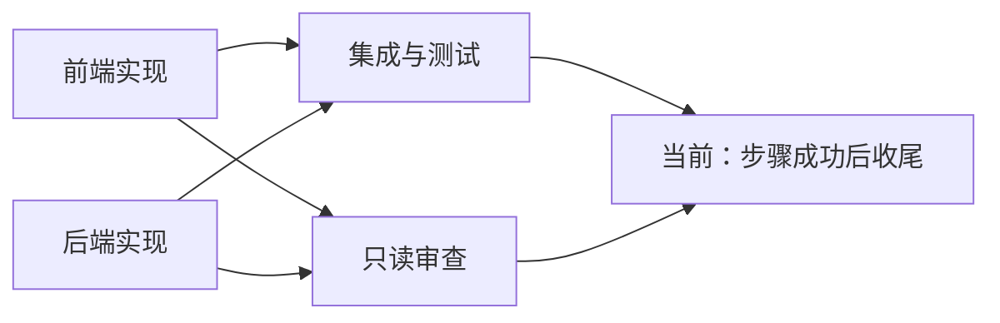

# /team 速度与质量问题解决报告

日期：2026-10-02
范围：当前未提交工作树、r9–r12 博客功能切片评测原始记录、r12 保存的交付与失败快照。
源码基线 HEAD：08f6d82999eb37569d20264c0d464ad40804f247；HEAD 不能代表本次工作树，相关文件存在大量已有修改。
本次动作：源码与历史产物审查、复跑 r12 保存快照的 npm test；新增本报告与审查证据摘要。未修改业务代码、未提交、未编译 Rust、未调用云端模型、未验收当前 CLI/桌面二进制。

## 1. 结论与优先行动

Team 在这些样本中确实更慢，且没有形成稳定的质量收益。主要原因是：小任务被扩展成四个独立模型工具循环；前后端完成后仍要承担较长的集成尾段；功能验收没有进入团队成功条件；审查意见没有必经的修复消费者；角色权限曾使发现缺陷的人无法修复。

关键区别：调度器已有真实并发，增加线程或 Worker 数量并不能消除集成关键路径。当前工作树还已补入就绪即派发、共享上下文等代码，不能继续把“完全没有并行/没有共享上下文”列为当前事实。其性能效果仍需同版本实测。

建议先做三件事：

1. 把真实测试退出码、阻断审查意见和最终文件版本接入成功门禁，禁止“测试已失败但团队成功”。
2. 让修复由原文件 owner 或经宿主限定授权的集成者完成，复测后收尾；不再靠补一句提示词完成质量闭环。
3. 统一评测与生产 Worker 执行器、权限与逐请求计量，冻结评测规则再比较速度；对窄任务使用更轻的团队编排。

不建议先增加角色、提高并发、扩大权限或移除审查。这些都不能解决目前已证实的交付闭环缺口。

## 2. 速度与完成度：原始报表核对

每轮双方 suite_hash 一致。不同轮提示词、检查器和模板在变化；每轮只有一对样本，以下是描述性结果，不是总体统计结论。

| 轮次 | Single 墙钟 / 检查器 | Team 墙钟 / 检查器 | 耗时倍率 | 模型调用 Single / Team | 报表 token Single / Team |
| --- | --- | --- | --- | --- | --- |
| r9 | 54.654 秒 / 9/10 | 213.865 秒 / 8/10 | 3.913 | 15 / 38 | 113,497 / 313,879 |
| r10 | 40.275 秒 / 9/10 | 103.951 秒 / 9/10 | 2.581 | 10 / 33 | 71,672 / 262,711 |
| r11 | 29.367 秒 / 9/10 | 96.191 秒 / 10/10 | 3.275 | 8 / 42 | 48,555 / 507,722 |
| r12 | 36.817 秒 / 10/10 | 105.387 秒 / 8/10 | 2.862 | 9 / 39 | 57,518 / 358,317 |

完成度是十个外部检查器的通过数，其中包含源码字符串检查；不等于需求覆盖率、完整网站完成率或浏览器验收结果。9/10 的运行在报表中为 failed。r11 Single 的唯一失败是没有源码字符串 status.textContent，不能据此确认它缺少可访问状态功能。

**token 数值需要修正口径。** r11 原始报表的倍率是 10.457，而提供的摘要写约 5.1；本次没有找到支撑 5.1 的逐请求账本。更重要的是，评测本身存在并发重复归因，表中 Team token 不能解释为真实计费消耗。r12 的 6.230 倍也只可称“报表倍率”。模型调用次数包含输出契约修复请求，但未证明覆盖 Provider 内部全部 HTTP 重试。

### 2.1 r12 关键路径拆解

| 角色 | 模型调用 | 记录的 Worker 耗时 | 工具调用与现象 |
| --- | --- | --- | --- |
| frontend_engineer | 10 | 32.862 秒 | 15 次；读 6、列目录 3、写 5、命令 1；1 次工具失败 |
| backend_engineer | 8 | 35.909 秒 | 9 次；读 5、列目录 2、写 2 |
| project_integrator | 11 | 57.099 秒 | 15 次；读 10、patch 2、写 1、命令 1；2 次工具失败 |
| reviewer | 10 | 26.611 秒 | 12 次；读 7、列目录 2、搜索 3 |

四个角色各有 1 次 output_repairs。其耗时记录不应直接当作完整角色 span：评测代码先记录 run_turn 耗时，再进行契约修复。

角色图是：

用角色耗时估算两层工作下界：max(32.862, 35.909) + max(57.099, 26.611) = 93.008 秒。TeamCoordinator 墙钟为 103.999 秒，外部整轮为 105.387 秒。未分配的约 10.991 秒含契约修复、上下文、调度和存储等，现记录无法进一步可靠拆分。

这说明：r12 前后端确实并行，但仅集成者的 57.099 秒就超过 Single 全轮 36.817 秒。把 reviewer 再调快，无法直接缩短该样本的关键路径。r11 则后端记录耗时 68.165 秒，瓶颈随模型与返工转移。没有请求级时间线，不能把所有等待归因给远端服务限流。

## 3. 质量根因：有发现、有报告，缺少强制解决

### Q1：成功条件只验证输出，不验证交付行为（P0，已证实）

- fullstack-web-v1 四个角色均 verify=non_empty。
- role_worker.rs 对 status=Done 的结构化输出登记 Artifact；非空正文即可继续。
- coord_lifecycle.rs:111 的 finalize_success 主要检查 all_succeeded，然后设置 TeamRunStatus::Succeeded 和 ProjectSpace Completed。
- r12 observation.status=Succeeded、四个 Artifact 都是 Draft；外部 report.status=failed。
- 集成 Artifact 已明确记录 npm test exit_code=1、12 pass/2 fail；这些信息仍只在正文里。

结果：诚实报告失败也能形成成功步骤、成功团队。修复格式 JSON 只提高格式完成度，不能修复功能。

解决：新增宿主产生的 ValidationReceipt/DeliveryVerdict。包含命令、退出码、日志引用、受测文件哈希、验收版本、未解决阻断项。代码任务最终成功必须满足宿主必需检查通过、必需交付存在、阻断问题已关闭、验证版本等于最终版本。测试失败进入 repairing/failed，未执行进入 unverified，不能把模型正文中的“通过”当作收据。复用现有状态与产物基础设施，不另建 Agent 服务。

### Q2：reviewer 不是闭环中的阻断评审（P0，已证实）

- reviewer 和集成者只依赖前后端；两者之间没有依赖。
- assemble_context_slice 及 team_artifact_read 只给直接依赖产物。
- util.rs:203 的 is_critic_role 仅识别 critic；reviewer 按普通产物角色登记，未自动转为结构化批准/驳回。
- r12 reviewer 已指出 limit=0/-5 错误，但图中没有读取其意见并完成修复的最终节点。

解决：以显式 role capability 表达评审职责，避免字符串角色名决定质量语义。审查输出结构化 findings，含 severity、file/hash、requirement_id、evidence、owner 与 disposition。保留审查/测试并行；二者完成后由宿主汇合，阻断项触发最小修复，再确定性复测。只有需要模型解决冲突时才启动额外收尾回合，不固定增加一个“重新读全仓”的 leader。

当前新增集成写权限使集成者能同时修改 apps/api 与 apps/web。reviewer 原先“只读稳定应用文件”的假设因此也不再成立。必须审查不可变快照，或绑定文件哈希并在修改后标记审查过期；不能只靠“不读取 shared”保证一致性。

### Q3：r12 集成者发现问题却没有合法修复路径（P0，历史已证实；当前部分补齐）

r12 保存的模板只授权集成者 packages/shared、根配置、docs 等。其集成摘要明确写“apps/api 白名单外不可修”；记录有两次 patch 工具失败，但历史未保存具体工具错误，不能把每次失败都断定为同一种权限拒绝。

当前 builtin_team_templates.rs:189 已补六个应用/测试文件的限定写路径与最多两轮复跑提示。说明问题已有源码改动，尚不能宣称运行闭环修好。

解决：优先将失败项交回原 owner，复用任务会话；必要时宿主授予集成者限定修复范围，保留租约、审计、hash 校验和取消。写路径从实际任务绑定产生，不能把 posts.mjs 等博客专用文件当作所有网站的通用规则。没有 owner/授权时明确 blocked，不设成功。

### Q4：接口语义在三个模块里各自实现，最后才对齐（P1，已证实）

r12 brief 明确默认 limit=6、最大 12、非法值回退；后端却实现 MAX_LIMIT=50，对 0/负数返回 1；共享契约由集成者晚于实现者补齐。后端 Artifact 还写“非法值回退”与代码不符。共享契约文件存在，并不代表 API 实际复用了它。

解决：开始实现前发布最小不可变契约：字段、默认/上限、非法值、空结果、越界页行为及测试向量。可由确定性代码从已有 brief 装配，避免新增重型规划角色。优先共享实际 normalization 函数；必须分别实现时，用同一组冻结行为用例检查各端。接口变更发布 revision，只重验受影响任务。

### Q5：整文件覆盖与审查遗漏造成既有样式回归（P1，已证实）

r12 starter CSS 为 1,874 字符，Team 交付仅 503 字符，缺少原 @media。前端 Artifact 说“追加”，reviewer 仍评价保留视觉，说明摘要与普通只读检查没有验证基线差异。

解决：既有文件小改优先宿主受控 patch；整文件重写前读原文件并校验 hash，保留必要基线。将响应式行为纳入回归检查，结合变更 diff 和实际视口验证。仅 contains('@media') 可作为短期保底，不应长期冒充移动端视觉验收。

## 4. 速度根因：固定角色成本与关键路径没有收敛

### S1：窄切片被固定扩展成四套工具循环（P1）

前端、后端、集成和审查各自读规则、目录、brief、源码和测试。r12 合计 48 次 read/list/search，39 次模型调用；Single 9 次模型调用完成。单个模型调用可批量工具，工具次数不能直接等于往返次数，但多个独立会话确实重复建立理解。

解决：保留 heavy-team 用于大模块；增加轻量编排。窄且耦合的变更以一个 owner 实现，必要时一个只读 reviewer；确有两个独立写面时使用两个实现者加宿主验证，集成模型只处理真正的接口冲突和失败。不要每个任务都固定跑四角色。用户强制 team 时尊重，但显示采用轻量编排及其理由。

### S2：禁止局部验证，把错误发现集中推迟到集成（P1）

r12 尝试用“实现者不运行命令、集成者统一 npm test”减少成本，但后端实现和其测试互相矛盾，进入集成后才暴露。历史前端仍调用命令，说明提示词不能当权限门。

解决：宿主统一验证队列；模块完成即可执行必要定向检查，不要求每个 Worker 自行思考并重复跑全仓。工具面按真实 profile 控制。Rust 构建仍保持全局单组 Cargo、ci-shared 资源红线；LLM 并行不等于构建并行。

### S3：输出契约修复重复开销（P1，现象已证实，具体违规待追踪）

r12 四个角色各修一次，r10 两次、r11 一次。现契约执行器最多再做一次 complete 请求。没有原始首次输出及违规类型，不能断言全部由同一个模板冲突造成。

解决：从统一 schema 编译 system/user 输出要求，避免动态角色 user prompt 要“直接正文”而 system 要契约 JSON。记录 first_violation、repair_request_id、repair_ms 与用量；能用确定性格式转换解决的结构错误无需额外模型调用，语义/status 不得自动改成 Done。对受支持 Provider 可使用结构化输出，仍保留宿主校验。

### S4：调度优化已有实现，但并非 r12 首要加速点（P2）

当前 goal/mod.rs:353 使用 JoinSet，在结果返回后填充就绪节点；coord_run.rs:730 保留可执行后继子图。旧文档的整批屏障诊断已部分过时。应补 A 完成即可启动 A2、B 仍在运行的契约验证及恢复测试，确认实际运行器注册表也覆盖后继。

本切片第二层两角色都必须等前后端，因此就绪即派发本身不能消除 57 秒集成尾段。先减少集成工作，再在大 DAG 上衡量调度收益。

## 5. 评测与生产路径的差异：必须先消除测量歧义

### M1：评测 token 并发串账（P0）

Agent::run_turn 在 agent/mod.rs:502/1350 用共享 Provider 的全局 usage_snapshot 前后差值构成 turn.usage；EvalAgentWorker 在 workswarm_executor.rs:422 接收该值，再在 :1090 汇总所有角色。

示例：A/B 同时开始，全局计数为 0；A 用 100、B 用 200；两者结束快照均为 300，则角色和=600，真实总量=300。真实请求交错会使偏差更复杂。契约修复在 record_success 之后进行，自己的修复 token 又可能漏记，或污染仍运行的另一角色。

当前 server metrics 已加入 RequestUsageCollector 与并发无 usage 时留空的处理，但 product-eval 没有共享这套归因。不可因此认定 r11/r12 报表已被修正。

解决：每请求返回 request_id、actual_model、usage、TTFT、total_ms，按 team/task/attempt 归属；请求去重后求和；包含修复和 Provider 重试，并标注 usage completeness。缺失留 null，禁止按重叠全局差值推算。团队总额、角色之和与请求账本必须一致；无法恢复历史逐请求记录时旧倍率保持不可用，不反推“真实成本”。

### M2：同模板不等于同执行路径（P0）

live_fullstack 测试使用 WorkSwarmExecutor + TeamCoordinator 内嵌路径，按 expected_artifacts 是否包含 apps/web/apps/api 选 fullstack-web-v1。它没有经 CLI、HTTP、Daemon、server runtime。

当前 CLI /team 默认 resolve_team_create_intent → 自动 parallel，连接父会话；显式 --auto 才走策略选择。服务端负责模型选择、实际 profile、跨运行写租约与共享事实工具。评测则自建 EvalAgentWorker、AgentConfig 和 AutoApprover；Session::new 未显式设置角色 model_override。live 测试固定 Provider 模型，只能支持此配置下的结论，不能证明角色模型路由正确。

当前生产 fullstack 的前后端工具面已 without_commands；评测仍通过通用 explicit_writer 暴露命令。评测写角色 system prompt 还说“不要执行验证命令”，与集成者要求 npm test 矛盾，生产 prompt 已调整。评测也未挂生产共享上下文工具与持久化 Worker 会话。

解决：将 ProfileSubagentRunner/Worker runtime 抽为生产与评测共享组件，差异只允许隔离工作区、测试审批、观测 sink 和配置化预算；统一 Session/model、工具表、Prompt、契约修复和 usage。增加真实 /team HTTP/CLI 的受控验收。保留内嵌微基准，报告明确标出 fullstack-template 或 automatic-parallel，不混成同一个模式。

### M3：检查器脆弱且部分测试可被被测 Agent改写（P0/P1）

r12 十个检查器中九个是 contains；如 status.textContent、items.length、测试名称，可能拒绝合法实现，也可能接受只有注释或死代码的实现。npm test 跑的是 Agent 可修改的测试文件；HTTP 搜索错误断言就是后端生成的测试缺陷，不是外部框架直接写错搜索需求。

解决：把独立验收测试放在不可写评测侧，分别检查 API 行为、搜索匹配字段、分页边界、query encoding、状态 DOM 和移动视口。Agent 可补开发测试，但不能改评分测试或需求。搜索断言按任一字段匹配修正，不能用删掉失败断言获得绿色。测试数与字符串通过数不作为质量分。

### M4：预算声明与实际执行不一致（P1）

r12 observation.strategy 写预算 9、角色 builder/critic/leader，实际是四模板角色、各 15 回合；live 配置又把 max_turns_per_worker/retries 设最大值，并以 600 秒为截止。39 次调用不等于违反一个真实生效的 9 次上限，9 是过时的策略解释。

解决：记录 resolved_plan、effective_config、实际角色/模型/工具、硬预算和退出原因，区分计划建议与执行预算。保留墙钟评测，但另做等 token/等费用预算比较。Provider 排队、租约等待、上下文、工具、契约修复、验证、返工分别计时。

## 6. 已有改动与尚需解决项

| 项目 | 当前源码情况 | 本次可认定的边界 |
| --- | --- | --- |
| wN 显式写权限 Prompt | team_prompt 已按 explicit_writer 编译 | 旧只读冲突已有代码修正，未实测 |
| 生产角色模型覆盖 | ProfileSubagentRunner 已 with_model_override；MeasuredProvider 已补转发方法 | 评测路径未完整同步，不能据显示模型认定路由 |
| usage 空 choices 尾帧 | stream.rs 已先读取 usage，允许空 choices | 当前实现已变，未跑 Rust 回归 |
| 共享事实/源会话/产物读取 | CLI、server、coordinator 和 Worker 已有接线 | 评测未复用；不能泛称“尚无共享记忆” |
| 就绪即派发与逐任务进度 | GoalRunner/Coordinator 已有新实现 | 未编译或验证恢复，不是已交付结论 |
| 集成者有限源文件修复 | 模板已扩充六个文件白名单和复跑说明 | 博客特化；成功门禁和审查汇合仍缺 |
| reviewer 阻断闭环 | 并行角色，仍无必经修复消费者 | 当前仍需完成 |
| 独立行为验收 | 历史切片主要字符串与可修改测试 | 当前样本不能证明完整网站质量 |

r13 目录存在；检查时 Single 有 passed 报表，Team 没有最终 report.json/observation.json。因此本报告不把 r13 计入成对结果，也不干预其运行。未找到对应的历史源码构建身份，r9–r12 只能与保存模板、状态、产物对应；不宣称历史二进制等于当前代码。

## 7. 分阶段实施与完成检查

| 顺序 | 修改边界 | 必须达到的完成检查 |
| --- | --- | --- |
| P0-A 成功门禁 | protocol DTO；core goal/types、role_worker、coord_lifecycle；server 运行/交付接线；TS/OpenAPI | 有真实失败收据时不得 Succeeded；未验证明确可见；文件修改使旧验证过期；相关路由契约同步 |
| P0-B 审查和修复 | builtin_team_templates、角色契约、coord_artifacts/coord_run、server runtime/write_lease | reviewer 阻断项派给 owner；合法范围局部修复；按新 hash 复验；取消/重启不重复写或复用过期意见 |
| P0-C 测量与执行一致 | gateway 请求元数据、共享 Worker runtime、workswarm_metrics、product_eval/workswarm_executor | 并发请求 token 不重复；修复/重试入账；生产/评测 profile/model/Prompt 一致；缺失 usage 不报成本 |
| P0-D 冻结外部验收 | product-eval case/checker；新增只读评分测试；CLI/HTTP 场景 | 修正搜索语义；覆盖默认6/上限12/0负值；状态行为测试不绑定变量名；移动端回归被检测 |
| P1 轻量团队与契约前置 | team_strategy、模板、coord_context、worker_profile | 任务按独立写面和关键路径选编排；开始实现前有明确接口；失败只重跑 owner 和受影响节点 |
| P1 减少重复和格式修复 | team_prompt、contract_worker、共享读取/patch 工具 | 记录契约违规；必要上下文一次读取并按 hash 复用；不牺牲权限、审计和原文件行为 |
| P2 大 DAG 调度及 Provider 容量 | goal/mod、coord_run、server runtime 与观测 | A2 不等 B；状态恢复一致；对1/2/4路请求测吞吐/429/时延后确定容量 |

实施顺序以闭环和可测性为先，不在 dirty 工作区批量覆盖现有改动。涉及 Rust 时先按 ci-shared 资源策略做受影响 crate check，再选 1–3 组行为契约测试，保持 fmt/clippy；不为本次文档审查启动全量构建。

建议契约测试场景：

- Worker 输出 Done 但宿主测试 exit=1：团队不能成功；输出 failed/blocked 也不得登记为成功交付。
- reviewer 已指出分页缺陷：必须产生 owner 修复/拒收结果，不能仅存一份报告。
- reviewer 审查期间文件变化：旧审查不能批准新文件版本。
- 文件 owner 修复后：复测使用最终哈希，失败重试有次数/预算限制，重启不双写。
- A/B 并发 usage 100/200，外加修复 50：账本及团队总量应为350，角色归属不交叉；无 usage 保持未知。
- 同一任务走内嵌与 Daemon：工具表、模型覆盖、验收和权限一致；测试不通过不以放宽审批替代。

## 8. 下一轮对比怎样才有决策价值

冻结任务输入、starter、外部评分测试、模型实际请求参数、模板、Prompt、预算、源码及二进制身份；每次记录 manifest 与 hash。同一轮双方使用相同初始文件。

先选三类任务：窄耦合切片、两个独立模块、中型多模块。分别比较 Single、轻量 Team、完整 Team、CLI automatic-parallel。先每类5对作筛选，再扩到至少10对作初步稳定性评估；样本数是执行建议，不能保证统计显著。交替或随机 Single/Team 顺序，避免所有 Single 永远先跑；使用相同外部环境并记录缓存、限流、失败与取消，不只保留成功样本。

报告至少包含：外部行为验收成功率、全部运行墙钟及中位数、按相同质量条件比较的交付时间、请求/工具次数、精确 token/成本（未知留空）、契约修复率、关键路径、验证/返工时间和失败类型。小样本不解读 p95；UI 质量另有真实浏览器验收，不与源码字符串混算。

建议晋级目标（尚未达成）：先做到“外部验收失败绝不显示团队成功”；同任务 Team 功能质量不低于 Single；在具有独立写面的中型任务上中位墙钟至少降低20%，成本按用户预算可接受。窄任务若没有并行收益，轻量编排应避免明显额外开销；不能通过删除验收项获得速度指标。

## 9. 本次验证与证据位置

本次在 r12 失败快照执行 npm test，真实退出码1：14 tests、12 pass、2 fail，测试引擎报告约368.8ms。两项分别是 limit=0 实际1而期望6、HTTP 搜索断言只看标题。后者是生成测试错误，不能据此否定正文匹配正确性。

额外静态复核：后端 MAX_LIMIT=50 与 brief最大12冲突；CSS 原始1,874字符、交付503字符且无 @media；reviewer发现分页问题；集成者真实报告测试失败和权限不足；Team内部成功状态与外部失败状态不一致。

原始根目录：
C:\Users\23843\AppData\Local\Temp\owo-blog-benchmark

- run-r9-speed-20261002-192819
- run-r10-speed-20261002-194420
- run-r11-speed-20261002-194940
- run-r12-speed-20261002-195528

每目录的 single/report.json、team/report.json 是外部成绩；team-runs/*/observation.json 是角色观测；runs 保存计划/角色元数据；cas 保存正文；team/failures 保存失败交付。临时目录可能被系统清理，本次另保存审查证据摘要，含原始报表、r12关键产物和源码哈希。没有将这些历史运行当作当前工作树的模型验收。

本次固化证据：[team-speed-quality-audit-20261002.json](qa/evidence/team-speed-quality-audit-20261002.json)。该文件保存原始报表与产物摘录；其中 token 保留原值仅用于追溯，不代表已经校正。
