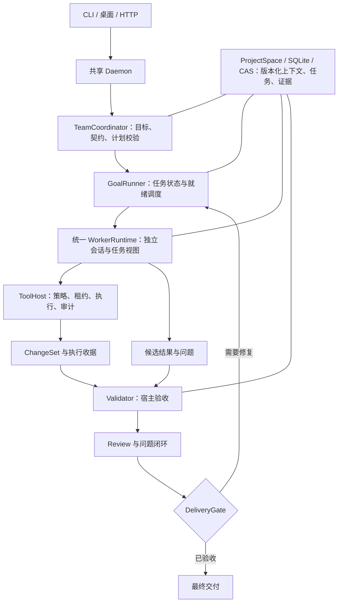

# Team 引擎架构重构方案：以任务、变更与验收驱动协作

日期：2026-10-02
范围：Agent SDK /team 实现本身。当前工作树存在既有未提交修改，本方案为源码审查与设计，未修改业务代码、未执行 Rust 或云端模型验证。
与上一份报告的关系：上一份记录运行现象与证据，本方案明确底层架构根因和统一重构边界；不把团队质量问题归结为某个任务不适合并行。

## 1. 架构判断

现实现具备 Agent、DAG 并发、权限、产物、恢复、共享上下文等基础能力。主要缺口是这些能力没有围绕同一个“可验收任务”形成强约束。

当前多条路径把“Worker 返回成功 + 输出满足文字断言”提升为“任务成功”，再把“所有步骤成功”提升为“团队成功”。角色交接依赖模型摘要，审查只是另一个步骤；权限、Prompt、模型和计量又在生产与评测两处分别装配。结果是协作越复杂，语义不一致、未解决缺陷和重复工作越容易积累。

推荐沿现有 Daemon/TeamCoordinator/GoalRunner/ToolHost 改造成统一任务执行内核：

- Worker 可以提出任务、实现、风险和修复建议，不能批准自己的交付。
- 宿主验证计划合法性、确定授权、持久化状态、采集执行收据、关闭阻断问题，并决定接受结果。
- Single 与 Team 使用同一内核；区别是任务图、Worker 容量和评审策略，不能长期保留两套完成语义。
- 角色是任务执行时的能力与约束配置，不再充当质量状态机。

这些调整解决执行正确性与质量闭环；不会保证所有任务都比 Single 快。速度目标是减少无效模型往返和串行尾段，质量目标是让缺陷无法被完成声明绕过。

## 2. 已确认的底层实现问题

| 源码入口 | 当前实现 | 架构后果 |
| --- | --- | --- |
| owo-agent-contracts/src/plan.rs:47–95 | VerificationSpec 只有输出包含、相等、非空；Custom 仍按非空处理 | “自定义验收”没有真正运行校验器，名称看起来比实际能力强 |
| core/src/goal/mod.rs:677 | verify_goal 拼接成功步骤的文字再做 verify_output | 验收对象是报告文字，不能证明文件、命令结果或目标行为 |
| core/src/workswarm/coord_lifecycle.rs:111 | finalize_success 检查 all_succeeded 后设置成功 | 缺少独立的最终交付判定 |
| workswarm/src/workswarm_output.rs:68 | WorkerOutputV1 的 evidence/open_issues 主要是文本；Done 校验 artifact 内容和格式 | “合法声明”与“真实验收”混在一个输出对象，未解决问题未必阻断完成 |
| core/src/workswarm/util.rs:203 | is_critic_role 只认角色名 critic | reviewer/自定义评审角色无法仅凭明确职责获得一致的评审语义 |
| core/src/workswarm/coord_artifacts.rs:426 | 上下文和产物访问主要按直接依赖、角色最新产物组装 | 多任务同角色需要更明确的 task/attempt 身份；不能靠角色最新版本代表任意依赖任务的输出 |
| core/src/builtin_team_templates.rs:168 | fullstack 固定角色，业务参数与具体文件名进入模板 | 通用引擎混入具体任务语义，任务需求、Prompt 与实际工具授权容易分叉 |
| core/src/worker_profile.rs 与 product-eval/workswarm_executor.rs | 两处装配 AgentConfig、Prompt、Session、工具、审批和计量 | 测试中的团队行为与实际产品运行器有差异 |
| core/src/agent/mod.rs:502/1350 | turn.usage 由共享 Provider 全局快照差获得 | 并发时无法准确归因，预算和成本判断失真 |

不能把已有代码说成没有安全约束或没有并行。问题是安全执行、调度完成、产物格式、功能验收和最终批准属于不同语义，却没有统一串联。

## 3. 推荐架构与职责

图中模块是职责边界，优先在既有 crate 内实现，不为每个框创建微服务、独立 Agent 服务或新的持久化系统。

### 3.1 TeamCoordinator：把目标编译为任务契约

输入是用户目标、父会话确认约束、工作区规则、当前源码快照和能力目录。模型提出计划，宿主检查依赖无环、需求覆盖、写范围、预算、验证器可用性和权限。

角色模板只保留通用能力：实现者、探索者、评审者、集成者。参数、路径、接口和验收来自本次 TaskSpec。由同一 ResolvedTaskContext 编译 Prompt、WorkerProfile 和工具注册表，杜绝各自根据角色名重新猜权限。

模型生成的 verification、command、write_paths 都是提案，不自动授权；宿主按实际 Policy、任务绑定和预注册能力解析。

### 3.2 GoalRunner：调度任务与状态，不解释模型报告

沿用已有就绪即派发和恢复机制。调度基本单位由“角色步骤”迁到“task_id + attempt_id + epoch”。

同一 Worker 可连续领取多个任务；一个任务有一个活动 owner。资源约束分开：

- 模型请求并发额度；
- 文件/目录写租约；
- 验证命令或构建执行队列；
- 团队预算及截止时间。

调度成功不表示交付成功。任务尝试返回候选结果后进入验证，不直接解锁所有需要已验收实现的下游。依赖边标注需要的输出：已接受接口契约、已验证模块或已批准交付，避免既盲目提前执行，也无条件等所有验证结束。

### 3.3 WorkerRuntime：全产品唯一执行器

复用 ProfileSubagentRunner，统一完成：

TaskContext → Session/model_override → ToolHost/profile → Agent loop → 输出契约 → 候选提交。

生产、Single、Team、评测只注入工作区、受控审批实现、观测 sink 和预算；它们不得另写完成判定或特殊工具授权。评测审批不得进入生产路径。

Worker 返回的 status=done 改解释为“已提交候选结果”，不再等价于 Task Accepted。格式错误和功能错误分别处理；格式修复不能把失败或阻塞语义改成成功。

### 3.4 Validator：宿主决定证据是否有效

新增真正的 VerificationPlan，引用预注册 validator_id、作用域、参数、必需性和资源需求。保留 OutputNonEmpty 等作为格式检查，但它们不能替代代码任务的行为验收。

未知 Custom 校验器必须返回 unsupported/unverified，不能回退非空后通过。已有依赖旧行为的路径标记 legacy，迁移时明确显示其未验证程度。

验证器通过 ToolHost 执行获授权的检查并生成不可由模型伪造的收据。命令退出0只是该检查通过，不等于功能全部覆盖；验证计划必须包含对应需求的必要行为检查。无法自动验证的要求明确进入人工验收或 unverified。

### 3.5 Review：独立证据裁决与问题闭环

以 capability=review 表示职责，不绑定 critic 字符串。ReviewResult 是结构化对象，包含审查的 ChangeSet/文件哈希、阻断/非阻断 findings、证据与建议 owner。

reviewer 的模型结论仍是候选判断；宿主负责身份、审查范围、版本与阻断状态校验。作者不能批准自己的独立评审。审查发生在不可变快照或带 hash 的版本上；文件改变使相关结论过期。

测试与审查可以并行。二者结束后宿主汇合，阻断项由原 owner 局部修复，补充收据，再重验受影响要求。没有失败时不用额外启动一个长篇 leader；有冲突时才用有限协调回合。

### 3.6 DeliveryGate：唯一成功入口

finalize_success 内部委托 DeliveryGate，不只检查 all_succeeded。所有进入成功的路径，包括恢复、Human 提交、重试和兼容入口，都必须遵守同一判定：

- 必需任务有被接受的结果；
- 必需验证收据通过且匹配最终输入/文件版本；
- 必需独立审查有效；
- 未解决阻断项为0；
- 最终产物清单与实际文件/内容哈希一致；
- 最终 epoch 有效，团队未取消，预算状态合法。

校验与终态提交使用带修订的事务/CAS；涉及文件时持有适当租约或校验同一不可变快照，不能检查后再无锁接受已变化文件。LLM、命令和长文件操作放在短事务外。

## 4. 核心数据契约

以下是建议新增/演进的逻辑契约，不是当前已经实现的类型。

| 对象 | 关键字段 | 谁可以决定 |
| --- | --- | --- |
| TaskSpec | task_id、requirement_ids、依赖输出、read_refs、write_scope、contract_revision、verification_plan、risk/budget | Coordinator 提案，宿主批准 |
| TaskAttempt | attempt_id、owner、epoch、输入revision、状态、有效租约、开始/截止时间 | 宿主 |
| WorkerSubmission | task/attempt/epoch、result_ref、changeset_ref、receipt_refs、issues | Worker提交，宿主校验 |
| ChangeSet | base_file_hashes、changed_files、patch/content refs、最终hash、执行收据 | ToolHost/变更追踪器生成 |
| ValidationReceipt | validator_id/version、参数、input/changeset hash、exit/verdict、日志ref、环境身份 | Validator/ToolHost生成 |
| ReviewResult | reviewer identity、changeset/hash、findings、判定、证据ref | 独立评审提交，宿主验证 |
| Issue | requirement、severity、证据、owner、解决代次、状态、复验ref | 宿主维持；模型提供建议 |
| RequestRecord | request_id、task/attempt、实际model、usage、TTFT、duration、重试来源 | Provider运行时生成 |

角色名不能决定任务身份；产物索引应是 task_id/attempt/output_slot，而非 role最新版本。历史角色链索引可保留用于展示，但不能作为新任务依赖解析的唯一依据。

证据引用存在与证据可信有效是两回事。模型引用日志或路径不自动变成宿主验证收据；Worker 发布事实保持 candidate，校验后才提升，并保留来源hash和有效revision。

## 5. 状态机与修复协议

任务主状态：

Planned → Ready → Running → Submitted → Validating → Reviewing → Accepted

异常分支：

- 验证/阻断审查失败 → RepairPending → 新 attempt；
- 权限/缺输入 → Blocked；
- 预算耗尽或不可修复 → Failed；
- 用户取消 → Cancelled；
- 文件/约束变化 → 相关结果 Stale，重验或重排。

这是拟议的新语义。现 StepStatus 不能机械全量替换，先在任务结果/交付判定层引入，再迁移步状态。

返工协议：

1. 汇总机器失败与结构化 findings，定位 requirement和文件版本。
2. 将最小修复任务派给原owner；复用局部会话，但刷新任务输入revision。
3. 重新申请限定写租约；不能通过派发任务扩大原授权。
4. 新ChangeSet记录旧结果被替代、影响范围及新的hash。
5. 只重验受影响的验证器和下游；交付前必要最终验收仍须覆盖最终版本。
6. 达到次数、预算或截止上限时如实失败/阻塞，不无限重试或弱化测试。

每个任务状态与接受指针持久化；崩溃恢复只认宿主接受记录，Worker迟到回传必须匹配attempt/epoch。重试不得重复接受产物、重复关闭Issue或重复执行未经幂等保护的外部副作用。

## 6. 性能如何从架构上改善

性能收益来自减少工作，而不只是把更多角色放进并行槽位：

1. 共享一次仓库勘察、规则与接口契约，Worker获得相关上下文切片；按hash缓存读取，修改前仍校验新鲜度。
2. 消除独立实现的重复装配和无效权限尝试。Prompt、工具与运行授权来自同一解析结果。
3. 实现结果完成即提交，确定性验证自动启动；模型只处理实现、复杂审查或失败诊断。
4. 没有接口冲突无需固定集成LLM重读所有文件，没有失败无需固定finalizer重写交付报告。
5. 同一Task的返工沿用会话和错误证据，不能重新从目录探索开始。
6. TaskGraph持续就绪调度；写租约与模型容量独立管理；构建验证保持仓库资源红线。
7. 模型调用按请求计量；修复、429、重试、租约等待、验证排队单独记账，找到真正关键路径。

共享事实不等于共享云端推理缓存。不能仅因增加共享存储就宣称token成本下降；需要实际请求和缓存命中证据。

## 7. 文件归属和迁移顺序

### 第一步：修正完成语义，立即阻止错误成功

- owo-agent-contracts：新增类型化任务/验证结果契约，保留纯DTO职责。
- core/goal：引入VerificationPlan/验证执行接口，不继续用verify_output承载功能验收。
- core/workswarm/role_worker.rs：WorkerOutput登记为候选提交。
- core/workswarm/coord_lifecycle.rs：finalize_success调用DeliveryGate，处理unverified/repairing/blocked。
- core/workswarm/coord_artifacts.rs：产物带task/attempt和受测版本，保留现有格式门。
- server/协议/TS：展示真实状态、收据和问题；路由变更同步route_contract_tests/OpenAPI。

优先契约测试：Done+失败收据不能成功；非空Custom不能冒充有效行为验证；已有open blocking Issue不能成功；收据对应旧hash不能成功。

### 第二步：统一WorkerRuntime和角色语义

- worker_profile.rs、contract_worker.rs、team_prompt.rs：以ResolvedTaskContext统一工具与Prompt，能力显式化。
- server/workswarm_api/runtime.rs、workers.rs：只做服务装配与事件接线。
- product-eval/single_agent.rs、workswarm_executor.rs：通过共享执行内核，迁移旧执行器后删除重复逻辑，避免永久增加门面。
- gateway/provider与metrics：逐请求身份/usage，同一请求只入账一次。

测试：角色改名不改变授权；生产与评测使用同一模型覆盖/工具表；失败契约修复不改业务终态；并发token归属不交叉。

### 第三步：任务身份、版本上下文与Issue闭环

- workswarm契约/存储：TaskAttempt、Submission、Issue和收据关联，SQLite迁移保留旧数据。
- coord_run/context/artifacts：按task/attempt读取依赖，更新影响分析和结果接收。
- server/write_lease、现变更追踪器：ChangeSet与验证快照绑定，跨团队写互斥。
- Review不再只是角色输出；修复安排依赖Issue与证据版本。

测试：同角色多任务不串产物；取消/重试/重启不双写；修改文件使审查过期；owner修复后必须重新验收。

### 第四步：消除固定串行尾段并验证收益

沿已存在的GoalRunner就绪调度，不另写调度系统。让验证、审查、提交、返工按事件推动；角色模板只给能力建议。Single与Team最终复用同一结果状态机，完成后收敛旧模式。

验证包括入口→任务契约→授权→实际文件/行为→收据→审计→失败/取消/恢复。性能比较以同版本、同模型和同外部验收为基础，分别量模型、工具、队列、验证与修复时间。

旧运行默认不能被自动提升为新Accepted：缺收据的历史成功保留原记录，并展示legacy/unverified；需要新验收时显式创建验证任务。避免升级数据库后把历史绿色错误包装成新门禁成功。

## 8. 必须守住的架构不变量

1. Worker完成声明不能直接使团队成功。
2. 每个被接受结果都对应明确task/attempt及有效证据版本。
3. 未知校验器、未执行验证、缺失usage都保持未知，不能自动通过或填0。
4. 任意阻断Issue都有owner、解决结果和复验证据。
5. 模型生成计划不能增加权限；评审者不能修改作者实现来替代独立审查。
6. 一个团队只有一个运行状态真相；Single、Team、评测和UI共享完成语义。
7. 请求、变更、验证和接受均可追溯；恢复和迟到结果不能绕过版本与epoch。
8. 控制面持短锁；LLM、工具和长验证不阻塞全局状态锁。

验收这八条，比增加角色或积累更多成功报告更能改善Team质量。它们也给速度优化提供可测边界：减少不必要步骤可以降低耗时，但不能删掉验证、权限或独立审查要求。

本方案依据当次源码审查；没有把设计视为已实现或保证性能收益。

## 9. 团队组织架构：一个持续协调者、动态执行池、独立验证通道、按需评审

这是本方案推荐的默认组织方式，综合优化墙钟、模型/工具往返、协作成本和交付质量。不是给每个目标都固定启动规划者、多个实现者、审查者、集成者、收尾者。

### 9.1 四个组织单元

| 单元 | 组织与生命周期 | 负责 | 不应承担 |
| --- | --- | --- | --- |
| Coordinator | 每个TeamRun一个持续逻辑协调者；状态持久化，模型只在必要决策时调用 | 确认目标、一次勘察、稳定接口、任务拆分、依赖与owner、异常协调、交付解释 | 为每个工具调用做一次模型审批、重复全仓阅读、重新实现所有Worker成果、自我授权 |
| WorkerPool | 可复用的独立执行会话；按任务能力选Worker，不永久绑定前后端等角色 | 在独占写面完成一个任务及局部修复，提交ChangeSet/证据，发布相关事实 | 修改需求、宣布团队成功、重复领取已在执行任务、无目的与其他Worker聊天 |
| ValidationLane | 宿主服务与资源队列；通常无需额外LLM | 运行已批准检查、收据、格式/契约验证、影响范围检查、发布结构化失败 | 依靠模型阅读日志后口头判“通过”、执行模型自创且未授权命令 |
| Review | 按风险/交付策略启动的独立会话；审查具体快照 | 检查需求覆盖、语义错误、测试漏洞、行为回归，提交结构化findings | 与所有Worker全面重复勘察、反复全仓评审、写作者文件、忽略已变化的版本 |

Coordinator是一个逻辑责任人，不意味着一把长锁或所有请求共用同一个LLM会话。确定性状态迁移和调度由宿主驱动；只有拆分不明、接口冲突、失败定位或需求变化需要协调者模型介入。

### 9.2 调度方式

勘察完成后，按“可独立交付的变化”而非角色名称拆任务。每个任务同时给出需求、必要读取、输出接口、独占写面、验证和预算。先发布接口契约，再并行实现；接口尚未稳定时，可以并行勘察或准备独立部分，不能让多个Worker各自猜接口。

Worker提交候选变更后，ValidationLane立即接手。无阻断失败时，结果Accepted，解锁需要该输出的下游。需要独立评审的变化在同版本上审查；可与测试并行。失败直接派回原owner，附结构化错误和相关上下文，不另启动一个重读全仓的“修复专家”。

集成是任务，不是固定职位。只有真实共享文件、跨模块不兼容或最终联调需要集成任务。最后的DeliveryGate由宿主执行；Coordinator根据已接受清单生成用户交付说明，不再让finalizer重写代码或重做验证。

### 9.3 工具调用组织

- Coordinator共享目录/规则/接口勘察结果，Worker领取后优先使用宿主验证的相关内容切片；缺信息才读取。
- 工具往返按同一状态下的独立操作批量处理：多个必要文件读取可批量；依赖前一结果的编辑和测试顺序执行。
- 为小改提供expected_hash保护的patch，避免整文件生成、截断和重复写入。
- ToolHost把成功、错误、文件hash和日志引用结构化返回。缺权限、缺文件、过期hash是不同失败类型；不能让模型盲试相同调用。
- 命令运行进入共享验证队列；相同输入hash的有效结果可复用。不能因为“执行过一次”复用已变化代码的旧绿色结果。
- 重复读取或相同失败调用达到阈值时，宿主阻止无进展循环并通知Coordinator；合法重试与新的输入版本仍可继续。

### 9.4 信息流

不建立全体Agent互相聊天的网状网络。共享空间是事实/契约/任务/证据的版本化索引，Worker会话保存自己的执行历史。

常用事件只有TaskSubmitted、ValidationFailed/Passed、FindingRaised、TaskAccepted、ContractChanged、BudgetPressure。事件携带task/attempt/revision与引用，正文按需获取。与任务无关的更新不塞进每个Worker的提示词。

事实不是所有Agent自由覆盖的“公共记忆”。同一key有来源、hash、revision与冲突状态；候选事实不能覆盖用户约束。重要接口改变由Coordinator经宿主确认后发布，受影响任务失效或刷新，不全队无差别重启。

### 9.5 资源和工作量

起步采用保守的开发并发容量，依据实际Provider吞吐、可独立写面、内存和失败率调整。开发Worker数量与任务数量分开；增加任务不必新增会话，也不默认提高并发。

给每个任务工作预算，同时预留团队的验证与修复预算。观察的是“无新证据/无新变更的模型往返”和“单位Accepted变化耗时”，而不是固定要求所有角色恰好几回合。达到预算时提交真实状态，不能为了格式收尾牺牲验收。

Rust/原生构建遵守既有单组Cargo与ci-shared策略；开发、验证、模型三个并发额度独立。模型等待时可以推进独立任务，但不能用多个同时重链耗尽机器资源。

### 9.6 综合目标及迁移优先级

质量硬约束：未经必要验收不接受；阻断问题不关闭不成功；授权、版本和恢复一致。
速度目标：降低Accepted交付的关键路径耗时，而不是更快输出最终报告。
工具目标：减少重复读取、无效失败、全文件重写和重复验证。
成本目标：逐请求准确归因后，衡量每个Accepted交付的模型成本与修复成本。

先统一WorkerRuntime/工具面、收据与DeliveryGate；再用任务身份、owner与Issue闭环连接验证和修复；然后把模板角色链迁移为动态任务池；最后移除不必要的固定集成/finalizer与重复上下文。每阶段保留现有API和数据的兼容适配，不能另起一套Agent服务长期双轨运行。

## 10. 普通对话的自主执行循环与 Single/Team 收敛（2026-10-03）

普通问答继续直接回答，不强制创建任务计划。用户提出可执行目标后，Agent 应沿“模型判断下一步 → 宿主执行获准工具 → 返回真实结果 → 模型继续或给出最终回答”循环运行。Single 产生候选源码后，模型文本不能直接结束回合：宿主先执行已登记的静态检查并核对行为命令收据；必需检查失败或过期时，宿主把结构化失败作为内部上下文回送同一模型回合，模型可继续修改并重跑验收。最终答复只在宿主验收通过、没有代码候选，或同一验证指纹重复且已无证据进展时发出；固定模型轮数、工具上限、取消及权限等待仍按既有边界处理。手动设置的正数上限仍作为运维保险；委派 Worker 使用独立、明确的任务预算，不能继承主会话的无限默认值。重复的完全相同调用仍由循环保护拦截，并把原因交回模型调整策略。

系统指令区分闲聊和执行请求：闲聊自然答复；可执行目标不能只输出方案或一次工具调用后就结束，而要查看工具实际结果、修复失败、运行与风险相称的检查，最后如实区分已完成、已验证和受阻内容。权限审批、撤销、写范围和审计均保持不变。

本节代码变更已经取消普通 Agent 的默认 60 轮和 64 次工具调用硬上限；Worker/子代理边界仍保留独立上限。普通 Single 已按当前用户回合产生共享 CompletionStatusV1，并以宿主命令回执、写入收据和最终文件哈希决定 Accepted/Unverified/Blocked。core 的共享 completion 裁决器现由普通 Single、GoalRunner 与 Team DeliveryGate 调用，统一处理 ResponseComplete、Candidate、Accepted、Unverified、Blocked 的裁决优先级；各入口仍分别采集宿主证据并维护自己的会话/任务生命周期，因此尚未成为同一个持久化状态机。GoalRunner 会聚合步骤级和目标级必需验证收据；存在已执行步骤但没有通过的必需宿主验证时，不再因步骤状态全成功而接受。系统提示要求验证也不等于宿主验证；Single 的通用命令成功只证明登记命令在绑定源码上成功，不证明需求覆盖完整。剩余工作是把需求级 VerificationPlan、Issue 解决状态与人工验收更直接地接入 Single，并让共享裁决接收可追溯的评审事实。

行为验收要求与任务约束分离：验证器必须由宿主登记，引用具体输入/ChangeSet/文件 hash，并执行经策略授权的行为检查。仅文件存在、非空、文本包含或 JSON 字段匹配，可以证明有限的静态条件，不能代表程序运行正确。若缺少可运行的验收方式，应保持 Unverified 或请求人工验收，不能让 Worker 把弱检查改名为功能通过。任何验证或审查之后的相关文件变化都使对应收据过期。

Team DeliveryGate 会把 WorkspacePaths 验证器产出的文件哈希，与同一 task/attempt 的 ChangeSet 结果哈希交叉核对；动态代码任务还必须声明宿主登记的行为命令。ToolHost 返回命令摘要、退出码、结果摘要、耗时和该 Worker 会话中已写文件的当前哈希；Team 只接受匹配 task/attempt、命令摘要、源码快照且退出码为 0 的收据。跨模型回合的编辑与测试通过会话写收据关联。白名单拒绝 --no-run、--list、--collect-only、--if-present 等可绕过测试执行的选项。

Team/Single 行为收据同时记录宿主验证器身份与版本；合法源码删除以域分离的缺失状态摘要绑定到 ChangeSet 的 sha256=None，只有宿主完整快照确认文件缺失时才可验收，缺失与读取失败不会混为一谈。

源码现已把 TaskGraph 的 timeout_ms 从 WorkerProfile 传到 Agent ToolHost capability；ToolHost 在审批通过后注入宿主上限，run_command 超时会终止沙箱进程，超预算不产生成功收据。收据裁决也再次检查实际耗时。命令验证证明的是该登记测试命令在收据绑定源码上成功，不证明测试覆盖完整。动态 Team 已把 Reviewer 排在集成步骤之后；Reviewer 启动时宿主把实际收到的 Artifact、ChangeSet 身份和工作区文件哈希一并快照，登记及最终 DeliveryGate 都重新计算并比较；源码与 ChangeSet 结果不一致、工作区不可读或评审期间/之后文件变化都会拒绝该评审收据。普通 Single 会话已接入宿主 Accepted/Unverified 状态机；GoalRunner 目标级 WorkspacePaths 验证器会读取绑定工作区并把文件哈希写入收据，步骤级与目标级必需收据由 core completion 裁决器共同判定；缺失必需验证时目标保持失败，不提升为成功。以上源码改动尚未经过最终 Cargo 验证。普通 Single 回合现已通过共享 CompletionStatusV1 明确区分 response_complete、candidate、accepted、unverified 与 blocked：没有本回合文件写入的自然回复保持 response_complete；宿主观察到文件写收据后标为 candidate，轮数上限收尾标为 unverified。该元数据随 TurnStats 发给兼容客户端，桌面/CLI 汇报卡显示“代码变更待验收”等状态。Team DeliveryGate 通过后在验收收据中记录同一类型的 accepted。Single 现通过 verification_plan 工具登记与当前用户回合摘要绑定的 VerificationPlanV1。每项必需要求必须映射用户验收点并使用宿主登记的 WorkspacePaths validator；代码源码路径还必须被 workspace-command-success-v1 行为命令覆盖。命令必须在本回合实际运行、通过宿主策略白名单、成功且在声明的耗时预算内；命令时、写入收据及回合结束时的路径状态必须一致。静态验证在宿主结束裁决时直接读取最终文件并绑定其 SHA-256。缺少当前请求绑定计划时有代码变更的回合保持 Candidate；范围缺失、静态检查未通过、命令失败或证据过期时保持 Unverified/Blocked，不产生 Accepted。计划中的验收点映射仍由模型声明，当前 Single 尚未把映射语义独立验证，也未接入按风险触发的独立评审或人工验收，因此不能据此宣称复杂任务需求覆盖已被证明。验证计划和收据持久化并经过兼容迁移；历史证据源码变化后标记 Stale。 Single 与 Team 的请求计量共用 protocol 的 ModelRequestMetricV1 字段：Single 的 ModelCallRecord 将逐请求 model、request ID、usage、延迟与成功状态写入 TraceRecord 并通过 TurnStats 下发；Team WorkerSpanRecord.requests 改为同一 DTO，MeasuredProvider 为失败请求也保留逐请求失败与延迟，旧 JSON 缺少 succeeded 时按默认 false 读取。Single 当前回合的成功/失败请求暂存于不落盘的 Session 内存字段；即使 Agent 在形成 TurnOutcome 前遇到网关错误或超时，错误 Trace 仍保存已观测请求与最后一次失败耗时，并将已知 usage 求和、通过 usage_known=false 明确表示失败请求导致该合计不完整。聚合指标仍使用独立 span 维度，避免把并行 worker 的调用、预算与生命周期合并成单回合。此源码变更尚待最终验证。

评审源码快照现按 team_id、task_id、attempt_id 三重身份过滤 ChangeSet，避免不同 Team 的同名步骤或尝试被混入审查证据；新增了跨 Team 污染回归测试源码，尚未运行。

本节是源码实现边界记录，不是运行结论。以上新增代码尚未经过 Cargo 验证；Single 与 Team 的真实行为质量和速度也尚无有效配对实测。

当前会话预算配置：OWO_AGENT_MAX_MODEL_TURNS 与 OWO_AGENT_MAX_TOOL_CALLS 仅在设置为正数时启用显式硬上限；普通对话默认值为 0（不限）。子代理、Worker 与有界评测单独设置模型轮数及工具调用预算，不继承主对话的不限配置。
显式 Worker 轮数耗尽时，Agent 可以生成说明性 wrap-up，但该结果带 reached_model_turn_limit 标记；WorkerRuntime 与评测必须把它记为预算失败，不能把收尾文本解析成 Done/Accepted。

Single 回合完成状态只描述当前用户回合。历史回合的 Accepted 收据因源码后来变化而转为 Stale 时，不能污染之后普通问答的 response_complete；历史未验收候选也只有在新回合明确登记新的请求绑定 VerificationPlan 后才进入本次验收，不能因旧写入把普通问答降为 Candidate。当前回合新写入的文件仍须满足原有行为验证门槛。源码回归用例已补充，尚未执行最终 Cargo 验证。

全栈 Web 模板的协调、实现、集成提示现要求从用户目标和仓库现状推导接口契约，不再强加博客列表字段、搜索字段或分页常量；集成检查提示改为使用任务计划登记的行为验证。Worker 写面继续受现有路径白名单约束。该模板回归用例尚未执行最终 Cargo 验证。

评审返工现支持在 finding 中用 target_task_id / target_artifact_id 指向宿主绑定的精确产物快照；该快照同时持久化 task_id 和 attempt_id。旧 finding 仍可用于 owner 唯一的情况；同一 Worker 对应多个候选任务时宿主拒绝猜选，并验证目标仍对应已成功步骤。相关协议解析与歧义回归测试源码已补充，尚未运行。 WorkSwarm 的 GoalRunState 现新增向后兼容的 DeliveryIssueV1 账本，保存 finding 摘要哈希、源评审产物、目标 task/attempt、owner 和 Open/RepairDispatched/Resolved 状态；评审返工派发时记录新代次，待关闭 Issue 会阻止运行期跳过 Reviewer，只有 reviewer 对修复后的当前 attempt 产生有效批准快照才可关闭 Issue。关闭记录绑定批准评审 Artifact ID、SHA-256 与修复后的 attempt；DeliveryGate 拒绝未关闭或关闭证据未绑定最终版本的 Issue，并将已关闭账本写入交付清单。该闭环尚未经过最终 Cargo 验证。

## 11. 配对评测输入契约（2026-10-04）

配对报告只有同时满足以下条件才标记 configuration_aligned=true，不对 dry/scripted 结果或配置不一致的结果放行 Team 收益判定：

- Single 报告执行器必须是 live-agent，Team 报告执行器必须是 live-workswarm；
- 两侧 suite hash、非空实际模型、批次标签和 (case_id, repetition) 集合一致，不能有重复、空白 ID 或未执行单元；
- 两侧 run_contract_sha256 必须存在且相同。它绑定所选任务、权限、检查器（通过 suite hash）、有效重复数、超时、模型调用预算和套件默认值；
- meta.json 续跑必须严格匹配模型、执行器、批次标签、生效配置指纹和评测器二进制身份；旧元数据缺少任一绑定时拒绝续跑，避免把变更后的来源与历史 journal 混合。

配对报告另绑定运行中的评测器可执行文件 SHA-256 和脱敏后的 Provider base_url SHA-256；同一批对照必须来自字节相同的评测器并连接到相同端点，续跑目录也不能跨二进制或端点混用。端点哈希不泄露 URL，但不能识别端点背后的服务版本或路由变化；二进制哈希也不单独证明对应哪个 Git 源码版本。正式结论仍需 freeze 与 Git/build 身份核验。以上是源码门禁和未执行的回归用例，不是本次测试结果；Single/Team 真实任务优势仍无有效实测结论。

## 12. 动态任务的集成尾段按证据触发（2026-10-04）

动态 TaskGraph 中存在依赖边，并不单独证明还需要额外的模型集成回合：下游任务已通过 DAG 读取上游产物，若上下游都声明了明确且互不重叠的写范围、也没有共享契约引用，协调器可由宿主清单汇总各自已验收的产物，省去固定串行集成步骤。共享/重叠写面或共享契约仍要求集成；依赖两端任一方缺少写范围时继续保守要求集成。整个结果仍需最终 DeliveryGate 对同一工作区版本验收，权限与评审约束不变。此次仅补源码与回归测试，尚未运行最终 Cargo 验证。

## 13. Single 验收点引用必须来自当前请求（2026-10-04）

普通 Single 的 VerificationPlan 不再接受由模型任意填写的 `user-request:<id>` 作为验收点映射。每项必须引用 `user-request:<用户原文中的精确片段>`；宿主从当前回合的原始输入核对片段确实存在后才登记计划。原文只在活动 Session 内短暂保存并标记为不序列化字段，不新增数据库迁移。该门槛使验收计划可追溯到用户原文，但仍不能证明模型没有遗漏其他语义要求；按风险触发的独立评审与需求覆盖完整性仍是后续工作。最终 Cargo 验证尚未运行。

## 14. Single 高风险源码的独立评审绑定（2026-10-04）

普通 Single 的静态验收通过后，对认证、权限、密钥/加密、支付、迁移、删除、隐私等高风险请求的源码变更，再启动一次独立只读评审。评审请求只含当前用户请求、冻结验收点和宿主从工作区读取的完整文件快照；结构化 ReviewResult 需逐个引用受审路径。宿主记录独立评审 ValidationReceipt，并在评审前后复查同一 SHA-256；源码无法读取、快照超限、敏感凭据文件或评审不通过时保持 Unverified/Failed，将证据送回当前 Agent 返工，成功后才保留 Accepted。评审使用当前会话的 Provider/模型路由，是独立上下文调用，不代表模型多样性；风险词匹配也不等价于完整风险分类。权限与命令审批规则不变。此次回归测试源码尚未运行，最终 Cargo 验证待实现收敛后执行。
## 15. Single 独立评审进入共享完成裁决（2026-10-04）

高风险 Single 源码评审结果现通过 core 的共享 completion 裁决器计算最终状态，不再由 Agent 循环手动把失败统一改写成 Unverified。评审 Passed 才能维持 Accepted；Failed 按必需验证失败裁为 Blocked 并进入现有修复反馈；Stale 或 Unverified 保持 Unverified；评审成功不能提升基础行为验收未通过的候选。对应状态回归测试源码已补充，仍待最终 Cargo 验证。
## 16. ProfileSubagentRunner 与 ContractSubagentRunner 共用 WorkerRuntime（2026-10-04）

普通 Single 子代理、Team Worker 与 ProductEval 现由 core `WorkerRuntime` 承载同一 Agent 回合、模型绑定会话、任务会话恢复/保存、取消、轮数预算耗尽判定、WorkerOutputV1 定向修复及逐请求用量归集。`ProfileSubagentRunner` 与 `ContractSubagentRunner` 保留适配职责，只能把调用方已解析的 Policy、ToolRegistry、预算与事件 sink 注入运行时；Runtime 自身不推断角色、不授予权限。Team 与 Single 的 ResolvedTaskContext 统一仍未完成；该变更尚未进行编译或测试。
## 17. Team TaskGraph 共用 ResolvedTaskContext（2026-10-04）

Team RoleWorker 在可信任务派发边界把 task_id、step/attempt/epoch、目标、验收、验证计划、读/接口引用、能力和写路径解析为 `ResolvedTaskContext`。同一序列化上下文传给 prompt 编译、Server WorkerProfile 收窄、ToolRegistry、任务写范围/租约和请求归因；`None` 与显式空能力/空路径保持不同语义。策略、角色、工作区范围与审批仍分别执行交集校验，任务上下文本身不授予权限。预先提供的角色 prompt 也会补入宿主解析的当前任务契约。新增回归测试源码覆盖权限缺失/空集、attempt 身份和已有 prompt 路径；尚未编译或运行测试，Single 普通任务的同类 Context 收敛与需求覆盖完整性仍待处理。

## 18. Single 与 Team 共用任务上下文身份（2026-10-04）

普通 Single 用户回合也用 ResolvedTaskContext 保存宿主解析的 turn/attempt 身份与原始目标；原先分散在 Session 的临时 turn_id、输入摘要和原文字段已收敛到一个不落盘的上下文对象。VerificationPlan 工具从该对象取得同一回合的原文和 attempt 身份，再计算请求摘要并绑定计划；SQLite 恢复与会话 fork 不会恢复活动上下文，避免把旧请求身份带入新回合。TaskContextOrigin 明确区分 SingleTurn、TaskGraph 和 Unscoped，Single 的 task_id 不会被误认成 TaskGraph 任务。

TaskGraph 入口与下游信任边界分开：RoleWorker 只从未经信任的派发字段解析任务，不采纳输入自带的 resolved_task_context；宿主解析后再通过 enriched input 交给 Server Worker、权限收窄、写范围租约和请求归因。新增回归测试源码覆盖 Single 身份及嵌套上下文伪造。该轮尚未编译或运行测试；普通任务的需求覆盖完整性、人工验收闭环和最终单一持久化完成状态机仍未完成。

## 19. Single 多条件源码任务的独立评审触发（2026-10-04）

除敏感领域与敏感路径触发外，当前用户请求若明确拆成多个句子/列表条件，或包含并列验收连接词，且本回合有候选源码变更，也进入独立只读评审。评审继续绑定宿主读取的完整文件快照，并逐条比较原始用户请求与宿主冻结的 VerificationPlan；只有行为验证通过后才触发，评审失败仍回流为阻断证据。单一条件的普通代码任务不因此额外增加评审模型调用。多条件识别是保守的文本启发式，不能证明需求拆解完整；所有高风险路径仍保持原有触发。新增回归测试源码覆盖简单任务与多条件任务的边界，尚未运行 Cargo 验证。

## 20. Major 评审发现与 Blocker 使用同一批准门槛（2026-10-04）

结构化评审若 verdict 为 approved，finding severity 为 blocker 或 major 都不能通过。该语义由 WorkSwarm 契约集中提供，并同时用于 RoleWorker 登记、Team 交付门禁、Issue 阻断项归集和 Single 独立评审解析；major 发现随评审返工闭环进入 Open Issue，不能只留在展示文本。Minor/Note 不自动阻断。新增回归测试源码覆盖共享严重级别规则、Team DeliveryGate 与 Single 审查解析；尚未运行 Cargo 验证。

## 21. Single 独立评审服从取消与活动回合预算（2026-10-04）

Single 独立评审现在与主 Agent 回合共用取消信号；评审请求等待会与 abort 竞争，取消会丢弃在途 Provider future、保留失败请求观测，并返回 Aborted，不把候选标成 Accepted。启用 turn_deadline 时，评审只使用剩余模型预算并记录到模型阶段瀑布；未配置截止时间时不额外设置固定评审时限，仍可由用户取消或沿用 Provider 自身请求配置。显式模型轮数或活动截止预算已耗尽时，不再启动返工模型轮次；当前候选保持 Unverified，并把最终文本返回给用户。新增测试源码覆盖可取消请求、活动 deadline timeout 与不限时成功路径；尚未运行 Cargo 验证。

## 22. Single 源码候选统一需求覆盖评审（2026-10-04）

普通 Single 的独立只读评审不再依赖请求中的高风险关键词、句数或并列词启发式：任何已经通过基础宿主验收、且有源码路径的候选都必须评审；闲聊和非源码交付不增加该模型往返。评审继续读取宿主冻结的原始请求、VerificationPlan 与当前源码快照，且没有工具或写权限。

评审结构化结果新增 reviewed_requirement_ids 回报。宿主将其与本回合所有必需 requirement_id 和精确 user-request: 引用 ID 集合比较；缺项、重复或额外 ID 都使收据保持 Unverified，覆盖 ID 列表的摘要一并写入评审证据。基础行为验证仍是前置门槛，独立评审不能替代测试或把失败测试升格为通过；评审请求仍受取消与显式回合预算约束。

该机制能检测评审输出未覆盖计划中的条目，也让评审直接对照原始请求发现计划遗漏；但评审仍使用当前配置的模型与端点，ID 回显和语义判断不是形式化证明。源码回归测试已补充，按用户要求尚未运行 Cargo、格式化或 clippy；只执行工作区差异检查。人工验收、共享持久化完成状态机及真实配对评测仍未完成。

## 23. Single 与 Team 共用持久化完成记录（2026-10-04）

协议层新增 TaskCompletionRecordV1，统一保存 task_id、attempt_id、CompletionStatusV1、宿主证据收据 ID、候选版本 SHA-256 和决策时间。Single 在回合 Trace 中写入；GoalRunState 在成功、阻断和取消时写入；Team DeliveryGate 把 Accepted 记录同时写入运行快照和最终交付清单。旧 Trace 与 GoalRunState 缺少此可选字段时继续按历史格式读取。

该记录是共享的持久化结果契约，不替代各执行器的权限、收据采集和生命周期转换。Single 的候选摘要绑定本回合变更路径及 after_hash；Goal 摘要绑定已验收步骤输出；Team 摘要绑定排序后的已验收 artifact 身份、attempt 与内容哈希集合，评审和行为验证原收据仍保留更细粒度版本证据。新增序列化、旧格式与磁盘持久化回归测试源码；尚未运行 Cargo、格式化或 clippy。

## 24. 完成记录中的候选版本摘要只绑定候选快照（2026-10-04）

共享 `TaskCompletionRecordV1.candidate_version_sha256` 现在只摘要宿主快照中的候选身份，不再把验证收据内容混入版本哈希：Single 摘要本回合路径及 after-hash；Goal 摘要已接受步骤输出及 attempt；Team 摘要按 artifact_id、attempt_id、内容 SHA-256 排序后的已验收产物集合。验证与评审收据 ID 单独保存在 `evidence_receipt_ids`，每张收据继续携带其细粒度源码/产物版本绑定。这样候选变更与验证证据的身份不会混成同一个哈希。新增回归测试源码验证 map 顺序稳定且候选内容变化会改变摘要；最终格式、Cargo、clippy 与测试仍留待实现收敛后统一运行。

## 25. Single 显式人工验收收据闭环（2026-10-04）

Single 的 VerificationPlan 现在可在自动行为验收确实不可运行时，显式登记宿主固定的 single-human-acceptance-v1 与 Manual scope。只有其他必需自动检查和变更覆盖均通过后，宿主才通过现有 Questioner 展示用户原文验收点、候选文件路径及当前摘要，并提供明确的“验收当前候选版本 / 暂不验收”选项。只有当前 question_id 对应的精确接受选项会生成 ManualAccepted 收据；收据绑定 task/attempt、输入、ChangeSet、候选路径 SHA-256、候选版本摘要、问题 ID 与回答摘要，不保存用户回答正文。提问等待可取消；无提问通道、超时、模糊自由文本或旧问题回答都保持 Unverified，用户明确拒绝则进入阻断反馈。宿主在答复前后重读路径哈希；候选改变时收据 Stale。人工接受源码候选后仍运行独立只读评审，不替代评审、权限或审计；最终回复会明确标出人工验收不等同于自动行为测试。新增回归测试源码覆盖显式选项、旧问题拒绝、精确快照接受和等待期间文件变化；本轮未运行测试、格式化、clippy 或 Cargo 检查。

## 26. 完成证据结构修正与普通对话轮数边界（2026-10-04）

源码复核发现共享完成证据结构体的 Rust 派生属性误放在人工验收 validator 常量上，导致结构体 Default 等 trait 不可用；已把属性移回 CompletionEvidence。普通 AgentConfig 默认 max_turns=0、max_tool_calls_per_turn=0，表示正常对话和普通 Single 回合没有隐藏的模型轮数或工具总量上限；显式配置的轮数/截止预算仍生效，WorkerRuntime 按任务配置使用自身预算。循环保护只拦截同一工具名和规范参数的过量重复调用。此次只作源码核对与差异检查，未运行编译/格式化/测试；最终验证仍待全部架构实现收敛。

共享完成状态新增 Aborted：Goal 主动中止、Team 取消与 Single AgentError::Aborted 均持久化为独立取消结果；CLI 与 TUI 能显示“已取消”。completion 裁决器将 aborted 视为非成功终态，即使取消前曾有通过证据也不会改成 Accepted。增加对应裁决和 trace 回归测试源码，未运行。

## 27. 评审 Issue 身份区分修复代次（2026-10-04）

Team 评审 Issue 的稳定 ID 现在同时绑定 team、来源 review Artifact 与摘要、目标 task/attempt、requirement、严重级别及 finding 摘要。同一 review 的重放仍幂等；修复后的新 attempt 再出现相同 finding 时会建立新的 Open Issue，不会被旧的 Resolved 记录覆盖成已关闭。新增回归测试源码覆盖相同 review 重放稳定，以及 attempt/review 变化产生新身份。未运行 Cargo、格式化、clippy 或测试。

## 28. 锁定评审返工的完整下游失效语义（2026-10-04）

源码确认 rework_step_with_actor 使用 downstream_recheck_closure，完整遍历传递依赖并重置已成功的下游任务、attempt 与验证收据；普通 steer retry 保留其只重置未成功下游的原语义。新增回归测试源码，构造 root→integrated→reviewed 与独立分支，确认 root 返工会使两个成功下游重跑而不影响独立分支。未运行 Cargo、格式化、clippy 或测试。

## 29. 失败事件携带共享完成状态（2026-10-04）

TurnFailed 新增带 serde default 的 completion_status 字段，Server 从同一条失败 Trace 的宿主完成记录取值；旧 SSE 载荷仍可反序列化为 Unverified。CLI/TUI 与 desktop/web 失败展示会按状态附加“已取消”“结果未验证”等标识，IME bridge 忽略新增字段并保持既有错误映射。未运行编译、格式化、前端测试或路由测试。

## 29. 失败事件携带共享完成状态（2026-10-04）

TurnFailed 新增带 serde default 的 completion_status 字段，Server 从同一条失败 Trace 的宿主完成记录取值；旧 SSE 载荷仍可反序列化为 Unverified。CLI/TUI 与 desktop/web 失败展示会按状态附加“已取消”“结果未验证”等标识，IME bridge 忽略新增字段并保持既有错误映射。新增协议兼容回归测试源码。未运行编译、格式化、前端测试或路由测试。

## 30. 配对 Live 评测入口可复现化（2026-10-04）

ProductEval 的忽略式 Single/Team live 对照已从固定单任务、单次运行和历史批次名改为 suite 驱动。必须显式传入重复次数及本批次标签；模型、任务筛选、Team Worker 回合上限和返工上限可逐批指定。配对运行拒绝 Single 无上限模型调用覆盖，并沿用每项任务共同的 max_model_calls 与 timeout_secs；Team 额外 Worker 上限作为拓扑专属约束一并写入配对 JSON。评测保留失败单元格，输出两侧原始报告、匹配摘要、任务 ID、套件/任务契约哈希、端点哈希、调用/耗时/检查器/返工观测；只有配对配置对齐时才使该入口通过。

这修复的是评测可复现性和预算声明边界，不是框架性能变化。尚未编译或执行该忽略式 live 评测，也未选择最终任务矩阵、重复次数或最终源码冻结点；没有新的 Single/Team 质量或速度证据。本轮未运行 Cargo、测试、格式化或 clippy。工作区测得可用内存约 16.08 GB、T: 剩余 34.28 GB，未启动 Cargo。最终验证与同任务、同模型、同预算的配对实测仍待实现收敛。

## 31. 配对评测结论受样本覆盖与顺序限制（2026-10-04）

配对报告新增覆盖充分性字段：至少 30 个已配对单元、3 个不同任务、2 个任务类别才标记 coverage_evidence_sufficient。该字段只说明样本覆盖达到最低门槛，不代表任务质量或性能更优。MatrixRunner 现按每个任务的 repetition 交替先跑 Single 或 Team，随后通过 mode-specific split 保留现有配对报告格式；空模式和重复模式会在建矩阵前拒绝。报告写入 counterbalanced 顺序元数据，但该顺序仍是确定性的，且未消除 Provider 漂移或外部争用，因此 causal_comparison_eligible 保持 false；它不能单独证明 Team 因果性优势。真实比较仍须在最终源码冻结后执行并解释这些边界。

人工验收源码复核确认：只有所有非人工必需验证收据已通过、变更覆盖通过、候选快照仍匹配时才会提问；失败的必需行为命令不会被人工验收提升为 Accepted。此轮只作源码与差异检查，未运行 Rust 编译、测试、格式化或 clippy。资源快照：可用内存 16.04 GB、内存占用 49.3%、T: 剩余 34.28 GB，未运行 Cargo。

## 32. 配对报告新增逐任务同格差值（2026-10-04）

配对报告现在按 (case_id, repetition) 把 Single 与 Team 的单元格一一匹配，输出双方单独通过/仅一方通过/双方未通过的数量、净成功率差、Team 减 Single 的全体尝试耗时分布及双方通过子集耗时分布，并计算调用数、已知 Token、已知成本和检查器质量差。overall 组附带逐格差值，分类和单任务组只保留摘要，避免重复放大报告。键集合不等或重复时，matched comparison 会显式标记 valid_complete_pairing=false；该标志只验证配对身份，不替代报告整体配置对齐。

目前差值是描述统计，尚未计算配对置信区间或显著性，也没有真实模型对照运行。因此它改善了“同任务到底差多少”的观测能力，不能单独支持 Team 优势结论。新增了回归测试源码，但未执行编译/测试/格式化/clippy。资源快照：可用内存 16.01 GB、占用 49.4%、T: 剩余 34.32 GB；无 Cargo/rustc 进程。

## 33. Single 缺少验收计划时继续自主执行一次验证闭环（2026-10-04）

普通 Single 在本回合实际写入文件、但模型没有登记绑定当前请求的 VerificationPlan 时，不再以 Candidate 直接结束：宿主根据本回合写收据中的路径和 after-hash 生成稳定指纹，并把缺少的宿主验收步骤作为内部上下文回送模型，要求登记引用用户原文的验收点、覆盖变更路径、运行获准的行为命令，并依据真实结果修复。该反馈复用现有 Agent loop、预算/截止时间、取消、权限与重复验证指纹；同一候选快照再次出现时停止无进展续跑并保留 Candidate。普通问答、无文件变更回合和已有有效计划的失败反馈路径保持原有语义。该改动仅弥补“漏登记计划导致直接停在候选态”的自主闭环缺口，不推断需求覆盖、不自动放宽验证，也不把 Candidate 提升为 Accepted。新增稳定指纹与当前 turn 隔离的回归测试源码；本轮未运行 Cargo、测试、格式化或 clippy。

## 34. Goal 步骤验收收据必须匹配当前 attempt（2026-10-04）

GoalRunner 汇总步骤级必需验证时，原实现仅按 requirement_id 选取第一张收据；当重试 attempt 产生相同输出哈希时，旧 attempt 的 Passed 收据可能被误计为当前验收通过。现在只有 task/step、当前 attempt_id、phase epoch、当前输出 SHA-256、requirement_id、validator ID/version 与 arguments SHA-256 全部匹配的宿主收据才参与完成裁决，并从当前匹配集合取最新记录；找不到当前版本收据则保持未验收。新增回归测试源码覆盖“新 attempt 输出与旧 attempt 相同，但没有新收据”的场景，要求 Goal 不能成功。该收据绑定增强尚未运行最终 Cargo 验证。

## 35. Single 删除源码也必须进入独立评审（2026-10-04）

源码评审候选构造之前只保留 after-hash 为 Some 的路径，导致被删除的源码不进入评审；删除当前最后一份源码时甚至可能绕过“每个源码变更都需独立评审”的门槛。现在宿主将 after-hash=None 编码为域分离的工作区缺失摘要，保留该路径的评审触发；评审上下文包含宿主确认的删除状态、删除前 SHA-256 和由 Session 快照恢复并校验哈希的原源码。评审前后都重新确认该路径仍缺失；评审收据同时记录删除前基线 SHA-256 与候选缺失摘要。任何路径复现、无法读取快照或快照哈希不符均保持 Unverified/Stale，不接受候选。既有敏感路径排除、只读评审和最终完成门禁保持有效。新增“删除最后一个源码文件仍需评审、并绑定删除状态”的回归测试源码；本轮未运行最终测试。

## 36. Single 人工验收只接受精确绑定的验证回执（2026-10-04）

Single 人工验收入口原先按 requirement_id 选取最近回执，未同时校验 task/attempt、validator ID/version、参数摘要、输入摘要、工作区身份及当前 ChangeSet 摘要；这可能让旧或不匹配的 Passed 进入“人工确认前自动检查均通过”的判断。现在完成裁决及人工提问前置条件只消费与当前 task/attempt、validator ID/version、参数摘要、请求摘要、工作区、规范化完整验证计划摘要和候选 ChangeSet 精确匹配的宿主回执。宿主还会为变更范围覆盖检查始终持久化结果：覆盖通过写 Passed，遗漏或源码未行为验证写 Unverified；缺少该收据不能视为覆盖通过。新增回归测试源码覆盖同 requirement_id 下错误 validator 的 Passed 回执不能验收；静态文件验收测试也检查覆盖通过回执。验证记录：git diff --check 退出码 0；Cargo/测试/格式化/clippy 未运行（退出码不适用，遵守最终只验证一次的要求）。资源快照：可用内存 15.76 GB、占用 50.2%、T: 可用 36.85 GB；未发现 cargo/rustc 进程。未完成项：最终编译、定向测试、格式化/clippy 和真实 Single/Team 配对运行。

## 37. 配对对照增加按任务聚类的不确定性区间（2026-10-04）

Pair report 现对成功率差和耗时差给出 task-balanced 点估计，并按 case_id 做 5,000 次确定性 percentile bootstrap。重复运行被留在同一个 case cluster 中；只有 Single/Team 的完整配对键无缺失/重复、配置指纹对齐且至少有 3 个独立 case 时才提供 95% 区间，否则输出不可用原因。这样避免把同一任务的重复轮次误当成独立任务样本。该区间仍受任务集代表性限制，不控制 Provider 随时间漂移或外部资源争用，也不证明因果优势；报告继续显式保留该声明。新增回归测试源码覆盖重现性、最小独立任务数、配对缺失和配置不一致门槛。

验证记录：git diff --check 退出码 0；ProductEval 的 Cargo check/test 未运行（退出码不适用，保留最终一次验证）。资源快照：可用内存 15.86 GB、占用 49.9%、T: 可用 36.85 GB；未发现 cargo/rustc 进程。未完成项：ProductEval 独立 workspace 定向验证、主 workspace 最终验证、冻结源码后的真实 Single/Team 配对运行。

## 38. Goal 完成记录绑定工作区验证快照（2026-10-04）

Goal 的 Passed 工作区验证收据现在会在最终交付前重新读取其绑定路径并核对 SHA-256；若后续步骤或候选摘要计算期间文件变化，收据转为 Stale，Goal 阻断。候选版本摘要同时包含已接受步骤输出/attempt 与收据覆盖的工作区路径哈希；同一路径出现冲突收据时拒绝完成。新增回归测试源码覆盖文件变更、越界路径和候选摘要绑定。此门禁只覆盖验证收据实际声明的工作区路径，未声明路径仍需由验证计划覆盖。

验证记录：本轮仅运行 git diff --check（随后记录退出码）；按“最终只测试一次”要求未运行 Cargo、测试、格式化或 clippy（退出码不适用）。资源快照：可用内存约 15.94 GB，T: 剩余约 34.32 GB，未发现 cargo/rustc 进程。未完成：实现收敛后的唯一最终验证、真实同任务同模型同预算 Single/Team 配对运行，以及其他尚未关闭的框架事项。

## 39. 共享完成裁决拒绝不一致验证计数（2026-10-04）

共享 completion 裁决原先只检查已通过数是否达到必需项数；若上游因收据聚合错误报告了超过计划数量的 Passed，候选仍可能得到 Accepted。现在裁决器检查 Passed + Failed 不超过必需验证数，且 Passed 不单独超过必需数；出现计数矛盾时返回 Unverified。Failed 收据及阻断 Issue 仍按既有规则返回 Blocked。该保护由 Single、Goal 与 Team 共同使用，防止任一调用入口的计数缺陷绕过共享交付语义。新增源码回归用例覆盖超额和无必需项却报告通过的输入。

验证记录：尚未运行 Cargo、测试、格式化或 clippy，留给实现收敛后的唯一最终验证；本轮源码和文档差异检查随后记录。未进行构建，不涉及构建资源占用。真实配对评测及其余架构闭环仍未完成。

## 40. Single 无代码变更回合仍执行请求绑定验证计划（2026-10-04）

源码审查发现 Single 完成判定在 pending workspace changes 为空时提前返回 ResponseComplete，即使当前用户回合已登记 VerificationPlan；因此“只运行测试/检查”的任务不会产生计划要求的宿主收据。现在仅在没有候选且没有当前请求计划时走普通 ResponseComplete；有当前计划时仍执行已登记的 WorkspacePaths/行为命令验证，并记录覆盖收据。工作区无法绑定时按 Unverified 收尾。新增回归测试源码构造零文件写入、当前请求绑定计划与成功宿主命令回执，要求行为及范围覆盖收据均为 Passed，状态为 Accepted。

验证记录：git diff --check 退出码 0；未运行 Cargo、测试、格式化或 clippy，遵守最终只验证一次的安排。未进行构建，不涉及构建资源占用。最终主 workspace 验证和真实配对评测仍未完成。

## 41. Single 返工反馈包含宿主变更覆盖失败

Single 的范围覆盖收据是必需的宿主验收项，但返工反馈原先只挑 VerificationPlan 明细和独立评审收据；当某个改动路径未被计划覆盖时，裁决会是 Unverified，却没有把缺失路径反馈给模型。现在 coverage receipt 仅在 requirement_id 与宿主固定 validator ID 同时匹配时进入失败反馈，模型能看到缺失路径和覆盖原因，并可通过返工收敛候选范围。新增回归测试源码覆盖“明细检查通过但宿主覆盖检查失败”的反馈场景。

验证记录：本轮 git diff --check 退出码 0；Cargo、测试、格式化、clippy 继续留给唯一最终验证。资源快照：可用内存 15.86 GB、占用 49.9%、T: 可用 34.32 GB；未发现 cargo/rustc 进程。最终验证与真实配对评测仍未完成。

## 42. Team DeliveryGate 在交付清单前重验全部工作区收据

DeliveryGate 之前逐产物验证并检查当时的 ChangeSet 哈希，但没有在所有验证结束、准备接受交付时统一重读通过收据中的 WorkspacePaths。现在 DeliveryGate 汇总本次当前 attempt 的 Passed 工作区收据，并在最终完成裁决前重验；文件增删改导致任一收据快照失配时，最终交付阻断。共享快照检查器同时识别域分离的“文件不存在”摘要，既能保护已记录的源码删除，也会拒绝路径被重建或越界。新增源码回归用例覆盖原文件、变更、删除及路径越界；团队最终门复用同一检查器。未做实际并发修改故障注入。

验证记录：Cargo、测试、格式化、clippy 均留待唯一最终验证；本轮 git diff --check 退出码 0。资源快照：可用内存 15.85 GB、占用 49.9%、T: 可用 34.32 GB；未发现 cargo/rustc 进程。最终全量验证与真实配对评测仍未完成。

## 43. Team Reviewer 必须逐项覆盖上游宿主验收义务（2026-10-04）

源码复核发现，DeliveryGate 之前能确认 Reviewer 看到了哪些上游 Artifact 与源码快照，却不能确认评审覆盖了上游任务的验收要求。现由宿主从目标、assigned_task、assigned_acceptance 和上游步骤必需 VerificationPlan 构造带唯一 ID 的 review_requirements；Reviewer 上下文清单包含全部上游 Artifact，而不再只列出有源码哈希的 Artifact。WorkerReviewResultV1 新增 reviewed_requirement_ids，输出契约要求 Reviewer 原样列举清单 ID。宿主在登记 Review Artifact 时拒绝遗漏、重复或额外 ID，并拒绝 finding 引用清单外的 requirement；评审 Artifact 为每个上游绑定的快照保存 requirements。DeliveryGate 再从当前 Plan 和 Goal 重算 requirements、逐 Artifact 比较绑定，并复核结果 ID 集合，防止评审后计划/收据错配。模板化只读 Reviewer 即使没有 task-scoped writer 上下文，也会在角色 Prompt 的“必须完成”段看到这份宿主评审合同；动态任务 Reviewer 则同时获得任务合同。

这项结构覆盖证明 Reviewer 声明了逐项检查，不证明其推理正确或发现所有语义缺陷；生产行为验证和同版本独立评审仍是必要门槛。已更新 WorkSwarm、恢复、响应性及 API 测试中的 reviewer worker，使其回显当前宿主清单，并增加精确、缺失、额外、重复 ID 与宿主任务义务生成的回归测试源码。本轮只做源码检查与 git diff --check，Cargo、测试、格式化和 clippy 留给实现收敛后的唯一最终验证；真实模型配对对照仍未完成。

## 44. 显式验收清单必须进入 Single 与 Team 的宿主评审合同（2026-10-04）

源码审查发现，Single 只验证 VerificationPlan 中模型提供的 user-request 引用确实存在于原始输入，仍允许模型完全漏掉用户明确写出的勾选项或“验收标准/Acceptance criteria”标题下的列表。新增共享的确定性清单提取：代码验收计划必须逐项引用这些显式条目；Team Reviewer 的宿主义务清单也会将目标、assigned_task 与 assigned_acceptance 中的显式条目展开成独立 requirement ID。普通编号步骤和代码围栏中的示例不会被误升格为验收要求，普通对话不触发此约束。

这项检查只能覆盖格式明确的清单，不能证明自由文本语义覆盖完整；未覆盖的语义仍需独立评审与行为验证。新增提取、漏项拒绝、代码围栏忽略和 Team 义务回归测试源码。本轮留待最终唯一 Cargo 验证。

## 45. Team GoalRunner 消费同一宿主行为命令回执（2026-10-04）

调用链复核发现，动态 Team TaskGraph 将 `workspace-command-success-v1` VerificationPlan 交给 GoalRunner 中间步骤验证，但通用 Goal 验证器明确不执行命令、也不接入 Team 的已执行命令收据，因而把该项判为 Unsupported；真正的 Team DeliveryGate 虽会检查收据，却要等 GoalRunner 步骤成功后才能到达。现在 GoalRunner 可由可信宿主注入只读的命令收据解析器，Team 阶段结束每个 Worker 后，从按 step/attempt 绑定的 runtime event、ChangeSet 和 Workspace hash 重新求值，并把同一命令结果摘要、源码快照与 validator 版本写入 Goal 步骤验证收据。缺少注入的普通 Goal 仍将此类检查保持 Unsupported，不会退化为宿主自行运行命令。

新增回归测试源码验证注入回执进入 Goal 步骤、Attempt 和工作区哈希绑定；本轮没有运行 Cargo 或测试。此接线需最终验证及真实 Team 任务运行确认。

## 46. GoalRunner 拒绝缺少源码与命令摘要的宿主通过回执（2026-10-04）

对 §45 新增的 GoalRunner 宿主命令回执接缝继续做 fail-closed 审查，发现 GoalRunner 会直接信任回调返回的 Passed，未检查其证据形状。现在只有当回执包含与 VerificationScopeV1::WorkspacePaths 完全一致的路径键集合、每个路径对应有效 SHA-256，以及 `command-result:sha256:<digest>` 格式的命令结果引用时才保留 Passed；缺失、额外、重复路径或非法摘要会降为 Unverified 并清除可被下游引用的宿主证据。宿主仍负责真实核对这些摘要与当前工作区/ChangeSet；此处校验不能替代上游回执解析器的可信性。

新增测试源码覆盖有效回执、缺少/额外路径、缺失命令证据和非法路径摘要，并覆盖伪造 Passed 不能使 Goal 步骤成功。本轮未运行 Cargo、测试、格式化或 clippy，按“实现收敛后唯一最终验证”保留。最终资源快照和静态差异检查在本轮记录；真实同任务 Single/Team 配对评测仍未完成。

## 47. Single 重复调用保护在成功操作后重新计数（2026-10-04）

对自主修复循环做源码复核发现，重复调用计数原先贯穿整个用户回合；即使模型已经成功写入修复，也可能因为之前运行过相同验收命令达到默认次数而被拦。现成功的串行/非宿主只读操作会清除其他工具签名的重复计数，同时保留该操作自己的计数，避免相同失败命令连续重试时自行刷新保护。这样“测试失败 → 修改 → 重跑相同测试”可继续在同一回合完成，未成功的重复调用仍受原循环保护。增加回归测试源码覆盖成功写入后重复运行同一命令，并保留纯逻辑计数测试；本轮未运行 Cargo、测试、格式化或 clippy，最终只验证一次的安排不变。

## 48. WorkerRuntime 的 Agent 网关失败保留请求统计（2026-10-04）

源码复核发现 WorkerRuntime 在 Agent 回合发生网关错误时直接将 AgentError 转成通用 String 错误，丢弃 Session 已记录的失败请求数量、已知 usage 与真实经过时间；若错误回合的会话保存也失败，通用 `?` 返回还会覆盖模型失败原因并丢掉统计。现在失败结果从本回合 ModelCallRecord 汇总请求数及可用 token usage，并记录 Runtime 实际耗时；同时保留 Agent 错误与会话保存错误，或在成功回合持久化失败时保留已完成步骤与请求统计。usage 是否完整沿用 Trace 的规则，缺少任一请求 usage 时明确为未知。成功路径的请求数也改为直接使用 Agent 输出的请求记录数量，而不是从展示事件反推。新增 Provider 与会话保存双失败回归测试源码，未运行 Cargo、测试或格式化，仍留待唯一最终验证。

## 49. 动态 Team 集成模型按需启动（2026-10-04）

源码核查确认，TaskGraph 的依赖重绑定已让独立 Reviewer 等待所有动态任务和集成步骤，因此评审顺序已有宿主约束。此前调度只允许跳过 `leader`，全栈模板实际使用的 `project_integrator` 在无共享写面/契约冲突时仍会启动模型。现将同一宿主清单替代条件用于阶段调度、GoalRunner 跳过器和 DeliveryGate：仅 parallel TaskGraph、明确可由宿主汇总且角色为 `leader` 或 `project_integrator` 时允许跳过；共享/重叠写面、缺少写范围或共享契约仍触发集成。全栈模板 Reviewer 显式依赖 `project_integrator`，因此必要集成完成后才评审；宿主跳过时其成功状态仍由最终交付门禁检查。新增源码回归用例尚未运行；本项还待最终一次 Cargo 验证。

## 50. TaskGraph 单任务调用上限（2026-10-04）

TaskGraph 的 estimated_effort 此前只用于派工排序/负载均衡，Worker 仅按角色使用统一回合上限。现由宿主为每个任务生成自己的每次尝试模型请求上限：基础 4 次（3 轮 Agent 执行/答复，加最多 1 次 WorkerOutputV1 格式修复），之后按 estimated_effort 的对数级增量提高，但绝不超过 writer 角色声明预算或 16 次硬上限。该值进入 ResolvedTaskContext，并在 ProfileSubagentRunner 中收窄实际 Agent 轮数；TaskGraph 文本不能提交或增大它。GoalBudget 仍限制步骤重试总量；Reviewer、Lead、Integrator 保留各自独立角色预算，验证命令由注册 VerificationPlan 限制宿主资源与超时。当前这实现的是每个任务/每次尝试的硬上限；尚未建立按美元/token 为全队原子预留验证和返工资金的共享账本，配置 max_cost_usd 时继续由现有团队预算门按阶段止损。新增源码测试尚未运行，最终编译、格式和测试仍待唯一验证阶段。

## 51. TaskGraph 兼容 Worker 执行器遵守同一请求上限（2026-10-04）

复核任务预算调用链时发现，带 WorkerProfile 的主执行路径把总请求上限减一作为 Agent 轮数，再预留一次 WorkerOutputV1 定向修复；无画像的兼容 SubagentRunner 路径则曾把全部总请求额度作为 Agent 轮数，之后仍可能再发起一次格式修复，存在多用一次请求的情况。现把 TaskGraph 总请求数到 Agent 轮数的换算收敛为 WorkerProfile 共享函数，两条执行路径均扣留同一修复额度，并由 ResolvedTaskContext 的范围校验拒绝低于 4 次或超过硬上限的无效预算。源码回归断言已补充但未运行；唯一最终 Cargo 验证安排不变。

## 52. Team 请求指标绑定任务预算身份（2026-10-04）

TaskGraph 单任务请求上限已由宿主分配并在两条 Worker 执行路径实施；原有 JSONL WorkerSpan 只有 step 与 span attempt 序号，无法审计实际请求属于哪个动态任务尝试，也无法将真实 model_calls 与被分配的上限直接比较。现在 span 可选记录 host-assigned task_id、_workswarm.attempt_id 与 model_call_budget，并随现有 workers 指标明细返回；旧记录缺少字段时仍可反序列化。summary 同时统计有预算的 span 与观测到的请求超限 span；阶段预算门按每个任务最新 attempt 判断，最新 attempt 超限时停止继续调度，修复重试在额度内完成后可继续。指标不含 prompt/response 正文，也不改变预算执行。新增序列化和旧格式兼容回归源码，尚未运行最终测试。
