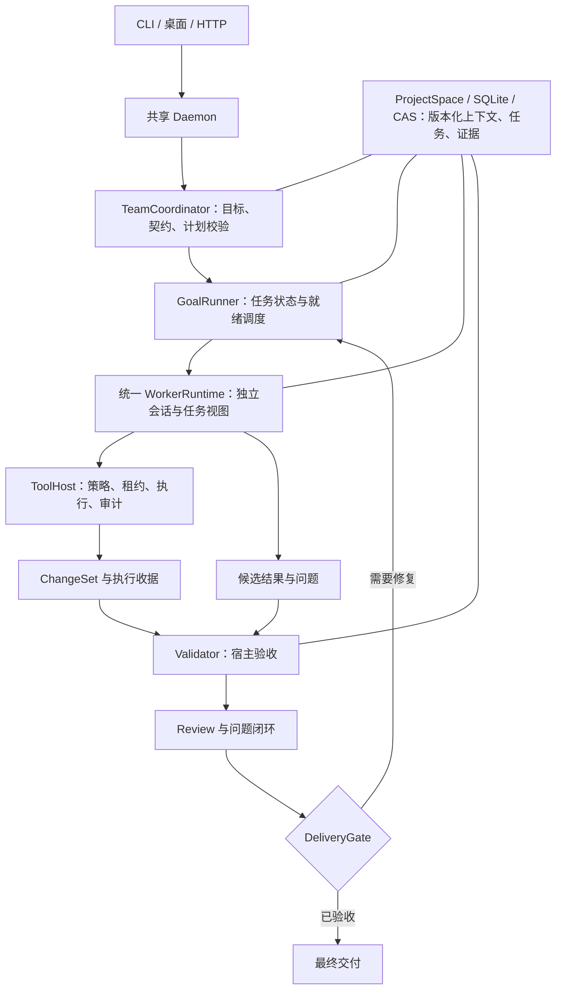

# Team 引擎架构重构方案：以任务、变更与验收驱动协作

日期：2026-10-02
范围：Agent SDK /team 实现本身。当前工作树存在既有未提交修改，本方案为源码审查与设计，未修改业务代码、未执行 Rust 或云端模型验证。
与上一份报告的关系：上一份记录运行现象与证据，本方案明确底层架构根因和统一重构边界；不把团队质量问题归结为某个任务不适合并行。

## 1. 架构判断

现实现具备 Agent、DAG 并发、权限、产物、恢复、共享上下文等基础能力。主要缺口是这些能力没有围绕同一个“可验收任务”形成强约束。

当前多条路径把“Worker 返回成功 + 输出满足文字断言”提升为“任务成功”，再把“所有步骤成功”提升为“团队成功”。角色交接依赖模型摘要，审查只是另一个步骤；权限、Prompt、模型和计量又在生产与评测两处分别装配。结果是协作越复杂，语义不一致、未解决缺陷和重复工作越容易积累。

推荐沿现有 Daemon/TeamCoordinator/GoalRunner/ToolHost 改造成统一任务执行内核：

- Worker 可以提出任务、实现、风险和修复建议，不能批准自己的交付。
- 宿主验证计划合法性、确定授权、持久化状态、采集执行收据、关闭阻断问题，并决定接受结果。
- Single 与 Team 使用同一内核；区别是任务图、Worker 容量和评审策略，不能长期保留两套完成语义。
- 角色是任务执行时的能力与约束配置，不再充当质量状态机。

这些调整解决执行正确性与质量闭环；不会保证所有任务都比 Single 快。速度目标是减少无效模型往返和串行尾段，质量目标是让缺陷无法被完成声明绕过。

## 2. 已确认的底层实现问题

| 源码入口 | 当前实现 | 架构后果 |
| --- | --- | --- |
| owo-agent-contracts/src/plan.rs:47–95 | VerificationSpec 只有输出包含、相等、非空；Custom 仍按非空处理 | “自定义验收”没有真正运行校验器，名称看起来比实际能力强 |
| core/src/goal/mod.rs:677 | verify_goal 拼接成功步骤的文字再做 verify_output | 验收对象是报告文字，不能证明文件、命令结果或目标行为 |
| core/src/workswarm/coord_lifecycle.rs:111 | finalize_success 检查 all_succeeded 后设置成功 | 缺少独立的最终交付判定 |
| workswarm/src/workswarm_output.rs:68 | WorkerOutputV1 的 evidence/open_issues 主要是文本；Done 校验 artifact 内容和格式 | “合法声明”与“真实验收”混在一个输出对象，未解决问题未必阻断完成 |
| core/src/workswarm/util.rs:203 | is_critic_role 只认角色名 critic | reviewer/自定义评审角色无法仅凭明确职责获得一致的评审语义 |
| core/src/workswarm/coord_artifacts.rs:426 | 上下文和产物访问主要按直接依赖、角色最新产物组装 | 多任务同角色需要更明确的 task/attempt 身份；不能靠角色最新版本代表任意依赖任务的输出 |
| core/src/builtin_team_templates.rs:168 | fullstack 固定角色，业务参数与具体文件名进入模板 | 通用引擎混入具体任务语义，任务需求、Prompt 与实际工具授权容易分叉 |
| core/src/worker_profile.rs 与 product-eval/workswarm_executor.rs | 两处装配 AgentConfig、Prompt、Session、工具、审批和计量 | 测试中的团队行为与实际产品运行器有差异 |
| core/src/agent/mod.rs:502/1350 | turn.usage 由共享 Provider 全局快照差获得 | 并发时无法准确归因，预算和成本判断失真 |

不能把已有代码说成没有安全约束或没有并行。问题是安全执行、调度完成、产物格式、功能验收和最终批准属于不同语义，却没有统一串联。

## 3. 推荐架构与职责

图中模块是职责边界，优先在既有 crate 内实现，不为每个框创建微服务、独立 Agent 服务或新的持久化系统。

### 3.1 TeamCoordinator：把目标编译为任务契约

输入是用户目标、父会话确认约束、工作区规则、当前源码快照和能力目录。模型提出计划，宿主检查依赖无环、需求覆盖、写范围、预算、验证器可用性和权限。

角色模板只保留通用能力：实现者、探索者、评审者、集成者。参数、路径、接口和验收来自本次 TaskSpec。由同一 ResolvedTaskContext 编译 Prompt、WorkerProfile 和工具注册表，杜绝各自根据角色名重新猜权限。

模型生成的 verification、command、write_paths 都是提案，不自动授权；宿主按实际 Policy、任务绑定和预注册能力解析。

### 3.2 GoalRunner：调度任务与状态，不解释模型报告

沿用已有就绪即派发和恢复机制。调度基本单位由“角色步骤”迁到“task_id + attempt_id + epoch”。

同一 Worker 可连续领取多个任务；一个任务有一个活动 owner。资源约束分开：

- 模型请求并发额度；
- 文件/目录写租约；
- 验证命令或构建执行队列；
- 团队预算及截止时间。

调度成功不表示交付成功。任务尝试返回候选结果后进入验证，不直接解锁所有需要已验收实现的下游。依赖边标注需要的输出：已接受接口契约、已验证模块或已批准交付，避免既盲目提前执行，也无条件等所有验证结束。

### 3.3 WorkerRuntime：全产品唯一执行器

复用 ProfileSubagentRunner，统一完成：

TaskContext → Session/model_override → ToolHost/profile → Agent loop → 输出契约 → 候选提交。

生产、Single、Team、评测只注入工作区、受控审批实现、观测 sink 和预算；它们不得另写完成判定或特殊工具授权。评测审批不得进入生产路径。

Worker 返回的 status=done 改解释为“已提交候选结果”，不再等价于 Task Accepted。格式错误和功能错误分别处理；格式修复不能把失败或阻塞语义改成成功。

### 3.4 Validator：宿主决定证据是否有效

新增真正的 VerificationPlan，引用预注册 validator_id、作用域、参数、必需性和资源需求。保留 OutputNonEmpty 等作为格式检查，但它们不能替代代码任务的行为验收。

未知 Custom 校验器必须返回 unsupported/unverified，不能回退非空后通过。已有依赖旧行为的路径标记 legacy，迁移时明确显示其未验证程度。

验证器通过 ToolHost 执行获授权的检查并生成不可由模型伪造的收据。命令退出0只是该检查通过，不等于功能全部覆盖；验证计划必须包含对应需求的必要行为检查。无法自动验证的要求明确进入人工验收或 unverified。

### 3.5 Review：独立证据裁决与问题闭环

以 capability=review 表示职责，不绑定 critic 字符串。ReviewResult 是结构化对象，包含审查的 ChangeSet/文件哈希、阻断/非阻断 findings、证据与建议 owner。

reviewer 的模型结论仍是候选判断；宿主负责身份、审查范围、版本与阻断状态校验。作者不能批准自己的独立评审。审查发生在不可变快照或带 hash 的版本上；文件改变使相关结论过期。

测试与审查可以并行。二者结束后宿主汇合，阻断项由原 owner 局部修复，补充收据，再重验受影响要求。没有失败时不用额外启动一个长篇 leader；有冲突时才用有限协调回合。

### 3.6 DeliveryGate：唯一成功入口

finalize_success 内部委托 DeliveryGate，不只检查 all_succeeded。所有进入成功的路径，包括恢复、Human 提交、重试和兼容入口，都必须遵守同一判定：

- 必需任务有被接受的结果；
- 必需验证收据通过且匹配最终输入/文件版本；
- 必需独立审查有效；
- 未解决阻断项为0；
- 最终产物清单与实际文件/内容哈希一致；
- 最终 epoch 有效，团队未取消，预算状态合法。

校验与终态提交使用带修订的事务/CAS；涉及文件时持有适当租约或校验同一不可变快照，不能检查后再无锁接受已变化文件。LLM、命令和长文件操作放在短事务外。

## 4. 核心数据契约

以下是建议新增/演进的逻辑契约，不是当前已经实现的类型。

| 对象 | 关键字段 | 谁可以决定 |
| --- | --- | --- |
| TaskSpec | task_id、requirement_ids、依赖输出、read_refs、write_scope、contract_revision、verification_plan、risk/budget | Coordinator 提案，宿主批准 |
| TaskAttempt | attempt_id、owner、epoch、输入revision、状态、有效租约、开始/截止时间 | 宿主 |
| WorkerSubmission | task/attempt/epoch、result_ref、changeset_ref、receipt_refs、issues | Worker提交，宿主校验 |
| ChangeSet | base_file_hashes、changed_files、patch/content refs、最终hash、执行收据 | ToolHost/变更追踪器生成 |
| ValidationReceipt | validator_id/version、参数、input/changeset hash、exit/verdict、日志ref、环境身份 | Validator/ToolHost生成 |
| ReviewResult | reviewer identity、changeset/hash、findings、判定、证据ref | 独立评审提交，宿主验证 |
| Issue | requirement、severity、证据、owner、解决代次、状态、复验ref | 宿主维持；模型提供建议 |
| RequestRecord | request_id、task/attempt、实际model、usage、TTFT、duration、重试来源 | Provider运行时生成 |

角色名不能决定任务身份；产物索引应是 task_id/attempt/output_slot，而非 role最新版本。历史角色链索引可保留用于展示，但不能作为新任务依赖解析的唯一依据。

证据引用存在与证据可信有效是两回事。模型引用日志或路径不自动变成宿主验证收据；Worker 发布事实保持 candidate，校验后才提升，并保留来源hash和有效revision。

## 5. 状态机与修复协议

任务主状态：

Planned → Ready → Running → Submitted → Validating → Reviewing → Accepted

异常分支：

- 验证/阻断审查失败 → RepairPending → 新 attempt；
- 权限/缺输入 → Blocked；
- 预算耗尽或不可修复 → Failed；
- 用户取消 → Cancelled；
- 文件/约束变化 → 相关结果 Stale，重验或重排。

这是拟议的新语义。现 StepStatus 不能机械全量替换，先在任务结果/交付判定层引入，再迁移步状态。

返工协议：

1. 汇总机器失败与结构化 findings，定位 requirement和文件版本。
2. 将最小修复任务派给原owner；复用局部会话，但刷新任务输入revision。
3. 重新申请限定写租约；不能通过派发任务扩大原授权。
4. 新ChangeSet记录旧结果被替代、影响范围及新的hash。
5. 只重验受影响的验证器和下游；交付前必要最终验收仍须覆盖最终版本。
6. 达到次数、预算或截止上限时如实失败/阻塞，不无限重试或弱化测试。

每个任务状态与接受指针持久化；崩溃恢复只认宿主接受记录，Worker迟到回传必须匹配attempt/epoch。重试不得重复接受产物、重复关闭Issue或重复执行未经幂等保护的外部副作用。

## 6. 性能如何从架构上改善

性能收益来自减少工作，而不只是把更多角色放进并行槽位：

1. 共享一次仓库勘察、规则与接口契约，Worker获得相关上下文切片；按hash缓存读取，修改前仍校验新鲜度。
2. 消除独立实现的重复装配和无效权限尝试。Prompt、工具与运行授权来自同一解析结果。
3. 实现结果完成即提交，确定性验证自动启动；模型只处理实现、复杂审查或失败诊断。
4. 没有接口冲突无需固定集成LLM重读所有文件，没有失败无需固定finalizer重写交付报告。
5. 同一Task的返工沿用会话和错误证据，不能重新从目录探索开始。
6. TaskGraph持续就绪调度；写租约与模型容量独立管理；构建验证保持仓库资源红线。
7. 模型调用按请求计量；修复、429、重试、租约等待、验证排队单独记账，找到真正关键路径。

共享事实不等于共享云端推理缓存。不能仅因增加共享存储就宣称token成本下降；需要实际请求和缓存命中证据。

## 7. 文件归属和迁移顺序

### 第一步：修正完成语义，立即阻止错误成功

- owo-agent-contracts：新增类型化任务/验证结果契约，保留纯DTO职责。
- core/goal：引入VerificationPlan/验证执行接口，不继续用verify_output承载功能验收。
- core/workswarm/role_worker.rs：WorkerOutput登记为候选提交。
- core/workswarm/coord_lifecycle.rs：finalize_success调用DeliveryGate，处理unverified/repairing/blocked。
- core/workswarm/coord_artifacts.rs：产物带task/attempt和受测版本，保留现有格式门。
- server/协议/TS：展示真实状态、收据和问题；路由变更同步route_contract_tests/OpenAPI。

优先契约测试：Done+失败收据不能成功；非空Custom不能冒充有效行为验证；已有open blocking Issue不能成功；收据对应旧hash不能成功。

### 第二步：统一WorkerRuntime和角色语义

- worker_profile.rs、contract_worker.rs、team_prompt.rs：以ResolvedTaskContext统一工具与Prompt，能力显式化。
- server/workswarm_api/runtime.rs、workers.rs：只做服务装配与事件接线。
- product-eval/single_agent.rs、workswarm_executor.rs：通过共享执行内核，迁移旧执行器后删除重复逻辑，避免永久增加门面。
- gateway/provider与metrics：逐请求身份/usage，同一请求只入账一次。

测试：角色改名不改变授权；生产与评测使用同一模型覆盖/工具表；失败契约修复不改业务终态；并发token归属不交叉。

### 第三步：任务身份、版本上下文与Issue闭环

- workswarm契约/存储：TaskAttempt、Submission、Issue和收据关联，SQLite迁移保留旧数据。
- coord_run/context/artifacts：按task/attempt读取依赖，更新影响分析和结果接收。
- server/write_lease、现变更追踪器：ChangeSet与验证快照绑定，跨团队写互斥。
- Review不再只是角色输出；修复安排依赖Issue与证据版本。

测试：同角色多任务不串产物；取消/重试/重启不双写；修改文件使审查过期；owner修复后必须重新验收。

### 第四步：消除固定串行尾段并验证收益

沿已存在的GoalRunner就绪调度，不另写调度系统。让验证、审查、提交、返工按事件推动；角色模板只给能力建议。Single与Team最终复用同一结果状态机，完成后收敛旧模式。

验证包括入口→任务契约→授权→实际文件/行为→收据→审计→失败/取消/恢复。性能比较以同版本、同模型和同外部验收为基础，分别量模型、工具、队列、验证与修复时间。

旧运行默认不能被自动提升为新Accepted：缺收据的历史成功保留原记录，并展示legacy/unverified；需要新验收时显式创建验证任务。避免升级数据库后把历史绿色错误包装成新门禁成功。

## 8. 必须守住的架构不变量

1. Worker完成声明不能直接使团队成功。
2. 每个被接受结果都对应明确task/attempt及有效证据版本。
3. 未知校验器、未执行验证、缺失usage都保持未知，不能自动通过或填0。
4. 任意阻断Issue都有owner、解决结果和复验证据。
5. 模型生成计划不能增加权限；评审者不能修改作者实现来替代独立审查。
6. 一个团队只有一个运行状态真相；Single、Team、评测和UI共享完成语义。
7. 请求、变更、验证和接受均可追溯；恢复和迟到结果不能绕过版本与epoch。
8. 控制面持短锁；LLM、工具和长验证不阻塞全局状态锁。

验收这八条，比增加角色或积累更多成功报告更能改善Team质量。它们也给速度优化提供可测边界：减少不必要步骤可以降低耗时，但不能删掉验证、权限或独立审查要求。

本方案依据当次源码审查；没有把设计视为已实现或保证性能收益。

## 9. 团队组织架构：一个持续协调者、动态执行池、独立验证通道、按需评审

这是本方案推荐的默认组织方式，综合优化墙钟、模型/工具往返、协作成本和交付质量。不是给每个目标都固定启动规划者、多个实现者、审查者、集成者、收尾者。

### 9.1 四个组织单元

| 单元 | 组织与生命周期 | 负责 | 不应承担 |
| --- | --- | --- | --- |
| Coordinator | 每个TeamRun一个持续逻辑协调者；状态持久化，模型只在必要决策时调用 | 确认目标、一次勘察、稳定接口、任务拆分、依赖与owner、异常协调、交付解释 | 为每个工具调用做一次模型审批、重复全仓阅读、重新实现所有Worker成果、自我授权 |
| WorkerPool | 可复用的独立执行会话；按任务能力选Worker，不永久绑定前后端等角色 | 在独占写面完成一个任务及局部修复，提交ChangeSet/证据，发布相关事实 | 修改需求、宣布团队成功、重复领取已在执行任务、无目的与其他Worker聊天 |
| ValidationLane | 宿主服务与资源队列；通常无需额外LLM | 运行已批准检查、收据、格式/契约验证、影响范围检查、发布结构化失败 | 依靠模型阅读日志后口头判“通过”、执行模型自创且未授权命令 |
| Review | 按风险/交付策略启动的独立会话；审查具体快照 | 检查需求覆盖、语义错误、测试漏洞、行为回归，提交结构化findings | 与所有Worker全面重复勘察、反复全仓评审、写作者文件、忽略已变化的版本 |

Coordinator是一个逻辑责任人，不意味着一把长锁或所有请求共用同一个LLM会话。确定性状态迁移和调度由宿主驱动；只有拆分不明、接口冲突、失败定位或需求变化需要协调者模型介入。

### 9.2 调度方式

勘察完成后，按“可独立交付的变化”而非角色名称拆任务。每个任务同时给出需求、必要读取、输出接口、独占写面、验证和预算。先发布接口契约，再并行实现；接口尚未稳定时，可以并行勘察或准备独立部分，不能让多个Worker各自猜接口。

Worker提交候选变更后，ValidationLane立即接手。无阻断失败时，结果Accepted，解锁需要该输出的下游。需要独立评审的变化在同版本上审查；可与测试并行。失败直接派回原owner，附结构化错误和相关上下文，不另启动一个重读全仓的“修复专家”。

集成是任务，不是固定职位。只有真实共享文件、跨模块不兼容或最终联调需要集成任务。最后的DeliveryGate由宿主执行；Coordinator根据已接受清单生成用户交付说明，不再让finalizer重写代码或重做验证。

### 9.3 工具调用组织

- Coordinator共享目录/规则/接口勘察结果，Worker领取后优先使用宿主验证的相关内容切片；缺信息才读取。
- 工具往返按同一状态下的独立操作批量处理：多个必要文件读取可批量；依赖前一结果的编辑和测试顺序执行。
- 为小改提供expected_hash保护的patch，避免整文件生成、截断和重复写入。
- ToolHost把成功、错误、文件hash和日志引用结构化返回。缺权限、缺文件、过期hash是不同失败类型；不能让模型盲试相同调用。
- 命令运行进入共享验证队列；相同输入hash的有效结果可复用。不能因为“执行过一次”复用已变化代码的旧绿色结果。
- 重复读取或相同失败调用达到阈值时，宿主阻止无进展循环并通知Coordinator；合法重试与新的输入版本仍可继续。

### 9.4 信息流

不建立全体Agent互相聊天的网状网络。共享空间是事实/契约/任务/证据的版本化索引，Worker会话保存自己的执行历史。

常用事件只有TaskSubmitted、ValidationFailed/Passed、FindingRaised、TaskAccepted、ContractChanged、BudgetPressure。事件携带task/attempt/revision与引用，正文按需获取。与任务无关的更新不塞进每个Worker的提示词。

事实不是所有Agent自由覆盖的“公共记忆”。同一key有来源、hash、revision与冲突状态；候选事实不能覆盖用户约束。重要接口改变由Coordinator经宿主确认后发布，受影响任务失效或刷新，不全队无差别重启。

### 9.5 资源和工作量

起步采用保守的开发并发容量，依据实际Provider吞吐、可独立写面、内存和失败率调整。开发Worker数量与任务数量分开；增加任务不必新增会话，也不默认提高并发。

给每个任务工作预算，同时预留团队的验证与修复预算。观察的是“无新证据/无新变更的模型往返”和“单位Accepted变化耗时”，而不是固定要求所有角色恰好几回合。达到预算时提交真实状态，不能为了格式收尾牺牲验收。

Rust/原生构建遵守既有单组Cargo与ci-shared策略；开发、验证、模型三个并发额度独立。模型等待时可以推进独立任务，但不能用多个同时重链耗尽机器资源。

### 9.6 综合目标及迁移优先级

质量硬约束：未经必要验收不接受；阻断问题不关闭不成功；授权、版本和恢复一致。
速度目标：降低Accepted交付的关键路径耗时，而不是更快输出最终报告。
工具目标：减少重复读取、无效失败、全文件重写和重复验证。
成本目标：逐请求准确归因后，衡量每个Accepted交付的模型成本与修复成本。

先统一WorkerRuntime/工具面、收据与DeliveryGate；再用任务身份、owner与Issue闭环连接验证和修复；然后把模板角色链迁移为动态任务池；最后移除不必要的固定集成/finalizer与重复上下文。每阶段保留现有API和数据的兼容适配，不能另起一套Agent服务长期双轨运行。

## 10. 普通对话的自主执行循环与 Single/Team 收敛（2026-10-03）

普通问答继续直接回答，不强制创建任务计划。用户提出可执行目标后，Agent 应沿“模型判断下一步 → 宿主执行获准工具 → 返回真实结果 → 模型继续或给出最终回答”循环运行。Single 产生候选源码后，模型文本不能直接结束回合：宿主先执行已登记的静态检查并核对行为命令收据；必需检查失败或过期时，宿主把结构化失败作为内部上下文回送同一模型回合，模型可继续修改并重跑验收。最终答复只在宿主验收通过、没有代码候选，或同一验证指纹重复且已无证据进展时发出；固定模型轮数、工具上限、取消及权限等待仍按既有边界处理。手动设置的正数上限仍作为运维保险；委派 Worker 使用独立、明确的任务预算，不能继承主会话的无限默认值。重复的完全相同调用仍由循环保护拦截，并把原因交回模型调整策略。

系统指令区分闲聊和执行请求：闲聊自然答复；可执行目标不能只输出方案或一次工具调用后就结束，而要查看工具实际结果、修复失败、运行与风险相称的检查，最后如实区分已完成、已验证和受阻内容。权限审批、撤销、写范围和审计均保持不变。

本节代码变更已经取消普通 Agent 的默认 60 轮和 64 次工具调用硬上限；Worker/子代理边界仍保留独立上限。普通 Single 已按当前用户回合产生共享 CompletionStatusV1，并以宿主命令回执、写入收据和最终文件哈希决定 Accepted/Unverified/Blocked。core 的共享 completion 裁决器现由普通 Single、GoalRunner 与 Team DeliveryGate 调用，统一处理 ResponseComplete、Candidate、Accepted、Unverified、Blocked 的裁决优先级；各入口仍分别采集宿主证据并维护自己的会话/任务生命周期，因此尚未成为同一个持久化状态机。GoalRunner 会聚合步骤级和目标级必需验证收据；存在已执行步骤但没有通过的必需宿主验证时，不再因步骤状态全成功而接受。系统提示要求验证也不等于宿主验证；Single 的通用命令成功只证明登记命令在绑定源码上成功，不证明需求覆盖完整。剩余工作是把需求级 VerificationPlan、Issue 解决状态与人工验收更直接地接入 Single，并让共享裁决接收可追溯的评审事实。

行为验收要求与任务约束分离：验证器必须由宿主登记，引用具体输入/ChangeSet/文件 hash，并执行经策略授权的行为检查。仅文件存在、非空、文本包含或 JSON 字段匹配，可以证明有限的静态条件，不能代表程序运行正确。若缺少可运行的验收方式，应保持 Unverified 或请求人工验收，不能让 Worker 把弱检查改名为功能通过。任何验证或审查之后的相关文件变化都使对应收据过期。

Team DeliveryGate 会把 WorkspacePaths 验证器产出的文件哈希，与同一 task/attempt 的 ChangeSet 结果哈希交叉核对；动态代码任务还必须声明宿主登记的行为命令。ToolHost 返回命令摘要、退出码、结果摘要、耗时和该 Worker 会话中已写文件的当前哈希；Team 只接受匹配 task/attempt、命令摘要、源码快照且退出码为 0 的收据。跨模型回合的编辑与测试通过会话写收据关联。白名单拒绝 --no-run、--list、--collect-only、--if-present 等可绕过测试执行的选项。

Team/Single 行为收据同时记录宿主验证器身份与版本；合法源码删除以域分离的缺失状态摘要绑定到 ChangeSet 的 sha256=None，只有宿主完整快照确认文件缺失时才可验收，缺失与读取失败不会混为一谈。

源码现已把 TaskGraph 的 timeout_ms 从 WorkerProfile 传到 Agent ToolHost capability；ToolHost 在审批通过后注入宿主上限，run_command 超时会终止沙箱进程，超预算不产生成功收据。收据裁决也再次检查实际耗时。命令验证证明的是该登记测试命令在收据绑定源码上成功，不证明测试覆盖完整。动态 Team 已把 Reviewer 排在集成步骤之后；Reviewer 启动时宿主把实际收到的 Artifact、ChangeSet 身份和工作区文件哈希一并快照，登记及最终 DeliveryGate 都重新计算并比较；源码与 ChangeSet 结果不一致、工作区不可读或评审期间/之后文件变化都会拒绝该评审收据。普通 Single 会话已接入宿主 Accepted/Unverified 状态机；GoalRunner 目标级 WorkspacePaths 验证器会读取绑定工作区并把文件哈希写入收据，步骤级与目标级必需收据由 core completion 裁决器共同判定；缺失必需验证时目标保持失败，不提升为成功。以上源码改动尚未经过最终 Cargo 验证。普通 Single 回合现已通过共享 CompletionStatusV1 明确区分 response_complete、candidate、accepted、unverified 与 blocked：没有本回合文件写入的自然回复保持 response_complete；宿主观察到文件写收据后标为 candidate，轮数上限收尾标为 unverified。该元数据随 TurnStats 发给兼容客户端，桌面/CLI 汇报卡显示“代码变更待验收”等状态。Team DeliveryGate 通过后在验收收据中记录同一类型的 accepted。Single 现通过 verification_plan 工具登记与当前用户回合摘要绑定的 VerificationPlanV1。每项必需要求必须映射用户验收点并使用宿主登记的 WorkspacePaths validator；代码源码路径还必须被 workspace-command-success-v1 行为命令覆盖。命令必须在本回合实际运行、通过宿主策略白名单、成功且在声明的耗时预算内；命令时、写入收据及回合结束时的路径状态必须一致。静态验证在宿主结束裁决时直接读取最终文件并绑定其 SHA-256。缺少当前请求绑定计划时有代码变更的回合保持 Candidate；范围缺失、静态检查未通过、命令失败或证据过期时保持 Unverified/Blocked，不产生 Accepted。计划中的验收点映射仍由模型声明，当前 Single 尚未把映射语义独立验证，也未接入按风险触发的独立评审或人工验收，因此不能据此宣称复杂任务需求覆盖已被证明。验证计划和收据持久化并经过兼容迁移；历史证据源码变化后标记 Stale。 Single 与 Team 的请求计量共用 protocol 的 ModelRequestMetricV1 字段：Single 的 ModelCallRecord 将逐请求 model、request ID、usage、延迟与成功状态写入 TraceRecord 并通过 TurnStats 下发；Team WorkerSpanRecord.requests 改为同一 DTO，MeasuredProvider 为失败请求也保留逐请求失败与延迟，旧 JSON 缺少 succeeded 时按默认 false 读取。Single 当前回合的成功/失败请求暂存于不落盘的 Session 内存字段；即使 Agent 在形成 TurnOutcome 前遇到网关错误或超时，错误 Trace 仍保存已观测请求与最后一次失败耗时，并将已知 usage 求和、通过 usage_known=false 明确表示失败请求导致该合计不完整。聚合指标仍使用独立 span 维度，避免把并行 worker 的调用、预算与生命周期合并成单回合。此源码变更尚待最终验证。

评审源码快照现按 team_id、task_id、attempt_id 三重身份过滤 ChangeSet，避免不同 Team 的同名步骤或尝试被混入审查证据；新增了跨 Team 污染回归测试源码，尚未运行。

本节是源码实现边界记录，不是运行结论。以上新增代码尚未经过 Cargo 验证；Single 与 Team 的真实行为质量和速度也尚无有效配对实测。

当前会话预算配置：OWO_AGENT_MAX_MODEL_TURNS 与 OWO_AGENT_MAX_TOOL_CALLS 仅在设置为正数时启用显式硬上限；普通对话默认值为 0（不限）。子代理、Worker 与有界评测单独设置模型轮数及工具调用预算，不继承主对话的不限配置。
显式 Worker 轮数耗尽时，Agent 可以生成说明性 wrap-up，但该结果带 reached_model_turn_limit 标记；WorkerRuntime 与评测必须把它记为预算失败，不能把收尾文本解析成 Done/Accepted。

Single 回合完成状态只描述当前用户回合。历史回合的 Accepted 收据因源码后来变化而转为 Stale 时，不能污染之后普通问答的 response_complete；历史未验收候选也只有在新回合明确登记新的请求绑定 VerificationPlan 后才进入本次验收，不能因旧写入把普通问答降为 Candidate。当前回合新写入的文件仍须满足原有行为验证门槛。源码回归用例已补充，尚未执行最终 Cargo 验证。

全栈 Web 模板的协调、实现、集成提示现要求从用户目标和仓库现状推导接口契约，不再强加博客列表字段、搜索字段或分页常量；集成检查提示改为使用任务计划登记的行为验证。Worker 写面继续受现有路径白名单约束。该模板回归用例尚未执行最终 Cargo 验证。

评审返工现支持在 finding 中用 target_task_id / target_artifact_id 指向宿主绑定的精确产物快照；该快照同时持久化 task_id 和 attempt_id。旧 finding 仍可用于 owner 唯一的情况；同一 Worker 对应多个候选任务时宿主拒绝猜选，并验证目标仍对应已成功步骤。相关协议解析与歧义回归测试源码已补充，尚未运行。 WorkSwarm 的 GoalRunState 现新增向后兼容的 DeliveryIssueV1 账本，保存 finding 摘要哈希、源评审产物、目标 task/attempt、owner 和 Open/RepairDispatched/Resolved 状态；评审返工派发时记录新代次，待关闭 Issue 会阻止运行期跳过 Reviewer，只有 reviewer 对修复后的当前 attempt 产生有效批准快照才可关闭 Issue。关闭记录绑定批准评审 Artifact ID、SHA-256 与修复后的 attempt；DeliveryGate 拒绝未关闭或关闭证据未绑定最终版本的 Issue，并将已关闭账本写入交付清单。该闭环尚未经过最终 Cargo 验证。

## 11. 配对评测输入契约（2026-10-04）

配对报告只有同时满足以下条件才标记 configuration_aligned=true，不对 dry/scripted 结果或配置不一致的结果放行 Team 收益判定：

- Single 报告执行器必须是 live-agent，Team 报告执行器必须是 live-workswarm；
- 两侧 suite hash、非空实际模型、批次标签和 (case_id, repetition) 集合一致，不能有重复、空白 ID 或未执行单元；
- 两侧 run_contract_sha256 必须存在且相同。它绑定所选任务、权限、检查器（通过 suite hash）、有效重复数、超时、模型调用预算和套件默认值；
- meta.json 续跑必须严格匹配模型、执行器、批次标签、生效配置指纹和评测器二进制身份；旧元数据缺少任一绑定时拒绝续跑，避免把变更后的来源与历史 journal 混合。

配对报告另绑定运行中的评测器可执行文件 SHA-256 和脱敏后的 Provider base_url SHA-256；同一批对照必须来自字节相同的评测器并连接到相同端点，续跑目录也不能跨二进制或端点混用。端点哈希不泄露 URL，但不能识别端点背后的服务版本或路由变化；二进制哈希也不单独证明对应哪个 Git 源码版本。正式结论仍需 freeze 与 Git/build 身份核验。以上是源码门禁和未执行的回归用例，不是本次测试结果；Single/Team 真实任务优势仍无有效实测结论。

## 12. 动态任务的集成尾段按证据触发（2026-10-04）

动态 TaskGraph 中存在依赖边，并不单独证明还需要额外的模型集成回合：下游任务已通过 DAG 读取上游产物，若上下游都声明了明确且互不重叠的写范围、也没有共享契约引用，协调器可由宿主清单汇总各自已验收的产物，省去固定串行集成步骤。共享/重叠写面或共享契约仍要求集成；依赖两端任一方缺少写范围时继续保守要求集成。整个结果仍需最终 DeliveryGate 对同一工作区版本验收，权限与评审约束不变。此次仅补源码与回归测试，尚未运行最终 Cargo 验证。

## 13. Single 验收点引用必须来自当前请求（2026-10-04）

普通 Single 的 VerificationPlan 不再接受由模型任意填写的 `user-request:<id>` 作为验收点映射。每项必须引用 `user-request:<用户原文中的精确片段>`；宿主从当前回合的原始输入核对片段确实存在后才登记计划。原文只在活动 Session 内短暂保存并标记为不序列化字段，不新增数据库迁移。该门槛使验收计划可追溯到用户原文，但仍不能证明模型没有遗漏其他语义要求；按风险触发的独立评审与需求覆盖完整性仍是后续工作。最终 Cargo 验证尚未运行。

## 14. Single 高风险源码的独立评审绑定（2026-10-04）

普通 Single 的静态验收通过后，对认证、权限、密钥/加密、支付、迁移、删除、隐私等高风险请求的源码变更，再启动一次独立只读评审。评审请求只含当前用户请求、冻结验收点和宿主从工作区读取的完整文件快照；结构化 ReviewResult 需逐个引用受审路径。宿主记录独立评审 ValidationReceipt，并在评审前后复查同一 SHA-256；源码无法读取、快照超限、敏感凭据文件或评审不通过时保持 Unverified/Failed，将证据送回当前 Agent 返工，成功后才保留 Accepted。评审使用当前会话的 Provider/模型路由，是独立上下文调用，不代表模型多样性；风险词匹配也不等价于完整风险分类。权限与命令审批规则不变。此次回归测试源码尚未运行，最终 Cargo 验证待实现收敛后执行。
## 15. Single 独立评审进入共享完成裁决（2026-10-04）

高风险 Single 源码评审结果现通过 core 的共享 completion 裁决器计算最终状态，不再由 Agent 循环手动把失败统一改写成 Unverified。评审 Passed 才能维持 Accepted；Failed 按必需验证失败裁为 Blocked 并进入现有修复反馈；Stale 或 Unverified 保持 Unverified；评审成功不能提升基础行为验收未通过的候选。对应状态回归测试源码已补充，仍待最终 Cargo 验证。
