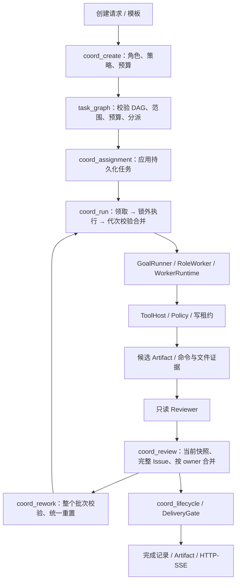
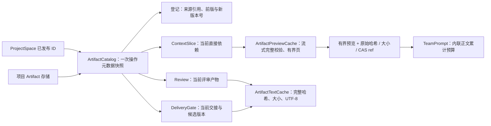

# Agent SDK 工程代码结构说明

更新：2026-10-08。本文描述当前工作树的源码职责，不代表全产品已通过真实任务、桌面或发布验收。
综合 Team 速度与交付质量诊断及建议架构见 docs/Team速度与交付质量问题解决报告-2026-10-05.md。

## 1. 阅读顺序与产品边界

活跃工程为 agent-sdk，根目录 C++ 输入法为历史工程。先从调用入口进入运行链路，再读协议、权限、执行和验收；不要把同名兼容导出当作第二份业务实现。

默认调用链：

CLI turn / REPL / TUI / 桌面 HTTP 客户端
→ owo-agent-client → Daemon / owo-agent-server
→ Single Agent 或 TeamCoordinator / GoalRunner
→ Policy + ToolHost → 文件、命令、Git、MCP
→ 验收证据 + 独立评审 + 完成记录 → HTTP/SSE / 用户输出

repl --local 是显式本地兼容入口，不应作为新客户端另建 Agent 服务的理由。

## 2. crate 分工

| 路径（相对 agent-sdk） | 主要职责 | 开发边界 |
| --- | --- | --- |
| crates/owo-agent-protocol | 客户端事件、状态和完成记录 DTO | 不依赖服务端或执行实现 |
| crates/owo-agent-contracts | 任务、验证计划、回执等共享契约 | 不承担模型或工具执行 |
| crates/owo-agent-client | Daemon 发现、HTTP、SSE 与重放 | 使用同一会话与服务 |
| crates/owo-agent-cli | turn、REPL、goal、TUI 和终端呈现 | 普通默认入口经 Daemon |
| crates/owo-agent-server | 路由、认证、审批、任务接线、恢复 | 负责装配，不另写 Agent loop |
| crates/owo-agent-core | Agent loop、模型网关、工具宿主和协作编排 | 新职责放入对应模块，不堆积入口文件 |
| crates/owo-agent-workswarm | 团队与 ProjectSpace 契约、存储 | 核心协调与 HTTP 接线分别在 core/server |
| crates/owo-agent-kernel、owo-agent-policy、owo-agent-tool-safety | 基础类型、权限与受信执行 | 不能反向依赖 core |
| crates/owo-agent-memory、owo-agent-mcp、owo-agent-extensions、owo-agent-plugins | 记忆、MCP、扩展与插件 | 经统一宿主接线和授权 |
| crates/owo-agent-perception、owo-agent-executor、owo-agent-env、owo-agent-workflow | 感知、UI 动作、环境和流程 | 单独验证原生依赖与产品入口 |
| devtools/product-eval | 行为检查、真实任务矩阵、Single/Team 配对统计 | 独立 workspace；不能代替生产验收 |
| desktop/electron、desktop/web、desktop/tauri、clients/ts | 客户端表面与 TypeScript 契约 | 先确认实际启动入口；不另建后台能力 |

上述表不是依赖隔离已完成的证明。core 的传递原生依赖，以及 CLI/server 经评测门面引入的依赖仍需按实际构建图核对。

## 3. Single 执行与完成判定

- core/src/agent/mod.rs：模型与工具回合调度、事件、取消、执行计时。最终文本不是验收结果。
- core/src/agent/config.rs：上下文、模型请求、工具、时间和显式轮数预算。
- core/src/agent/single_completion.rs：本轮拆出的宿主验收模块。负责请求绑定、候选文件哈希、行为验证收据、旧证据失效、缺失计划和失败后的反馈。原有行为回归测试随职责迁入。
- core/src/agent/single_review.rs：独立只读评审及源码快照重查。
- core/src/agent/single_manual_acceptance.rs：显式人工验收入口；不能由模型代替用户接受。
- core/src/goal/acceptance.rs：Goal 宿主验证回执匹配、工作区回执失效、候选版本摘要及目标完成/失败记录；持久化失败会记录错误并阻止 run() 报告成功；不执行 Worker 或调度步骤。`goal/mod.rs` 保留 GoalRunner 生命周期调度、步骤合并和 replan。
- core/src/goal/execution.rs：单步骤 Worker 解析与执行、执行目标路由、host verification、租约与取消清理；共享 ExecutionBudget 在每次 Worker/critic 作者调用前短锁预留全局 steps/retries，锁不跨 await。goal/mod.rs 负责恢复基线与结果合并；Team phase 以主 GoalRunState 的累计用量初始化，避免阶段预算归零。
- core/src/completion.rs：Single 和 Team 共用的完成状态判定与完成记录构造。
- core/src/verification.rs、verification_workspace.rs：验证契约与单次计划批次内共享的工作区文件读取，验证正文与最终哈希复核使用不同快照。
- core/src/workspace_snapshot.rs：规范路径、受限流式哈希与批次内唯一路径复用；每项验收必须创建新快照，禁止跨 attempt 复用。
- core/src/request_requirements.rs、task_context.rs：原文要求与宿主解析任务契约。
- core/src/session.rs、sqlite_store.rs、trace.rs：会话、证据、运行轨迹和持久化。Single 收尾现在把 TaskCompletionRecordV1 写入 Session，并由 SQLite v9 保存最近一次决策；它包含当前回合验证收据 ID 与候选快照哈希。

Single 与 Team 已共享完成状态裁决和 TaskCompletionRecordV1：Team 持久记录绑定已接受 Artifact 与最终工作区快照，Single 会话记录绑定本回合文件收据与验证收据。两者记录的候选范围、生命周期及恢复流程仍不同；这不是统一状态机，也不能据此宣称交付质量相等。

## 4. Team 与子代理执行

- core/src/workswarm/coord_create.rs：创建团队，解析模板、策略、角色、预算和自动只读 Reviewer。
- core/src/team_strategy.rs：模式选择、风险/来源信号与 Single/Team 计划构造；core/src/team_strategy/template_policy.rs：模板关键词匹配、自适应角色裁剪与运行期 Reviewer 跳过规则。后者是纯策略，不读写 RunMeta、不改 DAG；服务端协调器负责证据确认、步骤重写和持久化。
- core/src/workswarm/task_graph.rs：纯任务图校验、写范围、依赖、Worker 槽位、调用预算与集成必要性判断；测试位于 task_graph_tests.rs。
- core/src/workswarm/coord_assignment.rs：将已校验图应用到持久化步骤与 RunMeta，不执行模型或工具。
- core/src/workswarm/coord_run.rs：领取阶段、子图装配、锁外执行与请求/取消驱动；持久准入、进度快照事务和阶段结果合并分别归 coord_admission.rs、coord_progress.rs、coord_finalize.rs。GoalRunner 使用持久 steps_taken/total_retries 作为 ExecutionBudget 基线；该层不承载创建和任务图解析。
- core/src/workswarm/phase_subplan.rs：从 ready frontier 沿依赖边构造阶段内可达子图，只保留当前所需的成功依赖锚点；避免每一阶段复制无关历史成功节点，Human 分支和并行 lead 的延后扇出语义保持明确。
- core/src/workswarm/artifact_read.rs：有界 CAS 分页读取与预览缓存；TeamCoordinator 在最多 32 MiB、4096 个键的共享 FIFO 窗口内复用不可变、哈希校验过的依赖预览，并以有界 per-key single-flight 合并并发同键读取，每次仍核对 Artifact 声明大小，不缓存可变 Team/步骤状态。
- core/src/workswarm/coord_review.rs：匹配当前评审产物、校验内容身份、登记完整 finding 集合、按 owner 合并返修和关闭已复验问题。
- core/src/workswarm/coord_rework.rs：用户、宿主验证器与评审共用的返修状态变更。批次整体校验后统一重置 owner 和依赖闭包。
- core/src/workswarm/run_state.rs：Team durable run-state reducer。阶段准入/进度投影、批量返修、retry、continue、取消和进程中断统一经事件归约；协调器保留锁、业务前置校验、决策记录与持久化事务。重跑时清空旧 attempt/epoch/输出、清除跳过原因并将旧验证回执置为 Stale；continue/retry 保留已成功步骤，返工按已校验闭包失效成功下游。
- core/src/workswarm/coord_identity.rs：运行代次领取与失效，连接持久化高水位和进程内 claim。
- core/src/workswarm/coord_steer.rs：外部 steer/retry/replace 与公开返工 API；返工转交共用状态变更模块。
- core/src/goal/：步骤调度、状态、取消与恢复。
- core/src/workswarm/role_worker.rs：任务契约注入、角色输出与产物登记；无内容的上下文装配时长由协调器有界索引 O(1) 归因后进入 Server Worker JSONL span，供 metrics/诊断按角色和 epoch 聚合；旧记录缺失值显式统计，审计流不参与完成路径扫描。
- core/src/workswarm/context_timing.rs：上下文装配计时的短期归因索引，按 team/role/step/task/attempt/epoch 精确匹配、一次性取用，最多缓存 4096 条并淘汰最旧待归因项；审计只负责诊断展示，Server JSONL span 负责持久指标。
- core/src/worker_profile.rs：WorkerProfile 能力解析、工具面与写路径约束；core/src/worker_profile/runner.rs：把已解析画像适配到 WorkerRuntime，公开类型仍从 worker_profile 模块 re-export。
- core/src/contract_worker.rs：普通子代理适配和 WorkerOutputV1 契约校验、至多一次格式修复。
- core/src/worker_runtime.rs：共用 Worker 执行循环、任务会话、调用记账和输出修复控制。
- core/src/workswarm/coord_artifacts.rs：产物登记、版本链、交接发布和 Worker 提示词装配。
- core/src/workswarm/artifact_catalog.rs：一次操作内的已发布产物目录、当前任务版本与交接绑定；完整 CAS 文本在 blocking 线程校验，按预算缓存。
- core/src/workswarm/coord_context_slice.rs：源约束、共享事实和直接依赖的上下文切片；产物预览交给 artifact_read。
- core/src/workswarm/artifact_read.rs：按当前任务授权的产物分页、读取前后身份复核、可取消后台 I/O 与一次操作内的预览缓存。
- kernel/src/cas_text.rs：流式校验完整 CAS 哈希、大小和 UTF-8，返回有界正文页；不依赖模型、Core、HTTP 或策略。
- server/src/workswarm_api/worker_artifact_tool.rs：team_artifact_read 参数、工具效果、schema 与 Core 调用；生产装配继续使用同一 ToolHost。
- server/src/workswarm_api/worker_context_tool.rs：team_context_read/publish 的可见性、来源校验、revision CAS 与 freshness；文件哈希在 blocking pool 流式读取，单文件上限 64 MiB，超限返回 unverifiable。
- core/src/workswarm/delivery_gate_evidence.rs：ChangeSet 与验证证据。
- core/src/workswarm/coord_delivery_gate.rs：校验交付候选、变更、评审与工作区证据，签发通过门禁的产物收据；不负责推进 Team 终态。
- core/src/workswarm/coord_lifecycle.rs：失败/取消收尾与成功发布；消费 DeliveryGateAcceptance，把门禁收据和最终工作区快照绑定到完成版本。
- server/src/workswarm_api/workers.rs：生产 Worker 装配、租约、变更追踪与 ChangeSet 保存。本轮将 step/attempt 归属统一取自 ResolvedTaskContext。
- server/src/workswarm_api/runtime.rs：服务端阶段驱动与交付接线。

输出格式修复属于 Worker 的执行预算：取消或预算耗尽时不得再发请求；已发出的超时/取消请求保留调用计数，未获得 usage 时不能记成已知零消耗。格式修复通过也只说明契约合法，不等于源码通过行为验收。

## 5. 流式交互与评测

server/src/turn_api 负责运行回合、保存会话和最终统计；client/src/sse.rs 负责消费实时与重放记录。Final 表示文本结束，宿主完成状态在 TurnStats/TurnFailed 中传播，客户端不能仅凭文本完成提前接受任务。

server/src/event_stream.rs 的 EventStreamHub 为每个 SSE 订阅维护有界队列，以 `Arc<StreamEvent>` 在发布历史、订阅队列和重放副本间共享不可变正文，并用 Tokio Notify 异步唤醒；HTTP 帧泵经有界 mpsc 异步发送，不按连接创建 OS 线程，也不在订阅对象里维护 Condvar/阻塞读取接口。发布方不等待慢客户端；进度/心跳可丢弃，关键事件挤出可合并事件，无法容纳时标记慢连接并断开；Last-Event-ID 历史重放、关闭回收与指标仍由同一集线器维护。

ProductEval 的 Team Worker 使用 ProfileSubagentRunner / WorkerRuntime；Single 评测仍直接装配 Agent。Single 遥测与 Team WorkerObservation 的工具调用数已进入兼容字段 tool_calls，并贯通 journal、单/多统计和对比 UI；旧报告未知值保持 null，不能按 0 计。配对报告需要冻结任务、模型、运行顺序、预算及执行器身份；同一 server 进程不允许并行启动多份矩阵，取消后要等执行器收尾才释放测量名额。单次成功或模拟通过不能证明 Team 综合优于 Single。

## 6. 改动与验证方式

1. DTO/事件变更：同时核对 protocol、server、client、CLI 和 TypeScript 客户端。
2. Single 验收变更：修改 single_completion 与对应测试，核对独立评审与 Session 持久化。
3. Worker 执行变更：修改 worker_runtime/contract_worker，核对普通子代理、Team 与评测适配。
4. Team 交付变更：核对 Artifact、ChangeSet、attempt/epoch、最终源码快照、返工及恢复。
5. 构建与测试：使用 scripts/resolve-ort.ps1 和 scripts/ci-shared.ps1 的资源守护；不得以提高并发规避限制。
6. 产品验收：必须覆盖真实调用入口、权限、实际改动、行为检查、审计及失败/取消/恢复。

## 7. 尚待收口

- 当前工作树仍有大量既有未提交改动，需要完整验证与明确源版本身份。
- Single/Team 生命周期、候选版本计算规则和持久化入口仍需继续收敛；Single 目前仅保存会话最近一回合记录，Team 保存运行终态记录。
- `goal/mod.rs` 已把目标验收与单步骤执行分别抽到 `goal/acceptance.rs`、`goal/execution.rs`，现约 900 行；调度主循环与结果合并仍耦合，需经 Core 测试确认行为保持并继续沿单一职责收敛。
- Agent loop、工具宿主等大型模块仍需沿具体职责拆分。
- 桌面显示、渲染、交互及完整工具链需要真实使用验证。
- 同源同模型的配对任务、定时比较和 Team 综合优势尚未获得最终证据；整体目标保持未完成。

## 8. 本轮验证记录（2026-10-04）

- Core、Server、CLI 的 cargo check 最终退出码 0；首轮发现的三个编译接线错误已修复。
- 最终 core 单元测试：431 项中 429 通过、2 忽略、0 失败，退出码 0。
- Team 集成测试：初次 25/44 通过，自动评审收敛后最近一次 36/44 通过，仍有 8 项失败，退出码 101。之后抽取同语义的角色分类函数并增加单元回归；没有再宣称完整 Team 集成通过。
- Core、Server、CLI 的 clippy 退出码 0，但仍有 warnings，不是无告警验收。
- 本轮触及的 9 个 Rust 文件通过定向 rustfmt 内容一致性检查；三 crate 的 cargo fmt --check 退出码 1，其他文件仍存在大量格式差异。
- git diff --check 通过；本轮未调用云端模型、未验收桌面、未运行真实配对任务、未创建最终定时比较。
- 全产品目标继续 active。下一轮应优先完成 Team 集成契约及真实生产执行链验证，再推进界面验收与配对评测。

自动补评审现在只作用于模型执行且有写能力的角色；只读团队和自定义 Worker 保持声明的拓扑。自定义源码生产者仍须声明独立 Reviewer，交付门不会接受缺少评审的源码。TaskGraph 的输出修复保留已有的一次调用预留，不把 Agent loop 的轮数上限错误解释为已经扣掉预留后的总请求预算。

## 9. 执行身份与原子检查点（2026-10-04）

- core/src/workswarm/coord_identity.rs：统一首次派发、重启接管和取消/返修代次。首次合法代次为 1；持久化高水位用于阻止重启后复用旧身份；溢出拒绝执行。
- core/src/goal/types.rs：GoalRunState 增加可向后读取的 execution_epoch；旧状态从步骤代次恢复高水位。执行身份仍须同时匹配 step/attempt/epoch，不因新增字段放宽角色或权限。
- core/src/goal/persistence.rs：Goal/Team 使用同目录临时检查点，完整写入、同步、关闭后替换。并发读取应只见旧或新完整快照；发布失败清理临时文件，不声称已证明断电恢复。
- core/src/workswarm/coord_load.rs：状态检查点保留当前执行代次，代次未变时避免额外克隆完整状态。活动 Cancel 使用已校准的内存代次，避免等待一次读盘。

新增回归覆盖首次非零、重启代次推进、清空步骤不丢取消代次、代次溢出、旧状态兼容、并发完整快照、发布失败保留原目标和状态 ID 越界拒绝。另在既有恢复测试加入持久化代次断言；测试夹具按实际自定义 Worker 声明职责，保持生产评审门。

最终 Core/Server/CLI 编译检查退出 0，仍有 warnings。组合单元/Team 测试在重链期间触发资源守护，退出 137；最终 Team 重跑因内存 80.7% 在预检拒绝，命令退出 1。新回归与完整工具链未运行，不能把旧 40/44 或历史 429 单元通过数当作当前源码验收。

记录：docs/qa/evidence/team-execution-identity-checkpoint-20261004.json。全产品、桌面和真实配对评测仍未完成，目标继续 active。

## 10. 实际桌面入口与完成协议（2026-10-04）

index.html 先加载 core/turn-sse.js 与其他运行依赖，再加载 app-domain.js，最后加载 app.js。core/turn-sse.js 在域层之前加载，统一处理 UTF-8 分片、CRLF、多行 SSE、序号去重、取消与断流重放。单事件限制为 1 MiB。Final 只表示最终文本；有效 TurnStats 才提供宿主完成状态，TurnFailed 优先于文本完成。未知状态、缺少完成记录或 malformed JSON 不得显示验收成功。

app-domain.js 的 sendPrompt 使用 OwoApi.stream，实时与重放均进入同一事件消费路径。Final 后保留运行状态并显示等待宿主验收；完成卡在宿主统计后产生，保存失败显示未验证。回合统计使用发起会话绑定的局部对象。旧面板和其他 legacy 请求仍未全部迁移统一 API，不能宣称认证请求实现已完全收敛。

clients/ts/src/index.ts 的 runTurn 返回 Promise<TurnCompletion>，包含 completionStatus/finalText/stats；失败用 TurnFailure 表达。候选状态不会自动提升为 accepted；消费回调异常不会被当成 JSON 错误吞掉。TS 当前不自动重放，缺少宿主终态会明确失败；调用方显式依赖 Promise<void> 时需同步返回类型。

验证：桌面定向 14/14，TS 编译退出 0、定向 21/21。Edge headless 加载实际 HTML/CSS/脚本，以受控 HTTP 事件验证 Final 暂态、宿主确认、保存失败与 EOF 后续传；页面异常 0。仅 QA 服务端的内存副本关闭 boot，模型门及刷新接口替换为夹具；未修改生产 boot。截图与脚本位于 C:\\Users\\23843\\Documents\\Codex\\Artifacts\\team-stream-20261004。Browser plugin 不可用，使用现有 Playwright 和 Edge，未安装依赖。

更广的 api-client 测试为 21/23，两项失败分别是业务请求绕过统一客户端、路由设置节点/恢复刷新契约。尚未解决，也不能将本次定向通过扩大为完整桌面验收。当前 Rust 新回归仍受内存门禁限制；Team 真正综合优势与真实配对评测未完成。证据：docs/qa/evidence/team-client-completion-20261004.json。

## 11. 工作台统一请求与受限刷新（2026-10-04）

本节更新第 10 节所列旧请求缺口：实际 app.js 的 api/apiRaw 与 12 个面板的缺省网络路径均复用 core/api-client.js 的 OwoApi；主界面第二套 token/cache/401 重试逻辑已删除。账户重连和退出让 ApiClient 统一失效连接身份。公开健康请求也先取得壳当前端口，不额外领 token。面板不再将自己保留的旧 baseUrl 拼到请求上。

core/api-client.js 的 resource(url,options) 专供皮肤清单与用户指定模型端点探测：不附加宿主 token、pairing 或来源标签，不修改宿主连接状态，不执行宿主鉴权重试；默认 credentials=omit。用户显式提供的模型凭据仍随模型探测发送。业务请求仍经过统一宿主鉴权路径，不能用 resource 请求业务接口。

core/workbench-refresh.js 统一当前启动后的 16 项刷新计划。启动水合使用既有 core/recovery.js 的 runWithConcurrency，将 20 个刷新函数限制为最多 4 并发；后台最多 3 个刷新函数并发，各计划 pending 防止重入，不累积追赶请求，页面隐藏或 desktop-background 标记期间不启动新刷新。start 幂等，卸载清理队列、监听与计时；正在进行的请求自然结束。

边界：函数并发不等于全站 HTTP 请求总数上限；某个刷新函数可能发多个请求。面板自己的计时器、审批同步及其他交互计时器尚未全部纳入这个调度器。desktop-background 标记需宿主实际设置；不能仅凭可判断标记宣称后台壳生命周期已接通。当前启动仍水合 20 项，尚未实现仅四项首屏与按域事件失效，不用旧计数夹具宣称真实首屏总请求已降到五次。

最终定向 35/35，涵盖真实面板默认路径、主界面 JSON/原始响应边界、401 一次刷新、公开动态端口健康请求、资源凭据隔离、隐藏页/排队/慢请求/失败/停止与实际 boot 水合宽度。21 个脚本通过 node --check。Edge 实际入口受控 HTTP 流验证通过，并确认对话/重放/改动摘要与面板共用一次 token 引导；页面异常 0。浏览器 QA 禁用内存副本的 boot，不能代替生产启动验收。

完整前端测试的当前结果记录在 docs/qa/evidence/workbench-transport-refresh-20261004.json，仍有 36 项失败。多数涉及当前入口未接通的恢复、设置路由、域模块、显示与样式契约，另有测试文件载入失败，需逐项区分实现缺口与过时断言，不能统一当作误报删除。Rust 验证继续受资源限制，真实模型配对与 Team 综合优势尚未证明。

## 12. 产品对比工作台（2026-10-04）

现有 panels/eval.panel.js 与 app.js 的 /eval/run 继续作为旧工程回归入口，不把它误称为 Single/Team 产品对比。新增 panels/product-comparison.panel.js，注册 product-eval，index.html 加载并由当前 app-domain.js 的 PANEL_ORDER 挂载。panelHelpers.get 透传请求 options，以便统一 ApiClient 处理详情读取的取消信号。

调用链：工作台产品对比表单 → OwoApi/现有 panelHelpers → server/product_eval_api 四路由 → 注册的 v1 suite → MatrixRunner / live factory → 原始报告与所有失败样本 → 面板配对摘要。请求强制同批 single/workswarm，repetitions 1..20，支持注册分类及任务名称筛选；reference 为默认不调用模型的链路检查，live 使用宿主当前配置。现冻结请求没有客户端模型/预算覆盖，前端没有发明这些字段。

生命周期由 createController 管理：创建防重复提交、轮询只保留一个 timer、页面隐藏暂停读取、未取到首次详情时可退避重试、终态停轮询。取消会中止旧读取并推进视图代次，旧 running 响应不能覆盖 cancelled。切换运行与 dispose 拒绝迟到响应并中止读请求；宿主已受理的任务不会因卸载前端而被偷偷取消。取消协作生效，UI 明确当前样本可能还在收尾；interrupted 不会自动重新花费模型额度。

summarize 以 case_id 与零起点 repetition 配对，multi 在 UI 显示 Team。失败/error/timeout/cancelled 均留在已尝试分母中；未知 token、工具记录、检查器或调用次数保持未知。reference、缺席/重复/非法键、未完成样本、缺少 suite/contract/binary/endpoint 指纹或模型不一致均只展示诊断，不能判断 Team 更强。完整同源样本也仅显示耗时/token 倍率，不自动宣布目标达成；综合优势须按预先约定标准做真实重复实验。

reportHtml 所有外部文本转义，初次 DOM 最多 50 条样本并允许继续展开，汇总覆盖全部记录。当前宿主工具轨迹只有数组且旧版本默认空值，没有用空数组伪造“工具调用为零”。页面展示样本、失败检查、交付引用与缺席数；异步报告整行跨列，控件在窄栏下换行。样本轮次给用户显示从 1 起。

验证：13 项产品对比行为测试通过，含配对身份、保留失败、未知指标、单飞提交、切换、隐藏、断连、取消竞态、dispose、XSS、历史状态更新和大报告限量。包含既有 lint/传输/刷新的最终定向集 72/72；完整前端 425 项中 389 通过、36 失败。Edge headless 使用当前 HTML/脚本和受控 HTTP 接口，在 1440x900 与 900x600 检查创建、完成、取消、切走后恢复查看，页面异常 0，目标面板横向溢出 0，token 引导仅一次。内存副本关闭 boot，无法代替生产启动或真实模型验收；全局旧工具壳的 sticky/header 与路由显示仍有缺口。

证据：docs/qa/evidence/product-comparison-workbench-20261004.json。截图与脚本：C:\\Users\\23843\\Documents\\Codex\\Artifacts\\product-comparison-20261004。当前可用 RAM 约 4.3 GiB，本轮未运行 Rust 构建。真实工具链闭环、最终重复配对与定时任务仍未完成，全目标继续 active。

## 13. 核心源码快照读取器（2026-10-04）

新增 core/src/workspace_snapshot.rs，职责是工作区边界内的源码哈希读取，不授权、不执行命令。WorkspaceSnapshotReader 单批只解析一次 canonical root，保留 256 路径和每文件 8 MiB 限制，新增单批 32 MiB 总读取上限，以 64 KiB 缓冲流式计算与 CAS 相同的 SHA-256。读取前后文件长度变化、越界、目录、不可读取与超额均不产生可用证明；已知缺失与无法确认仍严格区分。

core/src/command_evidence.rs 负责收集本请求的未接受变更及验收路径，再交读取器生成快照；它继续负责 validator/command/duration/exit/before-after 身份判断。新增 capture_for_tool 只对已注册行为检查采集前快照。Agent 的串行与并行工具分派均复用它，行为命令成功后才做后快照。git status 等导航命令保留命令、结果、退出码、时长回执，但不再扫描全部源码，也不附加验证器或伪造完整源码证明。

core/src/verification.rs 的最终 workspace subjects 重检复用同一读取器和路径/总字节限制，删除重复的 canonical/read/hash 实现。Single/Team 共用这些底层规则；32 MiB 为每个快照或验收批次预算，不代表整轮所有工具/所有验证批次总量。超额标记不完整、最终核验拒绝通过，不能用截断后的子集声称全任务已验收。这里没有保证并发外部修改或断电场景；原有执行租约和 before/after/final 身份门仍需保留并验证。

按源码上限计算，原快照最坏读取 256×8 MiB=2 GiB；当前单批最多 32 MiB，哈希缓冲从整文件读取收敛为 64 KiB。该数值是资源上限变化，没有测量真实墙钟提速或模型 token 降幅。普通导航请求不再支付这项源码哈希成本；需要行为证明的命令保留完整证据判断。

验证边界：6 个触及 Rust 文件通过定向 rustfmt 解析与内容一致性检查，git diff --check 退出 0。已实际经 resolve-ort 与 ci-shared 的 strict/-j1 启动 Core cargo check；检查期间可用内存 5.51 GiB、已用 82.6%，守护终止进程树，退出 137。不能声称编译通过；新增 8 类快照/命令回归未运行。下一轮须在资源允许时优先完成当前源码 Core 检查和快照/验收/Agent 定向测试，再继续 Team 集成与真实工具闭环，不能用历史绿色结果验收这次修改。

证据：docs/qa/evidence/core-source-snapshot-bounds-20261004.json。全目标继续 active；没有真实配对提速或 Team 综合优势证据，最终定时任务仍未建立。

## 14. Team 协调职责与批量返修（2026-10-05）

本轮按用户要求只写代码、整理架构，暂不编译。下面是当前生产源码行为及验证缺口，不是运行验收结论。

协调器沿用一个 GoalRunner 和共享 WorkerRuntime。组织方式是：协调器维护任务图、任务身份和预算，Worker 处理自己的任务，宿主收集候选产物与证据，只读 Reviewer 指出问题，原 owner 修复，最终 DeliveryGate 判断交付。没有增加另一套执行循环或全量重写角色；角色写范围、工具授权与租约继续由原宿主控制。

### 14.1 此次修复的实际问题

旧 coord_run.rs 共 3,958 行，混合创建、任务图校验与分派、运行阶段、评审和返修。旧返修扫描只选第一条有 detail 的 finding，并在第一份可派发问题后退出；同一 owner 的后续问题没有进入这次指令，可能需要新的修复和评审轮次。选取评审依据交接前缀和时间戳，没有在该扫描处直接约束当前 reviewer attempt。

当前创建、图校验、图应用、阶段运行、评审问题和返修状态各有独立模块；阶段执行生命周期拆为 coord_run.rs（约 641 行）、coord_admission.rs、coord_progress.rs 与 coord_finalize.rs。task_graph.rs 为 897 行，独立测试文件 591 行。现有公开创建、阶段、用户返工、宿主验证返工和持久化评审返工接口保留，内部共用 coord_rework 状态变更。

coord_review 处理所有 finding，登记稳定 Issue ID，以被审 producer/task/attempt 唯一匹配原 owner；同一 owner 的多个问题合并成完整指令，多份当前评审针对相同 owner 时也合并。重复 finding 去重，不能定位、身份过期、预算耗尽或指令超额时明确拒绝整个计划。每份评审最多 128 条 finding，每个 owner 指令最多 32 KiB；这是拒绝上限，不能截断后当作完整任务。

coord_rework 在同一团队状态锁内先核对所有 owner 与 attempt、问题状态和输入，再计算 owner 与下游的并集、统一重置、一次推进代次和发布 Goal 检查点。两个 owner 有依赖时，不会因先重置上游而使后一个 owner 无法通过成功状态检查。无依赖的成功 sibling 保留记录；受影响旧回执标 Stale，清除旧 attempt/epoch/skip。原目标、验收契约、路径与权限不扩大；Artifact 和 Review 历史保留。同批重放不重复消耗返修 attempt，部分重放或更改同源指令明确冲突。

### 14.2 证据身份与开销边界

扫描优先匹配 team_id、producer、task_id 和当前 reviewer attempt，再按版本选择当前产物，并核对 CAS 引用、实际内容哈希和 Artifact SHA256。没有已完成且未跳过的 Reviewer 时不查询评审存储；需要扫描时一次取项目 Artifact 集合，复用到当前评审步骤。这里没有给整个项目历史集合新增分页上限，不能宣称所有存储扫描都有恒定成本。

approved 只关闭 RepairDispatched 问题，且必须对应新 attempt 的成功 owner。TaskGraph 的 assigned_task_id 与宿主 step_id 可映射到同一 owner；映射不唯一时不关闭问题。旧 attempt、原 attempt 的重复批准和跳过任务不能关闭问题。

Goal 检查点、Decision、ProjectSpace 与 TeamRun 仍是多次持久化，不构成跨存储事务。本次统一的是一个批次的身份预检、内存状态变化和 Goal 状态发布，不能宣称断电恢复具备数据库级批次原子性。模型失败、取消、跨存储写入失败和重启恢复仍需后续运行验收。

批量修复旨在减少逐条 finding 引起的模型、工具和评审重复；源码层改变了调度单位，没有测量实际墙钟、token 或总工具调用降幅，也不能据此判定 Team 已胜过 Single。

### 14.3 本次验证与后续验收

11 个触及 Rust 文件通过 rustfmt 解析与格式一致性检查，拆分后的具名 sibling import 均找到声明，旧 coord_run helper 引用与单 finding 私有返修入口已移除。新增 13 项局部回归和 1 项协调器集成回归，并加强原有单 owner 集成场景：同一评审给出两个问题，Worker 若收到不完整指令则失败，预期一次返修后两个 Issue 均关闭。新增集成场景包含有依赖的两个 owner 和三条 finding，预期每个 owner 与 Reviewer 各执行两次。

上述 Rust 测试均未运行，未执行 Cargo check/build/test/clippy；格式解析不等于类型检查。此前旧版本编译或测试结果不覆盖此次修改。后续获准编译后，先检查当前 Core，再运行评审规划/批量返修、Team 集成、取消/重启恢复契约；最后通过当前版本真实 CLI/Daemon/工具宿主入口完成冻结任务的重复 Single/Team 配对。定时比较仍是目标收尾步骤；Team 综合优势未被证明，目标继续 active。

证据：docs/qa/evidence/team-coordination-rework-20261005.json。

## 15. 统一产物目录与上下文预算（2026-10-05）

本轮继续按用户要求暂不编译。第 14 节的行数与源码证据是此前快照；本节更新该阶段之后的产物读取与上下文链路，不能将旧证据哈希当作当前文件验收。

### 15.1 当前调用与组织边界

ArtifactCatalog 在每个登记、上下文、评审、显式交接或交付门操作开始时读取一次项目产物集合，限制到该 ProjectSpace 已发布的 ID，建立 ID 和 task 索引；不会跨阶段持有缓存。当前选择匹配团队、producer、task 和宿主 attempt，再选唯一最高版本。相同最高版本存在多个产物时明确失败；旧 attempt 和错 owner 不参与选择。旧记录缺少 team_id 时可以保留历史版本号，但不能提供新任务验收证据。未发布的候选行不能进入下游上下文。

此前按每个直接依赖循环所有项目历史 ID 并逐条查存储，增加 D×A 级元数据查询。当前每次操作一次项目查询，随后在目录内查找。这是调用结构的变化，尚未测量真实耗时；目录仍包含项目历史集合，没有新增全局分页或恒定内存保证。

交付门不再按 handoff 前缀和最大时间戳决定当前结果，而先匹配包含当前 Artifact ID 的交接，再校验全部引用属于同一当前 task/attempt/版本。混入旧版本、错任务、重复引用或未知引用不构成完整当前交付。等价的当前交接仍按存储返回顺序选择，存储本身按 created_at 排序；时间戳不能把旧 attempt 或旧版本提升成当前产物，不能宣称所有排序都消除了墙钟依赖。

### 15.2 完整内容身份与内联正文

ArtifactTextCache 从 CAS 读取完整字节，验证合法内容引用、SHA256、登记大小与 UTF-8；缺失、损坏和非文本明确报错，不能以空字符串进入模型。同一操作内、相同 CAS hash 的正文以 Arc 复用，仍逐条核对元数据大小。缓存保留正文容量最多 32 MiB；超额内容仍可验证和使用，只是不保留在缓存中。该容量不限制单次全文分配、全部读取字节数或项目历史规模，也不构成跨文件事务。

ContextSlice 单产物内联预览至多 2,400 字节，所有直接依赖正文合计至多 8,000 字节；截断保持 UTF-8 边界。每条保留真实完整正文的 sha256、content_bytes、truncated、版本、Artifact ID 和 CAS ref；Reviewer 的源码清单与需求身份仍完整保留，超过原清单上限明确失败。hash 是已核验完整正文的身份，不是摘要哈希。

TeamPrompt 修复小产物绕过总预算的问题：所有正文都按剩余累计预算选择全文、摘要或仅引用。上游已截断时不会冒充全文，截断记录使用原始大小；极大 summary_chars 设置不再参与可能溢出的乘法预算判断。总预算限制的是内联正文，不包括标题、引用说明、共享事实、核心约束和评审清单，最终 Prompt 大小继续由完整编译元数据记录。因此不能称整个模型请求最多 8,000 字节。

上下文装配和 read_dependency_artifact 都核对 member_id 等于该 step 的 worker；选择别人的步骤来读取其依赖会拒绝。现有直接依赖范围、工具授权、角色写范围和租约维持原边界，没有借目录读取扩大权限。

### 15.3 检查与剩余验收

10 个触及 Rust 文件完成 rustfmt 解析与格式一致性检查；注册和公开协调方法声明、拆分后的具名引用与 UTF-8/空白检查完成，git diff --check 退出 0。原元数据扫描 helper 被目录方法替代。新增 12 项回归，并将上一轮当前评审版本选择测试迁入共用目录模块。回归覆盖相同时间戳、旧 attempt、未发布候选、旧记录版本保留、错团队/成员、歧义版本、旧交接覆盖、混合版本、版本溢出、CAS 内容损坏/缺失/非 UTF-8、缓存大小一致性、小产物累计预算、原始哈希保留、极小 UTF-8 预算、超大字符设置及上下文成员绑定。

这些 Rust 测试没有运行，未执行 Cargo check/build/test/clippy。解析与声明检查不能证明类型、生命周期或运行正确。后续需要检查当前 Core，并验证实际登记→上下文→评审→返修→交付、旧记录升级、取消和重启恢复；最后进行冻结身份与任务的重复 Single/Team 真实比较。未测量 token、工具调用或墙钟改善，Team 综合优势仍未证明，目标继续 active。

证据：docs/qa/evidence/team-artifact-context-20261005.json。

## 16. 大产物续读与 I/O 职责收敛（2026-10-05）

继续执行“写代码和整理架构，暂不编译”。本节更新第 15 节之后的 ContextSlice 读取实现；Review/DeliveryGate 的完整文本缓存保持原行为。不是实际运行验收，也没有证明 Team 综合优势。

### 16.1 修复的问题与调用链

此前 team_artifact_read 每次只返回开头最多 64 KiB，没有续读位置。下游即使发现上游摘要不完整，也不能通过该工具取得尾部的接口、约束或验收要求。上下文虽然只内联少量正文，读取时仍分配完整产物，并在异步协调路径执行同步磁盘操作。

当前组织边界：

用户任务 → 同一 WorkerRuntime / ToolHost
→ server worker_artifact_tool：解析参数与只读工具效果
→ core artifact_read：成员、直接依赖、当前任务/attempt、发布版本与哈希绑定
→ Tokio blocking 任务
→ kernel CasStore::read_text_page_with_cancel：流式全文校验、UTF-8 边界与有界正文页
→ core 读取后复核当前执行身份
→ 工具结果 / 执行 Agent

Kernel 只处理内容正确性；Core 处理任务与产物身份；Server 处理模型可调用的工具契约。没有另建 Agent loop、会话库、权限服务或 CAS 存储。

### 16.2 分页、身份与取消契约

旧 artifact_id / max_bytes 调用继续返回第一页；默认 16 KiB、每页最多 64 KiB。新结果包含 offset_bytes、next_offset_bytes、eof、全文 content_bytes 与 sha256。eof=false 时，后续调用使用 next_offset_bytes 和 expected_sha256；非零游标必须提供哈希，不能把不同版本的分页拼接。Server 拒绝未知参数、负数、零页预算、超额页预算、错误类型和非法哈希，不将无效参数悄悄钳制为另一个请求。

偏移必须处于 UTF-8 字符边界；页尾向前收敛，不切断中文或 emoji。预算小于下一个字符时明确失败，避免零进展循环。内核允许 max_bytes=0 作只校验预览；公开模型工具要求正数。即使请求第一页，也校验尾部字节和完整哈希，损坏尾部或非 UTF-8 不能返回看似正确的前缀。

Core 在每页读取前核对当前成员与直接依赖，读取后再载入状态核对运行代次、消费任务 attempt、owner、依赖范围及当前上游 Artifact。发布 ID 集合有变化时刷新元数据目录；旧执行或新版本替换使本次读取明确冲突。这里增加状态读取，且变化时增加目录读取，不声称所有读取仍严格只有一次查询；跨存储读取也不构成事务。

流式磁盘工作位于 spawn_blocking。异步等待被丢弃时，RAII guard 设置取消标记，后台每个约 64 KiB 读块检查并退出。这个机制避免直接把完整同步读留在协调 executor 上，但不能中断正在阻塞的操作系统 read，也没有新增全局 blocking 队列容量保证。

### 16.3 资源边界与剩余开销

ContextSlice 上游正文改用 ArtifactPreviewCache：只保留请求的预览页，完整哈希流式计算；内联单产物 2,400 字节、累计 8,000 字节的约束保持。极小剩余预算先验证完整字符再截成合法前缀，不能使整个上下文装配失败。同操作、同 hash 与预算的预览以 Arc 复用；缓存保留正文最多 32 MiB，不限制元数据数量。

内核读缓冲约 64 KiB + 4 字节，页正文最多 64 KiB。每页仍扫描全文以验证完整哈希：大小 S 的对象读 P 页，磁盘读取量约 P×S。此次改善的是全文分配、executor 阻塞和工具无法续读，不能宣称磁盘 I/O、墙钟或 token 已降低。后续若引入跨调用校验缓存，必须先实现可验证的不可变对象身份及失效机制，不能仅凭路径或时间戳跳过完整校验。

Review/DeliveryGate 的 ArtifactTextCache 仍读取全文；父会话约束和共享事实已改为哈希校验、可取消的有界 CAS 分页读取。这不是所有 CAS 读取统一有界，项目历史目录规模仍没有整体上限。

### 16.4 验证状态与下一验收顺序

9 个触及 Rust 文件经 rustfmt stdin 解析、格式一致性和静态声明检查，新增 11 项回归源码：6 项内核分页/Unicode/损坏/取消/非法输入，1 项微小预览与缓存一致性，1 项协调器大产物全文续读和旧 attempt 拒绝，3 项工具参数与兼容调用。没有执行这些 Rust 测试，也没有执行 Cargo check/build/test/clippy；格式解析不能证明类型、生命周期或运行正确。

获准编译后，先检查 Kernel/Core/Server 当前源码，再运行分页与工具参数、协调器、返修和取消/恢复契约。随后用生产 CLI/Daemon 与真实工具宿主完成任务，最后做冻结任务、模型和检查器的重复 Single/Team 配对。总耗时、工具/模型调用、token、返修和最终交付质量需要共同评估；目标继续 active，最终定时比较尚未建立。

静态证据：docs/qa/evidence/team-artifact-pagination-20261005.json。证据记录的是源码快照与未运行状态，不能当作编译或性能通过报告。
## 17. Single、Goal 与 Team 的共享验收文件批次（2026-10-05）

继续重构核心验收，未编译。本节记录前文第 16 节之后的验证器和源文件快照链路。

### 17.1 同一计划复用读取，验收末尾重新读磁盘

过去 Single 对每个 WorkspacePaths 要求执行静态验证、比较宿主写入或命令回执、收尾通过回执时，都可能重新 canonicalize / open / 读取 / 哈希同一文件。Goal 步骤和整体验收逐条计划执行，Team 又为多个产物验证、评审批次和 DeliveryGate 读取相同源码。相同路径因此被按“要求数 × 路径数”读取；Team 的评审快照用完整 fs::read，没有把单文件/总读取量交给共享限额。

现有职责改成：

验证计划 → verification_workspace::WorkspaceValidationBatch（每个本地计划最多 256 个唯一路径、8 MiB 每文件、32 MiB 正文总读取）→ 同批次相同规范化路径复用验证时字节和哈希 → 生成带路径哈希的回执 → 新建 WorkspaceSnapshotBatch，在所有要求结束后每个唯一路径重新读取一次并流式哈希 → 接纳或将回执标为 stale。

WorkspacePaths 验证仍用读取到的字节执行 exists、non_empty、UTF-8 contains 和 JSON 顶层字段检查；相同文件不因多个验证要求重复打开。行为命令仍只接受 ToolHost 发来的执行回执，不转为本地命令执行。Single、Goal 步骤及 Goal 汇总使用本轮验证批次；Team 在一次 DeliveryGate 中为当前任务的验证计划共享批次，为交付复核另建快照。Team 上下文中的多项独立评审源码绑定也共享自己的有界 hash 观察；最终交付复核合并已通过的验证文件和评审所读文件，再独立重读磁盘。

WorkspaceSnapshotBatch 与正文验证缓存不共享：它只缓存当前最终复核中已经读过的路径摘要。Team/Goal/Single 的新 attempt、返修或下一轮必须创建全新批次，不能用旧批次替代当前文件证据。路径 / 和 ./ 形式会按同一相对路径复用，但每次打开仍 canonicalize 并检查根目录边界。

旧的单要求验证 API 与独立收据复核包装器保留，内部转入新批次实现。新入口共用一份相对路径合法性和规范化规则。Kernel、Policy、ToolHost 与持久化契约没有新增副本，也没有改变 HTTP 路由或产品完成状态语义。

### 17.2 超限结果和资源边界

工作区正文验证总读取最多 32 MiB，最多 256 条唯一路径；路径超过范围返回 Unverified，单文件超过 8 MiB 或验证契约不支持返回 Unsupported。无效路径仍拒绝；文件缺失、发生变化、读取失败与确切不存在继续区分。失败观察也只在这个操作批次内复用，下一独立操作重新读取。

不同要求可以共享最多 32 MiB 已读文件正文；每项声明的 memory_mb 并没有变成独立运行时分配器或全局资源调度器。最终独立哈希批次另外最多读 32 MiB，评审绑定与最终复核分别有各自的路径集合预算。因此本次给出的是单批次工作范围，不是全局 Team 并发资源上限，也不声称符合任意小于批次上限的模型计划内存数值。

Review-source snapshot 已改用同一有界流式快照；Team 对绑定了工作区文件的 ReviewResult 在交付末尾再比一次身份，包括非代码文件。超过预算或不能定位工作区均留下未验证身份，源码要求不会被展示层 observed=false 记录冒充通过。

### 17.3 静态检查与尚未验证的内容

本轮改动覆盖 verification_workspace.rs 新模块、verification_workspace_tests.rs 新测试模块，以及 verification.rs、workspace_snapshot.rs、Single completion、Goal runner、Team delivery/review 源快照调用点。新增 14 个回归测试源码，覆盖同路径共享字节与哈希、32 MiB/256 路径限额、缺失与别名、版本/资源/参数、最终文件变更、Review 超大文件、Single 非工作区回执和 Goal host 命令结束前突变。

代码经 rustfmt stdin 解析和静态 API / 调用点检查；这不表示通过 Rust 类型检查。按用户要求，没有执行 Cargo check、build、test 或 clippy；新增回归源码也没有运行。没有当前运行时文件读次数或耗时计数，因此源码减少重复打开的设计目标不能写成测得的加速比例。后续验证应分别覆盖单文件被多个要求引用、多个 Team 产物评审同一文件、超预算、路径逃逸、验证期间变更、验收复核期间变更及取消/重启恢复。系统级配对评测和 Team 综合优势仍需真实任务证据，整体目标继续 active。

证据：docs/qa/evidence/verification-batch-20261005.json。

## 18. Team 策略预算与 Worker 执行预算一致性（2026-10-05）

组队策略的 budget_calls_total 过去主要进入 strategy_decision 展示。Server 的 build_run_registry 则独立查询内置模板预算；动态角色取不到模板预算时传入 0，WorkerProfile 将 0 解释为默认 12 轮。因而策略展示的 producer/critic/leader 默认 4/2/3 并不是动态 Team 的硬预算，且全队 max_model_calls 未配置时没有全队请求总闸。

创建时现在先保留模板明确声明的角色预算，再把策略计划角色预算绑定到缺省的动态 Worker 名称：Reviewer 对应 critic，leader/finalizer/integrator 对应 leader，其余角色对应 producer 或精确角色。Resolved 结果写入 RunMeta；Server Worker 构建优先读取 RunMeta，同一预算也用于 TaskGraph 与上下文预算提示。策略预算与运行预算因此有共享数据源，模板专属预算保持原值。对旧 RunMeta，Server 仍会查询模板描述作为迁移回退。

这减少了预算未接线时动态角色落到 12 轮默认值的可能性；每角色最大轮数仍不代表全队共享模型请求总量，也不保证目标任务能在预算内交付。创建者不匹配、历史 RunMeta 和真实 worker 输出尚未通过运行回归验收。新增测试源码覆盖 dynamic builder / reviewer / leader、模板覆盖优先级及 Server 预算解析优先级，但按用户要求没有 Cargo 编译或运行测试。模型请求数、耗时和 token 收益均未测量。

静态证据：docs/qa/evidence/team-role-budget-consistency-20261005.json。

## 19. Goal 进度快照合并与持久化负载（2026-10-05）

Team phase 中 GoalRunner 原先通过 Tokio 无界 mpsc 发送每一次步骤记录快照。快照包含输出与验收回执；同一步骤的状态会先后进入 Running、重试、Succeeded/Failed 等状态。协调器同时等待模型执行和消费队列，再逐条加锁、读取团队状态并落盘。慢存储或高频并发完成会积累重复的大快照，放大内存、锁竞争和写盘次数。

现改为容量为 1 的有界唤醒信号，并按 step_id 在共享 pending map 中替换为最新快照。协调器收到一次信号后批量取走待处理快照；单步骤在尚未消费期间的旧版本会合并。每个快照批次现在只取得一次 Team 锁、读取一次运行状态并在有变化时落盘一次；同一批更新在内存中合并，结束后释放锁再记录自适应跳过事件。pending map 的内存仍随本轮出现过的唯一步骤数增长，受任务图规模约束；本次限制的是重复快照和唤醒队列，不是对任意大小任务图施加总体内存上限。phase 结束仍会合并并持久化完整 runner 状态。

由于批量快照的发送顺序不同于逐条队列，Team 进度合并现在对 steps_taken 和 total_retries 使用当前值与新观察值的最大值，防止并发快照覆盖造成计数回退。StepRecord 变化检测覆盖 attempt_id、phase_epoch 和 validation_receipts；即使只有验证收据变化，也会持久化，不再只比较状态、输出与错误。skip_reason 从结构化更新或最新 StepRecord 读取，保留跳过事件。epoch 校验和阶段锁仍控制过期执行与最终状态合并。

新增的回归测试源码检查同一 step 的多个未消费状态会合并为一份最新快照，并只需一个有界唤醒；进度状态 reducer 测试覆盖 receipt-only 变化被识别和乱序计数不回退。仅完成静态检查；未做编译、测试、慢存储压测或真实模型调用，因此没有声称减少了多少写盘、内存、延迟或 token。后续验证应覆盖多个并发步骤、skip、取消期进度、慢持久化、重复 epoch 以及 phase 合并前后的计数一致性。

静态证据：docs/qa/evidence/goal-progress-coalescing-20261005.json。

## 20. Team 创建期任务画像接线（2026-10-05）

创建 Team 时曾把 TaskProfile 固定为单产物、零输入、普通风险、无需评审；该画像随后同时影响 auto 策略、模板角色裁剪和预算理由。现在 `workswarm/task_profile.rs::derive_task_profile` 从当前 objective、角色声明和是否存在父会话上下文生成画像：交付角色数排除 reviewer、人节点和纯 planner；显式 reviewer 与命中的高风险关键词/写路径提升评审要求；文档、研究、代码类别和 JSON 输出信号按目标文本提取；已知输入计数仅计可确认的父会话上下文。历史成功率维持 `None`，不会把缺数据说成成功率。

策略理由会携带提取后的画像，使 UI/审计能看到这次策略用了哪些信号。高风险识别是保守关键词筛查；未命中只表示未发现已列出的信号，不能证明无风险。无父会话快照时输入数为 0 也仅表示当前入口没有该类已知上下文，并不等于整个产品没有附件或用户材料。当前 schema 尚未把所有会话附件、工具输入和历史成功样本统一送入 Team 创建器，因此这些维度仍是不完整画像；不应把 auto 选择当成成熟的通用任务分类器。

新增 5 项回归源码：多个交付角色/评审/父上下文/敏感认证目标、planner 与 reviewer 不计交付角色、敏感写路径触发评审，以及 auto Reviewer 使用策略 critic 预算且不重复累计。策略画像中的 critic 角色在补入实际独立 Reviewer 时会改名绑定；若策略未规划 Reviewer，才新增默认预算，避免 strategy_decision 展示未运行的 critic 并高估预算。只完成 rustfmt 和静态接线核对，没有编译或运行这些测试，也未验证真实任务策略结果。后续应先让 Single 与 Team 共用结构化 RequestProfile，再用评测历史服务按任务类别、模型和版本提供成功率样本；只有来源、样本量和新鲜度满足 gate 才能进入 auto 策略。

静态证据：docs/qa/evidence/team-task-profile-derivation-20261005.json。

## 21. Single / Team 完成记录对齐（2026-10-05）

Single 与 Team 曾共享状态裁决/DTO，却由 Trace 与 Session 各自生成 Single 完成记录，task_id、候选范围和收据列表会分叉；且失败回合只在 Trace 留记录。

现在 `trace::single_completion_record` 是 Single 唯一证据生成器，TurnOutcome 收尾和 Trace 都调用它。它使用宿主解析的 task/attempt 身份，纳入当前 attempt 的执行收据、该 attempt 接受的历史候选与验证收据，并按 Accepted 状态过滤失败验证；Session 保存同一记录。SQLite schema v9 为旧库增加可空列，fork 清空父记录。错误/取消收尾也从 Trace 写回 Session，并在 `TurnFailed` 中可选透传记录。旧客户端仍可忽略该字段，TypeScript 保留终态事件；CLI/TUI 与桌面当前只展示完成状态，尚未展示收据明细。

回归源码覆盖接受记录的候选与收据绑定、SQLite 往返、fork 隔离、协议兼容/往返和 TypeScript 失败终态透传。按要求未编译、未运行测试或迁移。该修复消除 Single 内部两种完成证据口径，但 Single/Team 候选域仍有差异，也不代表性能或交付质量已经改善。证据见 `docs/qa/evidence/single-team-completion-record-20261005.json`。

## 22. 动态 Team 拓扑与策略预算对齐（2026-10-05）

动态默认 Team 原先采用 `planner → builder → critic → leader` 四个串行角色，但策略计划只计 producer/critic/必要时 leader。planner 虽被绑定 producer 回合上限，仍是一个额外模型阶段；未进入计划的 leader 则可能走 Worker 缺省 12 轮。另一个画像问题是把 leader 的终稿角色算成第二个用户产物，导致“需要多产物综合”的判断可由系统自己创建的 integrator 触发。

现在画像把 planner 与 integrator 从用户交付物数量排除。显式 Team 策略固定保留 producer+critic；仅在真实多来源或多产物信号存在时加入 leader。对无模板、无用户自定义角色的动态 Team，运行拓扑投影到策略计划：同步类别命名的 producer，移除未计划串行角色，并把依赖跨越被移除角色桥接到最近的保留上游。每个裁剪角色及其策略预算或 Worker 默认回合上限都计入 adaptive.saved_budget_calls；版本化模板与用户自定义角色保持原拓扑。

新增纯逻辑回归源码覆盖单产物 Team 裁剪、跨越删除角色的 DAG 依赖重接、预算余量、planner/integrator 不计入交付数量，以及默认 critic 不被误作用户强制评审信号。未编译或运行；这只证明代码结构和策略声明已对齐，尚未用执行日志验证真实模型请求数量或交付质量。证据见 `docs/qa/evidence/team-dynamic-topology-budget-20261005.json`。

## 23. Team 上下文 CAS 完整性与读取预算（2026-10-05）

父会话约束和共享事实此前仍走 CasStore::get_text()：完整文件同步读入 Tokio 执行线程；缺失引用、损坏哈希或非法 UTF-8 会变为空文本、被忽略或以替换字符继续执行。这样既可能让 Worker 缺少用户的明确约束，也让大上下文阻塞运行时并产生不可控的内存与 token 输入。

现在父会话快照在创建 Team 前必须满足结构化 schema，大小不超过 256 KiB；读取改用 Kernel 的哈希校验单次前缀扫描接口，通过 spawn_blocking 执行，取消时在块间终止；完整且符合 schema 的快照才解析 core_spec。共享事实只内联累计最多 8 KiB、每条最多 2.4 KiB 的首段；页面仍完整流式校验 hash，缺失、损坏、超限或无效引用会让上下文组装失败关闭，而不是把事实静默删掉。预算剩余小到放不下下一个 UTF-8 字符时立即结束，不再继续扫描后续事实。

这收敛的是 Agent 实际收到的约束完整性、同步阻塞和内存保留；它不减少 CAS 为确认不可变身份而扫描的总磁盘字节。父会话快照使用 Kernel 的单次全文件扫描前缀读取器，一遍计算完整 hash 并最多保留 256 KiB；共享事实页面也在 blocking 线程内校验。磁盘仍需扫描完整 CAS 正文以确认不可变身份，但快照不会按页数重复读盘。此处没有证明任务耗时或 token 已下降，也没有改动 Review/DeliveryGate 的完整 ArtifactTextCache。

源码回归覆盖：父会话约束 hash 被破坏后阻断组装、共享事实被破坏后阻断组装、超过 64 KiB 的合法快照由单次哈希扫描完整还原、超过 256 KiB 的输入在建队前拒绝。按要求未编译或运行测试。

证据：docs/qa/evidence/team-context-cas-integrity-20261005.json。

## 24. Team 交付验收与生命周期拆分（2026-10-05）

此前 coord_lifecycle.rs 同时实现 Team 失败/取消/成功收尾和约 750 行的交付候选验收，生命周期状态推进与候选内容证明集中在一个实现块中，修改或审阅门禁容易牵连终态持久化代码。

现在 coord_delivery_gate.rs 单独承载交付门校验；coord_lifecycle.rs 保留 TeamRun 生命周期收尾与完成发布。DeliveryGateAcceptance 在模块边界传递产物收据和最终工作区快照，成功收尾继续使用已经验收的同一份证据。此次为职责拆分，保留原验证步骤及顺序，没有改变验收规则。

静态检查只确认了源码切分、模块接线与格式解析；按要求未编译、未运行测试或模型任务。此拆分本身不证明速度、工具调用或交付质量提升。完整 CAS ArtifactTextCache 已将磁盘读取、哈希与 UTF-8 校验移入 blocking 线程；单个正文仍需完整载入供既有验收器使用，单体大小上限与流式验证尚未实现。

完整 CAS 读取改为在 spawn_blocking 执行，DeliveryGate 与评审调用点 await 校验结果，避免同步文件 I/O、哈希和 UTF-8 转换占住 Tokio 工作线程；通过验证的正文仍进入原格式/评审校验，缓存总量仍为 32 MiB。单体正文分配仍随文件大小增长，本改动只消除 async 执行线程被同步读取占用，不宣称降低 I/O 总量或端到端耗时。

## 25. ProductEval 工具调用成本贯通（2026-10-05）

Single 的 ToolStart 事件计数与 Team 各 Worker 的工具观察计数现在进入同一个 ProductEvalRun.tool_calls 字段；聚合报告提供 total_tool_calls，按任务/模式统计提供 mean_tool_calls。只有所有相应运行都能观测时才输出数值，旧 journal、取消时无法完整观察的结果保留 null，避免把缺失计数误当作零。该数据用于比较成本，不自动改变 Team 路由或成功判定。

服务端 OpenAPI、客户端 OpenAPI 快照和生成类型同步声明这三个字段；客户端类型样例补齐空值。route_contract_tests 增加 served spec 与快照中 ProductEvalRun、ProductEvalMetrics、CaseModeMetrics 的结构一致性断言。Rust ProductEval 回归源码覆盖未知值与相对工具调用变化，UI Node 测试覆盖展示优先级及旧记录兼容。

当前完成源码接线与静态 JSON/字段一致性检查；Node 对比工作台测试 14/14 通过，相关 Rust 格式检查通过。按要求未编译或运行 Rust 测试，也未运行 TypeScript 类型测试或真实模型配对任务。因此这里只能确认指标通路与契约已写入，不能确认运行时序列化、实际计数准确性或 Team 的性能收益。source-only 哈希证据见 `docs/qa/evidence/product-eval-tool-call-metrics-20261005.json`。后续在获准验证后先运行 route_contract_tests 与 ProductEval 统计测试，再用冻结任务比对模型调用、工具调用、token、质量和延迟。

## 26. Team Prompt 与最终 WorkerProfile 单一事实源（2026-10-05）

旧路径在 Core 的 build_enriched_input 阶段先按角色名编译 Prompt；Server 收到输入后才用宿主解析的 TaskGraph 能力、任务写路径与工作区绑定收窄 WorkerProfile，再据此创建工具注册表。角色 Prompt 和运行画像分属两套推导逻辑：例如 TaskGraph 仅授予部分工具时，提示仍可能列出角色默认工具；Server 后续限制虽然阻止越权调用，却会让模型尝试不存在的工具并浪费回合。

现在 Core 将 Team Prompt 上下文作为结构化值传给 Server，保留 handoff/task acceptance、已有宿主提示和 review manifest；返修内容单独传递。Server 在最终 task_profile 完成 capability、写范围、run_command 和单次请求预算处理后，调用 Core 的 compile_role_prompt_with_profile。TeamPromptCompiler 用这个 WorkerProfile 的可见工具、只读状态、浏览器/命令能力和 max_turns 生成护栏；同一个 profile 随后交给 ProfileSubagentRunner 装配 ToolRegistry。上下文大小及截断元数据在最终编译处记录。旧 compile_role_prompt_with_meta 保留作角色级兼容/纯逻辑辅助入口，不作为常规 Server Agent 执行路径。

此边界减少了模型根据不匹配工具描述反复调用失败工具、以及角色预算提示与实际回合上限不同的风险；它不减少模型提供商延迟，也未证明实际调用数下降。RoleWorker 不再提前编译再传一份大 Prompt，改为传递结构化上下文；Server 最终生成一次本次执行所需 Prompt。新增回归源码覆盖“角色名可写、最终画像只读”的护栏覆盖、工作区只读上限移除写/命令工具、相对路径渲染及既有任务提示/评审清单在延迟编译后的保留。

本次只完成源码与架构收敛，相关 Core/Server Rust 文件经 rustfmt 检查；按要求没有 Cargo 编译或运行 Rust 测试。尚未验证类型正确、Server 实际运行、prompt/tool snapshot 全量一致或真实任务模型调用变化。后续应运行 workswarm 与 server worker 定向契约测试，使用记录的模型输入工具清单对照实际 ToolRegistry，再做冻结任务的 Single/Team 配对评测。source-only 哈希与调用点证据见 `docs/qa/evidence/team-prompt-effective-profile-20261005.json`。

## 27. Team 生产与 ProductEval Worker 共享任务画像（2026-10-05）

上节把常规 Server Agent 路径改为 Server 最终画像编译提示，但 ProductEval WorkSwarmExecutor 仍假设 Core 会提供 `prompt` 字段。Core 的 RoleWorker 已把结构化 `team_prompt_context` 交给 Agent Worker 并移除旧 prompt，因此评测 Worker 会因缺字段直接失败；同时评测端只过滤 `write_file`、`apply_patch`、`run_command`，没有应用 TaskGraph 的精确能力集合、任务写路径和请求预算。即便执行未失败，评测权限与生产运行也会分叉，无法作为可靠质量基线。

现将 TaskGraph capability 收窄、路径规范化/符号链接边界检查、任务写范围与角色白名单求交、相对路径渲染放入 Core `WorkerProfile`。Server 与 ProductEval 都通过同一套逻辑。路径范围求交同时支持“任务父目录 ∩ 角色子文件”和“任务子文件 ∩ 角色父目录”；互不相交、工作区外路径、越界路径及无法解析的链接按拒绝处理。只读/空能力面保持 fail-closed。

ProductEval Agent Worker 现在从 Core 交付的结构化提示上下文读取 host-resolved task context，使用最终 profile 调用 TeamPromptCompiler；保留重试说明和旧 prompt 输入兼容。它用同一任务写范围组装 ProfileSubagentRunner，并在有限调用模式下以任务级 BudgetedProvider 包裹队级预算 Provider，硬性限制每个 TaskGraph attempt 的模型请求；显式无界基准模式仍保留原有无次数上限语义。任务回合上限继续为输出契约修复留一个请求槽。

新增 WorkerProfile 源码回归覆盖任务 capability fail-closed、父/子路径交集、路径逃逸和不相交范围；Server 与 ProductEval 调用点经静态断言确认使用 Core 实现。rustfmt 检查通过；按要求未编译或运行测试，故不能声称类型正确、ProductEval 已恢复运行、生产与评测运行行为完全一致，也没有性能或交付质量提升数据。下一步应先运行 core worker profile、server worker scope 与 ProductEval WorkSwarm 定向测试，再执行此前失败的 Team ProductEval 全栈用例，确认模型输入和实际注册表快照相符。

静态证据见 `docs/qa/evidence/team-producteval-profile-execution-alignment-20261005.json`。

## 28. Team RoleSpec 画像与写范围共用解析（2026-10-05）

第 27 节统一了 task-local capability 与任务写范围，但基础角色画像仍分叉：Server `build_run_registry` 调用 `for_team_role` 并叠加 `RunMeta.parallel` 与 fullstack w1/w2 命令限制；ProductEval 则自行依据 `write_paths`、review 能力和模板 id 构造画像，还用另一段逻辑物化路径。这样同一个 RoleSpec 可能在产品与评测获得不同的角色工具、命令面或 workspace 写范围。

现在 Core `WorkerProfile::for_team_role_spec` 接收已持久化的 RoleSpec、角色预算、parallel 标志和模板 id，唯一决定 review/显式 writer/parallel writer 初始画像，并应用 fullstack w1/w2 的命令限制。`team_role_write_allowed_paths` 在同一边界验证角色写路径、物化相对 workspace 路径，并为无显式路径的 writer 表达工作区级范围；无写权限且没有声明路径的角色直接得到空写范围，不依赖 ProductEval 的占位工作区存在。实际写路径会解析现存符号链接并拒绝越出工作区。Server 之后仍独立执行团队绑定交集、WriteLease、审批和审计，不改变这些宿主边界。ProductEval 用同一解析结果构造 WorkerProfile 与有效写范围，不再重复角色选择条件。

新增 Core 回归覆盖普通 w1 默认只读、parallel writer 可写、自定义声明路径 writer、fullstack w1 命令受限、reviewer 写路径拒绝以及工作区路径物化。Server 传入 RunMeta.parallel；ProductEval 从同一 RunMeta 使用该值。静态调用点和 rustfmt 检查通过；未编译或运行测试，不能宣称类型/运行正确或产品评测链已验证。后续定向验证应覆盖 Core RoleSpec 画像矩阵、Server 注册表/绑定交集和 ProductEval 实际工具 schema 快照。

静态证据见 `docs/qa/evidence/team-role-profile-resolution-single-source-20261005.json`。

## 29. Team Worker 协作上下文工具拆分（2026-10-05）

`workswarm_api/workers.rs` 同时承载 Worker 执行装配、任务 profile 收窄、运行事件和版本化团队共享事实工具；共享事实的可见范围、新鲜度、CAS 发布/读取及工具效果与 Worker 编排耦合，增加工具策略时需要在大文件内穿插修改。

现将 `TeamContextReadTool`、`TeamContextPublishTool`、读写 `ToolEffect`、事实可见性和源文件哈希新鲜度校验移动到 `workswarm_api/worker_context_tool.rs`。`workers.rs` 继续负责是否向当前授权任务注入这些工具、模型运行配置、工具调用观察和 Worker 输出收尾；新模块负责团队上下文工具 schema、revision CAS、Candidate 状态、来源过滤、新鲜度校验及有界 CAS 正文读取。绑定 file_hash 的工作区文件在 blocking pool 以 64 KiB 缓冲流式哈希，单文件限制 64 MiB；超限或 blocking join 异常保持 unverifiable，不将事实送入模型上下文。Artifact 分页读取保持独立在 `worker_artifact_tool.rs`，Core 继续拥有授权、持久化与 CAS 契约。

本次是保持对外工具名、参数、权限效果与执行语义的职责拆分。rustfmt 和 Python 源码边界断言通过；未编译、未运行 Rust 测试或 Server，因此不代表模块可编译或真实 Team 执行行为已验证。source-only 哈希证据见 `docs/qa/evidence/team-worker-context-tool-extraction-20261005.json`。

## 30. Single Agent 主回合执行模块拆分（2026-10-05）

`agent/mod.rs` 同时承担 Agent 长生命周期装配/设置 API 与整轮模型执行、流式响应、工具宿主调用、预算/取消、验证、持久化和完成证据生成；回合执行主方法超过千行，使入口 API 和执行状态机的修改相互干扰。

现将唯一回合执行实现 `Agent::run_turn_inner` 移至 `agent/turn.rs`。`mod.rs` 保留 Agent 配置、provider/registry/MCP 生命周期和公开 turn 入口；普通文本、图像与提问入口继续汇入同一个 `run_turn_inner`。该执行模块继续使用同一 DeadlineBudget、ToolHost、验证/审批和 SingleCompletionRecord 路径，没有建立第二个 Agent 或新的完成状态机。

静态边界断言和 rustfmt 检查通过；没有 Cargo 编译或测试，故不能确认私有项可见性/类型解析或运行行为。source-only 哈希证据见 `docs/qa/evidence/single-agent-turn-module-extraction-20261005.json`。

## 31. Core Web 工具族拆分（2026-10-05）

Core `tools.rs` 原来同时负责工具契约与注册表、文件/补丁操作、命令执行、MCP、Agent 委派以及网络搜索/抓取；HTTP 客户端、HTML 清理、Bing/DDG 解析和 URL 解码挤在统一实现文件中，Web 工具策略变更会扩大到其他工具域的审阅面。

现将 `web_fetch`、`web_search`、代理/HTTP 客户端、HTML 转纯文本和搜索结果解析移动到 `tools/web.rs`。父级 `tools.rs` 仍拥有公开 Tool/ToolContext 契约和 ToolRegistry，并在原注册位置注册同一 Web 工具类型；系统代码页输出解码仍由父模块提供，命令输出与 web_fetch 共用该实现。HTML 与 URL 解码纯逻辑 helper 对父级测试保持可见，搜索端点候选和工具参数/权限语义不变。

同一代理配置现在复用 reqwest Client 与连接池，代理配置变化时才重建；无效代理错误不回显 URL，避免代理凭据进入工具结果/审计上下文。新增凭据不回显回归测试源码。rustfmt 与 Python 源码断言通过；未编译或运行 Rust 测试、网络工具或真实 Agent 回合。没有实测延迟数据，不能据此声称端到端速度已经改善。source-only 哈希证据见 `docs/qa/evidence/core-web-tool-module-extraction-20261005.json`。

## 32. Core 命令执行与后台 Shell 模块拆分（2026-10-05）

tools.rs 中 run_command 的沙箱启动、宿主超时、后台 Shell 注册，以及 shell_output/kill_shell 状态读取彼此紧密耦合；与文件工具和 MCP 适配器混放，使命令执行边界难以单独审阅。

现将 RunCommandTool、后台 Shell 状态及 ShellOutputTool、KillShellTool 移入 tools/command.rs。注册表仍在父模块原位置注册相同工具，命令工具仍经既有 tool_sandbox_policy、SandboxManager 和 SandboxCommand 执行；路径解析、Windows verbatim 路径处理及进程输出解码继续共用父模块实现。此次只调整职责归属，不改变工具 schema、审批/沙箱边界、超时或后台 Shell 行为。

rustfmt 与 Python 源码边界断言通过；未编译或运行测试，因此不证明类型正确或真实命令/取消行为可用。未测端到端耗时、调用数、token 或交付质量。source-only 哈希证据见 docs/qa/evidence/core-command-tool-module-extraction-20261005.json。

## 33. Core MCP 工具适配器模块拆分（2026-10-05）

ToolRegistry 负责连接后的 MCP 工具、资源和提示模板注册；原先 MCP 调用适配、per-server 熔断与只读幂等重试也写在 tools.rs，使连接/注册装配与每次工具调用实现混在同一文件。

现将 McpToolAdapter、McpResourceAdapter 与 McpPromptAdapter 移入 tools/mcp_adapters.rs。父级继续负责 MCP client 注入、schema/effect 处理和注册；新模块继续使用原 client、Tool 契约及 MCP 健康跟踪，保留熔断前置检查、只读瞬态错误重试和资源/提示读取行为。此为职责整理，不改变 MCP 配置、授权或重试策略。

rustfmt 与 Python 源码边界断言通过；未编译、未运行测试或连接 MCP server，因此不能证明适配器类型正确或服务端行为可用，也没有真实速度和交付质量数据。source-only 哈希证据见 docs/qa/evidence/core-mcp-adapter-module-extraction-20261005.json。

## 34. TS SDK 与桌面 SSE 回合恢复闭环（2026-10-05）

桌面 Web 的回合客户端在初始 SSE 中断且尚无终态时，会按 x-owo-turn-id 和事件序号从持久事件 API 恢复；TypeScript SDK 之前只读原连接，因而相同的断线会丢失已保存的最终回答/完成状态。两套客户端的早退路径也只释放 reader 锁，没有取消仍打开的响应流。

TS SDK 现在解析 SSE id 游标，在连接中断或正常 EOF 缺少终态时通过生成的 OpenAPI 类型化客户端按 session/turn_id/after_seq 拉取有界重放页，过滤其他回合、排序并去重事件；当宿主声明已中断、无法补齐或返回终态时，仍 fail closed。重放等待响应外部 AbortSignal。TS SDK 与桌面 Web 都会在解析/回调异常导致提前退出时取消未结束的响应体，避免遗留读取。

新增客户端测试源码覆盖“final 已到、turn_stats 丢失后从日志补齐”、重复事件去重和异常回调取消流；测试尚未执行。源码审查确认服务端提供 x-owo-turn-id、SSE id 序号和对应持久重放路由。未运行 TS typecheck、单元测试、服务端或桌面，不据此宣称交互运行已通过。source-only 证据见 docs/qa/evidence/client-turn-replay-parity-20261005.json。

## 35. Team 策略结果与实际角色拓扑一致性（2026-10-05）

WorkSwarm 创建期存在两处会令策略显示与执行成本背离的路径：TeamMode::Single 在模板查找前没有被短路，可能采用显式或自动匹配模板；ForceSingle 受 template_id 存在与否限制；另外策略计划已判为 single 后仍可能为模型 writer 补入自动 Reviewer。这样成员、预算和策略摘要可能互相不一致。

现在 TeamMode::Single 明确解析为 ForceSingle，忽略显式/自动模板；同一请求若同时要求 strategy=team 会在创建期报冲突。Team 的 ForceSingle 可覆盖显式模板；Auto 判为 single 时裁剪系统默认或自动匹配拓扑，但保留调用方显式提交的角色图/模板。只有最终策略不是 single 且模式也不是 Single 时才自动添加 Reviewer。源码候选仍受 DeliveryGate 独立评审证据要求约束，Single 策略不会因此被错误标成 Accepted。

增加纯策略回归和 WorkSwarm 创建契约测试源码，覆盖 ForceSingle/显式模板优先级、Auto 拓扑裁剪、single 与 team 选择冲突、Single 不注入 Reviewer 和忽略模板。rustfmt 与静态边界断言通过；未编译或执行测试，因此当前只能确认规则落在源码中，不能确认创建运行时或 ProductEval 实际成本变化。也没有真实 token/耗时收益数据。source-only 证据见 docs/qa/evidence/team-single-routing-topology-20261005.json。

## 36. Single 回合完成证据的客户端呈现（2026-10-05）

Daemon 已把 `TaskCompletionRecordV1` 放入 `TurnStats` 和可用时的 `TurnFailed`，记录宿主决定、task/attempt、证据回执 ID 及候选版本哈希；此前 CLI/TUI/桌面只显示 completion_status，用户无法确认成功/失败绑定的具体候选和回执。

现在 CLI 行式 REPL 与 TUI 在终态统计/失败行下呈现紧凑的 task、attempt、回执摘要和候选哈希；桌面回合汇报卡显示回执数量与短哈希，展开后可查看任务/attempt、完整回执 ID 与候选 SHA-256。缺少记录时保持不显示，不推断为验收成功；普通回答与代码候选状态继续由宿主状态区分。CLI JSONL 原样输出协议事件，没有修改机器接口字段或语义。

新增 Rust 摘要函数测试及浏览器无 DOM 依赖的摘要契约测试源码；按当轮指令未编译/执行。当前只核验静态接线、格式和 source-only 哈希，尚未在真实 CLI/TUI/桌面窗口确认布局，也未证明 Agent 执行或交付率改善。证据见 `docs/qa/evidence/completion-evidence-surfaces-20261005.json`。

## 37. Daemon CLI/TUI 的 ask_user 应答闭环（2026-10-05）

Core `ask_user` 通过 Daemon `UserQuestion` SSE 暂停当前回合，并等待 `POST /session/{id}/answer/{question_id}`；桌面已能提交答案，但 daemon 行式 REPL 仅打印问题，TUI 原先完全忽略提问事件，导致这两类入口只能等服务端超时，无法完成信息澄清。

Rust `AgentClient` 新增 `answer_question` 端点调用。daemon REPL 现在接收自由文本或按序号选择选项，并在空答案时继续等待。TUI 增加提问专用输入状态和待答提示，答案 POST 在独立后台任务发送，主 SSE 消费仍持续运行，因此服务端的答案/超时/取消终态可以及时关闭提问状态；应答投递失败时主动取消回合并显示错误。共享输入解析器保证两种终端对编号选项与空输入使用相同语义。

新增客户端端点往返源码测试、编号/自由文本解析回归和 TUI oneshot 应答源码测试。按本轮要求未编译/执行，故尚未证明类型正确、终端交互行为和 300 秒超时运行。现有桌面问题卡不变。source-only 证据见 `docs/qa/evidence/daemon-cli-ask-user-closure-20261005.json`。

## 38. ProductEval 成功产物留证（2026-10-05）

ProductEval 原先只把执行器登记的相对路径写入 `artifact_refs`，但 Passed 运行随即删除整个沙盒；报告保留了“产物引用”，却没有对应文件，导致成功结果无法复查、比对或作为回归证据。

现在 Passed 运行会将登记的产物复制到 `out/artifacts/<run-key-sha256>-<snapshot-id>/`，并以 `manifest.json` 记录相对路径、字节数和 SHA-256；原始临时沙盒仍即时删除。快照只接收登记路径，限制 128 个文件、路径 4096 字节、单文件 16 MiB、单次总量 64 MiB，拒绝越界/链接逃逸、缺失文件和覆盖已有快照。快照发布失败会将本次运行记为 Error 并保留完整失败沙盒，避免把无可复核的结果记成 Passed。旧 `state.jsonl` 记录通过可选字段默认值继续读取。

新增源码回归覆盖快照内容和哈希清单、上限、缺失/越界路径及成功运行的持久快照引用；尚未执行。按当前要求未编译或运行测试，源代码静态检查仅说明结构已接线，不证明复制和原子发布在目标文件系统上实际成功。source-only 证据见 `docs/qa/evidence/product-eval-artifact-snapshots-20261005.json`。

## 39. Team 全局请求预算的非阻塞预留（2026-10-05）

Team 全局模型请求预算采用 write-ahead journal：每次请求先持久化一个预留，再调用 Provider，保证重启后仍不会突破 max_model_calls。此前这项 JSONL append + sync_data 从 async Provider 方法同步执行；并行 Worker 会在同一把锁后串行落盘，且占用 Tokio worker。

`MeasuredProvider::reserve_request` 现将预算预留提交到 Tokio blocking pool 并 await 结果，然后才增加调用计数和进入模型 Provider。预算耗尽、落盘失败或 blocking task 失败均 fail closed，不发模型请求；取消/崩溃时已提交的预留仍保守计入预算。新增回归测试占满唯一 blocking thread，确认 async executor 仍推进，而模型 Provider 要等待可持久预留完成。

rustfmt 与 git diff 空白检查通过；测试源码未运行、未编译。此调整隔离异步执行线程与同步 durable I/O，不减少 journal 写盘次数，也没有真实延迟或模型调用数据证明端到端加速。

## 40. Team 请求预算等待的分层指标（2026-10-05）

`MeasuredProvider::reserve_request` 把同步 write-ahead journal 预留放到 Tokio blocking pool。此次在等待起止处增加 `budget_reservation_wait_ms`，由 `RequestUsageCollector` 按 worker scope 累计；`MeasuredRoleWorker` 将值写入 JSONL span，`aggregate_metrics` 输出团队与角色汇总。provider_wait_ms 仍代表 Provider 请求 latency，避免把磁盘/调度等待混成模型网络等待。旧 JSONL 记录通过 `serde(default)` 继续读取。

Web 工作台的 `metricsFromPayload` 和 `metricsCardsHtml` 将汇总与单 Worker 的预算预留等待展示为单独字段。源码回归覆盖 collector 累积、summary/role 聚合、API payload 映射和可见卡片。该值是各次预留等待时长的累计值；并行请求的等待区间可能重叠，因此可能大于该 Worker 的墙钟时间。暂未运行测试或编译；该字段当前测量的是“提交 blocking task 至预算预留结果”的完整等待，其中既包含 blocking-pool 排队也包含 journal 锁与持久化，不应把它解释成纯 fsync 耗时。source-only 证据见 `docs/qa/evidence/team-budget-reservation-wait-metrics-20261005.json`。

## 41. Team 请求预算账本合并持久化（2026-10-05）

`TeamModelRequestBudget::reserve` 仍由 Tokio blocking pool 调用，以同步 `sync_data` 不阻塞异步 worker。现在预算状态内增加等待队列和唯一 flusher：并发请求最多收集 1ms 或 64 个请求；待处理队列上限为 256 项，然后把每个独立请求的 schema v1 write-ahead 记录连续追加，并对批次执行一次 write_all/sync_data。仅持久化成功后才返回允许调用 Provider；剩余额度按待处理请求逐项分配，拒绝的请求不会写入账本。日志 append/sync 失败会 poison 当前预算对象并 fail closed，避免部分失败后继续把账本当作可信状态。

账本重启仍逐行计数，兼容旧记录，无 schema migration。崩溃发生在批次落盘后、Provider 调用前，会保守消耗整批额度；写入失败则当前请求与队列请求均失败。Worker 的预算预留等待指标覆盖 1ms 合批窗口、blocking-pool 排队和实际账本 I/O，所以可用于观察端到端预留等待，但不能单独代表磁盘时间。测试源码新增 batch/fsync 次数与并发额度边界用例；rustfmt 源码解析通过，未编译或运行测试。单请求场景最多承受约 1ms 合批等待，真实并行合批率与端到端收益仍未知。source-only 证据见 `docs/qa/evidence/team-request-budget-batched-durability-20261005.json`。

## 42. Team 预算执行与 Worker 指标观测分层（2026-10-05）

`workswarm_metrics/metrics.rs` 原本同时保存 span/JSONL 聚合、Worker 生命周期包装、Provider 用量归因，以及全队请求预算账本与同步持久化。现在请求准入与预算事务整体位于 `workswarm_metrics/request_budget.rs`：write-ahead journal、受限并发等待队列、分批 durable commit、限额分配、失败熔断、请求 scope 和 per-request 指标采集/Provider 装饰器都归该模块；metrics.rs 通过显式 import 消费这些类型，负责执行后的 span/角色/团队观测及报告。

`workswarm_metrics/mod.rs` 统一重导出历史 crate 内接口，因此 `workswarm_api` 和现有测试无需引入第二套组装方式。请求预算记录 schema 与 async→blocking 执行边界均未改变。`task_budget_metadata` 作为共享测试/Worker scope 解析函数显式 crate-visible。rustfmt 对四个受影响 Rust 源文件解析与格式检查通过；未编译或运行测试。此为职责边界重构，不宣称行为与性能已运行验收。

## 43. Team 阶段进度快照合并边界（2026-10-05）

`coord_run.rs` 同时负责阶段认领与执行，并内嵌 coalesced progress snapshot 的合并算法。该算法处理并发更新的单调计数、仅收据变化的持久化、skip reason 归一和自适应跳过事件；它有独立行为约束，却和运行生命周期挤在同一文件里。

现将 `MergedStepProgress` 与 `merge_step_progress_updates` 及其既有回归用例移到 `workswarm/coord_progress.rs`。`coord_run.rs` 保留 Team 锁、epoch 校验、状态载入/写回和事件发布，只调用纯合并函数；状态转换行为未修改。该拆分降低阶段编排文件体量约 140 行，并明确“合并进度事实”与“推进运行阶段”的边界。

rustfmt 静态格式检查与 `git diff --check` 通过；按当前要求未编译、未运行 Rust 测试。它改善代码归属和可审查性，不构成速度、质量或运行稳定性提升的证据。源码哈希记录见 `docs/qa/evidence/team-progress-merge-module-extraction-20261005.json`。

## 44. Single 轮数上限收尾调用纳入统一预算（2026-10-05）

Single 达到 `max_turns` 后会额外发一条不带工具的总结请求，目的是把已完成的工具工作交付成可读答复。该路径此前直接 await Provider，没有检查剩余模型/回合 deadline，也没有监听 abort；Provider 卡住时，已启用回合期限仍不能结束本回合。此外这次调用未进入 `Phase::Model` 瀑布，超时和耗时归因不完整。

现在该收尾请求与普通模型请求共享剩余 `Phase::Model` 预算并监听取消。取消优先中断等待并返回 `Aborted`；deadline 已耗尽或请求超时时不再等待 Provider，而用既有工具动作摘要作为可见 fallback，且因 `reached_model_turn_limit` 保持 `Unverified`。只有 Provider 调用实际开始时才计入请求数与失败记录；已开始的请求耗时进入 model phase timing。新增回归测试构造“首轮工具调用成功、收尾 Provider 永不返回”，断言回合在 deadline 内返回 fallback、留下失败请求和阶段耗时。

`rustfmt --check` 与源码调用链检查为本轮静态验证目标；未编译、未运行回归测试或模型请求。实际超时/取消行为仍需后续定向测试确认。source-only 证据见 `docs/qa/evidence/single-wrap-up-deadline-20261005.json`。

## 45. TaskGraph 请求上限按 attempt 强制并可恢复（2026-10-05）

TaskGraph 已为任务分配 `model_calls_per_attempt`，但此前宿主只将额度映射成 Agent 轮数；轮数与模型 Provider 请求数并非一一对应，且收尾/输出修复请求可能走不同调用路径。现在真实 Provider 前的 `MeasuredProvider` 统一预留请求槽位，覆盖该 Worker 经过 Provider 的所有调用；超额请求在到达 Provider 前被拒绝。

请求账本现在同时追踪 Team 全局额度和 scope 额度。TaskGraph 预算键包含 phase、host task_id、host attempt_id：同一 attempt 跨进程恢复继续累计，新的 attempt 获得独立额度；原有指标、等待时间和写租约继续使用 step/phase 键，不混淆统计。新增 JSONL schema v2 的可选 scope_limit，仍可读取 v1 记录。即使 Team 未配置全局 max_model_calls，受限 attempt 也先进入现有有界合批 write-ahead journal；没有任务/全局限制的普通 Team 请求继续使用内存快速路径。崩溃发生在批次持久化后而模型调用前时，相应预留会保守计入该 attempt。

源码回归覆盖不同 attempt 独立配额、相同 attempt 超额拒绝、带/不带 Team 全局额度的恢复行为和 Provider 前置拦截。仅完成源码检查与格式检查；未编译、未运行这些测试。任务限额路径仍承担最多约 1ms 合批等待和批量持久化成本，需后续用匹配任务测量其 p50/p90 延迟、请求/token 总量和交付通过率；此改动保证额度执行边界，不单独证明 Team 更快或质量更高。源码证据见 `docs/qa/evidence/team-task-attempt-request-budget-20261005.json`。

## 46. Team Worker 会话按 attempt 隔离（2026-10-05）

Team 内部 Worker Session 原按 `team_id + task_id` 复用。task 被 retry/rework 后，旧 attempt 的所有消息仍进入新 attempt 的模型上下文：这会携带过时的修改/验收判断，扩大输入 token，并让新任务状态与旧推理纠缠。

现在内部 Session ID 按 `team_id + task_id + attempt_id` 稳定哈希。同一 attempt 恢复时仍加载同一 Session；新的宿主 attempt 自动开始空白会话。task 之间继续隔离，用户主会话与普通 Single 会话不受影响；跨 attempt 的必要事实应通过带版本的交接 Artifact、Review Issue 和 Team Context 工具传递，而不隐式复制完整对话。旧 attempt 的 Session 保留在 SessionStore，供故障审计与恢复定位；本改动不做数据清理。

新增源码回归覆盖相同身份稳定、attempt/task/team 任一变化即隔离。当前仅做 rustfmt、源码调用链和 diff 静态检查；未编译、未运行测试，也没有真实 retry/rework 的 token 对比，因此 token 降幅与质量收益尚未实测。源码证据见 `docs/qa/evidence/team-worker-session-attempt-isolation-20261005.json`。

## 47. Team 调度状态核对：DAG 已增量派发，优化焦点转向执行成本分解（2026-10-05）

当前源码不是“整批 ready 步骤全部结束后才启动下一批”：`GoalRunner::run` 使用有界 `JoinSet`，任一 Worker 返回后立即合并状态、重算依赖并填充空出的并发槽位；Coordinator 会把当前可运行 agent 步骤及无需 Human 门闩的可达后继交给阶段子计划。代码因而已有基本的动态 DAG 调度。`max_parallel` 控制并发 Worker 数，默认/上限是 4/8；它不代表模型请求并发、验证命令并发或写租约并发。

现有观测已有 worker wall、provider wait、预算预留 wait、lease wait 和工具事件；Lead 规划、TaskGraph 校验/绑定、上下文读取、Artifact 登记、Review/Rework 与最终 DeliveryGate 尚未形成统一的阶段 trace/span 口径。继续优化时应先按 task_id/attempt_id 采集这些区间和关键路径，再针对确认的最长阶段改造；不能把总墙钟归咎于“批次屏障”，也不能仅提高 max_parallel。上述结论来自源码调用链，尚未用运行 trace 验证。

## 48. Team 阶段耗时与执行代次关联（2026-10-05）

WorkSwarm 为注册表构建、Coordinator 阶段执行和最终交付收尾记录 JSONL 生命周期 span，并在 `/teams/{id}/metrics` 与诊断接口返回按阶段聚合的次数、失败数、累计耗时、P50/P90/最大值；门闩后再次推进的阶段也落记录。工作台展示 P50/P90。生命周期与 Worker span 嵌套，`phase_orchestration` 包含并行 Worker、审查等工作，不能将这些区间简单相加作为总墙钟。

阶段 span 与 Worker span 都带 Coordinator 的 `phase_epoch`，Worker span 另保留 task/attempt 身份。工作台 Worker 指标卡现在展示 task、attempt 和 epoch，便于从墙钟/token 数字回查具体执行轮次。全历史记录用于阶段聚合；API 只返回最近 200 条 span 明细和最近 100 个 epoch 摘要，并暴露总数、返回数和截断标记。epoch 关联建立了诊断切片，不等于已经生成关键路径；仍需真实运行证据和按 DAG 计算关键路径，才能定位瓶颈或宣称提速。source-only 证据见 `docs/qa/evidence/team-lifecycle-stage-metrics-20261005.json`。

## 49. Team 运行循环与 Worker 装配拆分（2026-10-05）

`workswarm_api/runtime.rs` 只保留运行期状态机：阶段调度、预算停止、取消/恢复、人节点门闩与 DeliveryGate 收尾。Worker 注册表装配移至 `workswarm_api/registry_builder.rs`，集中处理角色画像、权限/写范围交集、工具 Worker、模型请求预算、写租约、变更追踪以及指标包装。运行循环仅消费构建好的 `WorkerRegistry`；模块移动保留原角色与同一套 Policy/ToolHost、租约和审计链，不建立第二种执行通道。budget/provider fallback 源码测试随装配职责迁入新模块。

该拆分建立“运行状态机”与“执行面组装”两个维护边界，不代表已证明授权行为、恢复路径或运行结果无回归。当前仅做源代码结构和格式检查，未编译或运行测试。source-only 证据见 `docs/qa/evidence/team-runtime-registry-builder-extraction-20261005.json`。

## 51. Team 执行代次聚合与并行墙钟口径（2026-10-05）

`workswarm_metrics/execution_epochs.rs` 将 Worker span 按宿主 `phase_epoch` 聚合，输出每代 Worker 活跃窗口（最早开始至最晚结束）、Worker 墙钟求和、任务 attempt 数、失败数、模型请求数、token、provider/预算/租约等待，以及最慢 Worker。`phase_orchestration` 生命周期记录按同一 epoch 给出 Coordinator 编排耗时。活动窗口和 Worker 墙钟求和分开呈现；两者差异可观察并行重叠，不能把求和视为用户墙钟。未知 token usage 显式标记，不把缺失用量当成零；未知 cost 同样保留状态。

指标 API 返回全账本汇总但最多列出最近 100 个 epoch；阶段明细最多 200 条。工作台新增最近代次卡片，集中呈现 Coordinator 编排、Worker 活动窗口/累计耗时、任务尝试、请求数、token 与失败数。该结构供之后构造 Single/Team 配对分析和 DAG 关键路径使用，目前只按 epoch 聚合，不是计划 DAG 的关键路径算法。源码测试覆盖并发 Worker 时间窗、任务 attempt 去重、用量、失败统计和历史截断；尚未运行。

## 52. Team 遥测收尾与本轮静态验证（2026-10-05）

执行代次摘要已接入指标 API 与 WorkSwarm 工作台。前端定向测试 `node --test desktop/web/tests/workswarm.panel.test.mjs` 为 69/69 通过；WorkSwarm 样式守卫已移除与当前面板无关的旧评测面板类断言，改为只核对活动 DOM 使用的样式。相关 Rust 源文件 `rustfmt --check`、前端 `node --check` 和 `git diff --check` 通过。

遵照当前任务要求，未编译 Rust、未运行 Rust 测试、未发起模型请求；因此后端新聚合逻辑只有源码和格式证据，不能宣称类型/运行时已验证。也没有真实 Single/Team 配对样本，不能宣称速度或质量提升。

## 53. 桌面首启配置链路（2026-10-05）

活动启动顺序位于 desktop/web/app.js::boot：壳环境先运行有界、IPC-only 的 needsSetup()，缺工作区或缺 provider 时渲染 #setupRoot 并停止普通工作台 hydration。views/setup-guide.view.js 只负责配置卡片，core/folder-picker.js 负责原生目录选择；保存后重置核心连接并重载，以重新取得壳的权威状态。设置门超时或未知 IPC 状态不会推断配置缺失，而是交给既有 readiness 链路。视图脚本缺失/启动异常则显示本地 role=alert 和重载按钮，避免 boot 已返回但 UI 空白。

验证边界：新增 DOM-free 执行测试覆盖缺失/抛错回退；setup gate、工作台刷新和错误状态等定向 JS 测试通过。当前全量 Web 测试仍有历史静态合同与失活模块造成的失败，详见 docs/Team速度与交付质量问题解决报告-2026-10-05.md 第 53 节。该改动未进行桌面 GUI 验收或 Rust 编译。

## 54. Team Review 证据规则边界（2026-10-05）

coord_review.rs 只负责遍历成功 Reviewer 的当前 Artifact、读取 CAS 正文、分流 approved/changes_requested、调用规则并应用状态变化。review_evidence.rs 管纯 Review 证据规则：finding 到唯一 owner/task/attempt 的绑定、完整输入校验、Issue 稳定身份、审批后的旧 Issue 收敛、同 owner 返修合并。该模块同时持有这些规则的测试，避免执行装配与质量判定分散维护。

coord_review 仅从子模块使用 ReviewChanges、plan_review_changes、combine_review_requests 和 resolve_review_issues；其他绑定/哈希细节保持私有。该边界是代码组织改进，类型/行为仍需按 Rust 编译规则验证；本次受“暂不编译”约束，仅完成 rustfmt 和源码结构核对。

## 55. Team/CAS 代码边界 Rust 验证（2026-10-05）

CAS 全文读取有 8 MiB 单对象硬上限，先做元数据预检，再以单次流式 hash/UTF-8 校验读取；取消会传入阻塞读取，超限或身份/大小不符一律失败，不将截断正文当作完整交付。Team ArtifactTextCache 将其作为交付/评审正文边界，并保留独立总缓存上限。`coord_review.rs` 与 `review_evidence.rs` 分别承担 I/O 装配和纯证据规则。

本次 Rust 结果：Core `cargo check` 通过；Core lib 518 passed / 0 failed / 3 ignored；WorkSwarm 49/49、Recovery 8/8、Responsiveness 5/5、Kernel CAS 文本 9/9 通过。Core Clippy 退出码 0，但仍有已记录警告；完整 workspace 和 Server/CLI/Tauri 全包测试尚未运行。详情见问题解决报告第 55 节及 `docs/qa/evidence/rust-team-core-tests-20261005.json`。

## 56. ProductEval 遥测完整性与 Rust 全包验证（2026-10-05）

ProductEval 总 token/成本仅在整组遥测完整时输出；配对 delta 同时要求完整配对、两侧用量齐全，并返回覆盖率，否则不发布部分样本统计。评测 Team 假 Reviewer 从宿主绑定清单复制 `reviewed_requirement_ids`；测试不再把错误的静态输出导致的交付门返工误判为执行器故障。角色拓扑、模板验收和写路径断言已按当前源契约更新。

独立 ProductEval workspace 全包 Rust 测试为 101 passed / 0 failed / 2 ignored；ignored 是需真实模型配置的配对测试。定向 rustfmt 与 `git diff --check` 通过。未运行完整 Agent SDK workspace 测试或真实 Single/Team 模型对照；此处结果不能证明速度或交付质量优势。详见问题解决报告第 56 节及 `docs/qa/evidence/product-eval-telemetry-completeness-20261005.json`。

## 57. Server/CLI Rust 验证补充（2026-10-05）

Server 路由契约测试 39/39、CLI 包测试 72/72 通过。Server 回放测试确认 `Final` 流事件不等同于成功持久化；成功终态由 `TurnStats` 标记，缺少持久化终态的非活动回合报告 `interrupted`。CLI 路径守卫收敛到真正创建 Agent/SQLite/模型 Gateway/MCP 的执行入口，允许不创建运行时的纯角色辅助引用。完整结果与首轮失败归因见 `docs/Team速度与交付质量问题解决报告-2026-10-05.md` 第 57 节和 `docs/qa/evidence/rust-server-cli-tests-20261005.json`。

## 58. Server / WorkSwarm 定向 Rust 测试补充（2026-10-05）

Server 库测试 137/137、WorkSwarm API 执行测试 17/17 通过；和此前 Server 路由契约 39/39、CLI 包 72/72 一起覆盖了服务装配、Team HTTP 生命周期、事件回放和 CLI/Daemon 边界。API 测试夹具明确指定 Team 策略以避免 Auto 合法回退到 Single，普通 Echo Worker 不再冒充结构化 Reviewer，Human 节点声明宿主验证计划。

恢复 API 与额外 Team API 测试被资源门禁在 Cargo 启动前拒绝（可用内存 6.13 GB、已用 80.6%）；完整 workspace 与真实模型基准仍未完成。格式和 diff 检查通过。详细结果见问题解决报告第 58 节及 `docs/qa/evidence/rust-server-cli-tests-20261005.json`。

## 21. Agent Core 工作区编辑工具边界（2026-10-05）

`tools.rs` 仍是 Core 最大的混合职责模块之一。工作区文件读取与变更实现现位于 `crates/owo-agent-core/src/tools/workspace_edit.rs`，集中承载文件读写、批量编辑、补丁解析与应用、Session 快照和并发状态冲突检查。`tools.rs` 仍作为 Agent 对外工具入口和兼容门面，保留 ToolHost、ToolRegistry、其它领域工具及对旧 `tools::*` 路径的 re-export；白名单写工具复用同一写入与补丁内核。这样把执行语义聚合到文件工作流边界，不复制另一套写入逻辑，也不改变工具名/Schema。

本次静态验证：两个相关文件通过 Rust 2021 rustfmt，`git diff --check` 通过。因可用内存 5.53 GB / 占用 82.5%，未执行 Cargo 编译或测试；类型、可见性与行为兼容还待 Core 定向验证。当前拆分不代表工具链完整验收。原始证据见 `docs/qa/evidence/core-tool-workspace-edit-module-extraction-20261005.json`。

## 22. Agent Core ToolHost 信任边界（2026-10-05）

`tools/tool_host.rs` 集中维护策略批准后的执行 capability 与审计收据：审批 grant 绑定工具/参数摘要，capability 绑定 workspace/session/turn/tool-version/effect/scope，并具有时效；执行完成后将结果哈希、变更收据和耗时写入 sink。工具接口 `Tool`、`ToolSpec`、`ToolContext` 和 `ToolRegistry` 仍由 `tools.rs` 对 Agent 暴露和装配，避免把信任执行核心与领域工具实现耦合。宿主使用默认审计 sink；未来替换 sink 不应改变 Agent loop，但必须保留失败/成功收据语义。

当前 `tools.rs` 对 `tool_host.rs` 和 `workspace_edit.rs` 做兼容 re-export。三个文件完成 Rust 2021 格式检查及 diff whitespace 检查，未通过 Cargo 编译/测试：资源门禁要求空闲内存至少 6 GB 且占用低于 80%，检查时为 5.32 GB/83.2%。此项重构类型与权限行为仍待定向编译、ToolHost 权限/收据测试及工作区写工具测试验证。静态证据见 `docs/qa/evidence/core-tool-workspace-edit-module-extraction-20261005.json`。

## 23. Agent Core 工具执行域边界（2026-10-05）

`tools.rs` 收敛为兼容门面，保留工具公共契约 (`Tool`/`ToolSpec`/`ToolContext`)、`ToolRegistry` 和工具面组装。具体实现按执行边界放入四个子模块：`tool_host.rs` 负责审批后的可信 capability 签发、执行与收据；`workspace_edit.rs` 负责文件读写/修改/补丁及 Session 文件状态；`workspace_read.rs` 负责目录/文件发现与检索；`delegation.rs` 负责只读探索和子代理 fan-out。所有具体工具仍由单一 `ToolRegistry` 实例注册；现有外部路径与工具 Schema 不变。

门面及四个模块通过 Rust 2021 格式检查，diff whitespace 检查通过。当前 Cargo 验证受主机内存红线限制（最近检查 5.43 GB 空闲、82.8% 占用），所以这仅证明静态结构调整；在验证 `ToolHost`/文件写冲突安全契约之前，不将 Agent 工具链标记为稳定或完成。详细清单见 `docs/qa/evidence/core-tool-workspace-edit-module-extraction-20261005.json`。

## 24. Agent Core 工具门面与剩余领域模块（2026-10-05）

除第 23 节的 ToolHost、工作区编辑/读取、委派外，`tools.rs` 中的其余具体工具现也按领域下沉：`verification_tool.rs` 维护 Single 的宿主 VerificationPlan 契约；`todo.rs` 管会话 Todo；`image.rs` 管图片载入；`interaction.rs` 管用户提问与技能调用。工作区白名单写与白名单补丁保留在 `workspace_edit.rs`，复用同一 `write_file_body`、`ApplyPatchTool`、路径规范和 Session 冲突快照，避免工具白名单复制第二套写实现。公共 Tool contract、唯一 ToolRegistry 与默认工具顺序仍由 `tools.rs` 装配。

Single 完成路径依赖 `crate::tools::validate_single_verification_plan`，因此这项验证函数在新模块内实现但由门面以 `pub(crate)` 重新导出；现有外部路径保持一致。主文件从 3,979 行降至 1,778 行，约 2,201 行实现分配至八个职责模块。格式与 whitespace 检查通过；由于系统低于 Cargo 内存门槛，类型检查和行为测试未运行。此处不得推断工具域编译、权限或交互闭环已通过。待资源恢复后运行 Core check、工具权限/文件操作/委派/单轮验收测试。证据见 `docs/qa/evidence/core-tool-workspace-edit-module-extraction-20261005.json`。

## 25. 工具模块依赖方向与导入约束（2026-10-05）

`tools.rs` 是 Tool 契约和唯一注册表门面，不再充当子模块的隐式 prelude。全部工具子模块列出最小显式依赖：工具实现通过 `super::{Tool, ToolContext, ToolSpec, ...}` 引用必要的同层契约/宿主 helper；参数助手从 `owo-agent-kernel` 直接导入；外部工具定位由消费它的 command/search 模块直接导入。这样检查文件顶部即可判断模块对策略宿主、文件路径、命令提供器和基础库的真实依赖，避免新增 helper 时无意扩大整个工具实现层的可见命名空间。

当前静态检查确认 11 个工具子模块不存在 `use super::*`，Rust 2021 格式和差异 whitespace 检查通过。没有 Cargo 编译与 Rust 测试（主机内存 5.19 GB / 83.6%，不达门禁）。因此显式 import 结构已确认，类型/可见性仍待编译验证。证据见 `docs/qa/evidence/core-tool-workspace-edit-module-extraction-20261005.json`。

## 26. 桌面工作台域层成为唯一实现入口（2026-10-05）

桌面端原有 `app-domain.js` 保存了会话、审批、MCP 与扩展面板代码，但页面入口没有加载它；同一逻辑继续复制在 `app.js`，两份实现的审批签名、面板挂载参数和 MCP 状态已经漂移。本轮以当前活动 `app.js` 行为为准，将存储/会话/回合发送/审批/问题卡/diff/技能/记忆/MCP/工作区辅助任务/扩展面板和路由的一整段实现迁入 `app-domain.js`，从 `app.js` 删除重复实现，并在 `index.html` 中按依赖顺序加载域层后再加载启动层。

`app.js` 从 6,798 行减至 4,297 行；域层约 2,500 行，迁移函数只保留一份。域层中的处理仍复用启动层创建的 API、会话状态和消息渲染能力，不新增第二套状态或 API 客户端。SSE 回合收发、终态统计及重放的产品实现现在位于域层。Project History 补上窄屏状态、元数据和操作样式。

本次 `node --check` 对两份脚本通过；Action Center、Project History、SSE 回合终态和工作台结构回归中相关契约已通过。全量 Web 测试当前为 440 项中 416 通过、24 失败，仍有设置路由、后台刷新/恢复生命周期、断连卡、模型参数表单等 UI 闭环缺口，以及一个旧 eval 面板 Node 测试的浏览器全局加载问题。全 workspace `cargo fmt --all --check` 已通过；Core 类型检查发现工具契约/导入边界编译错误，修复后重试受内存门禁拒绝，因此 Core 尚未验证通过。详见问题报告第 66 节和证据文件。

## 27. Core 工具公共契约保持在门面（2026-10-05）

首次 `cargo check -p owo-agent-core` 实际证明，上一轮工具实现拆分把 `Tool` trait 放进 ToolHost 执行模块，却让 `tools.rs` 和 `crate::Tool` 兼容入口继续假设契约属于门面；同时把只供 Core 内部使用的 patch/path helper 以扩大可见性的方式重导出，编译器报告 48 个错误。现已把 `Tool` trait 放回 `tools.rs`，ToolHost 依赖同一个父级契约；领域工具与 patch/path helper 改为门面内部私有导入，仅 `validate_single_verification_plan` 保持既有 `pub(crate)` 可见级别。

这一调整在代码中已完成，但修复后 Core 重检受系统门禁拒绝（可用内存 4.72 GB、占用 85.1%），所以不能声称 48 个编译错误已经消除。必须在下一次资源合格后重跑 `cargo check -p owo-agent-core`，再按实际新错误修正；旧错误输出只定位到第一批发现，不能当作修复后的验证结果。

## 29. 桌面首屏刷新生命周期与窄屏导航（2026-10-05）

工作台启动先等待 Core 健康状态，再并发读取会话、设置、技能和白名单四类首屏必需数据；扩展工具面板改为用户打开后挂载。运行期以服务端 14 个失效域的认证 SSE 事件为刷新触发源，单域防抖与并发上限由 `core/workbench-refresh.js` 执行；SSE 降级时退回低频刷新，页面或原生壳进入后台时暂停，恢复后补刷。自动化面板不再另设 5 秒轮询，避免重复数据所有者。

窄屏默认只显示会话内容，侧栏通过菜单按钮进入覆盖式抽屉；遮罩和侧栏导航关闭抽屉。Composer 在 390px 视口隐藏次要模型选择文本，确保发送按钮与输入区不越界。当前完整 Node 测试 442 项中 423 项通过、19 项失败；这 19 项与本次窄屏修复前的完整测试失败数相同，失败归属包含设置/路由契约和旧面板浏览器全局加载等，尚未全部逐项定性。Chromium 静态站点验证 390px 文档宽度为 390px、主区宽 390px、输入框 374px，抽屉开关可交互；分组工具视图也覆盖到单列宽度上限，工作区工具页没有 420px 最小列导致的横向溢出；1365px 桌面布局无横向溢出。因静态站点未启动 Core，token 初始化得到 HTTP 404，不能据此验收 API 闭环。Rust 改动与全工作树 121 个受影响 Rust 源文件通过 `rustfmt --check`；Cargo 由于内存 4.41 GB/86.1% 未运行。证据见 `docs/qa/evidence/workbench-mobile-refresh-20261005.json`。

## 59. Single / Team 自动启用判定共享边界（2026-10-05）

owo-agent-workswarm::team_benefit 统一维护团队自动启用的收益与资源规则，ProductEval 直接调用其中的资源包络比较；token、模型请求、工具调用分别受 1.5×、1.5×、2.0× 上限约束，双侧有价格时成本受 1.5× 约束。自动启用还要求配对矩阵完整且无待执行项、样本充分、成功率/检查器质量不退化，并至少有一项约定收益。显式 Force Team 属于用户主动选择，不由自动建议覆盖。

ProductEval 在报告的可选 comparison 中输出上述权威判定。Server OpenAPI、TS 声明和 Web 面板同步展示，避免指标页另行复制门槛。旧报告没有 comparison 时仍按旧字段读取，不展示假结论。实现与验证边界见问题报告第 69 节和 docs/qa/evidence/team-composite-resource-gate-20261005.json。当前 Rust 只完成静态格式/语法解析；Cargo 验证受内存门槛限制，未编译、未执行 Rust 测试。

## 60. Turn SSE 客户端缓冲边界（2026-10-05）

AgentClient 的 TurnStream 使用 SseBuffer 解码实时响应和断线续读页面。该缓冲现在对未解析字节限定 1 MiB；超限返回 Protocol 错误，并让当前实时 TurnStream 进入终态，防止把截断事件后的状态继续显示为可信回合。逐事件续读仍基于 session_id / turn_id / last_seq，服务端持久化事件用于新连接补齐。

这是资源边界与错误传播的 fail-closed 修复，不改变事件顺序或回放游标。缓冲与相关测试通过 rustfmt 静态解析，Cargo client 测试未运行；验证状态和限制见问题报告第 70 节、docs/qa/evidence/client-turn-sse-buffer-20261005.json。

## 61. WorkSwarm TaskGraph 校验与调度策略（2026-10-05）

`crates/owo-agent-core/src/workswarm/task_graph.rs` 解析和校验模型提供的任务图、验收引用、路径权限、验证计划与每任务模型请求预算；`task_graph_policy.rs` 维护调度与集成拓扑规则，包括 reviewer/integrator 的依赖绑定和 host manifest 早退条件。`coord_assignment.rs` 仍负责把通过校验的图写入持久计划，`coord_run.rs` 消费其拓扑执行，DeliveryGate 在末端做版本化交付验收。两模块之间仅共享写路径重叠判定和通过窄重导出的策略函数。职责边界与验证限制见问题报告第 71 节及 `docs/qa/evidence/team-task-graph-policy-extraction-20261005.json`。

## 62. 工作台视图状态单一所有者（2026-10-05）

`desktop/web/core/workbench-view.js` 是工作台聊天、工具面板与设置面板的视图状态所有者，封装显示/隐藏、互斥切换、按钮可访问状态、设置区滚动和工具分组清理。`app.js` 保留兼容入口并委托给该控制器，`index.html` 保证依赖先加载；状态机行为测试位于 `desktop/web/tests/workbench-view.test.mjs`。同轮审查也修正感知快照把内部字段误标为权限、以及云端进度提示泄漏 API 路径的问题。验证结果见问题报告第 72 节与 `docs/qa/evidence/workbench-view-state-20261005.json`。

## 63. Project Launcher 布局样式与窄屏约束（2026-10-05）

`desktop/web/panels/project-launcher.panel.js` 生成的当前 DOM 由 `desktop/web/style.css` 的第 20 节负责布局、预览角色与模板目录排版、长路径换行及目录树滚动高度；1280px 与 700px 断点分别收紧间距和窄屏角色卡宽度。原样式守卫仍检查已移除的 `owo-pl-wsbox`/`owo-pl-tree` 类，因此改为针对现行 `owo-pl-tree-list`、`owo-pl-tree-row` 等 DOM 契约。面板 Node 测试 29/29 通过。渲染验收未运行（无 Browser 插件、Playwright/Chromium 及现成 UI 服务），详情见问题报告第 72 节和对应 evidence。

## 64. ProductEval 配对报告模块边界（2026-10-05）

`devtools/product-eval/src/product_eval/paired_report.rs` 独立负责 Single/Team 配对 JSON 契约、配置/任务矩阵对齐、按任务聚类的置信区间与资源/质量差异统计。原公共 API 仍从 `product_eval` 重导出，CLI、测试与 WorkSwarm 消费契约不改路径；父模块保留套件 schema、执行器、矩阵状态、报告持久化与冻结点。父模块从约 4957 行减至 4325 行，配对报告移动约 632 行实现到新模块（新文件 647 行，含注释与导入）。本轮所有 40 个变更/新增 Rust 文件通过 Rustfmt 静态解析；`devtools/product-eval` 是独立 workspace，但 Cargo 类型检查/测试本轮未运行，见问题报告第 73 节与 `docs/qa/evidence/product-eval-paired-report-extraction-20261005.json`。

## 65. ProductEval 输入冻结与漂移校验边界（2026-10-05）

`devtools/product-eval/src/product_eval/freeze.rs` 负责评测输入的可复现身份：任务文件哈希、套件修订哈希、权限摘要、有效预算、模型和版本字段的冻结及校验。矩阵执行阶段仍通过 `product_eval::permissions_hash` 调用；CLI 与外部测试仍使用 `build_freeze_json`、`verify_freeze` 和 `parse_freeze` 旧路径，父模块仅重导出这些公共契约。此次父模块约从 4,325 行缩至 4117 行，新 freeze 模块 217 行。Rust 静态解析通过，Cargo 验证因门禁未运行，见问题报告第 74 节和 `docs/qa/evidence/product-eval-freeze-module-extraction-20261005.json`。

## 66. ProductEval 矩阵运行时边界（2026-10-05）

`devtools/product-eval/src/product_eval/matrix_runner.rs` 现在承载矩阵规划、Single/Team 成对顺序平衡、RunOptions 过滤、运行目录身份校验、journal 追加/恢复、单元预算超时、产物快照、报告逐次持久化与最终 pending 计算。`CaseExecutor` 继续留在父模块作为 Single/Team 共用执行器契约。现有 `product_eval::MatrixRunner`、`RunOptions` 与 `filter_cases` 通过 facade 重导出，CLI 和集成测试调用路径不变。ProductEval 父模块由 4,117 行减到 3470 行，矩阵运行器新模块 666 行。静态解析通过；Cargo 类型检查和 Rust 测试尚未通过资源门禁，详见问题报告第 75 节和 `docs/qa/evidence/product-eval-matrix-runner-extraction-20261005.json`。

## 67. Freeze 清单按 suite 任务闭集校验（2026-10-05）

`product_eval/freeze.rs::verify_freeze` 将外部 freeze JSON 的 task.file 与已加载 suite 的精确相对路径集合先匹配，再读取 suite 内文件；未知/越界路径不会交给文件系统。校验同时拒绝重复任务文件、缺失任务、file/id 错配和缺失权限摘要，避免只比较任务数量导致重复项掩盖遗漏。回归覆盖已写入 `devtools/product-eval/tests/product_eval_tests.rs` 的现有 freeze 集成测试。静态边界和格式检查见问题报告第 76 节、`docs/qa/evidence/product-eval-freeze-path-validation-20261005.json`。

## 68. ProductEval 矩阵 journal 恢复边界（2026-10-05）

`product_eval/matrix_runner.rs::load_runs` 按原始字节逐行读取 `state.jsonl`，支持把仅末尾未完成、且 JSON 无法解析的字节片段截断到最后有效行；修复会同步到磁盘，避免下一轮续跑把旧撕裂尾变成中段损坏。只缺换行的有效 JSON 会在后续追加前补齐分隔符。完整行损坏与中段损坏继续失败关闭。回归测试覆盖 UTF-8 多字节截断、连续两次续跑和完整坏行拒绝。129 个 Rust 文件通过 rustfmt 静态检查；Cargo 测试受资源门槛限制尚未运行。证据见问题报告第 77 节和 `docs/qa/evidence/product-eval-journal-torn-tail-recovery-20261005.json`。

## 69. Goal DAG 关键路径调度边界（2026-10-05）

`goal/scheduler.rs::ReadyFrontier` 每个 Goal 派发阶段从有效 DAG 构建一次后继表与加权最长路径关键度；TaskGraph 使用经校验且封顶的 `estimated_effort`，其他 Goal 步骤默认权重 1，并以二叉堆维护就绪队列。初始 ready 节点一次性入队；步骤成功或宿主跳过时，只检查其直接后继，并在其全部依赖已成功时入队。关键度相同按原计划顺序稳定处理。步骤状态和依赖满足判定仍由 `GoalRunner` 持有；调度器不持久化状态、不调用模型、不改变权限与交付验收。并发门控测试覆盖关键链后继越过 FIFO 独立任务积压的行为。Cargo 运行验证待资源门槛满足后补齐，见问题报告第 78 节与 `docs/qa/evidence/goal-critical-path-ready-scheduling-20261005.json`。

## 70. Team 共享事实发布与可见性边界（2026-10-05）

`workswarm_api/worker_context_tool.rs::TeamContextPublishTool` 只允许发布 source_refs 与当前宿主 TaskContext 的 `read_refs` / `contract_refs` 精确匹配的 candidate；Server 在注册工具时将这组 host-resolved 引用绑定到工具实例。`file_hash` 事实必须绑定一个安全的工作区相对路径。`team_context_read` 仍按 task/step/ref 和文件哈希新鲜度筛选，不因 CAS 地址本身扩大可见范围。纯函数测试源码覆盖引用范围、URI 和穿越路径；编译与测试待 Cargo 资源门槛满足后执行。详见问题报告第 79 节和对应 evidence。

## 71. Team 收益策略与运行证据绑定（2026-10-05）

`owo-agent-workswarm::team_benefit::TeamPolicy::validate` 是策略配置的单一校验入口，JSON 加载和 `gate_auto` 都调用它；配置无效且没有可用替代文件时，Core 的策略加载回退会保留内置阈值但关闭 `allow_auto_team`；自动放行要求报告侧及当前运行侧的模型、`task_set`、策略版本齐全并精确相同，模板值也精确匹配。`owo-agent-core::workswarm::util::benefit_gate_for_runtime` 从 `OWO_TEAM_TASK_SET` 提供当前运行任务集。没有任务集、模型不唯一、旧版/不完整报告或配置不一致均回退 Single；要启用自动 Team，运行环境的 `OWO_TEAM_TASK_SET` 必须与配对报告的 `bindings.task_set` 完全一致。用户显式 Force Team 保留原路径。详见问题报告第 80 节及 `docs/qa/evidence/team-policy-and-evidence-binding-20261005.json`。

## 72. Perception STT feature 边界（2026-10-05）

`owo-agent-perception` 默认不启用 Sherpa STT；`owo-agent-core` 的 `stt` feature 显式转发给 Perception，`owo-agent-server` 启用 Core 的该 feature，因为 Server 构造 `LocalStt` 并提供语音 HTTP 路由。Core 默认、MCP、Executor、Workflow 与 ProductEval 的依赖面不再隐式引入 Sherpa。`SttSettings` 属于轻量配置契约，保持 feature 外可用。需要 STT 类型的直接 Core 消费者必须启用 `stt`；性能收益应以 Core-only 构建日志与产物大小实测。详见问题报告第 81 节。

## 73. Team 指标预算门失败语义（2026-10-05）

Server 的 workswarm_api/runtime.rs 在派发阶段前调用指标预算门。判定分为 Continue、Exhausted、Unavailable：只有成功读取并确认未超限才进入下一阶段；超限记录 team.budget_exhausted，查询失败记录 team.budget_check_failed，二者均请求取消并结束运行循环。查询错误不会再被当作“预算未耗尽”。TeamRun 终态写入失败时仍需查看协调器取消错误与后续恢复状态；事件审计与取消请求不是 Cargo/运行时验证的替代物。回归测试源码覆盖纯判定，执行证据见问题报告第 82 节和 docs/qa/evidence/team-budget-guard-fail-closed-20261005.json。

## 74. Team 运行前装配与工作区绑定边界（2026-10-05）

Server workswarm_api/runtime.rs 负责运行循环和失败收尾；registry_builder.rs 只能在 TeamRun、运行元数据、预算与工作区绑定完整校验后返回 WorkerRegistry。TeamRun/预算读取失败、绑定 sidecar 损坏/身份不匹配/规范路径变化时必须停止装配，不得回退为无全局调用上限或默认工作区执行。绑定明确不存在仍表示未绑定，是与读取错误不同的合法状态。执行路径调用 project_workspace_api::load_binding_checked；Option 兼容读取器仅保留给旧查询端。绑定缓存由 canonical run_dir 与 team_id 共同索引，隔离不同 Daemon 数据根；首次载入与保存时重验路径，缓存命中复用已校验对象，避免每阶段重复磁盘规范化。装配失败需留下审计、取消运行并收尾未完成返工；测试执行状态见问题报告第 83 节及对应 evidence。

## 75. Team 保护门取消持久化重试（2026-10-05）

budget/workspace/registry 保护门写入审计后请求 Coordinator Cancel。Cancel 存储失败时保持运行循环存活并按 100 ms 起步、倍增至 5 秒封顶重试；门关闭期间绝不进入 registry/GoalRunner 派发。TeamRun NotFound 是唯一终止重试的持久化错误，Cancel 成功后才处理未完成返工。该策略针对暂时 I/O 故障；若存储持续不可用，循环会以封顶低频等待，相关故障状态需要从错误日志和 LoopAlive 状态诊断。见问题报告第 84 节与 evidence。

## 76. Team 人节点等待与进度事件（2026-10-05）

`TeamCoordinator::advance_progress` 递增进度序号并发布到 per-team Tokio watch；`record_human_result` 在产物与步骤成功状态持久化后发布事件。Server `run_team_loop` 的 AwaitingHuman 门闩先订阅，再重查阶段，之后在进度、取消和 1 秒预算心跳之间等待。人节点无变化时不重复运行 `run_phase`；预算检查保留墙钟上限与 fail-closed 语义。进度事件只在本进程传播，重启恢复仍由持久化 Team/Goal 状态处理。静态代码检查之后必须补 Core/Server Rust 类型检查与人节点集成测试，不能把源码测试当作已运行。对应问题报告第 85 节及 `docs/qa/evidence/team-human-wait-event-wakeup-20261005.json`。

## 77. Cloud SSE 历史缓存与关闭语义（2026-10-05）

`CloudSseHub` 统一以一个状态锁保护 task sender 与 progress history，保证 subscribe 原子地取得历史快照和实时 receiver；不会在两者之间重复交付同一帧。单任务重放历史限制为 512 事件和 256 KiB，单帧限制 64 KiB；最近 128 个已终态任务保留最多 30 分钟；未知 task_id 返回关闭通道，不分配持久发送器。完成时释放广播 sender，实时订阅者读完终态帧后结束；取消写入 canceled 终态。服务内任务状态与结果仍以 CloudTaskQueue 持久化记录为准，SSE 历史只是有界重放缓存，不代替任务查询/结果 API。静态格式通过，Server Rust 回归与 HTTP 流测试未运行，资源证据见问题报告第 86 节及 `docs/qa/evidence/cloud-sse-atomic-bounded-history-20261005.json`。

## 78. Cloud task 执行锁、取消信号与下一步 actor 边界（2026-10-05）

HTTP 当前共享一个 CloudTaskQueue，但 submit handler 会跨远端 transport await 持有队列 Mutex；status/result handler 因而只能等待执行结束。取消路径现用 AppState::cloud_cancel_signals 的 per-task watch sender 绕过队列锁，在远端 status/poll/fetch 阶段取消后再由执行持锁方负责远端 cancel、状态持久化和唯一终态事件。Server 调用 run_next_with_cancel，run_next API 保留兼容行为。这修复取消路由永远等执行结束的主要故障，但没有移除全局执行锁，也没有让 POST submit 提前返回。

稳定的并发边界应改为 queue actor：一个任务驱动器独占可变 CloudTaskQueue，HTTP handler 通过有界命令通道请求 submit/cancel，通过快照 watch/read model 查询状态；submit 返回 id 后，SSE 订阅才能与实际执行并行。actor 迁移必须保留 JSON 恢复、任务幂等、transport 取消、审计顺序和终态/SSE 一致性，并以多个并发状态查询、submit 即时返回、挂起 transport 可取消、重启恢复四类 Rust 契约测试验收。当前 actor 改造尚未实现；相关实测状态见问题报告第 87 节与 evidence。

## 79. 桌面全局运行状态条接入真实入口（2026-10-05）

`desktop/web/views/status-bar.view.js` 现由真实 `index.html` 加载，并挂载到全局 `#globalStatusBar`。状态条提供后台、工作区、模型、权限和当前任务五个键盘可达按钮；`app.js` 负责读取现有 UI 状态、接收模型/权限设置回灌并将点击路由到设置、工作区、权限或聊天视图。`app-domain.js` 在回合开始、成功、失败和取消时更新最后一次回合结果。状态条没有新增 HTTP 轮询，模型和工作区仍沿用已有壳 IPC/cache 能力。

定向 Node 测试 20/20 通过；全量 Web 测试为 446 项中 431 通过、15 失败，剩余失败横跨测试 harness、旧静态 DOM/脚本合同及当前设置/布局合同，尚未逐项分类。Edge + Playwright 在 1365×900 实际 HTML 下验证五段均可见、点击模型段进入设置的模型页、页面异常与错误覆盖层均为 0。静态服务器没有运行 Daemon，未验收真实后端状态。900×600 下 `html, body` 的既有 960px 最小宽度导致 60px 横向溢出，尚未修改。Cargo 因可用内存约 4.31 GB、占用 86.4% 未通过仓库门禁而未启动；Rust 编译与 Rust 测试仍待资源达标。证据：`docs/qa/evidence/desktop-global-status-strip-20261005.json`。

## 80. 桌面最小宽度与窄屏导航实测（2026-10-05）

`desktop/web/style.css` 将全局最小桌面宽度从 960px 收敛至已声明的 900px；900px 以下仍由 860px/700px 断点转为单列布局与侧栏抽屉。修复前 900×600 的根文档被撑到 960px。Edge + Playwright 当前验证 1365×900 文档宽 1365、900×600 文档宽 900、390×844 文档宽 390；三种视口均显示五个状态按钮且页面异常为 0。390px 下打开菜单后侧栏坐标为 0..292px、`aria-expanded=true`，点击遮罩后抽屉关闭且 ARIA 恢复 false。定向状态栏/启动测试 20/20 通过。全量 Web 测试仍为 446 项中 431 通过、15 失败，其中最小窗口旧测试仍检查已不在当前 DOM 的 `.rail-button` 规则，不能视为该实测布局回归失败；其余失败仍待逐项核对。静态 HTTP 未运行 Daemon。Rust Cargo 仍受资源门限制未启动。证据：`docs/qa/evidence/desktop-responsive-layout-20261005.json`。

## 81. WorkSwarm 上游上下文 CAS 有界并行预览（2026-10-05）

`workswarm/artifact_read.rs::ArtifactPreviewCache::read_many` 负责同一 Worker context slice 中彼此独立的直接依赖 Artifact CAS 预览读取。它以 Tokio `JoinSet` 将在途读取上限设为调用方给定值（生产 context slice 当前为 4），按请求顺序返回结果；相同 CAS 哈希和预览字节上限在批内去重，仍检查 CAS 哈希、完整对象字节数与 Artifact 声明长度。有效页在 operation-local 32 MiB 上限外还可进入协调器共享 FIFO 缓存（32 MiB/4096 键）；并发同键 miss 通过每键锁合并，锁表也最多保留 4096 键；共享命中按 CAS 哈希、预览上限和 Artifact 声明大小校验，缓存只含不可变且 CAS 已验证的预览页；失败会中止其余在途预览任务。

`coord_context_slice.rs::assemble_context_slice` 先根据依赖顺序与 Artifact 元数据预留总正文预算，单个不超过 2.4 KiB、合计不超过既有 8 KiB；只为该步骤的直接依赖发起读取，结果按原依赖顺序与 review snapshot 信息组装。共享事实仍按最新 key 和既有预算顺序读取，不改变权限过滤、Reviewer 清单或工作区哈希检查。新增回归测试源码覆盖批次顺序、重复页复用、Unicode 截断和声明大小漂移。两个 Rust 文件 `rustfmt --check --edition 2021` 通过；CI wrapper 因可用内存 5.26 GB、使用率 83.4% 触发 `resource_limited`，Cargo 未启动。并行扇出缩短延迟是设计目标，尚无真实计时或 ProductEval 证据。详见问题报告第 90 节和 `docs/qa/evidence/team-context-parallel-cas-previews-20261005.json`。

## 82. WorkSwarm 共享事实 CAS 页有界并发（2026-10-05）

上下文切片中的共享事实此前按最新优先逐项等待 CAS 磁盘页，最多扫描 128 条候选，独立事实之间却没有读取依赖。现在先执行既有最新 key 去重、文件哈希排除、步骤范围与状态过滤，再按当前剩余预算形成最多 4 个读取任务的批次；页结果按候选顺序归并。每页最多 2.4 KiB，聚合正文仍最多 8 KiB，短事实会将剩余预算传给后续批次，因此字节预算和填充优先级保持不变。共享的 `read_context_pages` 限制单页至 64 KiB、验证 CAS 正文，并对重复的哈希/页长请求去重。

新增 Core 集成测试源码覆盖多个长事实的最新优先顺序、逐条截断和总字节上限。`rustfmt --check --edition 2021` 覆盖本次三个 Rust 文件并通过；`git diff --check` 对工作区可见的已跟踪差异通过。没有运行 Cargo：当前仍需以受控 CI 门禁复核物理内存，不能用静态检查替代 Core 类型检查和测试执行。没有运行计时基准，暂不能量化速度收益。证据见问题解决报告第 91 节与 `docs/qa/evidence/team-context-bounded-parallel-facts-20261005.json`。

## 83. CloudTask HTTP 异步接收与并发只读快照（2026-10-05）

`POST /cloud/tasks` 现在先完成验证、分配 task_id 和 JSON 持久化，再启动后台 runner 并返回 Queued 记录；SSE 客户端能在远端 transport 完成前取得 task_id。task_id 分配与记录持久化通过独立短时 submit 锁完成，不需要取得 transport 队列锁；runner 在取得单写者执行锁后刷新持久化记录并串行执行，避免并发改写同一任务状态。`GET` 状态和结果直接读取经过 task_id 路径约束及身份校验的持久化记录，不等待执行锁。活动任务的取消端点更新 watch 信号并立即返回 `cancel_requested`；唯一 runner 负责远端 cancel、终态落盘和 SSE 关闭。为覆盖提交与 runner 订阅之间的竞态，Core runner 在转入 Running/启动远端调用前检查 watch 当前值。

该边界解决 HTTP handler 被远端运行占住、客户端拿不到任务标识、GET 与活动取消排队的问题；后台远端执行期间的新 POST 只竞争短时提交锁，可先持久入队并快返；runner 执行仍串行，数据目录 I/O/ID 分配期间的同时提交会短暂排队。崩溃关闭时后台任务仍未接入优雅停机 join。HTTP 首次初始化会恢复队列文件；Running 任务持久化回 Queued，文件名与任务身份不匹配或含路径字符时拒绝恢复。每个 queued task 通过 signal-map dispatch token 进入固定快照；runner 按 ID 执行并消费 token；一次 dispatch 会在可取消退避后重试到终态，避免任务停在 Queued，也避免并发提交产生的后续 runner 立即重复尝试；CLI `cloud submit --run` 复用同一指定 task_id 终态执行路径。新增 Server 回归测试源码检查执行锁持有期间 POST 快返且记录先落盘、GET 与活动取消立即返回；Extensions 回归测试源码检查预先发出的取消信号不会启动远端提交、指定任务执行不会误消费更早任务，以及恢复状态持久化和身份校验。Rust 执行状态见问题报告第 92 节与 evidence。

## 84. Team 自动准入使用独立 case 样本（2026-10-06）

ProductEval 配对快照现在分别记录 `runs_total` 与 `independent_case_clusters`，并且只在独立 case 数达到门槛时声明 `sample_sufficient`。`team_benefit::evaluate` 和 `gate_auto` 都使用独立 case 数复核样本门槛；运行数仍保留用于成功率、成本和 UI 展示。缺少新字段的历史快照反序列化为 0，因此不能让旧口径报告打开 auto-Team。策略绑定版本更新为 `ten-5-independent-case-samples`，旧绑定报告与当前策略不匹配。

新增 WorkSwarm 回归测试验证 30 次重复运行但仅 1/2 个独立 case 时 gate 关闭；ProductEval 回归测试验证 30 次同一 case 只计 1 个独立样本，而 30 个不同 case 达到样本阈值。Rust 格式、类型检查及测试尚待执行；Cargo 仍受资源门槛约束。详见问题解决报告第 93 节与 `docs/qa/evidence/team-independent-case-sample-gate-20261006.json`。

## 85. 云端任务 SSE 事件消费与慢订阅恢复提示（2026-10-06）

`CloudSseHub` 每任务实时广播 ring 与 HTTP 转发队列均有界。第 86 节已补入 task ID 返回前的事件流预注册与自动游标续传。云端任务路由发出命名 `progress` SSE 事件；Goal 面板此前只设置 `EventSource.onmessage`，浏览器不会把命名事件交给该回调，导致“订阅已连接但云任务进度日志不更新”。面板现同时注册 `progress` 事件监听器和默认消息回调，并将普通帧与异常兼容消息写入现有进度日志。

转发受慢客户端背压后，广播接收端可能返回 `Lagged(skipped)`。服务端此前忽略计数并继续，这会永久漏掉实时进度；现在发送一条命名 `progress` 的 `stream_gap` 事件（含 task_id、跳过数量和恢复提示），随后关闭流。用户可重新订阅读取保留的近期历史，并通过任务结果核对最终状态。日志和转发缓冲仍受已有容量限制。

验证：新增 Goal 面板 Node 测试通过，覆盖真实面板脚本的 EventSource `progress` 回调注册、一般进度渲染和丢帧提示渲染。新增 Server Rust 契约测试源码覆盖 256 槽广播溢出时明确发 gap 事件并关闭流；`rustfmt --check` 通过。Rust 测试未运行，当前可用内存低于仓库 Cargo 门槛。Browser 插件不可用，仓库无 Playwright package/workflow，`pnpm exec playwright --version` 因无 package 失败，因此未声称完成可视化浏览器验收。详见问题解决报告与 `docs/qa/evidence/cloud-sse-progress-delivery-20261006.json`。

## 86. 云端任务 SSE 按事件 ID 自动续传（2026-10-06）

云任务持久化后，HTTP 返回 task ID 前就先在 hub 注册该任务流；客户端可在后台 runner 被调度前订阅，不会把有效但尚无事件的任务误判为不存在。进度帧由 hub 分配单调递增的 task-local sequence，每个 SSE `progress` frame 都包含标准 `id:`。订阅在同一锁下完成实时 receiver 注册、`Last-Event-ID` 后的历史快照和缺口统计，避免历史/实时切换丢事件。断流后浏览器 EventSource 自动携带游标重连，服务端只重放游标之后的保留帧。游标已覆盖终态记录时返回 `stream_complete`，避免空流触发无限重连。

慢消费者导致广播 ring 溢出时，SSE 服务端发送 `stream_gap`，其 ID 保持为最后一个已交付序号，让客户端重连后重放尚保留的事件。若事件已经超出有界历史，服务端另行报告缺失数量，并重放现存后缀；这个状态明确说明无法补回完整过程，最终状态仍需检查任务结果。错误 task ID 会收到终态 `task_not_found` 帧，避免浏览器对不存在的任务无限重试。Goal 面板仅在终态/不存在时主动关闭流，普通网络错误由浏览器自动重试。

新增 Server Rust 测试源码覆盖预注册后首个事件到达、序号、cursor 过滤、历史截断缺口、慢消费者通知、unknown task 终态及终态游标关闭；Goal Node 测试通过（2/2），覆盖命名进度、断流后保持 EventSource 重连，以及终态/stream_complete 关闭。`rustfmt --check` 通过；由于可用内存低于门槛，Server Rust 测试未运行。详见 `docs/qa/evidence/cloud-sse-progress-delivery-20261006.json`。

## 87. Workbench 面板装配与当前验证状态（2026-10-06）

权限中心由 `permissions.domain.js`、`.api.js`、`.controller.js`、`.view.js` 分层实现；`index.html` 按依赖顺序加载，`app-domain.js::PANEL_ORDER` 注册权限面板，状态栏入口切换到该面板。它与回合审批分离：前者管理持久授权，后者批准当前工具回合。诊断请求台账通过 `diagnostics-ledger.view.js` 注册为懒加载面板，只在挂载/显式刷新时请求；卸载时递增序号并清理防抖状态，旧响应通过 sequence/root 守卫不能覆盖当前界面。相关 Node 契约测试分别为权限中心 38/38、诊断台账 12/12。

当前整套桌面 Web 测试为 450 项中 441 通过、9 失败，失败集中在 `ui-ia-fixes.test.mjs` 的旧 DOM/模块入口断言；需对齐到当前 UI 的可观察契约，不能以删除断言来标绿。会话列表常显“继续”与一排次操作已重构为标题主操作和键盘可访问的 `⋯` 菜单（Escape、方向键、Home/End、焦点恢复），R12 定向测试及 JS 语法检查通过。`cargo fmt --all -- --check` 通过；WorkSwarm Rust 库测试由 `Invoke-CiCargo` 拦截，资源快照为 4.45 GB 可用、85.9% 已用，Cargo 未启动。源码/格式检查不能替代 Core、WorkSwarm 和 Server Rust 类型检查及测试。证据：`docs/qa/evidence/team-architecture-validation-20261006.json`。

## 88. Team 任务画像的风险证据边界（2026-10-06）

`workswarm/task_profile.rs::derive_task_profile` 现在从目标、角色名、`handoff_contract`、`verify`、写范围和 `extra_input` 的字符串键值构建风险证据。证据最多扫描 256 KiB 文本和 16,384 个扫描项（包括结构节点与文本字段）；任一上限耗尽即提高到 High 并请求独立评审，避免截断造成假阴性。关键字筛查只是协调器选择评审拓扑的保守信号，不取代 Permission Policy、ToolHost、写租约和最终 DeliveryGate。回归测试覆盖任务合同、结构化输入和超限失败关闭；仅格式检查通过，Cargo 测试/类型检查因资源门禁未运行。证据：`docs/qa/evidence/team-task-profile-risk-evidence-20261006.json`。

## 89. WorkSwarm 创建与任务画像职责分界（2026-10-06）

`workswarm/coord_create.rs` 负责组队请求校验、角色图装配和策略选择；`workswarm/task_profile.rs` 单独负责从目标及角色声明派生分类、交付数量、格式要求与风险画像。风险证据上限、结构化输入遍历和画像测试与实现同模块维护，创建流程通过 `derive_task_profile` 消费结果。

此次将画像与其测试移出编排装配模块，并补充扫描项预算以限制标量密集输入的遍历时间；需要 Core 定向类型检查和画像测试确认编译与行为。画像定向测试的最新门禁采样为可用内存 4.22 GB、占用 86.7%，仍低于仓库门槛；Invoke-CiCargo 以 resource_limited 拒绝启动，Cargo 未运行。

## 90. Team 风险画像结构遍历预算（2026-10-06）

`workswarm/task_profile.rs` 对声明风险文本施加 256 KiB 字节上限，并对扫描项施加 16,384 上限；JSON 节点、键名、文本字段和数字/空值均消耗预算。任一预算耗尽即停止扫描并保守转为 High 风险/独立评审，避免超大结构化输入造成无界遍历。新增标量数组超限测试。

格式检查通过；Core Rust 定向测试由 `Invoke-CiCargo` 以 `resource_limited` 拒绝启动（4.22 GB 可用、86.7% 已用），本项的编译与测试行为仍未验证。

## 91. CLI Team ChangeSet 人工决策闭环（2026-10-06）

commands/repl_daemon.rs::handle_team 现在接通 accept/reject/revert，复用 Server 已有 /change-sets/{id}/{action} 路由与 ChangeSetStore，不另建 CLI 状态机。命令先查询所选团队的 ChangeSet 列表并核对 team_id，再提交稳定幂等键、可选说明；ID 只允许安全路径段字符，响应的 ChangeSet/team 身份和状态必须匹配后才向用户报告成功。Reject/revert 文件恢复与冲突保护仍由服务端 ChangeSet API 负责。

新增解析和幂等键测试覆盖 ID、说明、未知动作、路径注入与重试键稳定性。格式检查通过；CLI Rust 测试由门禁以 resource_limited 拒绝（4.53 GB 可用、85.7% 已用），尚不能确认类型检查或实际 Daemon 调用闭环。

## 92. WorkSwarm 创建策略与编排边界（2026-10-06）

团队创建曾把策略模式解析、auto Reviewer 规则、角色预算绑定、动态角色拓扑投影和请求校验，与 create_team_run 的状态持久化及 DAG 装配放在同一源文件。现在这些纯决策规则集中到 workswarm/coord_strategy.rs；coord_create.rs 留作创建用例的装配入口，调用策略模块结果后继续处理模板/ProjectSpace/TeamRun 持久化和任务图落盘。任务画像继续由 task_profile.rs 独立负责。

该边界不改变角色选择、强制 single/team 语义、显式模板保护、预算来源、Reviewer 只读约束或审计路径；原拓扑和预算测试仍覆盖创建流程实际调用的同一策略函数。后续调优策略可以局部演进，不需要在创建状态机中修改纯策略逻辑。当前仅完成源码拆分与格式检查，尚需 owo-agent-core 定向类型检查和 WorkSwarm 创建策略回归测试验证。

## 93. 主工作台权限审批卡闭环（2026-10-06）

桌面主对话审批条现在保留 SSE 的 level、explain、redacted_args 和 risk_note，显示动作、目标、风险、可撤销性及脱敏参数；使用 textContent 写入，不展示原始 args。用户允许时，点击处理器读取该卡选择的 scope 并随 PermissionResponse 一起提交；默认仅本次。依据当前权限契约，只有 Read 级操作开放任务、一小时与工作区长期授权，其他级别只允许一次性审批。权限中心既有跨会话审批面板继续沿用服务端待审批 API。

Node 源码契约、权限中心 38 项测试和两个脚本语法检查通过。ui-ia-fixes.test.mjs 全文件仍有 8 项旧界面契约失败；未运行真实浏览器验收、Rust 编译或 Rust 测试。

## 94. Grant 授权记忆只允许只读请求（2026-10-06）

权限请求是否具备记忆资格由 PermissionRequest::is_destructive 统一判定：请求等级必须为 Read，且当前工具副作用注册表也必须声明 Read。GrantStore 在创建和匹配两处执行该判定，所以 API 调用不能为写入/命令执行保存 Grant，升级前的旧 Grant 也不能再自动放行。Server 权限响应分别返回 allowed（本次执行决策）和 granted（是否实际保存了 Grant）；列表用 effective 标记历史非只读授权已失效，同时保留撤销入口。

Web 权限中心只在服务端明确提供 destructive=false 且 level=read 时显示本任务/工作区记忆选项；控制器也在请求前复核，拒绝过期界面或调用方越权提交。主对话审批条遵守同一规则。Read 级授权及权限中心撤销路径仍保留。

格式检查与权限中心 Node 测试通过；本次 Rust 测试门禁因可用内存 4.57 GB、已用 85.6% 以 resource_limited 拒绝启动。需在资源恢复后运行 policy 库定向测试和 Server permissions_center_api_tests、permissions_profile_api_tests。

## 95. Team 调度与执行组织架构审查（2026-10-06）

当前 Team/GoalRunner 已有事件驱动 DAG、关键路径优先、有界并发、任务写范围与 attempt/epoch 隔离、Artifact/CAS、Reviewer 和 DeliveryGate；GoalRunner 会在任务完成时即时解锁后继，固定批次屏障不是当前主要缺陷。Server 已有 registry/phase/delivery 生命周期 span 和按 epoch 汇总的 Worker wall、请求、token、provider/budget/lease wait。运行期仍由 TeamCoordinator 构造/复制阶段子图和状态，再由 GoalRunner 推进内存状态，进度事件又回流持久状态；每个 RoleWorker 还独立装配团队上下文。上下文装配现已记录带任务身份的 content-free 时长事件，metrics/diagnostic 按 role 与 epoch 输出有界 P50/P90 并在 Team 面板展示采样截断状态。双状态同步、上下文以外的 Worker 阶段和持久化各自耗时仍需实测拆分。

目标组织是单一 Durable Run Scheduler 作为 readiness/attempt/lease/epoch/budget 的唯一状态权威者，Team Facade/PlanCompiler 只产出策略和已验证 DAG，Worker Executor 只处理有界派发与工具/模型生命周期，Artifact/Context Store 提供按 epoch/revision 绑定的共享只读快照，Validation Lane 显式管理 Review/返修/DeliveryGate。Single 与 Team 共用调度状态转换和完成判定。详细源码证据、迁移顺序与测试门槛见 [Team 架构综合审查与改造方案](Team架构综合审查与改造方案-2026-10-06.md)。

这是架构目标与静态检查结论，不表示上述目标模块均已实现，也不代表 Team 的实测速度、资源用量或质量已胜过 Single；统一状态所有权和上下文快照迁移应先补齐运行期遥测，再逐步实现并用恢复/取消/幂等/评审返修契约验证。

## 96. Goal 检查点失败阻止虚假成功（2026-10-06）

GoalRunner 记录最新一次检查点失败，并写入 goal.persistence.failed 事件；run() 在返回状态前确认检查点错误已被后续成功写入清除，否则返回错误。这样可避免进程内状态成功但恢复快照未发布时向 Single/Team 上层报告成功。回归测试源码使用普通文件作为 persist_dir，稳定触发目录创建失败。当前只做源码、格式与 diff 静态检查，Rust 测试及类型检查尚未运行。详见 Team 架构审查报告和 docs/qa/evidence/team-goal-persistence-fail-closed-20261006.json。

## 97. Team 进度合并的 attempt 身份隔离（2026-10-06）

workswarm/coord_progress.rs::merge_step_progress_updates 对每条快照检查当前记录与更新记录的 phase_epoch、attempt_id。阶段号相同也不能让旧 Worker attempt 覆盖新领取状态；过期更新不改变步骤状态、Artifact/回执、预算计数或运行期跳过事件。未知 step 同样丢弃。回归测试覆盖 stale 结果和 stale skip；本次仅静态格式检查，Rust 测试待资源门槛满足后运行。详见架构审查报告与 docs/qa/evidence/team-step-progress-attempt-fencing-20261006.json。

## 98. Team Worker 调用前的持久预算准入（2026-10-06）

GoalRunner 的 StepRuntime 在 worker/critic 作者调用前先预留运行内存并发额度，再等待 AttemptAdmissionSender 的宿主确认。workswarm/coord_admission.rs 的持久准入事务通过 bounded channel 收集请求、按可用请求批量进入 Team 锁，在 phase_epoch 与 step attempt_id 匹配后增加 GoalRunState.steps_taken、total_retries 和 StepRecord.attempts，成功持久化后才回复确认。持久化或身份检查失败时不会开始 Worker 调用；取消时拒绝未确认请求，返回确认后再次检查 abort。workswarm/coord_progress.rs 统一负责带 attempt fencing 的进度合并、持久化和跳过审计；coord_finalize.rs 负责 epoch 校验、阶段状态合并、Review/返修与 Human/终态收尾；coord_run.rs 负责阶段选择、子图装配和取消/执行驱动。进度快照仅按 attempt fencing 投影步骤记录，不修改 run-wide 预算计数；coord_finalize.rs 从已落盘准入高水位与阶段基线计算计数，不覆盖或重复累加准入账本。Standalone GoalRunner 若未接入宿主确认，仍使用进程内预算。源码、rustfmt 和回归测试已添加，Cargo 类型检查与 Rust 测试待资源门槛满足后执行。详见 Team 架构审查报告与 docs/qa/evidence/team-team-attempt-admission-durable-20261006.json。

## 99. Team 取消信号直达 Worker 准入（2026-10-06）

workswarm/roles.rs 的 CancelToken 持有共享 abort AtomicBool；cancel() 先置位再发送 watch 通知。workswarm/coord_run.rs 在构造 GoalRunner 时绑定该标志，因此 goal/execution.rs 的准入后检查与协调器读取的是同一个取消状态。该路径关闭“取消已发生但 select 尚未处理、准入确认先到而启动新 Worker”的窗口；已经运行的 Worker 仍走既有协作取消与清理，不等价于强杀。覆盖信号共享与取消置位的 Rust 回归测试已添加但未运行，待资源门槛满足后验证。

## 100. Team 阶段快照与预算账本所有权（2026-10-08）

Team 的 GoalRunState 有两类状态来源：步骤记录由当前 phase 的 GoalRunner 投影回完整运行；steps_taken / total_retries 则由 coord_admission.rs 在 Worker 调用前持久化，是 run-wide 预算账本。此前 merge_phase_into_full 同时做记录投影和计数器增量，调用方随后又用准入高水位与 phase 基线重算计数。虽然最终赋值覆盖了临时增量，通用合并操作仍隐含了第二种计数所有权。

现在 merge_phase_records_into_full 只合并 phase 内的步骤记录与目标错误，并保留已成功状态和已准入 attempt 高水位；它不改 run-wide 预算计数。coord_finalize.rs 单独根据当前持久准入计数与 base_steps_taken / base_total_retries + phase 计数取高水位。新增回归测试断言 phase 快照不能改写完整状态预算值。这样使准入事务成为预算计数的唯一持久写入方，并让状态投影与预算聚合有清楚边界。

当前只有 rustfmt --check 与 git diff --check 静态证据；Rust 编译、该回归测试和并发/崩溃恢复测试都尚未运行。该边界改善了计数权威性，但还没有消除 GoalRunner 阶段子状态与 Team 持久状态之间的双份步骤记录。

## 101. Daemon ready 与可选 MCP 初始化解耦（2026-10-08）

`crates/owo-agent-cli/src/commands/serve.rs` 在监听端口并输出 `core_ready` 前不再等待可选 MCP 握手。服务先用基础工具、会话库与路由启动；随后 `support.rs::spawn_mcp_connections` 在后台使用既有并发连接和 3 秒全局预算连接 MCP，成功后通过 `Agent::register_mcp_tools` / `register_mcp_extras` 热注册 tools、resources、prompts，并按插件持久状态恢复禁用前缀。服务结束时取消仍在运行的初始化任务，再关闭已注册 MCP，避免 ready 延迟和残留连接任务。

回归测试 `support::mcp_startup_tests::pending_mcp_handshake_does_not_block_background_startup` 以本地挂起 HTTP 握手验证后台连接不会阻止启动路径；当前已运行通过（1/1，0.01s）。该证据覆盖调度和慢握手隔离，不覆盖真实第三方 MCP 兼容性、注册后的工具调用、桌面诊断状态刷新或断电恢复。当前变更后的完整 workspace `cargo check --locked -j1` 与 `owo-agent-cli` 构建均通过（exit 0）；仍未覆盖第三方 MCP 兼容性和完整桌面运行验收。

## 102. Team 上下文装配的有界并行存储读取（2026-10-08）

`workswarm/coord_context_slice.rs::assemble_context_slice` 在加载并校验当前 run/step 后，将三个互相独立的读取并入 `tokio::try_join!`：Artifact Catalog、当前团队共享事实快照、父会话 CAS `core_spec`。父会话快照通过 `buffered(4)` 并发读取，仍按 `shared_context_refs` 原顺序返回；CAS 哈希、快照 kind、对象大小、JSON 形状和错误失败关闭语义均保留。每次调用仍重新加载当前步骤、Artifact、共享事实及评审源码快照，不缓存这些会随运行变化的状态。

该调整消除这三类存储等待在 Worker 上下文准备阶段的串行相加，但没有本机墙钟前后对照，不能填报实际速度提升、token 节省或 Team 胜过 Single。验证：新增 5 个父会话快照的有序批读单测 1/1；`owo-agent-core` 完整测试矩阵通过，库单测 552 passed / 0 failed / 3 ignored，所有 Core 集成测试及 doc tests 通过；其中真实命令 ToolHost 写入—pytest—独立评审闭环已显式运行 1/1。workspace `cargo check --workspace --locked -j1` 和 CLI `cargo build -p owo-agent-cli --locked -j1` 通过。仍有两项库级 ignored 测试未执行，且没有完整 workspace 测试、桌面真实交互或 Single/Team 配对模型评测证据。

本轮同时校正了两个测试夹具：关键路径调度测试显式把最终接受交给外层 DeliveryGate；简单显式 Team 的策略契约测试改为验证 producer+critic，而不要求无合并信号时额外创建串行 leader。这与 `forced_team_keeps_review_but_only_adds_integrator_for_real_merge_work` 的策略回归一致；生产完成门禁和显式用户拓扑行为没有放宽。

## 103. Team 执行预算的唯一持久写入者（2026-10-08）

再次追踪 `run_phase` 发现，Worker 准入已先在 Team 锁内持久增加 run-wide 执行数与重试数，但 `StepProgressUpdate` 还携带 runner-local 预算快照；`merge_step_progress_updates` 会用 `base + snapshot` 更新持久计数，`finalize_phase` 又会从 phase Runner 计数回算并与 admission 取 max。若阶段状态和准入次数因取消、迟到快照或未来调度变化不一致，投影路径可能把计数额外抬高。

现在 `StepProgressUpdate` 的预算字段仅保留为兼容诊断值；进度合并忽略它们，只依据 phase epoch、attempt_id 合并 StepRecord。`finalize_phase` 不再接收 base 预算或读取 runner-local 计数；Team 总计数只由 `persist_attempt_admissions` 在调用前落盘。GoalRunner 仍用继承的 base 值在内存中执行预算准入，但其 phase 计数不再成为 Team 持久状态来源。Single 未附加 Team admission 时仍使用 GoalRunner 自己的执行预算。

验证覆盖：回归测试注入 steps_taken=500 / retries=300 的进度快照而断言持久值保持原样；attempt admission 正常累计与拒绝 stale identity 测试通过；Team 完整集成 50/50；完整 Core `cargo test -p owo-agent-core --locked -j1 -- --test-threads=1` 退出 0，Core library 552 passed / 0 failed / 3 ignored，所有集成和 doc tests 通过；workspace `cargo check --workspace --locked -j1` 退出 0。完整状态所有权统一仍未完成：Team 步骤状态仍由 phase Runner 推进并投影回 durable run state。

## 104. Team 交付评审按 StepSpec 解析当前产物（2026-10-08）

ArtifactCatalog 增加按已解析 `StepSpec` 读取当前 attempt 产物与历史产物的入口。评审、返工产物登记和 DeliveryGate 依赖解析沿用当前循环中的步骤对象，不再为了取得任务 worker/依赖信息重新扫描完整 DAG；DeliveryGate 对评审上游 step ID 建立一次 `HashMap<step_id, plan_index>`，随后按索引读取步骤。对仅持有 step ID 的兼容调用保留 `current(state, step_id)`。当前 attempt、producer、team 和 artifact version 的原有校验保持不变。

该改动减少大 DAG 评审阶段重复的计划查找工作；尚无大规模 DAG 前后墙钟基准，不声称量化提速。验证：`cargo fmt --all -- --check` exit 0；`cargo test -p owo-agent-core artifact_catalog --locked -j 2 -- --test-threads=2` 9 passed；`cargo test -p owo-agent-core --test workswarm_tests --locked -j 2 -- --test-threads=2` 50 passed；两组 Cargo 均经 `ci-shared.ps1` 普通开发门禁，ORT 环境解析成功。未覆盖完整 workspace 测试、真实模型调用或 Single/Team 配对评测。

## 105. Team phase 执行状态转换 reducer（2026-10-08）

新增 `workswarm/run_state.rs`，为执行阶段的三类纯状态转换提供统一入口 `apply_run_execution_event`：attempt 准入、Worker 进度批次和 phase Runner 投影。`coord_admission.rs` 与 `coord_progress.rs` 继续拥有 Team 锁、checkpoint 写盘、准入应答和提交后的审计副作用；`coord_human.rs` 保留兼容投影入口，但将状态修改委托给 reducer。准入事件是唯一可增加持久 `steps_taken` / `total_retries` 的事件，进度快照忽略 runner-local 预算值，phase 投影只更新本阶段记录且保留 durable attempts 高水位。

这将阶段执行路径中的预算、epoch/attempt fencing 与 StepRecord 投影规则集中到一个可测的纯函数入口，但尚未覆盖 steer/replace/cancel 等控制面迁移；Team 仍有 phase 子状态投影，也尚未形成目标中的 Durable Run Scheduler。

验证：`cargo fmt --all -- --check` exit 0；`cargo test -p owo-agent-core --lib --locked -j 2 -- --test-threads=2` exit 0，552 passed / 0 failed / 3 ignored；`cargo test -p owo-agent-core rework --locked -j 2 -- --test-threads=2` exit 0，8 项 Core 单测与 1 项集成用例通过；`cargo test -p owo-agent-core retry --locked -j 2 -- --test-threads=2` exit 0，5 项 recovery 集成用例通过；随后 Core `cargo check` exit 0，`retry_failed_step_resets_only_target_closure` exit 0（1/1）；完整 `workswarm_tests` exit 0，50 passed / 0 failed；CLI `cargo build -p owo-agent-cli --locked -j 1` 经 strict 门禁 exit 0。Cargo 命令使用 ORT 解析及 `ci-shared.ps1` 资源门禁。此处未运行完整 workspace 测试、真实模型回合或 Single/Team 配对评测。

## 106. Team 恢复入口共用状态失效与重置（2026-10-08）

`continue` 过去在 `coord_steer.rs` 自行重置 StepRecord，而 retry 和批量 rework 走不同代码。现在三种操作都经 `run_state.rs` reducer 的同一记录复位 helper：清除旧 attempt/phase epoch、输出、错误和 skip reason，并将旧验证回执标为 Stale。各事件仍在 reducer 中保留自己的成功记录策略：continue/retry 保留 Succeeded；返工按预先校验的 owner 与下游复验闭包重置。Goal aborted/error 清理也归入 reducer；Team 锁、状态前置条件、DecisionRecord、成员健康、写盘和审计仍归协调器。continue 活动流现在记录实际复位步骤数。

新增纯 reducer 单测证明 continue 只重置 Pending/Aborted 等可恢复步骤，保留成功和失败终态记录，旧收据失效且 run-wide steps/retries 预算计数不变。重启恢复集成测试补充断言旧 attempt_id/phase_epoch 被清除。验证：reducer 单测 1/1；`workswarm_recovery_tests` 8/8；`workswarm_tests` 50/50；`cargo fmt --all -- --check` 退出 0；Core clippy 退出 0（仓库仍有既有 warning）；strict `owo-agent-cli` build 退出 0。未运行完整 workspace tests、真实模型任务或 Single/Team 配对评测。

## 107. WorkerProfile 与 WorkerRuntime 适配器分层（2026-10-08）

将约 190 行的 `ProfileSubagentRunner`、结果遥测类型和 runtime 调用从 `worker_profile.rs` 移至 `worker_profile/runner.rs`。父模块仅保留角色能力判定、工具面、预算/权限范围和共享提示编译；子模块只消费已解析 `WorkerProfile`，建立 Policy、ToolRegistry 与 AgentConfig，再调用统一 `WorkerRuntime`。原 `owo_agent_core::worker_profile::{ProfileSubagentRunner, ProfileSubagentRunReport, ProfileSubagentRunError}` 路径通过 re-export 保持不变，ProductEval 与 server 的调用方无需迁移。

该边界让“解析角色能做什么”和“执行一个 Agent 回合”可独立阅读、测试，降低生产装配与评测适配互相侵入的风险；没有改变 prompt、权限、预算、会话、取消或用量逻辑。验证：WorkerProfile 权限/预算测试 20/20；ProductEval Team Worker per-attempt 用量和 repair 统计测试 1/1；格式检查通过；Core clippy 退出 0（仍有既有 warning）；模块拆分后 CLI strict 构建退出 0，`--version` 确认 `source=compiled`。

## 108. SSE 订阅统一为异步唤醒（2026-10-08）

此前 `/events/stream` 的 HTTP 帧泵为每个连接创建专用 OS 线程，线程在 `Condvar` 上阻塞；每条连接的队列虽有界，但高连接数仍线性增加线程栈、调度和同步原语成本。现在 `Subscription` 只保留内嵌有界事件队列、原子状态与 `Notify`；发布时仅做有界队列更新和通知，SSE task 通过 `recv_async()` 等待并向有界 HTTP body channel 异步发送。移除了订阅路径的 Condvar、阻塞/非阻塞双读取 API，以及队列和各原子字段上多余的 Arc 分配。发布对象本身通过 Arc 在历史、实时订阅和重放之间共享，避免按连接数复制事件 String。慢消费者与关键事件策略、历史重放和断连回收语义保持不变。新增测试用 `Arc::ptr_eq` 锁定实时帧与历史重放引用同一不可变事件。

验证：`event_stream_tests` 26/26、`observability_tests` 27/27、`production_readiness_tests` 8/8；server all-targets Clippy 退出 0；`cargo fmt --all -- --check` 退出 0；`cargo build -p owo-agent-cli --locked -j 1` 退出 0，生成的 CLI `--version` 返回 `source=compiled`。上述测试确认功能/资源边界契约，不是并发压力测试；每连接资源占用、吞吐和延迟收益仍需压测量化。真实 Single/Team 配对模型评测和 Tauri 独立 workspace 验收仍未完成。

## 109. 定时 Agent 自动化动作与有界调度（2026-10-08）

自动化契约位于 `owo-agent-extensions/src/automation.rs`：`Reminder` 写入提醒列表，`RunPrompt` 经 server 的 `AgentWorker` 以只读模式执行并落运行台账。桌面 `panels/automations.panel.js` 现在暴露两种真实动作，动作字段按类型显示不同提示，并构造后端可识别的 tagged payload；此前表单只有 reminder 选项，且两条分支都序列化成 reminder，导致已存在的 RunPrompt server 路径无法从产品界面触发。

`start_automation_loop` 为无人值守 Agent 回合设置两个全局并发槽。调度到期时先持久推进任务，再尝试占用槽；已满时本次触发会记为 `skipped` 并说明并发上限，下一次周期仍可正常调度。持有的 permit 覆盖整个 AgentWorker 回合，在完成或异常退出时自动释放。提醒不受 Agent 回合上限影响。此上限用于防止极短间隔配置无限堆积模型请求，不代表已优化 Team/Single 模型回合速度。

验证：自动化面板定向 Node 测试 5/5；新增 scheduler 槽位上限/释放 Rust 单测 1/1；`cargo fmt --all -- --check` 通过。尚未在运行中的 Daemon/桌面 GUI 验收定时触发，也未进行真实模型调用；无人值守任务目前仍是只读执行。

## 110. Single/Team 配对证据与定时评测入口（2026-10-08）

devtools/product-eval/tests/product_eval_fullstack_live.rs 是显式忽略的真实模型配对评测入口，使用同一 provider/model、每任务共享调用数与时限、随机化 AB/BA 顺序、强制 Team，并交给 MatrixRunner 保存逐单元 journal。报告契约将三类概念分开：计划配对是否全部完成；是否达到至少 30 个配对重复单元、3 个任务和 2 个类别的方向性趋势门槛；Single 与 Team 是否各有至少 30 个独立任务内容簇，后者才满足策略样本数量门槛。独立性按 SHA-256(category, instruction, inputs) 计算，任务 ID、标题和重复轮数均不能制造新样本；相同内容被改名后会在发起模型调用前拒绝。四份根级报告先写入同目录唯一临时文件、同步后再改名，避免中断留下截断 JSON。

evals/v1/suite.json 目前列出 10 个独立任务。scripts/run-paired-team-eval.ps1 -PlanOnly 先解析套件内任务文件、阻止路径逃逸，并用同样的语义字段预检重复内容；4 次重复计划为 40 个配对单元、10 个独立内容簇，因此只能给出方向性结果，不能满足 30 个独立任务的 Team 策略门槛。真实执行脚本拒绝覆盖已有批次，恢复用户级模型密钥到当前进程，按 ci-shared.ps1 资源策略启动独立 ProductEval workspace 测试。scripts/register-paired-team-eval.ps1 可创建当前用户交互会话下的每日/每周任务，支持 -WhatIf、不覆盖同名任务、忽略重叠触发；尚未注册真实计划，也未触发模型调用，须由用户给出合理频率和开始时间后再创建。

本轮验证：ProductEval live target 辅助测试 4/4（真实模型测试仍为 ignored）；WorkSwarm 集成测试 50/50；桌面 Web Node 测试 459/459；ProductEval 格式检查、两个 PowerShell 脚本的 Parser/BOM 检查和 runner PlanOnly 均通过；PlanOnly 显示 10 个任务内容簇、4 次重复、40 个配对单元，策略样本不足。strict workspace cargo check 与 owo-agent-cli 链接构建通过。注册脚本 -WhatIf 仅验证计划生成，没有写入 Task Scheduler。没有真实 provider 配对数据，故没有 Team 胜出的速度、质量、交付或 token 结论。

## 111. V2 配对评测候选任务集（2026-10-08）

evals/v2/suite.json 是独立于已冻结 v1 的候选任务集，包含 30 个内容独立的 Python 代码修复任务和 1 个多来源研究简报任务。每个代码任务提供原始代码、行为测试、严格命令白名单、修复报告产物和可执行参考实现；评测前置测试会在隔离目录真实运行全部 30 个参考实现的 command_check，而不只验证 JSON/检查器格式。研究案例提供第二个任务类别以满足方向性报告的类别下限，但其单组样本仅 1 个，不能用于研究组的 Team 策略准入结论。

v2 当前用于建立代码修复组的 30 个独立样本下限；它仍是候选套件，尚未生成冻结清单，也未做真实 provider 对比。任务以单点 Python 修复为主，不能代表完整网站、多文件架构改造或复杂工程集成；即使未来数据显示 Team 在此套件中胜出，也不能单独据此宣布通用 Team 优势。正式评测前需先审阅任务代表性、固定模型与策略版本，再生成并校验 freeze.json；v1 的历史冻结和报告保持不变。

本轮验证：ProductEval live target 辅助测试 6/6（真实模型用例 1 项按设计忽略）；Rust 测试静态校验确认 31 个任务内容指纹唯一、类别为 code=30/research=1，且套件所有 checker 参考输出通过；额外在真实 sandbox command_check 中运行 30 个参考代码实现，30/30 通过。runner PlanOnly 对 v2 报告 31 个独立内容簇、2 次重复、62 个配对单元。没有模型调用、真实 Single/Team 成绩或策略优势结论。

## 112. Team 阶段结果投影的 attempt fencing（2026-10-08）

WorkSwarm 的 run-wide GoalRunState 是持久状态权威，GoalRunner 的阶段 GoalRunState 只是执行期投影。此前 `finalize_phase` 校验整体 phase epoch，但纯 reducer `PhaseProjection` 仅跳过已经成功的持久 StepRecord；它没有验证阶段记录是否仍对应宿主持久 claim 的逐任务身份。现在 reducer 要求持久记录和阶段记录的 `phase_epoch` 都等于阶段状态的 `execution_epoch`，并要求 `attempt_id` 精确相同，然后才允许投影状态、产物和错误。已成功的持久记录保持不可回退，`attempts` 仍保留 durable admission 的高水位，预算计数仍只能由 AttemptAdmitted 修改。

新增回归覆盖旧 attempt 在同一 epoch 的 Failed/旧产物不得覆盖当前 Running 记录，以及当前 attempt 的合法完成投影能够生效且不改写 durable 预算。原 `coord_human` 测试夹具补齐真实 claim 身份，避免用缺少 epoch/attempt 的 synthetic phase 当作合法完成。验证：`cargo fmt --all -- --check` 通过；Core phase projection 单测 3/3；WorkSwarm 集成测试和恢复测试命令均退出 0，恢复测试 8/8；Core `--all-targets` 检查、Core Clippy 和 CLI 链接构建均退出 0。Clippy 与编译仍报告仓库内既有未使用代码和风格警告。没有真实模型请求或 Single/Team 配对耗时数据；该修复提升状态隔离正确性，不作为速度优势证据。

## 113. Team 上下文热路径轻量投影与阶段快照边界（2026-10-08）

workswarm/context_snapshot.rs 在活跃阶段缓存稳定的项目空间 ID、角色元数据、目标文本、步骤 ID 索引和父会话 CAS 引用；父会话 core_spec 仍由 OnceCell 并发安全地只加载一次。上下文组装通过 coord_context_slice.rs 使用步骤索引，避免每个 Worker 都重新反序列化整份 DAG；coord_load.rs 对持久运行状态只反序列化最新记录的 attempt_id，由 serde 跳过完整计划、审计事件和历史验证回执。artifact_catalog.rs 提供精确 attempt 的查询入口，避免热路径为查一个 attempt 构造完整 GoalRunState。

缓存边界保留动态数据的新鲜度：每次 Worker 仍读取最新 ProjectSpace（其 Artifact 发布清单会在同阶段变化）、attempt 记录、TeamContext 事实和 Artifact Catalog；CAS 预览与工作区评审快照仍按既有校验路径加载。阶段快照按 epoch 隔离，最多保留 32 个团队条目，并在阶段收尾清理。上下文装配审计写入 phase_snapshot_cache_hit，用于后续从真实运行日志评估缓存命中和装配耗时。

阶段内发布空间清单最初暴露了缓存整个 ProjectSpace 的错误边界：同阶段后续评审找不到刚发布的 Artifact，上游要求不完整，接力测试失败。实现现在只缓存不变的空间 ID，并在每次上下文组装时重载最新 ProjectSpace；Team 接力端到端测试锁定了同阶段缓存命中且交付成功的行为。

验证：上下文 attempt 投影单测 2/2；WorkSwarm 上下文契约测试 8/8；包含缓存命中断言的 relay 接力端到端测试 1/1；格式检查通过。此改动减少重复状态解析与静态 DAG 查找，但没有实测解析 CPU、上下文装配 p50/p95 或 Single/Team 全流程墙钟差异，不填报量化加速或 token 节省；应由匹配源码、模型和任务的配对评测给出证据。

## 114. Single/Team 真实配对试跑：整题预算与角色预算冲突（2026-10-08）

在 v2 候选套件上启动了真实模型配对评测：31 个不同任务内容、2 次重复、原计划 62 组配对，模型为当前配置 `glm-5.3-flash`，每题共享调用/墙钟预算，Team 单 Worker 回合上限 8、局部重试上限 1。任务集 31/31 校验通过，ORT 与模型 preflight 通过。完整批次未完成：观察到同一简单修复任务连续两次 Team 失败后，为避免在已知预算冲突上继续消耗请求，主动中止。输出保留在 `scratch-eval-runs/team-single-paired/live-20261008-20261008-195054/`，只有部分 `state.jsonl`，没有完整 paired-report.json；不能据此出 Team 胜负或统计结论。

首个 Single 样本耗时 41.5 秒、5 次模型调用、6 次工具调用、7,458 tokens，8 个检查通过 6 个；交付报告缺少 `## 修复方案` 与 `## 测试结果` 两个标题。两个 Team 尝试分别耗时 61.1 秒和 78.1 秒，各 6 次模型调用，运行记录没有可用 token usage，也没有产出交付 Artifact。WorkSwarm 持久诊断显示 `worker_turn_budget_exhausted`，返工后又命中整题 `max_model_calls=6`；`code_analyzer` 已消耗额度，`implementer` 与 `reviewer` 未执行。重复两次均失败只说明此任务/配置存在稳定故障，不构成独立样本或 Team 通用速度结论。

源码根因是预算契约不一致：ProductEval 的任务默认整题上限为 6 次模型请求；`code-change-v1` 角色预算分别是 analyzer 4、implementer 5、reviewer 3，合计 12。`WorkSwarmExecutor` 把同一个 `BudgetedProvider` 共享给各角色，因此先运行的 analyzer 和一次局部返工可以耗尽全题额度，没有为实现和审查保留预算。不能通过给 Team 单独放大共享预算来声称效率变好；后续应按任务复杂度选择角色拓扑，并在启动前验证每角色预算和整题预算的可行性，保留交付所需角色额度；同一预算下无法完成时要在组队前降级或明确拒绝，而不是进入不可完成的流水线。

这次启动还暴露 CI helper 的 PowerShell StrictMode 缺陷：`New-CiFailureState` 对未声明的 script-scoped 变量做 null 比较，令配对脚本在 Cargo 前退出。现在改为查询变量表后只初始化缺失状态；随后真实评测成功通过 helper 启动并编译 live 测试。ProductEval 失败分支之前又把局部返工后的 `worker_turn_budget_exhausted` 覆盖成泛化的“无可重试步骤”；现改为优先返回失败步骤诊断或持久化 goal.error，并加入回归测试。

验证：配对脚本计划检查 v2 为 31 个独立内容簇、62 配对单元；`product-eval preflight` 在 ORT 当前进程解析后退出 0；真实 live 测试编译成功且完成至少 3 个单元格写盘，随后由操作者前置任务控制取消，整批退出非零且无汇总报告。ProductEval 格式检查退出 0，诊断保留回归单测 1/1 通过。该记录证明了预算/错误诊断缺陷和本次修复，不证明 Team 已超过 Single；完整配对比较须在预算拓扑修复后重跑。
