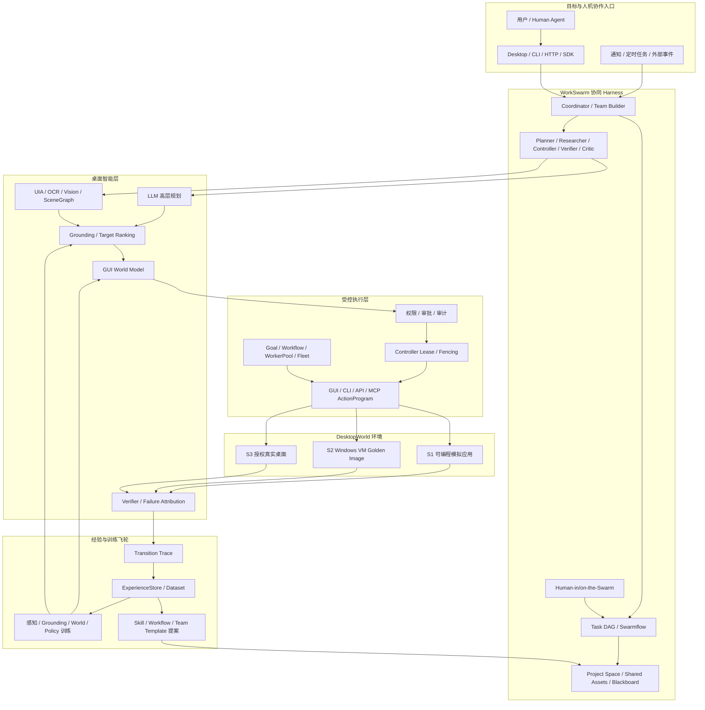
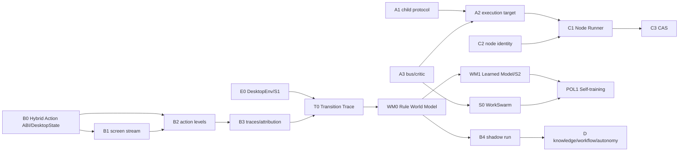

# OwO Agent SDK 主开发技术文档

> 版本：v1.2-draft（多 Agent 工作台 v1 优先 + Hybrid Computer-Use v2 兼容版）  
> 更新日期：2026-08-27  
> 适用目录：`T:\创新创业\OwO-master\agent-sdk`  
> 定位：当前开发主文档。它收敛 `builGoal/` 下所有**未归档**技术文档的有效结论，并以当前工作树为准记录工程状态。  
> 开发策略：v1 优先交付稳定的本地多 Agent 日常生产力工作台；Hybrid Computer-Use Worker、DesktopWorld、世界模型、自训练、Windows VM 与跨设备节点保留为并行兼容支线，不得阻塞 v1。单项开发保留快速验证，进入 v1 Beta 前必须通过第 11 节量化验收与第 13 节发布门禁。

---

## 1. 文档职责、范围和使用方式

### 1.1 唯一主入口

本文件取代分散路线文档作为后续开发任务的第一阅读入口。新功能、模块拆分、接口扩展和 Agent 分工都应先在此确认：

- 是否在实施范围内；
- 属于核心、插件/技能、实验 Spike 还是明确不做；
- 依赖哪些已完成模块；
- 当前工程是否已经有同类实现，避免重复建设；
- 最小可用完成标准和下一阶段接口预留。

本文件不删除原始文档，不重写其调研证据。原始文档保留为设计依据；出现冲突时，按“当前代码事实 > 本文最新决策 > 原始方案”的顺序处理。

### 1.2 参与收敛的源文档

| 源文档                                   | 在本文中的作用                             | 处理结论                      |
| ------------------------------------- | ----------------------------------- | ------------------------- |
| `技术文档-AI智能体输入法.md`                    | 产品范围、核心架构、接口概念、感知/学习/远期支柱           | 作为功能与边界基线；输入法相关内容仅保留为暂停项  |
| `综合技术开发文档-2026-08-16.md`              | 既有能力总览、模块索引、架构收敛                    | 作为此前综合稿；其中“先生产化”的排序按本文件重排 |
| `技术路线改进方案-能力拓展与功能分层-2026-08-15.md`    | 核心与插件分层、computer-use 定位、多 Agent 最小集 | 采纳分层原则与功能取舍               |
| `技术路线评审与前沿多模态Agent演进-2026-08-15.md`   | 神经符号混合路线、感知/学习/记忆研究支线               | 采纳为中远期技术分支与 Spike 清单      |
| `技术路线改进方案-生产级GL-2026-08-15.md`        | 存储、凭据、隔离、CI、发布等硬化方案                 | 普通开发按支线推进；凭据、恢复、迁移、隔离和诊断进入 V1-R3 门禁 |
| `多Agent并行体系-生产级设计与跨机扩展-2026-08-16.md` | 编排内核、单机到跨机的四层演进                     | 本地多 Agent 编排进入 v1；跨机节点网格属于 v2+       |

`builGoal/archive/` 的文档不参与当前路线综合；其中输入法、macOS 等历史评审只通过已锁定决策的摘要间接保留。

本次 v1.2 路线仍参考以下外部实现与技术报告：WorkSwarm/JiuwenSwarm 的 Coordination Engineering、团队接力和 Human-in/on-the-Swarm；Qwen-UI-Agent 的沙箱/真实设备联合环境、GUI+CLI 动作、自动数据飞轮和长轨迹训练；Qwen-AgentWorld 的结构化语言世界模型；MobileGym 的可复制/可判分模拟环境；WindowsAgentArena/OSWorld 的桌面 VM 与 Golden Image。外部项目的自报告基准用于判断技术方向，不作为 OwO 已实现能力或直接验收指标；其中桌面训练、神经世界模型和跨设备能力不再作为 v1 交付依赖。

### 1.3 开发优先级规则

1. 优先完成已经存在骨架但尚不能由真实调用方使用的能力；
2. 优先把跨模块主链接通，避免继续堆孤立模块；v1 唯一一级产品主线为 **WorkSwarm 式本地多 Agent 协同工作台**，DesktopWorld—世界模型—数据飞轮作为并行技术支线维护，不能成为 v1 依赖；
3. 一个功能在核心、插件、研究支线中只能选择一个主归属；
4. 每轮只要求 `fmt`、受影响 crate `cargo check`、1～3 个相关定向测试或手工闭环；不以全仓 soak、外部评测、CI、跨平台发布作为本阶段阻塞条件；
5. 安全红线不降级：默认 deny、审批不可由主 Agent 自授、用户模型密钥不得写入仓库或远端节点、不可逆操作要有预览/确认或回退路径；
6. 遇到架构分叉、权限模型变化、跨机身份/凭据方案、输入法重启等会改变路线的问题，暂停该分支并在第 14 节的开放决策中讨论，不靠 Agent 自行假设。

---

## 2. 产品定义与固定边界

### 2.1 一句话定义

OwO Agent SDK v1 是一个**面向代码、研究、文档和结构化信息处理的本地优先多 Agent 工作台**。它支持 Coordinator + 最多三个 Worker + Human 节点，通过文件、Git、浏览器/API、受控命令和版本化 Artifact 完成任务；系统可编程、可审批、可审计、可恢复，并保持本地优先。

它不是输入法，也不是单纯聊天客户端，更不是把所有桌面控制外包给 MCP 的壳。

#### 2.1.1 v1 产品承诺

v1 先把多 Agent 并行、任务接力和版本化交付做成可日常使用的产品，不以通用桌面自治作为发布承诺。默认团队规模为一个 Coordinator、零至三个 Worker，以及按需加入的 Human 节点；只有当并行在成功率、结果质量或耗时至少一个维度显著优于单 Agent 时，Coordinator 才创建 TeamRun。

v1 的主要执行面限定为：

- 工作区文件与版本化 Artifact；
- Git 仓库及其 diff、review、apply/revert；
- 浏览器/API 和 MCP 等已有受控接口；
- 经过权限策略和审批的受控命令；
- Human 节点的领取、提交、退回、补充和全局 steer。

v1 暂时不绑定以下能力，它们可以继续演进，但不得阻塞 v1 的功能、测试或发布：

- 完整 Hybrid Computer-Use Worker 和通用 GUI 动作路由；v1 已有浏览器/API/受控命令能力不受影响；
- WM1 神经世界模型；
- S2 Windows VM 与 Golden Image；
- 跨设备 Node Runner、节点身份和跨机执行；
- 自动训练、自动模型晋升或在线强化学习；
- 对任意 Windows 软件的通用操作承诺。

### 2.2 已锁定的技术边界

| 主题      | 当前结论                                                                                                     |
| ------- | -------------------------------------------------------------------------------------------------------- |
| 核心产品    | v1：Rust Agent SDK、HTTP/OpenAPI、CLI/TUI、本地多 Agent 桌面工作台；v2+：受支持应用范围内的桌面自治平台                               |
| 主平台     | Windows 11 x64；macOS/Linux 作为后续节点和平台分支，不阻塞 Windows 主线                                                    |
| 模型      | 云端强模型 BYOK；本地模型用于离线、隐私与降级；Provider 可替换                                                                   |
| 执行      | v1 以本地执行为主；云端和跨设备执行属于 v2+；任何阶段的高风险写操作都必须经过权限门控                                                         |
| 互操作     | MCP、Agent Skills、OpenAPI/TS SDK；A2A 只在多 Agent/团队阶段按任务生命周期对齐                                              |
| 桌面控制    | 原生 Rust 感知/执行/审批为主；LLM 只负责目标理解、高层规划和异常解释，底层感知、grounding、状态预测、动作执行与验证由专用模型和确定性代码共同承担                      |
| 环境与学习   | DesktopWorld、世界模型和训练飞轮保持协议兼容并行演进，但不进入 v1 关键路径；v2+ 再以 Windows VM 做真实软件校准，真实用户桌面只做授权后的影子观察与低风险执行        |
| 多 Agent | v1 采用 WorkSwarm 式 Coordinator/Worker/Human 协同、共享资产与任务接力；一个 Coordinator 最多创建三个 Worker；同一资源保持明确单写者       |
| 插件      | v1 以本地 SDK、权限声明、子进程/WASM 隔离为基础；公开市场属于后续能力                                                                |
| 输入法     | 不实施。未来若重新立项，只作为同一 SDK 的交互表层，不能反向污染核心架构                                                                   |
| 不做      | 跨组织隐私计算、组织自动协调、自动改他人日程、无审批的支付/发布/删除、端到端 VLM 作为唯一桌面控制主线                                                   |

### 2.3 技术路线选择

总体技术架构仍保留 **协同 Harness + 神经符号桌面智能 + 环境训练飞轮**，但交付顺序拆为两层：v1 先完成本地多 Agent 产品闭环，v2+ 再让桌面环境、世界模型、自训练和跨设备能力逐层准入。

v1 产品主链：

```text
用户目标 / Human 节点
        ↓
Coordinator：单 Agent / TeamRun 选择、任务 DAG、预算和完成条件
        ↓
最多三个 Worker：代码 / 研究 / 文档 / 结构化处理
        ↓
Policy / Approval → 文件 / Git / 浏览器/API / 受控命令
        ↓
Project Space → Artifact / Review / Handoff / Final Delivery
        ↓
Audit / Cost / Checkpoint / Resume / Failure Attribution
```

v2+ 扩展主链：

```text
用户目标 / 主动事件 / Human-in-the-Swarm
        ↓
WorkSwarm Coordinator：组队、任务 DAG、共享资产、接力、评审
        ↓
LLM 高层规划 + 专用感知/grounding + GUI 世界模型
        ↓
GUI / CLI / API 混合动作 + Policy / Approval / Controller Lease
        ↓
DesktopWorld 模拟环境 / Windows VM / 授权真实桌面
        ↓
Verifier → Transition Trace → ExperienceStore → 训练与 Skill 提案
```

保留确定性工作流作为已验证流程的固化层。端到端 VLM GUI Agent 可以作为候选策略或 grounding provider，但不拥有直接执行权限，也不取代权限、审批、审计、断言、环境租约和结果验证。世界模型仍是长期架构的一部分，但只预测候选动作后果和风险，不直接调用工具，也不成为 v1 TeamRun、Artifact、恢复或发布的依赖。

### 2.4 可交付功能的判定方法

每一条路线进入开发前，先把它写成下列六项，而不是只写“支持某能力”：

| 项目       | 必须明确的内容                               | 例：节点任务执行                                                             |
| -------- | ------------------------------------- | -------------------------------------------------------------------- |
| 用户/调用方入口 | CLI、HTTP、桌面面板、workflow step 或内部 trait | Node Runner 通过 CLI 启动，控制面通过 `/fleet/*` 调度                            |
| 输入       | DTO、权限范围、上下文、文件/CAS 引用、超时和预算          | `node_id`、lease、CapabilityCard、Task ref、context slice                |
| 状态       | 创建、运行、等待、终态及可恢复路径                     | registered → leased → claimed → running → succeeded/failed/cancelled |
| 核心处理     | 负责模块、算法、线程/进程模型                       | `LeaseManager` 校验，`FleetTransport` 传输，目标节点本地执行                       |
| 输出       | 结果、证据、审计、错误码和 UI 可见信息                 | progress/evidence/result、trace、拒绝原因和终态                               |
| 禁止行为     | 安全边界、降级策略、不做什么                        | 旧 epoch 写入、无 claim 回传、发送模型 Key、远程注入默认禁止                              |

没有这六项的“功能想法”先归入 Spike 或第 14 节待决策，不能直接开代码任务。

---

## 3. 当前工程基线（2026-08-21）

### 3.1 工作区结构

当前 Rust workspace 已包含：

```text
agent-sdk/
├─ crates/
│  ├─ owo-agent-protocol/  # 协议与共享类型
│  ├─ owo-agent-core/      # 主要实现：Agent、感知、执行、学习、编排、存储
│  ├─ owo-agent-server/    # axum HTTP 服务、OpenAPI、路由与服务运行态
│  ├─ owo-agent-cli/       # CLI
│  └─ owo-sim/             # 确定性模拟环境
├─ clients/ts/             # OpenAPI 驱动的 TypeScript SDK
├─ desktop/                # Tauri 壳和 Web 工作台
├─ skills/                 # 内置 documents/spreadsheets/pdf/browser 等技能
└─ tests/、scripts/、plugins/、models/
```

`owo-agent-core` 仍是大 crate，当前不启动纯结构性拆 crate 工程；后续只在模块确实阻碍并行或复用时，按第 12 节渐进拆分，禁止为“架构好看”而迁移大量稳定代码。

### 3.2 已可用能力地图

| 子系统           | 已有实现（主要路径）                                                                         | 当前状态                                                                          |
| ------------- | ---------------------------------------------------------------------------------- | ----------------------------------------------------------------------------- |
| Agent Harness | `agent.rs`、`tools.rs`、`context.rs`、`session.rs`、`subagent.rs`                      | 已有 loop、工具调度、会话、项目规则、子代理和审计基础                                                 |
| 权限与审批         | `permissions.rs`、`autoreview.rs`、`audit.rs`、`audit_chain.rs`                       | deny/ask/allow、独立审批、审计已落地；继续保持默认 deny                                         |
| 模型网关          | `gateway.rs`、`usage.rs`、`settings.rs`                                              | Provider 适配与基础路由已具备；自适应预算仍是后续                                                 |
| 感知            | `accessibility.rs`、`ocr.rs`、`onnx_ocr.rs`、`vision.rs`、`scene.rs`、`locate.rs`       | UIA、OCR、场景图、多源定位已实现；事件驱动屏幕流未完成                                                |
| 执行            | `action_program.rs`、`assert.rs`、`executor.rs`、`computer_use.rs`、`computer_task.rs` | 结构化动作、断言、审批、敏感面熔断、本地桌面操作已实现                                                   |
| 学习与记忆         | `learn.rs`、`observe.rs`、`memory.rs`、`skill*.rs`、`skill_health.rs`                  | 示范、受限探索、三层记忆和健康度已有；自动反馈闭环尚未接通                                                 |
| 编排            | `workflow.rs`、`goal.rs`、`plan.rs`、`automation.rs`、`critic.rs`、`blackboard.rs`      | `.owflow`、Goal/Plan、DAG、预算、重试、黑板与 critic 基础已在代码中                              |
| 多 Agent / 网格  | `fleet.rs`、`lease.rs`、`capability.rs`、`node_agent.rs`、`fleet_transport.rs`         | 本地总线/监督、节点租约与 P2 HTTP 协议已推进；见 8.4                                             |
| WorkSwarm 协同  | `goal.rs`、`plan.rs`、`subagent.rs`、`critic.rs`、`blackboard.rs`                      | 有任务图、子 Agent、critic 和黑板基础；尚无完整 TeamRun、Project Space、Human 节点和可视化接力           |
| DesktopWorld  | `computer_use.rs` 的 `TaskSurface`/`SimTaskSurface`/`RealTaskSurface`、`owo-sim`     | 已有单一模拟面和真实桌面抽象；尚无统一 reset/snapshot/restore/judge、环境注册和训练协议                    |
| 世界模型/训练数据     | `scene.rs`、`action_program.rs`、`observe.rs`、`experience_store.rs`、`learn.rs`       | 已有状态、动作、Outcome 和经验聚合原料；尚无 `TransitionTraceV1`、数据构建器、WorldModel trait 和模型训练工程 |
| 云端执行          | `cloud_exec.rs`                                                                    | 本地模拟、HTTP transport、任务状态、diff/revert 骨架已在；真实云运行时未定                            |
| 笔记/知识         | `notes.rs`、`memory_graph_api.rs`、`notes_api.rs`                                    | 块模型、MD/HTML/画布、检索接口存在；时序知识图未实现                                                |
| 插件/市场         | `plugin.rs`、`plugin_market_api.rs`、`mcp.rs`                                        | manifest、签名、扫描、版本、安装回滚与 MCP 生命周期已有基础                                          |
| 存储            | `sqlite_store.rs`、`storage_crypto.rs`、`backup.rs`、`credentials.rs`                 | SQLite、备份、凭据与加密模块存在；生产化迁移/密钥策略另列支线                                            |
| 服务器/API       | `owo-agent-server/src/*.rs`                                                        | 会话、工作流、Goal、notes、插件、fleet、SSE、指标等路由均已存在                                      |
| 桌面与 SDK       | `desktop/`、`clients/ts/`                                                           | Web/Tauri 工作台和 TS schema 已有；功能跟随 API 逐步暴露                                     |

### 3.3 本轮实际增量：P1/P2 接线状态

当前工作树含未提交的 P1/P2 增量。它们是下一阶段开发的直接起点，后续 Agent 必须在此基础上继续，不得回退为模拟闭环。

#### P1：Goal/Plan 的 WorkerPool 运行模式

`crates/owo-agent-server/src/goal_api.rs` 已为 `POST /goal/{id}/run` 加入可选 `execution` 字段：

```json
{
  "execution": {
    "mode": "process | worker_pool",
    "workers": [
      {
        "name": "worker-name",
        "command": "...",
        "args": [],
        "cwd": "...",
        "env": {},
        "budget": {},
        "max_restarts": 0,
        "base_backoff_secs": 0
      }
    ]
  }
}
```

已实现的约束：

- 默认 `process`，不破坏既有进程内 Goal 语义；
- `worker_pool` 必须显式提供 worker；命令 canonicalize 后仅允许当前可执行文件；
- `cwd` 必须存在；子进程 `env_clear` 后只注入白名单；拒绝 `KEY`、`TOKEN`、`SECRET`、`PASSWORD`、`CREDENTIAL` 等敏感环境键；
- 进程池运行时接入审计；超时和 `/goal/{id}/abort` 会取消子进程并将任务落为已定义终态；
- agent 类型 worker 暂仍在进程内，避免把模型凭据与 Provider 行为错误地继承给子进程。

已收口的功能接线（2026-08-25，A1）：正式宿主二进制 `owo-agent` 已具备 `--owo-worker-child --handler <echo|sleep|fail>` 受控协议入口（`crates/owo-agent-cli/src/worker_child.rs`），并提供可见开发命令 `owo-agent worker demo`（current_exe 自启子进程演示 started/result/stopped）。server 经 CLI serve 启动时 current_exe 即协议宿主，`worker_pool` 模式不再依赖测试二进制自举；process 模式语义不变。

#### P2：真实远端节点协议最小闭环

已新增 `fleet_node_protocol.rs`，并在 `fleet_api.rs` 增加以下节点协议：

```text
POST /fleet/nodes/{node_id}/heartbeat
GET  /fleet/nodes/{node_id}/tasks
POST /fleet/tasks/{id}/claim
POST /fleet/tasks/{id}/progress
POST /fleet/tasks/{id}/result
POST /fleet/tasks/{id}/cancel-ack
```

节点注册返回 `lease_token` 和 `epoch`。所有节点侧写操作使用 token + fencing epoch；任务必须由匹配 `node_id` 显式 claim 后才能回传进度、证据、结果或取消确认。越权节点、过期租约、旧 token、旧 epoch、重复终态回传都会被拒绝并写入拒绝/失败审计。

这意味着 P2 不再由控制面在同进程内“假装节点完成任务”。但它仍是局域网 HTTP 协议层，尚未具备设备配对、mTLS、证书轮换、真实节点服务循环或跨机电脑实际运行证明。

### 3.4 当前基本可用检查状态

本文件只记录对开发有意义的最近检查，不将历史“全绿”当作当前事实：

| 检查                                              | 当前结论                                                                                     |
| ----------------------------------------------- | ---------------------------------------------------------------------------------------- |
| `cargo fmt --all -- --check`                    | 当前通过                                                                                     |
| `cargo check -p owo-agent-core --all-targets`   | 当前通过                                                                                     |
| `cargo check -p owo-agent-server --all-targets` | 当前通过；存在既有测试代码 warning                                                                    |
| P1/P2 定向测试                                      | 代码内已补充并由开发轮记录为通过；本机重新链接 server 测试二进制时被 `ort-sys` 缺少 `libonnxruntime` 阻断（`link.exe` 1120） |
| 全仓测试 / soak / 外部真模型评估                           | 本阶段不作为功能推进门槛，不以历史结果代替当前验证                                                                |

结论：可以继续基于当前代码推进功能；若需要运行 server 测试，先单独修复本机 ONNX Runtime 链接环境，不能把该环境失败当成 P1/P2 功能失败。

### 3.5 现有模块的完成度与下一接线点

这里的“完成”只指代码中已有可调用实现；“接线”指尚未被真实调用方或跨模块流程使用，二者不能混同。

| 模块群          | 已经具备的内部能力                                             | 仍缺的真实入口或整合点                                                  | 下一实现应避免的误区                     |
| ------------ | ----------------------------------------------------- | ------------------------------------------------------------ | ------------------------------ |
| 会话/审计        | Session 历史、fork/revert、trace、audit、搜索和部分加密存储          | 把 Goal、Workflow、Fleet 的 correlation 统一映射到同一可查询链路             | 不要另造一份任务日志或在 UI 内缓存“真相”        |
| 权限/审批        | 工具级 deny/ask/allow、独立审批、computer task gate            | workflow/远程节点/worker 子进程的审批上下文统一                             | 不要以“任务来自可信 worker”为由跳过 Policy  |
| Goal/Plan    | DAG、波次、重试、恢复、预算、AgentWorker                           | ExecutionTarget 适配、WorkerPool child、远端 node worker           | 不要在 `goal.rs` 内直接写 HTTP/进程管理细节 |
| Workflow     | DSL 校验、条件、人审、回滚点、运行记录                                 | dry-run、长期 checkpoint、跨节点 backend                            | 不要把 `.owflow` 变成无法版本化的任意脚本     |
| Scene/Locate | 多源元素、证据、打分、模板、健康度                                     | 事件驱动增量刷新、动作等级记录、学习排序                                         | 不要把视觉模型结果直接当作无条件坐标点击           |
| Learning     | 示范、轨迹基础、Outcome、技能健康度                                 | TraceV1 统一格式、失败归因、元数据建议、人工采纳                                 | 不要让学习模块自动改权限或直接重写流程            |
| DesktopWorld | `TaskSurface`、模拟 OCR/动作闭环、真实桌面 adapter                | `DesktopEnv`、环境版本、reset/snapshot/judge、S1 多应用和 S2 VM         | 不要把单一 `owo-sim-qq` 宣称为训练平台     |
| WorldModel   | SceneGraph、ActionProgram、Observation、Outcome 提供输入原料   | 状态差分 DTO、Transition Trace、规则基线、shadow provider、模型 registry   | 不要先训练大模型或让预测直接改变终态             |
| WorkSwarm    | Goal/Plan、subagent、critic、blackboard、WorkerPool/Fleet | TeamRun、Project Space、Artifact/Handoff、Human 节点、TeamTemplate | 不要把多 worker 并行等同于可用团队协作        |
| Fleet        | 总线、租约、fencing、HTTP 节点 API、两节点协议测试                     | Node Runner、身份配对、CAS、Goal binding                            | 不要把 HTTP 控制面内存模拟称作跨机部署完成       |
| CloudExec    | transport、任务状态、Mock、diff/revert                       | 一个真实 executor 部署、快照打包、远程日志协议                                 | 不要先做多租户、计费和集群编排                |
| Notes/Memory | 块树、搜索、记忆接口、部分图 API                                    | 统一证据链接、时序实体关系、后台整合                                           | 不要引入全量用户数据扫描或无授权索引             |

---

## 4. 总体架构



### 4.1 关键数据流

1. 用户、Human Agent 或主动事件提交目标；Coordinator 判断使用单 Agent、固定 Swarmflow 还是动态团队；
2. Team Builder 只创建目标所需角色，分配能力、预算、上下文切片、项目资产和完成条件；
3. Goal/Plan 或 `.owflow` 生成统一 `RunGraph`，WorkerPool/Fleet 只负责执行和状态传输，不自行改变任务语义；
4. Planner 生成高层步骤和少量候选动作；感知层形成 `WorldStateV1`，grounding 模型把语义目标落到稳定元素；
5. 世界模型预测候选动作的状态差分、成功率、风险和不确定度，Verifier/规则据此筛掉明显错误候选；
6. 每个工具或动作经过 Policy、Approval 与单写 `ControllerLease`；执行器在 GUI、CLI、API/MCP 中选择最短且可验证的路径；
7. DesktopWorld 或真实环境返回动作后状态；Verifier 使用隐藏状态、文件/UIA、结构化断言和视觉证据判定结果；
8. 动作前后状态、预测、真实差分、奖励、失败分叉点和证据写入 `TransitionTraceV1` 与 ExperienceStore；
9. 离线训练生成感知、grounding、世界模型或策略的新版本；已验证经验生成 Skill、Workflow 或 Team Template 提案，必须经过门控才能启用；
10. 客户端通过 HTTP/SSE 查看团队成员、任务 DAG、共享资产、审批、环境状态、预测与真实结果、diff 和回退操作。

### 4.2 核心横向约束

- **权限优先于模型意图**：模型只能提出工具调用，不能自我授权；
- **结构化优先于自由文本协作**：节点、worker、Agent 间传递任务、结果、证据和状态，而不是依赖自然语言转述；
- **团队围绕资产协作**：文档、代码、数据集、计划、评审和交付物以版本化 Artifact 进入 Project Space；聊天只用于解释和协商，不作为唯一事实来源；
- **单环境单写者**：每个桌面环境同一时刻只能有一个 Controller 持有写租约；Planner、World Agent、Verifier 和 Critic 没有桌面写权限；
- **预测不是事实**：世界模型输出必须标注模型版本、置信度和不确定度；真实 `observe/judge` 结果才可更新任务状态；
- **模拟与真实双向校准**：模拟环境提供规模和确定性判分，Windows VM 提供真实软件分布，真实用户桌面不用于无约束在线强化学习；
- **模型可替换、门控不可替换**：感知、grounding、世界模型和策略模型均为 Provider；Policy、Approval、Lease、Audit 和 Verifier 始终位于执行链上；
- **状态只允许已定义终态**：成功、失败、取消、等待审批、熔断、回滚/询问；不引入 `Unknown` 作为逃生出口；
- **最小上下文**：任务只携带完成它需要的 context slice；密钥不可出本机；
- **可撤销优先**：工作流写入、文件变更、云端 diff、已记录的桌面动作优先提供影响预览、检查点或回退；
- **本地优先**：感知、OCR、截图和目标应用动作优先在目标设备本地执行，跨机仅回传结构化证据和必要产物。

---

## 5. 核心功能设计

### 5.1 Agent Harness、会话与工具

标准 Agent loop：

```text
用户目标
  → 收集上下文与项目规则
  → 模型规划/请求工具
  → 权限策略与独立审批
  → 执行工具并写结果
  → 验证、重试、replan 或结束
```

关键组件：

- `Agent` 负责循环、停止条件、工具结果回填；
- `ToolRegistry` 只向模型暴露已注册且当前权限可见的 JSON Schema；
- `Session` 提供历史、fork、revert、checkpoint 和恢复；
- `AGENTS.md` / Skills / MCP / 子代理是上下文与扩展机制，不改变权限模型；
- `trace` 记录执行因果，`audit` 记录会影响用户环境的动作。

短期扩展：为高歧义目标加入目标澄清回合；将模型自评改为“置信升级触发器”（弱模型 → 强模型或人工），而不是不受约束的自我反思循环。

### 5.2 权限、审批、审计与安全最小线

权限等级仍为 `Deny / Ask / Allow`。文件写入、命令执行、网络、文本注入、远程节点回传等越界动作必须先由 Policy 判断，再由用户或独立审批器确认。

功能开发期必须坚持的最小线：

- 未声明权限的工具不可调用；
- `inject`、外部写入、支付/密码/验证码等敏感面不得自动提升自治；
- 插件禁用、权限撤销和 MCP 移除必须立即使工具对模型不可见，并回收进程；
- 密钥只经环境变量或 OS 凭据引用读取，不写入代码、设置、审计、CAS 或节点请求；
- 远端节点的 lease/fencing 校验失败必须拒绝写入；
- 审计至少保留动作主体、时间、目标、权限决定、关联任务和结果摘要。

生产级的 OS 沙箱、审计哈希链、供应链扫描、CI 等不作为当前功能波次的统一阻塞项，详见第 13 节。

### 5.3 模型网关与本地模型策略

模型网关提供 OpenAI-compatible、Anthropic、本地 Ollama/llama.cpp 等 Provider 适配。调用方表达任务类型、上下文和预算，网关返回模型输出和用量记录。

建议的三层策略：

| 层     | 适用任务               | 实现方向                          |
| ----- | ------------------ | ----------------------------- |
| 本地确定性 | OCR、STT、规则、技能回放、检索 | 默认可离线；不依赖强模型                  |
| 本地小模型 | 意图预分类、摘要、简单路由、置信判断 | 可选 ONNX/DirectML/NPU；不可用时退化规则 |
| 云端强模型 | 复杂规划、代码、长文本、多轮推理   | BYOK；显式展示 Provider 和降级状态      |

未来加入 `difficulty → model tier` 路由：首次用轻模型，检测到分支复杂、重试、低置信或高风险时升级强模型。调用成本不作为本阶段精细治理目标，但每次升级必须可见、可审计。

### 5.4 感知、定位与 computer-use

当前是“原生内化 + 外部运行时补充”的混合实现：

| 层       | 现有能力                             | 后续方向                   |
| ------- | -------------------------------- | ---------------------- |
| L0 事件   | 前台窗口、剪贴板和平台事件基础                  | 接入 UIA/WinEvent 驱动的屏幕流 |
| L1 语义   | Windows UI Automation、DOM/aria 等 | 作为首选、最低成本的动作锚点         |
| L2 视觉   | 按需截图、Media/OCR、ONNX OCR、可选云 OCR  | 区域增量缓存、SoM 标注、像素-语义映射  |
| L3 融合   | SceneGraph、模板、OCR、视觉证据、历史        | 从固定权重走向可回退的学习排序        |
| L4 模型兜底 | 可选 vision / 未来 CUA schema        | 只做受限定位、验证、探索；默认关闭      |

动作可靠性阶梯固定为：

```text
L1 语义直驱（UIA / DOM ref）
→ L2 OCR / 模板定位
→ L3 视觉 grounding 与多源交叉验证
→ L4 VLM 动作建议（仅可选、需审批和证据）
```

每步都应记录实际使用的阶梯、锚点、证据和断言结果。浏览器侧优先向 aria-ref 交互收敛；坐标点击是兜底，不是接口主语义。上述 L1～L4 是进入 GUI 通道后的定位阶梯；在选择通道时，若 API/MCP、受控 CLI 或浏览器语义接口能等价完成任务，应先于桌面像素操作。

#### 5.4.1 Hybrid Computer-Use Worker（v2 执行配置，不阻塞 v1）

Hybrid Computer-Use Worker 不是新的顶层产品，也不替换 WorkSwarm。它是 v2 可挂载到 `WorkerBinding` 的一种执行配置：Coordinator/Planner 仍负责任务语义，Worker 在一个受控桌面环境内选择 API、CLI、浏览器语义接口、Windows UIA 或视觉 GUI 动作。v1 的文件、Git、浏览器/API 和受控命令型 Worker 不依赖本节完成。

统一通道路由顺序为：

```text
Task Subgoal
  → API / MCP（结构化、可验证、权限最小）
  → Controlled CLI（明确 executable/args/cwd/env/timeout）
  → Browser DOM / aria-ref
  → Windows UIA
  → OCR / template / visual grounding
  → Screenshot + VLM 候选定位
  → coordinate input（最后兜底）
```

顺序不是机械固定：只有在多个通道语义等价、权限相同且结果可验证时才选更靠前者。必须经过真实界面、需要用户可见交互或应用没有稳定接口时，允许直接进入 GUI 通道。Screenshot + VLM 可以从第一版作为可选 `GroundingProvider` 存在，但默认不独占控制权；它只产生候选目标、证据和置信度，不能绕过 Policy、Approval、freshness 检查和 Verifier。

Hybrid Worker 对外暴露的是能力集合，不是一条任意字符串工具表：

| 通道 | 典型操作 | 强制边界 |
| --- | --- | --- |
| `api` / `mcp` | 查询、结构化写入、应用 API | schema 校验、最小权限、幂等键、结果断言 |
| `cli` | 文件处理、Git、构建、批量转换 | 禁止裸 `shell(command)`；使用受控 `CommandSpec`、工作区范围、环境白名单和超时 |
| `browser` | navigate、snapshot、click ref、type ref、download | 使用 DOM/aria ref 和页面版本；导航、下载、提交分别审批 |
| `uia` | invoke element、set value、窗口切换 | 稳定 element ref、窗口身份和 snapshot freshness |
| `gui` | click、double-click、drag、scroll、hotkey | 必须有目标证据；坐标是执行参数，不是模型主语义 |
| `system` | open app、窗口管理、剪贴板、受限文件枚举 | 使用 `AppRef`/`WindowRef`/scoped path；剪贴板按敏感数据处理 |

`ask_model` 不属于操作系统动作空间。模型调用留在 Planner/Gateway 层，单独记录 Provider、用量、延迟、预算和数据出境策略；`ask_user` 才是可进入 RunGraph 的等待节点。

### 5.5 动作程序、断言、影子预演

`action_program.rs` 是 UI/桌面自动化的可执行中间层，承载条件、循环、重试、等待、定位、动作和断言。`assert.rs`/`VerificationRecipe` 用可观测状态判定结果，而不是让模型口头宣布成功。

生产执行默认采用单步闭环，而不是让模型一次输出动作数组后开环执行：

```text
plan candidate
  → ground target
  → Policy / Approval
  → execute one action
  → observe fresh state
  → verify expected effects
  → update observed state and trace
  → choose next action / reobserve / ask_user / stop
```

只有同时满足低风险、可幂等、可中断、共享同一新鲜上下文且每步有断言的原子动作，才可编译为短批次；批次仍需在动作间保留取消点和失败短路。打开应用后紧接输入、切换窗口后粘贴、导航后提交等容易受弹窗、焦点或页面版本影响的组合，默认拆回逐步观察。

下一步增加影子预演：首次执行高风险或跨应用 `.owflow` 时，只执行感知、定位和断言可行性检查，不真实点击/写入。预演失败时返回证据与需要用户确认的分支；预演成功再进入受审批的真实执行。

### 5.6 技能、学习、记忆和知识图

现有技能路径：用户示范或受限探索 → 轨迹对齐/变量推断 → `.owskill` 或动作图 → 健康度监控 → 降级、重录或禁用。

后续把它升级为执行反馈闭环：

```text
统一轨迹（感知哈希、动作阶梯、断言、Outcome）
  → 失败归因（锚点漂移/时序/断言/界面变化/权限）
  → 经验蒸馏（更新技能元数据、前置条件、等待/断言配方）
  → 重新验证后升级或保持降级
```

此阶段只自动改“技能元数据候选”，不自动改用户代码、权限策略或外部系统数据。经验蒸馏失败不影响正常执行。

记忆保持三层：

- 情景记忆：执行发生过什么、在哪个应用、何时、结果如何；
- 语义记忆：可检索事实、摘要、笔记和文档片段；
- 程序性记忆：技能、工作流、模板及其健康度。

中期目标是时序知识图：实体—关系—时间三元组与向量、FTS 混合检索；后台空闲期只做合并、消歧、索引重建与健康预检，不阻塞用户路径。

### 5.7 工作流、Goal/Plan 与主动建议

`.owflow` 描述触发器、步骤图、子流程、条件、人审节点、回滚点；Goal/Plan 描述一次性或长程目标的计划、并行波次、重试、恢复和预算。二者共享动作程序、权限、审计、技能健康度和事件流，不维护两套执行语义。

主动建议只能读取允许的信号，默认输出建议卡：学习、执行一次、忽略、永久静默。它不自动发消息、改日程、购买、支付或删除数据。

近期唯一产品主线调整为：先完成单 Agent 真实任务基线，再收口 WorkSwarm 团队接力、持久化 TeamRun、Artifact 版本、局部重试、崩溃恢复、Human 节点、成本统计和最终交付。DesktopEnv、Transition Trace、规则世界模型影子预测可以并行维护，但不得成为 v1 任务依赖；WM1、Windows VM、自动训练、跨设备和像素级生成式世界模型均属于 v2+。

### 5.8 笔记、文档与个人第二大脑（暂时不做）

现有 `notes.rs` 支持块树、Markdown/HTML/画布、检索和 API。它是个人知识层的文档基础，而不是独立产品线。

后续分两步：

1. 将会话、技能、工作流、网页片段、文件元数据建立可追溯链接，支持按任务/应用/时间过滤；
2. 再引入时序知识图、混合检索、引用证据和由 Agent 驱动的生成。

Yjs/CRDT 和多人协作不进入当前功能主线；它们属于 v4 团队空间分支。

### 5.9 插件、MCP、市场与 SDK

插件扩展点统一为：`tool`、`view`、`skill`、`worker`、`perception-source`、`grounding-provider`。核心只吸收权限边界、跨功能复用和低常驻成本的能力；应用特定逻辑进入插件或技能包。

- MCP：第三方工具/资源互操作层；
- Skill：程序性知识、流程、示例和最小验证；
- Plugin：带 manifest、权限、版本、运行时和 UI/工具扩展的可发布单元；
- Market：签名、扫描、版本选择、更新回滚的后续分发服务；
- TypeScript SDK：由 OpenAPI 同步的客户端集成入口；Python SDK 是后续研究/自动化入口。

### 5.10 实现级模块契约

本节把第 5 节的功能路线落到具体模块交互。字段名可以随 Rust DTO 调整，但语义不得改变；新增接口优先复用这些结构，而不是重复发明近似状态。

#### 5.10.1 Harness：Turn、ToolCall 与会话恢复

一次 Agent turn 应具有如下内部形态：

```text
TurnRequest {
  session_id,
  user_input,
  attachments: [AttachmentRef],
  workspace_scope,
  active_context: ActiveContextRef,
  requested_model?,
  budget: TurnBudget,
  idempotency_key?
}

TurnState = queued
          | collecting_context
          | model_running
          | awaiting_approval
          | executing_tool
          | verifying
          | completed
          | failed(reason)
          | cancelled
```

`TurnRequest` 不直接携带未经筛选的剪贴板、屏幕图或工作区全文；上下文收集器应输出带来源、权限和截断原因的 `ContextSlice`。模型轮次从 `TurnBudget` 取得最大轮数、token、总时长与工具次数；到达预算时由 Harness 终止并返回结构化预算原因，不允许模型继续自行重试。

工具调用的生命周期固定为：模型请求 → schema 校验 → Policy 决策 → 可选 Approver → handler 执行 → 标准化 ToolResult → trace/audit → 模型回填。`ToolResult` 应区分用户可见摘要、模型可见内容、附件/CAS ref 和错误码，避免把过长命令输出或敏感原文直接塞回上下文。会话恢复只恢复状态、引用、审计指针和必要上下文摘要；大附件和旧工具结果按需加载。

#### 5.10.2 权限：PolicyInput、Approval 与拒绝语义

每一次越界动作必须被归一为：

```text
PolicyInput {
  subject: user | agent | plugin | worker | node,
  capability: file.read | file.write | shell.exec | network | inject | ...,
  target: workspace/path/app/url/node,
  intent_summary,
  task_id/correlation_id,
  evidence: [EvidenceRef],
  requested_scope,
  risk_flags
}

PolicyDecision = deny(reason) | allow(scope) | ask(ApprovalRequest)
```

`deny` 必须立即中断 handler，不创建“先执行后审计”的旁路；`ask` 保存不可变的影响预览、调用方身份、目标范围和证据摘要，审批成功后只授权该 capability/target/scope，而不是放开整个会话。审批过期、证据变更、目标窗口/文件版本变化、节点 lease 变化都应使原审批失效并重新询问。

独立审批模型的职责是风险分类和拒绝建议，不拥有工具执行权；用户审批仍是最高权威。对于密码、支付、验证码、系统安全设置、未知外部发布目标，Policy 直接进入 deny/fuse 或高强度人工确认，不能用自动审批降级。

#### 5.10.3 网关：Provider 请求、降级与成本信号

网关应把上层的“任务意图”与底层 Provider 请求分离：

```text
ModelRequest {
  purpose: agent | planning | summarize | vision_verify | embedding,
  messages/tool_schemas,
  required_capabilities,
  latency_preference,
  budget,
  privacy_mode: local_only | cloud_allowed,
  trace_context
}

ModelResponse {
  provider, model, finish_reason,
  content/tool_calls,
  usage: input_tokens/output_tokens/cost?,
  latency,
  downgrade_chain,
  error?
}
```

网关先根据 `privacy_mode`、任务目的、显式模型选择和可用 Provider 构造候选链；本地模型失败时不能静默发送敏感上下文到云端，必须遵从 cloud_allowed。升级强模型、切换 Provider、命中缓存和预算耗尽都要成为可显示的 `GatewayEvent`。短期只记录这类事件和基础 usage；精确成本归集、全局熔断、供应商质量排行榜属于后续增强。

#### 5.10.4 感知：SceneGraph、Snapshot 与 Evidence

感知层的唯一事实载体为 `SceneGraph`。建议按以下逻辑实体扩展现有模型：

```text
SceneSnapshot {
  snapshot_id, captured_at, device_id,
  foreground_window, viewport,
  elements: [SceneElement],
  source_versions: { uia, ocr, screenshot, dom },
  freshness, privacy_labels
}

SceneElement {
  stable_id?, role, name/text?, bounds?, state,
  sources: [uia | dom | ocr | template | vision],
  confidence, parent/children, version
}

EvidenceItem {
  kind, source_snapshot_id, element_id?, bounds?,
  excerpt?, hash/ref?, confidence, captured_at
}
```

UIA/DOM 提供优先级最高的语义元素；OCR 给出文本和坐标；模板和视觉只补充证据。`locate` 的输出不是裸 `(x,y)`，而是 `LocatedTarget { element?, bounds, strategy, confidence, evidence }`。执行器在动作前检查 snapshot freshness：若窗口已变、元素版本失效、置信度低于动作等级门槛，必须重新感知、降级询问或拒绝，而非沿用旧坐标。

屏幕流实现时不改变此模型，只改变 Snapshot 的生成方式：事件到来标记窗口/区域失效，查询请求从缓存组合增量 snapshot；无事件源时继续按需抓取生成完整 snapshot。

Hybrid Worker 在产品层维护 `DesktopStateV1`，但它不是第二份事实库，而是对同一 snapshot、OS/API 观测和 RunGraph 上下文的分层视图：

```text
DesktopStateV1 {
  state_id, observed_at, device_id, env_id?,

  semantic_observed: {
    foreground_app_ref?, window_refs[], document_refs[],
    active_resource_refs[], clipboard_meta?, source_refs[]
  },

  visual_observed: {
    scene_snapshot_ref, screenshot_ref?, accessibility_tree_ref?,
    element_refs[], viewport, freshness, privacy_labels[]
  },

  task_inferred: {
    run_id, current_subgoal?, predicted_goal?, recent_action_refs[],
    confidence, source_refs[], model_id?, model_version?
  }
}
```

三层语义必须严格区分：

- `semantic_observed` 只保存可由窗口、文件、应用 API、UIA 或其它确定性来源证明的状态；
- `visual_observed` 指向 `SceneSnapshot`/`WorldStateV1`，截图、元素树和坐标共享同一 snapshot/version；
- `task_inferred` 来自 RunGraph 或模型推断，必须带置信度和来源，不能覆盖观测事实或直接改变任务终态。

`current_task` 以 RunGraph 为准，不能从当前窗口反推后写成事实；`predicted_goal` 只是建议字段。剪贴板、文档正文、聊天文本和截图默认不在状态对象中持久化原文，只保存受控 ref/hash、分类和必要摘要。Semantic 与 Visual 是同一时刻的两种视图，不允许各自维护互相矛盾的“当前窗口”。

#### 5.10.5 执行：ActionProgram、回滚与可靠性阶梯

动作程序至少由以下原语组成：

```text
ActionStep = Locate | Click | Type | Key | Scroll | Launch
           | WaitUntil | Assert | ReadClipboard | WriteFile
           | CallTool | Branch | Loop | Checkpoint | Rollback
```

`ActionStep` 是工作流控制层；真正交给执行器的原子动作统一归一化为目标形状 `GroundedActionV2`：

```text
GroundedActionV2 {
  action_id,
  channel: api | mcp | cli | browser | uia | gui | system,
  operation,
  semantic_intent,
  target_ref?, target_evidence[], snapshot_id?, freshness_requirement?,
  payload,
  preconditions[], expected_effects[], verification,
  risk, reversible, idempotency_key?,
  timeout, retry_policy, approval_scope, permission_scope
}
```

`operation + payload` 最终应收敛为带 serde tag 的类型化联合，而不是长期依赖自由 JSON。现有 `ActionKind { gui, cli, api, wait, ask_user } + arguments` 保留兼容适配器：先把已有 `computer_use`、browser、UIA、CLI/API 工具归一化到 V2，再在公开契约稳定后逐步替换内部自由参数，避免一次性破坏现有路由和轨迹。

关键操作约束：

- `type`/`paste` 必须绑定 `target_ref`、窗口身份和 freshness，不能只依赖“当前焦点应该正确”；
- `open_app` 使用已解析的 `AppRef`/受控 executable，不接受模型生成的任意启动字符串；
- CLI 使用 `CommandSpec { executable, args, cwd, env_allowlist, timeout, output_limit }`，禁止把 `shell(command)` 作为无边界原语；
- `list_files` 必须绑定批准的 workspace/root 和深度/数量上限；
- `read_clipboard`/`write_clipboard` 单独声明敏感数据范围，默认不写入长期状态、Prompt、Artifact 或远端节点；
- `click(x,y)` 只允许作为已有 `target_ref`/bounds/evidence 的落地参数，视觉 Provider 不能直接生成无证据点击；
- `ask_model` 由 Gateway 调用，不进入动作 ABI；`ask_user` 是可恢复的等待节点，不由执行器伪造完成。

每个 `ActionStep` 需要 `preconditions`、`target`、`parameters`、`timeout`、`retry_policy`、`approval_scope` 和 `verification`。解释器执行前后都写 `StepRecord`：输入 snapshot、使用的可靠性等级、定位证据、实际动作、断言结果、耗时和可逆性信息。

`Checkpoint` 只保存可以恢复的本地状态引用，例如文件 diff、会话 undo、已知应用文档版本或 workflow 变量；它不承诺能撤回外部消息、付款或第三方系统写入。此类不可逆动作必须在 Policy 层标为高风险，执行前产生影响预览。

可靠性阶梯的选择过程应为：优先语义 ref → OCR/模板 → 经过交叉证据的视觉定位 → 仅提供候选的 L4 VLM。低阶失败可升级，高阶失败不得自动退化为盲坐标点击。每次升级都带原因，例如“UIA 无此元素”“OCR 文本不唯一”“视觉与 OCR 不一致”。

#### 5.10.6 工作流与 Goal：同一状态、不同入口

`Goal` 面向“完成一个目标”；`.owflow` 面向“可复用、可触发的流程”。两者都应转换为统一的 `RunGraph`：

```text
RunGraph {
  run_id, kind: goal | workflow,
  nodes: [RunNode], edges, variables,
  checkpoints, approval_waits,
  execution_targets, budget, status
}

RunNodeStatus = pending | ready | running | awaiting_approval
              | skipped | succeeded | failed | cancelled | rolled_back
```

Goal 的模型规划负责生成/修订 `RunGraph`；workflow 的 DSL 编译器负责读取稳定定义生成 `RunGraph`。二者都用同一个 scheduler、事件流、checkpoint、cancel 和审计接口。这样 WorkerPool、Fleet、Cloud executor 只看 `RunNode`，不需要知道它来自模型计划还是 `.owflow`。

重试必须由节点幂等性决定：纯读取/定位可以重试；本地文件写需用 diff/checkpoint；外部发布、支付、远端非幂等 API 不自动重试。replan 只能在未进入不可逆边界前修改后续节点，且必须保留原计划和变更理由。

#### 5.10.7 学习：TraceV1、Outcome 与归因处理器

统一轨迹格式建议为：

```text
ExecutionTraceV1 {
  trace_id, run_id, skill_id?, workflow_id?,
  context_fingerprint, snapshots: [hash/ref],
  steps: [TraceStep],
  outcome: Outcome,
  user_feedback?,
  privacy_scope, created_at
}

TraceStep {
  action_program_step, target_fingerprint,
  reliability_level, evidence_refs,
  policy_decision, assertion_result,
  duration, error_code?
}

FailureAttribution = anchor_drift | timing_race | assertion_mismatch
                   | ui_changed | permission_denied | tool_failure
                   | model_plan_error | unknown_needs_review
```

归因处理器先采用规则和证据驱动：例如有相同文本但 stable id 改变时偏向 `anchor_drift`；等待超时时目标随后出现偏向 `timing_race`；Policy 拒绝直接归 `permission_denied`。低置信归因只能记为 `unknown_needs_review`，不能伪造确定原因。

经验蒸馏输出 `SkillImprovementProposal`，包含建议的前置条件、等待条件、优先锚点、断言修改和证据。Proposal 必须由用户或专用审核流程采纳后才写回 Skill；它没有能力改变全局权限和模型配置。

#### 5.10.8 记忆、笔记和知识图的连接方式

笔记内容、Session、Trace、Skill、Workflow、文件和网页片段都应有稳定 `EntityRef`。知识图的最小三元组为：

```text
TemporalFact {
  subject: EntityRef,
  predicate,
  object: EntityRef | literal,
  valid_from, valid_to?,
  source_refs: [Trace/Note/File/Approval],
  confidence, visibility
}
```

`memory.recall` 的输出必须返回证据和可追溯 source refs，不能只返回无来源的模型总结。查询先使用结构化过滤（时间、应用、任务、技能）缩小候选，再合并 FTS/向量结果；必要时由模型重排。第一阶段可只支持“上周/上次/某应用/某工作流”的时间过滤，随后再增加实体消歧与自动关系抽取。

空闲整合使用后台队列：合并重复情景、重建索引、生成候选关系、预检技能。它不得读取未授权内容、占用前台模型预算，或在用户工作时改变任何流程。

#### 5.10.9 插件：加载、能力声明和生命周期

插件 manifest 至少应包括：id、version、entry、permissions、extension points、依赖、schemaVersion 和签名/来源信息。加载流程为：

```text
发现 manifest → schema 校验 → 签名/静态检查（若适用）
→ 权限与用户授权 → 启动隔离 runtime → 注册可见扩展
→ 运行/审计 → disable/update/remove 时撤销工具并终止 runtime
```

插件可以注册 worker、perception source 或 grounding provider，但注册后仍受核心 Policy、预算和数据出境开关约束。插件只能收到必要 context slice；不能读取全会话、凭据库或节点 token。市场安装、签名、扫描和回滚的结构已存在，当前以开发期本地插件为主要功能入口。

### 5.11 DesktopWorld：可训练桌面环境

DesktopWorld 是 GUI Agent 的环境基础设施，不等同于世界模型。环境负责产生真实状态转移、可恢复试错与确定性奖励；世界模型负责学习和预测这些转移。第一阶段把现有 `TaskSurface` 和 `SimTaskSurface` 收敛为统一接口：

```rust
trait DesktopEnv {
    fn reset(&mut self, task: TaskSeed) -> Result<WorldStateV1, EnvError>;
    fn observe(&mut self) -> Result<WorldStateV1, EnvError>;
    fn step(&mut self, action: GroundedAction) -> Result<StepResult, EnvError>;
    fn snapshot(&mut self) -> Result<SnapshotId, EnvError>;
    fn restore(&mut self, snapshot: SnapshotId) -> Result<WorldStateV1, EnvError>;
    fn inject_fault(&mut self, fault: FaultSpec) -> Result<(), EnvError>;
    fn judge(&mut self, success: SuccessSpec) -> Result<Verdict, EnvError>;
}
```

三层环境必须复用同一动作和观测协议：

| 环境层           | 实现方式                                            | 主要用途                              | 判分来源                 |
| ------------- | ----------------------------------------------- | --------------------------------- | -------------------- |
| S1 可编程模拟应用    | 扩展 `owo-sim`，以应用状态机渲染聊天、文件、浏览器、文档、表格和系统设置       | 大量任务生成、失败注入、快速回滚、并行 rollout       | 隐藏 JSON/数据库状态，必须确定性  |
| S2 Windows VM | 版本化 Golden Image + Guest Agent + 快照；安装固定软件和任务资产 | 收集真实软件状态转移、验证 Sim-to-Real、复杂桌面长轨迹 | 文件/进程/UIA/应用状态和结构化断言 |
| S3 授权真实桌面     | 现有 `RealTaskSurface` 的严格受控扩展                    | 影子预测、用户示范、低风险已验证技能                | 实际状态 + 用户确认；禁止自由 RL  |

S1 不追求复制整个 Windows 内核，而是优先复制 Agent 真正需要学习的状态和干扰：窗口层级、菜单、对话框、文件状态、网络等待、权限提示、遮挡、分辨率变化、应用版本变化和跨应用信息传递。模拟器必须支持用 seed 复现同一任务，并能批量克隆相同初始状态。

S2 的宿主调度器负责创建/恢复 VM、分配 `env_id` 和写租约、注入任务资产、回收实例、记录轨迹。Guest Agent 只暴露受限的 screenshot、UIA、OCR、process/file-state 和动作端点；控制面不得向 Guest 发送任意未声明 shell。每个 Golden Image 记录 OS、应用、语言、分辨率和构建 hash，训练样本必须绑定环境版本。

核心状态和动作契约：

```text
WorldStateV1 {
  env_id, env_version, snapshot_id, timestamp,
  screenshot_ref?, scene_graph, accessibility_tree_ref?,
  foreground_app, window_stack, structured_app_state?, freshness,
  privacy_labels
}

GroundedAction {
  action_id, kind: gui | cli | api | wait | ask_user,
  semantic_intent, target_id?, target_evidence[], arguments,
  expected_effects[], risk, reversible, idempotency_key?
}

StepResult {
  before_state_ref, action, after_state_ref,
  observed_delta, verdict, reward_parts,
  duration_ms, error?, evidence_refs[]
}
```

上面是当前 `GroundedAction` 兼容契约；Hybrid Worker 通过适配器将其归一化为 §5.10.5 的 `GroundedActionV2`。`DesktopEnv` 可以继续接受现有 `kind + arguments`，但生产执行、审计和新公开 API 应逐步以 channel、operation、target evidence、permission scope 和 verification 为显式字段。兼容层必须保留原 action、归一化结果和 schema version，保证历史 Transition 可回放。

训练环境与生产执行器共享 `GroundedAction`，但不共享权限。S1/S2 可以按训练策略授予沙箱动作；S3 每一步仍经过用户环境的 Policy/Approval。环境快照不能当作用户文件备份，训练完成后按 retention 策略回收。

### 5.12 GUI 世界模型、专用模型与自训练飞轮

#### 5.12.1 模型职责分离

先区分三个概念：

1. `DesktopStateV1` 是状态追踪/Context Engine，把可验证语义观测、视觉观测和带来源的任务推断组合成当前视图；
2. `GuiWorldModel` 才是预测器，输入当前观测状态与候选动作，输出未来 `StateDelta`、成功率、风险和不确定度；
3. Perception/Grounding 从截图、UIA、DOM 和 OCR 中恢复当前元素或目标，不因为使用 VLM 就自动成为世界模型。

因此，只维护 `current_app/open_windows/current_task/recent_actions` 仍属于 Semantic State Tracker；只有学习或编码出 `state + action → predicted delta` 的转换规律，才能称为 Semantic World Model。状态追踪器可以先独立落地，世界模型不可用时 Hybrid Worker 仍按确定性路径工作。

桌面智能不由一个大模型包办，至少分为四类 Provider：

| Provider     | 输入                       | 输出                  | 不允许做的事           |
| ------------ | ------------------------ | ------------------- | ---------------- |
| Perception   | screenshot、UIA、OCR、窗口元数据 | UI 元素、角色、文本、遮挡、交互性  | 不提出高风险动作         |
| Grounding    | 语义目标、SceneGraph、局部图像     | 候选元素、边界框、证据和置信度     | 不直接点击            |
| WorldModel   | 当前状态、候选动作、任务子目标          | 预测状态差分、断言概率、风险、不确定度 | 不调用工具、不把预测写成事实   |
| ActionPolicy | 子目标、候选动作、世界模型预测          | 候选排序、重感知/询问建议       | 不绕过 Policy/Lease |

LLM 负责意图理解、任务分解、候选方案与异常解释。高频低层感知和动作排序逐步由小模型、规则、UIA 和环境状态承担；模型不可用时可退回确定性策略，而不是让 LLM 自动获得更高桌面权限。

双层桌面表示采用同一事实底座：

```text
DesktopStateV1
  ├─ Semantic View：应用、窗口、文档/资源 refs、RunGraph 子目标、近期动作 refs
  └─ Visual View：SceneSnapshot、screenshot ref、UIA/DOM/OCR 元素、bounds、freshness
```

对应的预测能力可以分层，但第一阶段不训练视频生成模型：

- `SemanticWorldModel`：规则/统计或小模型预测结构化字段、窗口、元素和断言变化；当前 `RuleWorldModel` 即 WM-0 基线；
- `VisualDeltaProvider`（可选后续）：只预测/验证元素出现、消失、位置或局部视觉变化，不生成完整下一帧，也不直接产生执行权限。

两个 View 必须引用同一 snapshot/version；Semantic 预测与 Visual 证据冲突时，以新的真实 observe 为准，进入 `reobserve | ask_user | deterministic fallback`，不能让某一模型覆盖事实。

#### 5.12.2 世界模型接口

第一版只预测结构化状态差分，不生成完整下一帧截图：

```rust
trait GuiWorldModel {
    fn predict(
        &self,
        state: &WorldStateV1,
        action: &GroundedAction,
        context: &WorldModelContext,
    ) -> Result<WorldPrediction, ModelError>;
}

struct WorldPrediction {
    predicted_delta: StateDelta,
    assertion_probabilities: Vec<AssertionProbability>,
    success_probability: f32,
    risk: RiskLevel,
    uncertainty: f32,
    model_id: String,
    model_version: String,
}
```

推理默认执行深度 1 的候选比较：Planner/规则生成 2～3 个候选，WorldModel 分别预测，ActionPolicy 排序，只执行一个。只有单步预测校准稳定后，才允许深度 2 的短树搜索；不得在真实桌面展开自由 MCTS。高不确定度、多个候选接近或预测与安全规则冲突时，返回 `reobserve | ask_user | use_deterministic_path`。

`WorldModelContext` 可以读取 RunGraph 子目标和受控历史摘要，但 `predict` 的事实输入只能来自带 freshness/source refs 的观测状态。模型输出不能写回 `semantic_observed`/`visual_observed`；只有真实 `observe`、应用 API、文件状态或 Verifier 可以更新事实视图。

#### 5.12.3 TransitionTraceV1 与训练数据

现有 `ExecutionTraceV1` 记录运行过程；新增 `TransitionTraceV1` 专门服务模型训练：

```text
TransitionTraceV1 {
  transition_id, episode_id, task_id, env_id, env_version,
  state_before_ref, action, predicted?, state_after_ref,
  observed_delta, verifier_results[], reward_parts,
  outcome, failure_class?, fork_point?,
  policy_version, model_versions, privacy_scope, created_at
}
```

数据清洗顺序为：环境/任务版本有效 → 状态完整 → 动作目标在证据中 → 坐标位于目标框（若适用）→ Verifier 一致 → 去除敏感值或标记不可训练 → 去重/平衡成功失败。模型重新预测、坐标框检查和多 Verifier 只能过滤样本，不能篡改原始轨迹；原始、清洗后和训练集 manifest 分开保存。

#### 5.12.4 自训练闭环

```text
Task Generator / Curriculum
  → 环境 reset 与任务资产注入
  → Planner/Policy 多候选 rollout
  → 确定性 Verifier 判分
  → 成功/失败轨迹对齐，定位 fork point
  → Dataset Builder 清洗与版本化
  → SFT / preference / 受控 RL
  → Shadow Registry 注册候选模型
  → 与当前模型并行预测
  → 达到准入条件后人工/策略提升版本
```

训练阶段按能力递进：

1. `WM-0`：规则、频率统计和每应用转换表，先验证数据契约和预演价值；
2. `WM-1`：SceneGraph/UIA + action 的小型前向模型，预测元素出现/消失、属性变化和断言；
3. `WM-2`：前向 `state+action→delta`、逆向 `before+after→action`、结果/风险多头联合训练；
4. `POL-1`：在 S1/S2 中训练候选动作排序或 grounding，奖励优先来自程序化 Verifier；
5. `REAL-CAL`：用少量 S2 与经授权 S3 数据做校准，不在用户桌面做在线梯度更新。

训练工程与 Rust 运行时解耦：`models/gui-world-model/` 使用 Python/PyTorch 构建数据和训练，导出 ONNX/其他受支持格式；Rust 只负责模型 manifest、hash、加载、推理、健康状态和回退。ONNX Runtime 当前本机链接问题必须隔离在可选 feature/runtime 中，不能阻塞默认 server。

#### 5.12.5 混合动作和批量动作

`ActionProgram` 统一 GUI、UIA、browser、CLI、API/MCP、system、Wait、Assert 和 AskUser。文件检索、批量转换、图片拼接等确定性工作优先 CLI/API；必须经过真实界面、没有接口或需要视觉确认时使用 GUI。Planner 可以生成计划和候选动作，但不能用一段 JSON actions 数组绕过执行循环；每个原子动作默认都经过 ground→policy→execute→observe→verify。

批量动作只允许连续低风险、可中断、可验证、可幂等且依赖同一新鲜状态的原子动作，并在动作间保留取消点与失败短路。支付、删除、授权、发布、发送、跨窗口输入、打开应用后立即键入以及任何焦点敏感操作不得跨审批点或 observation boundary 批量执行。

#### 5.12.6 研究依据与采纳边界

- WorkSwarm/JiuwenSwarm：采纳 Leader 组队、共享项目资产、任务接力、Swarmflow、Human-in/on-the-Swarm、Skill/团队经验沉淀；不照搬无边界自由聊天式协作；
- Qwen-UI-Agent：采纳沙箱 + 真实设备、GUI/CLI 混合动作、批量低风险动作、自动任务/环境/Verifier 数据飞轮和长轨迹训练思路；不把项目方基准分数当作本项目完成标准；
- Qwen-AgentWorld：采纳用 accessibility tree、HTML/UI hierarchy 等结构化可渲染状态训练环境模型，而不是第一阶段生成完整像素世界；
- MobileGym：采纳可 reset、inject、snapshot、clone 和确定性 judge 的环境设计；
- WindowsAgentArena/OSWorld：采纳 Windows Golden Image、Guest 服务、快照恢复和并行环境调度；不直接把评测框架嵌入生产执行链。

参考链接：`https://github.com/openJiuwen-ai/jiuwenswarm`、`https://arxiv.org/abs/2607.28227`、`https://qwen.ai/blog?id=qwen-agentworld`、`https://github.com/Purewhiter/mobilegym`、`https://github.com/microsoft/WindowsAgentArena`、`https://github.com/xlang-ai/OSWorld`。

---

## 6. WorkSwarm 式多 Agent 协同与节点网格

### 6.1 编排内核

多 Agent 采用 **Coordination Engineering**：系统围绕目标、角色、任务状态和共享成果组织协作。用户看到的是一个可组队、可接力、可介入的项目工作空间；底层仍采用可恢复的 supervisor-worker、RunGraph、WorkerPool 和 Fleet，不实现失控的无中心自由 swarm。

支持三种运行形态：

| 形态        | 进入条件              | 执行方式                                 |
| --------- | ----------------- | ------------------------------------ |
| Single    | 单一角色、短任务、没有独立并行产物 | 一个 Agent/Worker 完成，Coordinator 只维护状态 |
| Team      | 角色明确、阶段清晰、需要接力或评审 | Leader 生成团队与任务 DAG，Teammate 按资产契约交付  |
| Swarmflow | 高频稳定流程、需要可恢复和人工节点 | 用版本化模板固化角色、阶段、预算、Human 节点和完成条件       |

动态团队只创建完成任务需要的角色。默认角色包括 `coordinator`、`planner`、`researcher`、`builder`、`controller`、`verifier`、`critic`；应用/行业专用角色通过 Skill/Plugin 注册。角色定义的是能力、工具、读写范围、预算与交付契约，不只是 system prompt。

核心组件为：

| 组件                   | 责任                                      |
| -------------------- | --------------------------------------- |
| Scheduler            | 任务分解、能力/负载路由、预算分配                       |
| WorkerRegistry       | worker/node 的能力、健康、负载和信任级               |
| Supervisor           | worker/节点重启、熔断和隔离                       |
| AgentBus             | 有界结构化消息、topic、correlation_id、取消传播       |
| LeaseManager         | 心跳、租约、fencing，防止旧节点写入                   |
| CAS                  | 输入/输出/中间产物的内容寻址引用                       |
| Blackboard           | 共享状态；必须是单写主或 CRDT，不能自由竞争写               |
| ExperienceStore      | 执行 Outcome、失败归因和后续学习输入                  |
| TeamBuilder          | 根据目标和模板选择最小团队、角色与依赖关系                   |
| ProjectSpace         | 任务、讨论、Artifact、版本、决策、审批和交付物的统一工作空间      |
| HumanOperator        | Human-in/on-the-Swarm 的接单、修改、审批、退回和接管接口 |
| TeamTemplateRegistry | 保存已验证的角色组合、Swarmflow 与适用条件              |

任务最小模型：

```text
Task {
  id, parent_id, idempotency_key,
  team_id, role_id, assignee: agent | human,
  spec: worker_kind | workflow_ref | action_program,
  input: CAS refs + context_slice,
  required_artifacts, output_contract,
  budget: turns/tokens/duration/cost,
  approval: policy + human/auto-review,
  state: queued → scheduled → running → terminal,
  lineage: input_hashes + dependent_tasks
}
```

Leader 不能靠一段自然语言“让大家协作”。它必须产出 `TeamRun`：

```text
TeamRun {
  team_id, goal_id, mode: single | team | swarmflow,
  members: [TeamMember], task_graph: RunGraph,
  project_space_id, shared_context_refs,
  budget, human_policy, status, created_at
}

TeamMember {
  member_id, role, runtime_binding,
  capabilities, tool_scope, read_scope, write_scope,
  budget, handoff_contract, health
}
```

TeamBuilder 的默认策略是模板优先、动态补充：先查找已验证 TeamTemplate；没有匹配模板时由 Planner 生成候选团队，Coordinator 用预算、任务依赖和权限约束裁剪。团队规模默认不超过 5 个 Agent；增加成员必须能对应独立任务、独立证据或独立评审价值。

### 6.2 可内置的并行模式

| 模式                 | 使用条件                 | 当前策略                            |
| ------------------ | -------------------- | ------------------------------- |
| fan-out/fan-in     | 输入可独立分块              | 核心；有预算、超时、部分成功和仲裁               |
| best-of-n          | 高价值文本/方案             | 默认最多 3 路；最终写入仍走审批               |
| 流水线                | 研究→分析→写作→评审等明确阶段     | 核心工作流能力；阶段之间有产物契约               |
| 角色路由               | 研究、执行、审查等异构能力        | 核心 Registry + 插件角色包             |
| critic/reviewer    | 高风险产物复核              | 核心但默认关闭；只读权限                    |
| debate/arbitrate   | 多角色辩论                | 插件/后续，不作为基础依赖                   |
| 经验异步聚合             | 每次执行完成后              | 后台写 ExperienceStore，不阻塞任务终态     |
| Human-in-the-Swarm | 人承担任务图中的一个正式节点       | 有 assignee、输入、输出、截止条件，完成后自动唤醒下游 |
| Human-on-the-Swarm | 人观察、steer、暂停、退回、替换成员 | 不强制参与每步，但可在任意安全边界介入             |
| Team Template      | 已验证的角色组合和接力流程        | 复用任务图与交付契约，不复制历史敏感上下文           |

不应为了并行而并行：单 worker 能完成的任务不拆；预计节省墙钟时间低于约 30% 时不拆；每个分支都有预算与取消传播。

### 6.3 四层演进

| 阶段      | 形态               | 当前状态                                                    | 后续目标                                            |
| ------- | ---------------- | ------------------------------------------------------- | ----------------------------------------------- |
| L0 / P0 | 单机进程内总线          | `fleet.rs`、bus、supervisor、budget、handoff 环检测、fan-out 已有 | 补 handoff/critic/blackboard 与 Goal 主链一致接线       |
| L1 / P1 | 单机多进程 worker     | WorkerPool API 已接入 Goal 的显式模式                           | 增加宿主 child 入口、真实 worker 模板、资源策略与本地恢复            |
| L2 / P2 | 两台 Windows 节点    | 节点注册、lease/fencing、claim/结果协议已完成                        | 节点 runner、配对/mTLS、CAS 传输、跨机审批回传                 |
| L3 / P3 | macOS/Linux 异构节点 | 未启动                                                     | CapabilityCard 路由、各 OS `UiActionSource`、跨节点审计聚合 |

### 6.4 L2 节点协议与安全边界

节点 `CapabilityCard` 至少声明：OS/arch、动作能力、感知能力、模型能力、资源、插件、权限、信任级与网络出口策略。调度条件为：

```text
task requirements ∩ capability ∩ trust ∩ current load
```

当前 HTTP 协议只解决任务领取和状态回传。下一步的身份方案不能由实现 Agent 擅自选择，待第 14 节确认后在以下候选中选一条：

- 一次性配对码 + 设备密钥 + 短期节点证书 + mTLS；
- 仅局域网开发期 HMAC pairing token，明确限制为实验模式；
- 利用 Windows 设备身份/企业证书的部署方案。

无论选择何种方案，用户模型 Key 永不发送给节点；远程 computer-use 默认关闭，目标节点本地完成感知和敏感面检测，只回传结构化证据。

### 6.5 Fleet 协议、调度和恢复的实现细则

#### 6.5.1 节点生命周期

节点不是单纯的字符串 id，而是受控制面管理的运行实体：

```text
NodeRecord {
  node_id,
  capability_card,
  auth_state,
  lease: { token, epoch, expires_at },
  health: online | degraded | offline | fused,
  load: running_tasks/queue_depth/resources,
  last_seen, protocol_version
}
```

生命周期为：

```text
unpaired → registered → leased → online
                       ↘ degraded → offline → re-register → leased
online/degraded → fused（连续协议或执行失败，等待人工恢复）
```

开发期注册调用必须创建或续租 lease；同一个 `node_id` 的重复注册不应制造多个活跃 lease。心跳返回当前 epoch 和到期时间；节点发现 token 变化、epoch 增加或被控制面拒绝时，停止所有写回、丢弃旧 claim 并重新注册/获取任务。控制面到期后将节点标为 offline，任务按可重试性进入待重派、失败或等待用户，而不是继续相信旧节点会完成。

#### 6.5.2 节点任务协议

当前 `/fleet` API 的下一层语义应统一为以下 payload：

```text
FleetTask {
  task_id, worker, required_capabilities,
  input: inline_small_json | cas_refs,
  context_slice, budget, approval_requirement,
  correlation_id, idempotency_key, lineage
}

ClaimRequest { node_id, lease_token, epoch }
ProgressRequest { node_id, lease_token, epoch, text, evidence[] }
ResultRequest {
  node_id, lease_token, epoch, ok,
  output?, output_cas?, error?, evidence[]
}
```

控制面仅把 `worker == node_id` 或由 capability route 匹配的运行中任务列给该节点。`claim` 成功后建立 task→node 所有权；其它节点不能 progress/result/cancel-ack。`result` 只能使一个非终态任务进入一次终态；相同 idempotency key 的重复请求返回既有结果或明确冲突，绝不运行两次写任务。

节点本地执行器按任务类型分发到受控 WorkerPool、只读工具、workflow/action-program backend 或未来 cloud proxy。它不会接受服务器传来的任意 shell 字符串。每个分发器先重做本地 Policy 判断，形成“控制面批准 + 目标节点本地策略”的双层门控。

#### 6.5.3 Scheduler 选择与降级

调度依次过滤而不是计算不透明总分：

1. capability：动作、感知、模型、插件、平台是否满足；
2. trust：owned/team/external 是否达到任务要求；
3. policy：节点网络出口、数据驻留、远程注入开关是否允许；
4. lease/health：节点是否在线且未熔断；
5. load：并发槽、队列深度、资源余量；
6. preference：同设备数据亲和、用户指定节点、本地优先。

任何一层不满足都产生可解释的 `RoutingRefusal`。降级顺序是等待匹配节点 → 询问用户是否改为本地/只读/云 executor → 明确失败；不能自动选择权限更高、信任更低或数据路径更宽的节点。

#### 6.5.4 远程审批与证据

远程节点不能自己批准写操作。对于 `approval_required` 任务，节点先回传目标描述、拟执行动作、受影响资源、结构化 evidence、预估可逆性和当前 snapshot/version。控制面将其作为 ApprovalRequest 展示在所有者设备；批准结果绑定 task/lease/target，只对该次运行有效。

远程截图默认只回传 OCR、元素、边界框、hash 或用户选择的缩略证据；原始屏幕帧、剪贴板内容、模型 Key 和未授权文件不自动跨机。远程 computer-use 是后续特性，必须另有显式节点能力与用户开关。

#### 6.5.5 CAS 数据面

CAS 是跨运行时传递已授权产物的机制，不是第二份用户文件系统。对象元数据至少应有：

```text
ArtifactMeta {
  hash, size, media_type, created_by, correlation_id,
  classification: public | private | sensitive,
  retention, allowed_consumers
}
```

上传先计算 hash，下载校验 hash；大对象只传 ref。`sensitive` 默认不可跨节点，除非任务、节点信任级和用户审批共同允许。任务完成/取消后由引用计数或保留策略回收，不能把 CAS 当永久审计库。

### 6.6 Project Space、共享资产与接力协议

WorkSwarm 式协同的核心不是群聊，而是统一 Project Space。其最小数据模型为：

```text
ProjectSpace {
  project_id, goal_id, team_id,
  tasks[], artifacts[], decisions[], approvals[],
  discussions[], activity_stream[], delivery_manifest,
  version, status
}

Artifact {
  artifact_id, kind, version, producer,
  content_ref, schema_ref?, source_refs[],
  classification, review_state, created_at
}
```

Agent 交接任务时必须填写：已完成内容、未解决问题、输出 Artifact refs、证据、建议下游动作和已知风险。下游从 Project Space 读取版本化成果，而不是从长对话中猜测当前版本。多个 Agent 修改同一代码/文档时仍遵守 `AGENTS-COORD.md` 的文件独占；非文件对象采用乐观版本/CAS，冲突进入 merge/review 节点。

讨论消息允许自然语言，但每项会改变任务路线的结论必须写成 `DecisionRecord`，包含提出者、选择、理由、影响的任务/资产和时间。Critic 只读上游输入并输出 `ReviewArtifact`，无权直接覆盖原产物；Leader 或明确的 owner 采纳后产生新版本。

### 6.7 人机混编、动态调整与团队经验

Human-in-the-Swarm 把人作为正式任务节点：可领取、提交、退回或要求补充。Human-on-the-Swarm 提供全局 steer、暂停、取消、改变目标、替换成员和审批。用户新指令到达时，Coordinator 先分类为 `continue | steer | replace | cancel | answer_only`，更新 RunGraph 并保留原目标和变更记录，不能让所有成员自行解释新指令。

成员失败时按以下顺序处理：局部重试 → 更换同能力 Worker → 退回上游补充输入 → Coordinator replan → 请求 Human。已完成且验证通过的角色组合、任务图、预算和交付契约可生成 `TeamTemplateProposal`；至少经过一次用户采纳后才进入 TeamTemplateRegistry。所谓“团队自进化”是模板、Skill、Verifier 和路由先验的受控更新，不是 Agent 自动修改权限、代码和模型配置。

桌面任务还有额外限制：每个 `env_id` 只有一个 `ControllerLease`。Controller 可以按 WorldModel/Verifier 的建议行动，其他 Agent 只能提交 `ActionProposal`。租约转移必须完成当前动作、刷新环境状态并写 handoff；节点离线或 epoch 变化后旧 Controller 的任何结果都被 fencing 拒绝。

---

## 7. 云端执行与本地执行双轨

### 7.1 本地执行

本地执行用于工作区文件、命令、技能和桌面动作。近期优先完成 WorkerPool 子进程闭环与可控的子进程协议；OS 级 AppContainer/Job 限制作为增强任务，不应阻塞普通受控 worker 的开发。

### 7.2 云端执行

`cloud_exec.rs` 已提供任务状态、transport、Mock/HTTP、进度、重试、diff、apply/revert 等骨架。下一阶段云执行先定位为“真实可调用的隔离远程任务服务”，最小范围：

```text
提交任务 → 远端获取仓库快照 → 受限执行 → 回传日志、结构化结果和 diff
       → 本地审阅 → apply / revert
```

在没有明确部署环境、身份/凭据方案、成本归属方案前，不实现大规模容器编排、队列集群或公开 SaaS。先用单一受控远程 executor 打通端到端协议，并保持本地模拟 executor 可用。

### 7.3 云与节点的关系

- 云执行是“远程隔离计算”；
- 节点网格是“用户拥有设备上的能力路由与本地动作”；
- 两者共享任务状态、CAS 引用、审计、权限与 correlation_id；
- 不能把云 token 当作节点设备身份，不能把节点 HTTP 协议伪装为云沙箱。

### 7.4 云端 executor 的实现级设计

#### 7.4.1 CloudTask 与执行边界

云任务不同于 Fleet node：它是“向隔离环境申请计算”，不是对用户设备发出动作指令。

```text
CloudTaskSpec {
  task_id, source: repo_snapshot | archive_ref,
  workspace_layout, command_plan,
  input_refs, output_policy,
  timeout, resource_hint, network_policy,
  credential_refs?, correlation_id, idempotency_key
}

CloudTaskResult {
  task_id, status, logs_ref,
  diff: [FileDiff] | diff_ref,
  artifacts: [CAS ref],
  exit_summary, started_at, finished_at
}
```

`command_plan` 是本地 Policy 已审核过的受限命令/步骤，不是任意远程 shell。executor 创建独立工作目录，展开快照，按白名单执行，收集 diff 与日志；最终不直接写用户本地仓库。应用 diff 与 revert 永远发生在本地审阅侧，并复用现有 diff/Session 回退记录。

#### 7.4.2 最小远端服务接口

在建立真实 executor 时，先稳定下列 API，不提前引入队列集群：

```text
POST /cloud/tasks              # 幂等提交，返回 remote_id
GET  /cloud/tasks/{id}         # 状态和摘要
GET  /cloud/tasks/{id}/result  # diff/产物 refs
POST /cloud/tasks/{id}/cancel  # 取消请求
GET  /cloud/tasks/{id}/events  # 可选 SSE 进度
```

远端服务保存的仅是任务元数据、快照引用和运行日志；凭据以短期引用或单次签名请求提供，绝不把用户 Provider Key 写入任务文件、镜像层或日志。开发期可使用一台用户可控机器/容器，先验证协议与 diff 语义；是否使用 Docker、Hyper-V、远程 Linux 或云厂商由第 14.3 节决定。

#### 7.4.3 失败和取消语义

网络失败只意味着本地暂时无法获取状态，不等同于远端任务失败；客户端显示“状态未知，正在重连”，并通过 `remote_id` 重新查询。远端明确失败、超时、取消确认才转为终态。若远端状态不可恢复，任务携带最后可见日志/检查点并请求用户重试，而不是盲目再次提交非幂等任务。

`cancel` 先将控制面标为 `cancel_requested`，executor 终止子进程/容器后回传 `cancelled`。超时和取消保留已生成的安全日志与未应用 diff 供用户查看；它们不能自动清理本地工作区。

---

## 8. 接口与契约约定

### 8.1 HTTP 与 SSE

HTTP 服务使用 axum；OpenAPI 是 TS SDK 和桌面 API 面的事实来源。新增路由必须：

1. 在 router 中挂载；
2. 同步 `openapi_spec`；
3. 同步路由契约测试中资源路径样本；
4. 如由 TS SDK 使用，重新生成 `clients/ts/src/schema.d.ts`；
5. 只补最小必要的相关测试，不要求全仓回归。

SSE 事件至少携带 `task_id`/`run_id`、`correlation_id`、事件类型和结构化 payload。未来会增加协议版本和 `seq` 重连语义，但当前新增事件不得破坏既有历史重放。

### 8.2 幂等、状态与证据

- 外部提交优先接受 `Idempotency-Key`；
- 任务状态转换必须由单一责任模块执行；
- 所有远端回传必须附节点身份/lease/fencing；
- 高风险审批需要影响预览和结构化 `EvidenceItem`；
- diff、CAS、轨迹、审计之间通过 hash/ref/correlation_id 关联，不依赖文本拼接。

### 8.3 版本和兼容

当前迭代优先推进功能，但不引入无标识的破坏性格式：

- 插件 manifest、`.owskill`、`.owflow` 使用 `schemaVersion`；
- API 增字段优先向后兼容；
- 拆分或替换字段时保留旧字段解析器，直到有明确迁移轮次；
- 内部 Rust 模块可快速演进，但 server 公共 payload 需同步 OpenAPI。

### 8.4 公共错误、事件和 DTO 的具体约束

所有公共 handler 的失败响应使用统一语义，不让客户端解析人类字符串判断状态：

```json
{
  "error": {
    "code": "fleet.stale_epoch",
    "message": "节点租约已失效，请重新注册",
    "retryable": false,
    "details": { "node_id": "node-a", "expected_epoch": 4 }
  },
  "correlation_id": "..."
}
```

初期错误码覆盖：`validation.*`（400/422）、`permission.*`（403）、`not_found.*`（404）、`conflict.*`（409）、`runtime.*`（5xx）。`retryable` 必须由状态机或 transport 给出，而不是由 UI 猜测。错误 `message` 面向人，客户端行为只根据 `code` 和 HTTP status。

SSE 使用事件名和 JSON payload：

```text
event: task.progress
data: { v, task_id, correlation_id, seq?, phase, evidence_refs, message }

event: task.approval_required
data: { v, task_id, approval_id, impact_preview, expires_at }

event: task.completed | task.failed | task.cancelled
data: { v, task_id, result_ref?, error?, summary }
```

目前 `seq` 可以是可选字段，但新增 event 不得把未结构化拼接文本作为唯一数据源。桌面和 TS SDK 在不知道新字段时应能忽略它；服务端若新加 required 字段，则开新 payload 版本或提供默认值。

### 8.5 WorkSwarm、DesktopWorld 与模型 API 规划

以下是分阶段实现的资源面，不要求一次建立全部路由；新增时必须遵守 8.1 的 OpenAPI 与路由契约规则：

```text
POST /teams                         # 创建 single/team/swarmflow 运行
GET  /teams/{id}                    # 成员、预算、状态
GET  /teams/{id}/tasks              # TeamRun 的任务图
POST /teams/{id}/steer              # continue/steer/replace/cancel
GET  /projects/{id}                 # Project Space 摘要
GET  /projects/{id}/artifacts       # 版本化共享产物
POST /tasks/{id}/handoff            # 结构化接力
POST /tasks/{id}/human-result       # Human 节点提交结果

POST /desktop-envs                  # 创建 S1/S2 环境实例
POST /desktop-envs/{id}/reset
GET  /desktop-envs/{id}/observe
POST /desktop-envs/{id}/step
POST /desktop-envs/{id}/snapshot
POST /desktop-envs/{id}/restore
POST /desktop-envs/{id}/judge

POST /world-model/predict           # 单步结构化预测
GET  /world-model/providers         # 模型/规则 Provider 与健康
GET  /transitions/{id}              # 预测与真实状态转换
POST /datasets/build                # 手动触发数据集构建
GET  /datasets/{id}/manifest
POST /model-candidates/{id}/promote # 经授权提升候选版本
```

环境 `step`、模型 `predict` 和 Team task 都使用 ref 连接大对象。原始 screenshot、UIA dump、数据集样本不能直接塞入 SSE；事件只发送摘要和受控引用。训练管理 API 首期仅允许本机管理员/CLI 使用，不暴露为普通模型工具。

---

## 9. 功能主线实施路线

本节先按 v1 产品交付顺序排期，再保留长期技术包的依赖关系。v1 的推进顺序为：**工程收口 → 单 Agent 基线 → 多 Agent 产品闭环 → Beta 发布门禁**。环境、世界模型、自训练、Windows VM、跨设备和云执行均不得反向阻塞这条主线。

### 9.0 v1 产品主线：本地优先多 Agent 工作台

以下 `V1-R0`～`V1-R3` 是 v1 的正式交付阶段，优先级高于本节后续技术 Wave：

| 阶段 | 核心工作 | 完成门槛 |
| --- | --- | --- |
| V1-R0 工程收口 | 当前代码按功能拆分为可审查提交；同步 OpenAPI/TS；修复 WorkSwarm UI 溢出；清理运行产物后重新构建 | 工作树边界清楚、无凭据/运行态误入提交，核心定向测试以当前构建结果全绿 |
| V1-R1 单 Agent 基线 | 代码、研究、文档三类固定真实任务；统一权限、取消、checkpoint/resume、失败定位、耗时和模型调用量统计 | 单 Agent 在固定任务集达到第 11.2 节基线，并可展示最终 Artifact 与完整证据 |
| V1-R2 多 Agent 产品闭环 | 持久化 TeamRun、Artifact 版本、结构化 Handoff、局部重试、崩溃恢复、Human 节点和单写冲突处理 | 多 Agent 在选定任务上相对单 Agent 的成功率、结果质量或耗时至少一项显著改善，且不牺牲安全与恢复语义 |
| V1-R3 产品发布门禁 | 安装/升级、数据迁移、诊断包、8 小时运行、真实模型测试、恢复与回滚演练 | 通过第 11.2 节量化验收和第 13 节 v1 Beta 阻塞项，可作为日常 Beta 使用 |

v1 的强制依赖是 S0、A1、A2、A3，以及 Goal/Plan、Project Space、权限、审计、恢复和桌面工作台的产品接线。E0、T0、WM0 可以复用现有成果并继续演进，但不是 v1 发布门槛；Hybrid Computer-Use Worker、B0～B4、WM1、POL1、S2 VM、C1～C4 和通用 GUI 自治不进入 v1 关键路径。

#### S0. WorkSwarm 最小协同闭环

**目标**：一个目标可以形成可见团队、任务 DAG、共享资产和一次真实接力，不再只有后台 fan-out。

**进展（2026-08-25）**：桌面可视化收口——`desktop/web/panels/workswarm.panel.js` 已接入 `index.html` + `app.js` PANEL_ORDER；面板覆盖建队（objective/single/team/swarmflow/模板 + Agent/Human 角色）、团队列表与运行状态、成员职责/任务 DAG/阻塞节点/预算、Artifact 版本与 Handoff、审计事件流、continue/steer/replace/cancel、Human 节点结果提交与模板提案 adopt/reject。实时通道优先 `/teams/{id}/events` SSE（受保护路由 401 时自动降级为 2.5s 轮询），审计事件按 `(ts,event,detail)` 键去重防重放重复追加。

实现：

- 定义 `TeamRun`、`TeamMember`、`ProjectSpace`、`Artifact`、`DecisionRecord`、`HandoffRecord`；
- Coordinator 支持 `single | team | swarmflow`，模板优先并限制动态团队规模；
- 将 Goal/Plan 的节点绑定到角色和 assignee，支持 Agent 与 Human 节点；
- 桌面/HTTP/SSE 展示成员、任务状态、交付物、评审、审批和 steer；
- 完成 `planner → builder → critic → leader` 的接力样例，产物通过 Artifact ref 传递；
- 从一次已验证运行生成 `TeamTemplateProposal`，只做提案，不自动启用。

基本完成标准：用户能看到团队为什么被创建、每个成员负责什么、当前产物版本和阻塞；新指令可只 steer 未完成节点，不丢失已完成成果。

以下 E0/T0/WM0 保留为并行技术支线，其接口不得侵入或阻塞 v1 TeamRun；涉及这些模块的失败只影响对应支线，不能阻止本地文件、Git、浏览器/API 和受控命令型 Worker 完成 v1 任务。

#### E0. DesktopEnv 协议和 S1 可编程环境

**进展（2026-08-22）**：core 层已实现——`core/desktop_env.rs` 提供 `DesktopEnv` 协议与全部 DTO、S1 四类应用状态机（聊天/文件/表单/文档，同 seed 可复现、隐藏状态判分、快照/恢复、弹窗/漂移/迟钝故障注入）、`EnvRegistry` + ControllerLease 单写租约（epoch fencing）、`SurfaceEnvAdapter` 兼容既有 `TaskSurface`。完成标准四项均有契约测试（`tests/desktop_env_tests.rs` 18 条）。遗留：S1 仍为 core 内置状态机而非 `owo-sim` 进程升级；HTTP 路由与并发 runner 未接线。

**进展（2026-08-25，R1 收口）**：HTTP 闭环完成——`server/desktop_world_api.rs` 已挂入 `build_router` 与 OpenAPI（16 条路由，方法语义：observe/providers/transition manifest 类为 GET，其余 POST），写路径保持 lease token+epoch fencing；step 固定「读前态 → 影子预测 → 真实执行 → delta 对照 → Transition 落盘 → 校准聚合」顺序；影子候选并行预测记入各自校准样本（晋升门槛可满足）；`tests/desktop_world_api_tests.rs` 6 条覆盖 create→observe→step→judge→snapshot→restore 全链路、租约 fencing、Transition 查询、Dataset 构建与回读、promote 门控、双环境并行不串线；route_contract_tests 恢复 11/11；TS schema.d.ts / openapi 快照同步再生成。

**目标**：把现有单一模拟面升级为训练环境协议，提供真实的 reset/step/snapshot/restore/judge 闭环。

实现：

- 在 core/protocol 定义 `DesktopEnv`、`WorldStateV1`、`GroundedAction`、`StepResult`、`SuccessSpec`；
- 适配现有 `SimTaskSurface` 与 `RealTaskSurface`，保留兼容入口；
- 给 `owo-sim` 增加 seed、隐藏状态、snapshot、fault injection 和程序化 judge；
- 首批模拟表面选择文件管理器、聊天、浏览器/表单、轻量文档四类；
- 环境实例绑定 `ControllerLease`，动作和状态都携带 env/version/snapshot；
- 建立 `EnvRegistry` 与最小并发 runner，先支持本机少量环境，不承诺大规模集群。

基本完成标准：同一 seed 可重复执行任务；中途恢复快照得到相同状态；成功/失败无需 VLM judge 即可判定；两个环境可并行运行且互不串状态。

#### T0. Transition Trace 和数据构建器

**进展（2026-08-22）**：core 层已实现——`core/transition.rs`（`TransitionTraceV1`、JSONL 幂等 `TransitionStore`、成功/失败 fork 对齐与回填、ExperienceStore 接线）与 `core/dataset_builder.rs`（按 §5.12.3 顺序清洗、去重含终态维度、成功/失败平衡、`DatasetManifest` 落盘）。`tests/transition_tests.rs` 10 条覆盖。遗留：与 HTTP 任务系统的录制接线（R1）。

**进展（2026-08-25，R1 收口）**：HTTP 录制接线完成——`POST /desktop-envs/{id}/step` 自动写入 TransitionStore 并可经 `GET /transitions/{id}` 稳定回查预测/真实差分；`POST /datasets/build` + `GET /datasets/{id}/manifest` 以稳定 dataset_id 回读清单；record=false 支持只执行不落盘。

**目标**：把每次环境交互转换为可清洗、可版本化、可训练的数据资产。

实现：

- 新增 `TransitionTraceV1`，记录动作前后状态、预测、真实差分、Verifier、奖励和 fork point；
- `ExperienceStore` 接收 transition 事件，同时保留既有 Goal/Worker Outcome；
- Dataset Builder 按环境版本、状态完整性、目标证据、坐标命中、隐私标签和 Verifier 一致性过滤；
- 支持把成功与失败轨迹在最后共同状态/分叉点处对齐，生成纠错样本；
- 生成 dataset manifest、样本统计和拒绝原因，不先建设复杂数据湖。

基本完成标准：一次成功轨迹和一次注入弹窗导致的失败轨迹可以生成结构化差分、失败类别、fork point 和可重放样本。

#### WM0. 规则/统计世界模型与影子预测

**进展（2026-08-22）**：core 层已实现——`core/world_model.rs` 提供 `GuiWorldModel` trait、`WorldPrediction`（结构化状态差分）、`RuleWorldModel`（应用×动作签名转换表 + Laplace 平滑成功率/不确定度/风险合成）、`advise_candidates`（深度 1：无模型→确定性路径、高不确定→reobserve、前二接近→ask_user、Critical 候选剔除）、`shadow_step`（`RunMode::Shadow`：预测只记录、不改变既定动作与终态）与校准聚合。`tests/world_model_tests.rs` 8 条，含「S1 rollout→TransitionStore→fork 对齐→DatasetBuilder→RuleWorldModel」全链路。遗留：与执行链的 Live 接线、ONNX Runtime 神经模型（WM1）。

**进展（2026-08-25，R1 收口）**：Live 接线完成——HTTP step 写路径内置影子预测（active 规则模型即时构建，语料为空显式确定性回退）；影子候选（shadow）按 §5.12.4 与 active 并行预测并对照真实结果积累各自校准样本；`POST /world-model/predict` 只读不改环境；`GET /world-model/providers` 汇报候选健康 + 校准报告；候选晋升要求显式 ack + 理由 + 影子样本齐备。

**目标**：在训练神经模型前证明“预测动作后果”确实能改善动作选择和验证。

实现：

- 实现 `GuiWorldModel` trait 和 `WorldPrediction` DTO；
- 用每应用转换表、频率统计、前置条件和断言规则作为 `RuleWorldModel`；
- Planner/规则最多生成 2～3 个候选动作，WorldModel 输出 delta、成功率、风险和不确定度；
- `RunMode::Shadow` 同时保存预测与真实状态，不影响当前动作决策；
- 聚合预测命中、错误类型和置信区间，形成后续神经模型训练目标。

基本完成标准：在 S1 至少两类任务中，系统能展示候选动作的不同预测结果；执行后能对照预测和真实 delta；错误预测不会改变真实任务终态。

#### WM1. 小型结构化模型和 S2 Windows VM（v2+，不阻塞 v1）

**目标**：用 S1 数据训练小型状态转换/grounding 模型，并用真实 Windows 软件轨迹校准。

实现：

- 建立 `models/gui-world-model/` 数据、训练、导出和 manifest 工程；
- 先训练 SceneGraph/UIA + action 的前向/逆向/结果多头模型；
- 建立一套版本化 Windows Golden Image 和 Guest Agent，接入 `DesktopEnv`；
- 在固定浏览器、文件管理器和一类文档软件上采集少量真实转换；
- 对 S1/S2 差异做环境标签、校准或微调，不把真实数据直接混入而不标来源；
- 模型先以 shadow/candidate ranker 部署，稳定后才影响低风险动作排序。

基本完成标准：模型可从 manifest 加载并在无模型时安全回退；在固定验证集上优于规则基线；至少一个 S1 训练能力能迁移到 S2 完成同语义任务。

#### POL1. 受控自训练与技能/团队进化（v2+，不阻塞 v1）

**目标**：在 S1/S2 中形成自动任务生成—rollout—判分—再训练闭环。

实现：Task Generator 依据现有应用能力生成任务和异常变体；Verifier 以程序化状态为主；训练只优化 grounding、世界模型或候选动作排序；失败轨迹按 fork point 产生纠错数据。模型、Skill 和 TeamTemplate 都以候选版本进入 Registry，经影子运行与人工/策略门控后提升。

基本完成标准：手动触发一轮小规模飞轮后能得到新 dataset manifest 和候选模型/Skill/TeamTemplate；默认运行版本不会被后台任务自动替换。

### 9.1 Wave A：打通已经开始的执行与编排主链

#### A1. WorkerPool 正式宿主入口

**进展（2026-08-25）**：已完成——`owo-agent` CLI 新增隐藏入口 `--owo-worker-child --handler <echo|sleep|fail>`（`crates/owo-agent-cli/src/worker_child.rs` 复用 core `child::run_child_protocol`；首期仅 echo / 受上限 sleep ≤30s / 显式 fail，不开放任意 shell）与可见命令 `owo-agent worker demo`；子进程零环境继承 + 凭据类键显式拒绝（`partition_credential_keys`）。`tests/worker_child_tests.rs` 7 条：真实二进制 ready→task→result、ping/pong、fail 错误回传、非法 JSON 不破协议、预算超时 kill 无孤儿（budget_aborted）、abort 排空 pending、未知 handler 非零退出。goal_api.rs 审查确认 process 模式兼容、生产路径经 CLI serve 后 current_exe 即协议宿主。

**目标**：让 `worker_pool` 从测试自举走向 server/CLI 可实际启动的受控子进程。

实现：

- 在合适的可执行 crate 增加内部 `--owo-worker-child` JSONL 协议入口；
- 输入只允许结构化 task/ready/ping/result/error/cancel；
- 提供最小 `echo`、`sleep`、`command` 或受控 task handler，后续再接 Agent worker；
- Goal API 根据 `execution.worker_pool` 创建、运行、取消和回收 worker；
- CLI 提供最小本地示例命令，用于开发时查看运行状态。

基本完成标准：一个真实二进制 child 可以被 Goal 启动、返回结果、超时杀死、abort 后不残留进程。

#### A2. Goal/Plan 与 Fleet 的统一调度适配层

**目标**：使同一计划步骤可由进程内 worker、WorkerPool worker、远端 node worker 选择执行，不让 `goal.rs` 直接感知 HTTP。

实现：

- 定义 `ExecutionTarget` / `WorkerBinding`：`in_process`、`local_process`、`fleet_node`；
- 将能力、权限、预算、输入 CAS ref 和 correlation_id 映射到 transport task；
- 保持 `GoalRunner` 状态机是唯一状态来源；
- 将节点结果转换为既有 step result、审计和恢复记录；
- 对不可路由任务返回明确“等待/降级/询问”结果，不能静默改派到权限更高的目标。

基本完成标准：一个 Goal 可显式选择 local process 或已注册 node；取消、失败、审批和终态在调用方表现一致。

#### A3. 本地 Agent Bus 最小集接线

**目标**：把已有 `fleet.rs`、`critic.rs`、`blackboard.rs` 用进 Goal/Plan，而不是只作为独立库模块。

实现：

- `handoff` 使用结构化 context slice；
- `fan-out` 返回部分成功与失败集合，并支持父任务取消；
- `review` 以只读 worker 审查产物，限定轮数；
- `blackboard` 写入经 policy gate，单写主；
- 所有消息进入 trace/audit，保留 correlation_id。

基本完成标准：两 worker fan-out + 一 critic 回收可在模拟环境运行；任一 worker 取消或失败不产生孤儿任务。

### 9.2 Wave B：感知—执行—学习闭环（整体为 v2+；通用 trace/失败定位可供 v1 复用）

#### B0. Hybrid Computer-Use Action ABI 与 DesktopState

**目标**：不重写已有工具，把分散的 GUI、UIA、browser、CLI、API/MCP 和 system 操作收敛为可审计的统一原子动作，并建立 Semantic/Visual 双层桌面状态视图。

实现：

- 新增独立 `hybrid_action.rs`/`desktop_state.rs`（最终文件名以落地时协调为准），定义 `GroundedActionV2`、typed payload、`DesktopStateV1` 和 schema version；
- 为现有 `GroundedAction`、`computer_use`、browser、`UiActionSource`、CLI/API 工具提供只读兼容适配器，不先移除旧入口；
- 实现 channel router：API/MCP、受控 CLI、browser ref、UIA、视觉 grounding、坐标兜底，并记录选路/降级理由；
- 实现单步执行闭环和受限短批次编译器；任何批次都保留动作间取消点、失败短路和逐步 `StepRecord`；
- `DesktopStateV1` 组合 observed semantic、visual snapshot 和 task inference，推断字段不能覆盖事实；敏感内容只保存受控 ref/hash；
- Screenshot + VLM 作为可选 GroundingProvider 接入，无模型时显式回退 UIA/OCR/确定性路径；
- 真实桌面继续使用 Policy/Approval/ControllerLease，多个 Agent 只能提交 `ActionProposal`，同一环境仍只有一个 Controller 执行。

基本完成标准：固定样例分别通过受控 CLI/API、browser ref、Windows UIA 和一次视觉候选兜底完成；所有动作具有 target/evidence/expected effects/verification，VLM 不可用时任务可安全降级；裸 shell、焦点不明的 type、无证据坐标点击和模型 actions 数组开环执行均被契约测试拒绝。

#### B1. 屏幕流与增量 SceneGraph

**目标**：从按操作全量拉取，转为事件驱动缓存 + 按需刷新。

实现：

- Windows UIA AutomationEvent / WinEventHook 作为事件源；
- SceneGraph 维护元素版本、窗口版本、局部失效区；
- OCR 结果按窗口/区域缓存，窗口变化时局部失效；
- 感知 API 增加 snapshot id 和 freshness，执行器可要求最新状态；
- 没有事件源时保留当前拉取式 fallback。

基本完成标准：在模拟或 Windows 最小样例中，连续读取未变化窗口时命中缓存；窗口变化后能刷新受影响元素，不要求先完成 8 小时性能验证。

#### B2. 可靠性阶梯与浏览器 aria-ref

**目标**：把动作选择从散落实现变成可观察的策略。

实现：

- 定义 `ActionReliabilityLevel` 和每步选择/回退理由；
- `executor` 优先 UIA/DOM/aria-ref，其次 OCR/模板，再到视觉；
- 浏览器 driver 输出稳定 ref，动作按 ref 执行；
- 轨迹、审计和桌面面板展示本次动作等级与证据。

基本完成标准：至少一个浏览器动作和一个桌面动作可记录等级；原有坐标兜底仍可用。

#### B3. 轨迹资产化与失败归因

**目标**：让技能健康度从“失败计数”升级为可行动的反馈。

实现：

- 定义统一 `ExecutionTraceV1`：场景哈希、anchor、动作等级、参数、assert、Outcome、权限与时序；
- 定义第一批可解释归因：锚点漂移、时序竞争、断言失配、界面变化、权限拒绝、工具错误；
- 将归因写入 ExperienceStore 与 SkillHealth；
- 生成“建议修复”的技能元数据候选，不自动应用。

基本完成标准：一次模拟失败能归为一个类别，并在技能健康视图/API 中检索到。

#### B4. 影子预演与可视化证明

**目标**：把“可能执行”变为“先证明能定位和验证”。

实现：

- workflow/Goal 对高风险步骤支持 dry-run；
- dry-run 执行感知、定位、前置条件与断言，不执行写/注入；
- 返回截图标注、OCR/元素证据、预期影响和失败原因；
- 用户批准后可将成功的预演绑定为真实运行的上下文。

基本完成标准：一条 `.owflow` 能从预演返回可读证据，再经审批进入真实执行。

### 9.3 Wave C：节点网格与云执行（v2+，不阻塞 v1）

#### C1. Node Runner

**目标**：把 P2 协议接到真实可运行的 Windows 节点进程。

实现：

- CLI 或独立 `owo-agent-node` 以 node_id、控制面 URL 和受控能力启动；
- 注册→心跳→拉取可领取任务→claim→本地执行→progress/result/cancel-ack；
- 只执行本节点明确声明且 policy 允许的 worker/action；
- 断线时停止新写，租约恢复后重新获取状态；
- 节点本地持久化最小任务检查点与 last known lease，不缓存用户模型 Key。

基本完成标准：两台本机/虚拟节点可通过实际 HTTP 进程完成一个只读或模拟任务；控制面重启或过期 lease 后旧结果被拒绝。

#### C2. 节点身份与配对（暂停待决策）

本任务不自行开始。见第 14.1，需先确定开发期 token 模式和正式 mTLS 路线。

#### C3. CAS 产物传输与远程步骤

**目标**：让节点和云任务传递引用，不把大文本/二进制塞进事件。

实现：

- task input/output 支持 CAS ref；
- CAS 按 hash 校验、按需上传/下载；
- 禁止凭据、敏感原文和未经授权屏幕图进入 CAS；
- `remote_step` 通过 evidence/ref 回传影响预览和结果。

基本完成标准：远端模拟任务能消费一个输入 ref、产生一个输出 ref，并在本地查询/审阅。

#### C4. 单一云端 executor 闭环

**目标**：用一套受控远端执行环境验证 `cloud_exec` 的真实协议。

实现：仓库快照、白名单命令、受限执行、日志/diff/结果回传、本地 apply/revert。部署实现先采用用户可控的一台远端机器或本地容器；不建设公开多租户平台。

基本完成标准：一个示例仓库任务完成后可查看 diff、apply，再 revert。

### 9.4 Wave D：知识、工作流与主动生产力

其中跨天工作流、checkpoint/resume 和可视化证据属于 V1-R1/R2；时序知识图、空闲期整合、分级自治和主动建议 v2 不作为 v1 发布条件。

| 任务      | 核心实现                                   | 基本完成标准                              |
| ------- | -------------------------------------- | ----------------------------------- |
| 时序知识图   | 实体/关系/时间、向量+FTS 混合查询、来源链接              | 能回答至少一个带时间限定的 `memory.recall` 查询    |
| 空闲期整合   | memory 合并、消歧、索引重建、技能预检队列               | 手动触发一次整合后不影响前台会话                    |
| 跨天工作流   | durable run/checkpoint、定时恢复、失败询问       | 任务重启后可恢复到检查点或明确失败                   |
| 分级自治    | manual/supervised/autonomous、迁移审批、失败降级 | 已验证只读步骤可减少重复确认；写/注入始终不低于 supervised |
| 主动建议 v2 | 多信号但只提示、频控/静默、可解释原因                    | 产生建议卡且用户可永久静默来源                     |
| 可视化证明   | 元素框、执行回放、引用与图表 spec                    | 桌面面板能显示一项操作的证据链                     |

### 9.5 波次依赖、实现包和并行边界

功能波次不是按日期排队，而是按接口依赖推进。下面的实现包可作为 Agent 任务的最小分配单元；同一行中的文件应由一个 Agent 独占，跨行通过 DTO/trait 和协调表对接。



| 实现包                  | 主要文件边界                                                                   | 新增的核心对象/接口                                                       | 与其它包的对接点                         | 不包含                     |
| -------------------- | ------------------------------------------------------------------------ | ---------------------------------------------------------------- | -------------------------------- | ----------------------- |
| A1 child protocol    | `owo-agent-cli` 或独立 bin、`worker_pool.rs`、专用 child 模块                     | JSONL `ready/task/ping/cancel/result`、ChildTaskHandler           | A2 通过 `WorkerPool` 调用            | Agent 模型凭据代理、OS 沙箱      |
| A2 execution target  | `goal.rs`/`plan.rs` 适配层、`goal_api.rs`                                    | `ExecutionTarget`、`WorkerBinding`、节点结果适配器                        | A1/A3/C1                         | 不改 Fleet 的 HTTP handler |
| A3 bus/critic        | `fleet.rs`、`critic.rs`、`blackboard.rs`、Goal 集成模块                         | `HandoffMessage`、`ReviewRequest`、`BlackboardLease`               | A2 使用 correlation/run status     | 跨机 transport、自由 swarm   |
| S0 WorkSwarm         | `goal.rs`、`plan.rs`、`subagent.rs`、新 team/project-space 模块、server/desktop | `TeamRun`、`TeamMember`、`ProjectSpace`、`Artifact`、`HandoffRecord` | A3 bus、Goal RunGraph、Session/SSE | 无边界动态组队、共享全会话           |
| E0 DesktopEnv        | `computer_use.rs`、`computer_task.rs`、`owo-sim`、新 env/protocol 模块         | `DesktopEnv`、`WorldStateV1`、`GroundedAction`、snapshot/judge      | B1/B2 复用感知与动作；T0 消费 StepResult   | Windows VM、神经模型训练       |
| T0 transition data   | `trace.rs`、`experience_store.rs`、新 dataset_builder 模块                    | `TransitionTraceV1`、`DatasetManifest`、fork point                 | E0/WM0/POL1                      | 大型数据湖、自动上传用户数据          |
| WM0 world model      | 新 `world_model.rs`、`world_policy.rs`、server DTO                          | `GuiWorldModel`、`WorldPrediction`、`RuleWorldModel`               | B4 shadow、T0 预测对照                | 深树搜索、真实桌面在线 RL          |
| WM1 model/VM         | `models/gui-world-model/`、新 VM adapter/guest、模型 registry                 | forward/inverse/outcome 模型、Golden Image manifest                 | WM0 provider、E0 DesktopEnv       | 通用 27B 基础模型、万级环境        |
| POL1 flywheel        | task generator、curriculum、rollout、verifier、registry                      | 训练任务、候选版本、准入报告                                                   | S0 团队、E0/S2 环境、T0 数据             | 自动替换生产模型/权限/Skill       |
| B0 hybrid computer-use | 新 `hybrid_action.rs`/`desktop_state.rs`、`computer_use.rs`/browser/executor 兼容适配 | `GroundedActionV2`、typed payload、`DesktopStateV1`、channel router | B1/B2、E0、A2 WorkerBinding          | 通用应用承诺、神经模型训练、跨设备执行    |
| B1 screen stream     | `platform.rs`、`accessibility.rs`、`perception.rs`、`scene.rs`              | `SceneInvalidation`、`SnapshotCache`、event source trait           | B2 读取 snapshot freshness         | GUI grounding 模型        |
| B2 action levels     | `executor.rs`、`locate.rs`、browser driver、`computer_use.rs`               | `ActionReliabilityLevel`、`LocatedTarget`                         | B3 记录 trace step                 | 改写全部旧动作实现               |
| B3 trace/attribution | `trace.rs`、`experience_store.rs`、`skill_health.rs`、`learn.rs`            | `ExecutionTraceV1`、`FailureAttribution`、Proposal                 | B4/技能面板使用 evidence               | 自动应用技能修复                |
| B4 shadow run        | `workflow.rs`、`goal.rs`、`action_program.rs`、server API                   | `RunMode::Shadow`、`ImpactPreview`                                | D 分支复用预演结果                       | 外部系统回滚承诺                |
| C1 node runner       | CLI/新 node bin、`fleet_transport.rs`                                      | `NodeRunner`、local dispatcher、checkpoint                         | A2 派发 node target                | mTLS、跨 OS UI 注入         |
| C3 CAS               | `cas_store.rs`、`remote_step.rs`、fleet/cloud adapters                     | `ArtifactMeta`、upload/download ref 接口                            | C1、Cloud executor                | 全量同步或用户网盘               |
| D knowledge/autonomy | `memory.rs`、`notes.rs`、`proactive.rs`、`workflow.rs`                      | `TemporalFact`、`AutonomyLevel`、sleep queue                       | B3/T0 提供 trace/outcome           | 未经门控的偏好训练与高风险自治         |

推荐执行顺序改为：先完成 V1-R0；随后以单 Agent 固定任务基线驱动 A1/A2、Goal/Plan、权限、恢复和成本统计；再集中完成 S0/A3、持久化 TeamRun、Artifact/Handoff、Human 节点和局部重试；最后执行 V1-R3 发布门禁。E0/T0/WM0 只允许在不占用 v1 集成面的前提下并行维护。B0 Hybrid Computer-Use、WM1、POL1、Windows VM、C1～C4、Cloud 真实部署和 S3 真实桌面训练全部等待 v1 Beta 或明确的独立资源，不得插入 v1 关键路径。启动 v2 桌面支线时先做 B0，再做 B1/B2/B3/B4；世界模型仅作为可选预测 Provider 接在 B0 闭环之外，不是动作执行前置条件。

### 9.6 每个 Wave 的可见功能结果

| Wave    | 完成后用户/调用方具体能做什么                                    | 对现有能力的改变                        |
| ------- | -------------------------------------------------- | ------------------------------- |
| V1-R0   | 获得可构建、可审查、契约一致且 UI 基本可用的当前版本                       | 从并行开发工作树收敛为稳定开发基线              |
| V1-R1   | 用单 Agent 稳定完成代码、研究、文档任务，并查看耗时、模型调用、失败位置和最终 Artifact | 建立多 Agent 对比所需的真实产品基线           |
| V1-R2   | 让 Coordinator 与最多三个 Worker/Human 围绕版本化成果并行、接力、评审和恢复   | WorkSwarm 从功能演示变为日常生产力闭环         |
| V1-R3   | 安装、升级、迁移和长时运行后仍能恢复任务并输出诊断信息                       | 达到本地日常 Beta 的发布门槛               |
| S0      | 看到一支由 Leader 组织的 Agent/Human 团队、任务接力、版本化共享成果和全过程状态 | 多 Agent 从后台 fan-out 变为可用的协同工作空间 |
| E0/T0   | 在可重置模拟电脑中重复执行任务、注入异常、精确判分并形成训练样本                   | `owo-sim` 从演示面变为数据与训练基础设施       |
| WM0/WM1（v2+） | 执行前比较候选动作后果，执行后查看预测与真实差分；低风险动作可由小模型排序              | 感知和操作不再每步完全依赖 LLM               |
| POL1（v2+）    | 从成功/失败环境轨迹生成候选模型、Skill 和 Team Template，经过门控后复用     | 自训练成为可审计的数据飞轮而非自动改系统            |
| A       | 通过 Goal 显式选择本机进程或已注册 node；查看结构化 fan-out/review 进度  | Goal 不再只会进程内同步 worker           |
| B0/B（v2+） | 用统一动作协议在 API/CLI/browser/UIA/视觉之间安全选路，查看 Semantic/Visual 状态、证据与验证；高风险流程可先预演 | 分散 computer-use 工具收敛为可观察、可降级的 Hybrid Worker |
| C（v2+） | 在两台自己的 Windows 设备间把只读/模拟任务派给目标节点；云任务能返回可审阅 diff    | “远程”从 Mock/API 骨架变为真实协议与执行器     |
| D       | 查询“某时某应用如何完成过某流程”；让已验证流程跨天恢复、减少重复低风险确认             | SDK 从单次 Agent 进入个人生产力编排层        |

---

## 10. 插件、可选功能与研究分支

### 10.1 核心、插件与明确延后

| 类别       | 内容                                                                                                                      |
| -------- | ----------------------------------------------------------------------------------------------------------------------- |
| 核心       | 权限、审计、会话、任务状态、WorkSwarm 协同、Project Space、DesktopEnv、SceneGraph、动作程序、Verifier、Transition Trace、结构化世界模型接口、Goal/Plan/Fleet |
| 插件/技能    | 行业角色 agent、文档深度理解、CodeAct、应用映射包、移动表面、悬浮球、全双工语音、grounding provider                                                       |
| 研究 Spike | 本地 GUI grounding 的具体模型、NPU 推理、像素级生成式世界模型、视频学习、DPO/偏好优化、深层 imagined rollout                                              |
| v4/团队    | CRDT 同步、团队空间、技能/工作流共享、A2A 团队互操作                                                                                         |
| 暂停/不做    | 输入法融合、跨组织自动协作、无审批的高风险自治、纯端到端 VLM 主路线                                                                                    |

### 10.2 Spike 管理

Spike 不是主功能承诺，必须有时盒和退出结论：

| Spike               | 研究问题                      | 进入主线条件            | 失败时保留路径                  |
| ------------------- | ------------------------- | ----------------- | ------------------------ |
| S1 本地 GUI grounding | ONNX/量化模型能否补足自绘界面         | 在目标样例上定位准确且延迟可接受  | 继续 OCR/模板/云视觉可选通道        |
| S2 NPU/DirectML     | 本地小模型/grounding 是否实际可用    | 指定硬件上首响应和内存达可用    | ≤3B 或规则/云升级              |
| S3 全双工语音            | 实时语音能否不破坏审批/上下文           | 可打断、意图确认、工具调用仍受门控 | 维持转写→确认→执行               |
| S4 生成式世界模型          | 是否需要在结构化 delta 之外生成下一帧 UI | 能提供结构化模型无法覆盖的验证价值 | 继续只用 SceneGraph/UIA 状态差分 |
| S5 视频学习             | 录屏能否抽取技能骨架                | 多个示例可生成需人审的流程     | 维持结构化示范录制                |

每个 Spike 结束必须形成“采纳 / 不采纳 / 重试条件”三选一，不允许无结论地长期占用主线。

### 10.3 可选技术分支的具体实现方向

#### 10.3.1 本地 GUI grounding provider

该分支不直接修改 `executor` 的主策略，而实现 `GroundingProvider` 插件接口：输入为经用户允许的 screenshot/SoM 标注/任务文本，输出为候选 bounding boxes、置信度、模型版本和推理耗时。`locate` 把它作为 L3 证据源，只有当它与 OCR、UIA、模板或结构约束交叉一致时才允许转成可点击 `LocatedTarget`。

需要的工程件包括模型清单（版本、hash、量化格式、最低硬件）、按需下载器、模型 runtime adapter、离线状态说明和可禁用的 provider 注册。它不能在没有模型时阻塞 UIA/OCR 主链，也不能把截图默认上传到云端。

#### 10.3.2 NPU/DirectML/本地小模型分支

该分支提供统一 `LocalModelBackend`：模型发现、设备能力探测、下载/校验、加载、卸载、推理队列和 health 状态。上层只提出 `purpose`（intent/summary/embedding/grounding/vision_verify），而不依赖某个 GGUF 或 ONNX 路径。

第一批功能应该是意图分类、摘要、embedding 或置信升级，不先追求本地强 Agent。模型不可用时返回结构化 `local_model_unavailable`，网关再根据 privacy mode 决定规则降级或询问是否允许云端，不静默降级。

#### 10.3.3 全双工语音分支

语音链路分为：音频采集 → VAD/打断检测 → STT partial/final → 意图澄清 → 文本 Agent turn → TTS 播报。工具调用与文本入口完全共享 `TurnRequest`、权限与审批；语音只能缩短输入和输出，不能绕过“确认后执行”。

桌面端应提供麦克风状态、临时转写、取消/打断、隐私模式和“仅转写不执行”模式。首期只实现流式转写与用户确认后的文本执行；云 realtime 模型和本地全双工模型分别作为 Provider，不在 UI 层分叉业务逻辑。

#### 10.3.4 CodeAct 与文档深度理解分支

CodeAct 把一串低级工具调用收敛为可审阅的受限代码块：代码在本地/云 sandbox 执行，输入输出显式、文件 diff 可见、执行前过 Policy。它适合数据转换、仓库重构和重复文档处理，不应用于桌面盲操作或直接连接用户外部账户。

文档深度理解应作为 skills/plugin：PDF/Office/表格解析器先产生布局、块、表格、图片和引用 ref，再由 Agent 生成摘要、问答或文档内容。所有生成结果保留源页/单元格引用；原文档不被隐式上传，也不替代 `notes.rs` 的统一知识引用机制。

#### 10.3.5 视频学习与生成式世界模型分支

视频学习的最小产物不是“自动执行视频中的动作”，而是 `CandidateSkillDraft`：录屏分段、候选动作、时间戳、可见文本/控件、待用户确认的变量。用户审核后才能转为结构化示范/技能。

结构化世界模型已进入 5.12 和第 9 节 v2+ 支线，但不是 v1 产品依赖；本分支仅研究像素级下一帧生成、视频轨迹表征和更深 imagined rollout。其产物必须能证明超出结构化 `StateDelta` 的实际价值，例如识别 UIA 不可见的画布变化；否则不引入高成本视觉生成链。即使采纳，也只作为 WorldModel Provider，不直接连接真实桌面执行器。

#### 10.3.6 跨组织团队空间与 A2A 分支

本机/自有节点的 WorkSwarm 团队能力已进入主线；v4 延后的只是跨用户、跨组织共享。技术上应基于共享对象版本而非共享全局 Agent 记忆：`SkillPackage`、`WorkflowPackage`、`TeamTemplatePackage`、`KnowledgeExport`、审计摘要各自有签名、脱敏、review、version 和 rollback。A2A 对齐只覆盖 AgentCard、任务生命周期、push/状态通知及签名，不引入自由对话式 swarm。

团队节点永远比自有节点更低信任：只读/沙箱任务先行，模型 key 不出本机，跨组织数据与远程注入默认禁止。

### 10.4 输入法暂停状态

输入法融合继续暂停。其前置条件包含真实桌面重复操作基线、跨应用兼容矩阵、交互设计和高敏按键安全评审。当前 Agent SDK、工作流、节点和感知主线不依赖输入法；任何输入法代码不得写入现有 core/server 主链，直到用户显式重新决策。

---

## 11. 分层开发与 v1 产品验收标准

### 11.1 单项功能开发门禁

单项功能开发仍以快速闭环为目标。每个功能任务只需完成以下最小集合：

1. `cargo fmt --all -- --check`；
2. 受影响 crate 的 `cargo check --all-targets`；
3. 新增/修改 HTTP 路由时：一条路由契约或 handler 测试，并同步 OpenAPI；
4. 修改状态机、权限、diff/revert、节点租约时：至少一条覆盖成功或拒绝路径的定向测试；
5. 修改桌面 Web 文件时：语法检查和一次可打开/关键交互手测；
6. 报告真实命令输出、退出码和无法运行的环境原因。
7. DesktopEnv 变更至少跑一次 reset→step→judge→restore；世界模型变更至少验证无模型回退和一条预测/真实对照；TeamRun 变更至少验证取消或 steer 能传播到未完成节点。

以下内容暂不作为**单项功能任务**的阻塞条件：全 workspace 测试、Clippy 零警告、8/24 小时 soak、真实模型大评测、跨平台矩阵、发布签名、性能 SLO、外部 GUI 基准。它们是否阻塞 V1-R3，按第 11.2 节和第 13 节判断，不能再用“单项开发非阻塞”代替产品验收。

但任何变更都不得：绕过权限、硬编码密钥、删除用户数据、破坏已有公开接口而不更新 OpenAPI、或把未验证的模拟行为宣称为真实跨机/云端能力。

### 11.2 V1-R1/R2 基线与 V1-R3 Beta 量化验收

v1 建立至少 10 个固定真实任务，覆盖代码、研究、文档三类主场景；每个任务在固定模型、Provider、权限和机器配置下重复运行 20 次。任务输入、期望 Artifact、允许写入范围、成功判定、超时和预算必须版本化，失败运行不得从统计中删除。

进入 V1-R3 前必须同时满足：

1. 低风险核心任务总体成功率不低于 90%，并分别报告单 Agent 与多 Agent 结果；
2. 取消后孤儿进程、孤儿 Worker、孤儿 Team task 和继续计费的模型请求为 0；
3. 同一 idempotency key 的重复运行产生额外写副作用为 0；
4. 有 checkpoint 的任务在进程重启后恢复率不低于 95%，无法恢复时必须明确失败并保留已完成 Artifact；
5. 未经 Policy/Approval 授权的文件、Git、命令和外部系统写操作为 0；
6. 多 Agent 只有在预先选定的任务上满足至少一项才默认启用：成功率提高至少 5 个百分点、盲评结果质量提高至少 10%，或墙钟时间降低至少 30%；同时不得降低安全、幂等和恢复指标；
7. 每次运行必须展示并落盘：墙钟耗时、模型调用次数、可获得时的 token/费用、失败步骤、重试/取消记录和最终 Artifact refs；
8. 完成一次真实模型 8 小时连续运行，期间无任务永久卡死、无状态串线、无无法解释的重复执行；
9. 安装、升级、数据迁移、诊断包生成和回滚各完成一次可复现实测；
10. OpenAPI、TS SDK、桌面 UI 和服务端使用同一公开契约，不允许已知字段漂移进入 Beta。

量化门槛证明的是“在固定支持范围内可日常使用”，不等同于承诺任意软件、任意模型或任意机器上均达到相同成功率。

---

## 12. 工程演进策略

### 12.1 渐进 crate 拆分

当前先维持 workspace，按功能压力拆分而不是大爆炸迁移。建议顺序：

1. 先按新文件实现 team/project-space、desktop-env、transition/world-model 模块，避免立即迁移旧代码；
2. 接口稳定后把 `fleet`、`goal`、`workflow`、team 与 `cloud_exec` 收敛为 `owo-orchestration`；
3. 将 DesktopEnv/模拟器协议抽为 `owo-desktop-env`，感知模块独立为 `owo-perception`，执行模块为 `owo-automation`；
4. 数据集/模型注册与 ExperienceStore 稳定后再抽 `owo-learning`/`owo-store`；
5. `owo-agent-core` 最终只装配 loop、tools、context、permissions、subagent 和 Provider 接口。

每次仅拆一条可独立构建的边界，保持 re-export 兼容。若拆分不能直接解决编译慢、冲突多或复用需求，就不拆。

### 12.2 协调规则

- 并行 Agent 开始前在根目录 `AGENTS-COORD.md` 认领文件；
- 同一文件同一时刻只允许一个 Agent 修改；
- `server/lib.rs`、`core/lib.rs`、OpenAPI、路由契约测试属于集成面，单独认领；
- server 新路由必须更新 route contract；
- 新增核心模块必须优先新建独立文件，避免把逻辑堆进 `lib.rs`；
- 不触碰仓库根 C++ 输入法工程；所有开发均位于 `agent-sdk/`。

### 12.3 当前环境已知问题

在 Windows 当前环境中，server 测试二进制有时因 `ort-sys` 找不到 `libonnxruntime` 而在链接阶段报 `link.exe` 1120。`cargo check` 不受影响。

处理原则：

- 先确认 `ort` 预编译库/环境变量/缓存是否存在；
- 不修改功能代码来规避链接器错误；
- 测试环境恢复前，以 format + crate check + 源码/路由契约核对继续功能开发；
- 修复环境后再批量复跑相关测试，不能把历史成功或失败误报为当前功能状态。

---

## 13. 生产化增强与 v1 Beta 门禁

下列事项不阻塞普通功能分支的早期开发，但标为“V1-R3 必须”的项目是本地日常 Beta 的发布阻塞项。不能因为 v1 暂不承诺通用桌面自治，就省略凭据、恢复、迁移、隔离和诊断能力。

| 支线 | 内容 | 普通功能开发 | v1 Beta 要求 |
| --- | --- | --- | --- |
| 凭据/落盘保护 | Credential Manager、敏感字段加密、迁移/备份恢复 | 安全红线立即阻塞 | **V1-R3 必须**：凭据不进入仓库、日志、Artifact 或 Worker 普通环境；迁移/恢复实测 |
| OS/进程隔离 | Job Object/AppContainer 或等效资源限制、工作区边界、网络 egress | 可渐进实现，发现越权立即阻塞 | **V1-R3 必须**：受控命令有资源上限、取消可回收、不能静默扩大工作区和权限 |
| API 与审计硬化 | 本地 token、限流、审计完整性、SSE seq/背压 | 新公开入口随功能同步 | **V1-R3 必须**：关键操作可追溯，断线重连不重复事件或副作用 |
| 长时韧性 | watchdog、checkpoint、soak、故障注入、崩溃恢复 | 不阻塞早期 handler 开发 | **V1-R3 必须**：通过第 11.2 节 8 小时运行和恢复门槛 |
| 发布工程 | 可复现构建、安装/升级/卸载、迁移、回滚、诊断包、签名/SBOM | 不阻塞核心逻辑 | **V1-R3 必须**：本地 Beta 完成安装升级、迁移、回滚和脱敏诊断；外部分发前再强制签名/SBOM |
| 平台/国际化 | macOS、Linux、i18n、可访问性 | 不阻塞 | v1 只承诺 Windows 11 x64；其它平台不阻塞 |
| 真实模型与外部评测 | 固定任务集、Provider 差异、公开 GUI 基准 | 不阻塞单项功能 | **V1-R3 必须**：固定真实任务和真实模型测试；公开 GUI 基准仍属 v2+ |

---

## 14. 需要用户确认的路线决策

以下问题不能由开发 Agent 在实现过程中默认决定。对应任务应暂停，等待你选择路线后再拆分。

除 14.2 的 v1 Worker 承载方式和 14.8 的本地团队边界外，本节其它决策均不得阻塞 V1-R0～R3。节点身份、云执行、Windows VM、训练资源和真实桌面数据策略只有在启动相应 v2+ 支线前才必须完成决策。

### 14.1 P2 节点身份与网络模式

当前已经有 lease/fencing，但没有设备身份。需确认：

- 开发期是否允许只在受信任局域网使用 pairing token + HTTP，以加速 Node Runner 闭环？
- 正式方向是否确定为“一次性配对码 + 设备密钥 + 短期证书 + mTLS”？
- 节点是否只允许用户自有设备，还是预留团队/外部设备信任级？

在确定前：可继续开发只读/模拟 Node Runner 和协议适配；不得开放远程注入、不得把模型 Key 发送到节点。

### 14.2 WorkerPool 的正式执行载体

需确认受控 child 的第一版承担什么：

- 只承载确定性工具/模拟 worker；
- 承载 shell/代码任务并由现有权限/工作区限制约束；
- 或承载真实 Agent worker（需要单独设计 Provider 与凭据代理）。

v1 固定采用：确定性工具和受控命令可进入本地 WorkerPool；真实 Agent worker 暂时保持进程内，但必须拥有独立的逻辑权限、预算、取消上下文和审计 correlation。跨进程 Agent 凭据代理属于后续硬化，不阻塞 V1-R1/R2。

### 14.3 云执行部署形态

需确认下一步是：本地容器、用户自有远程 Windows/Linux 主机，还是第三方云 GPU/容器。不同选择直接决定快照、身份、网络、文件传输和费用接口，不能只根据 `cloud_exec.rs` 的 Mock 继续猜测。

### 14.4 输入法是否永久排除

当前规则是“暂停且不实施”。若未来想把它恢复为表层入口，需要先重新确认投入范围、Windows TSF/跨平台策略与高敏输入安全边界；在此之前不开始任何 TSF/候选窗实现。

### 14.5 L4 VLM 与本地 grounding 的准入

结构化世界模型和 GroundingProvider 接口已经进入 v2+ 支线。B0 第一版允许通过现有 Gateway/BYOK 接入可选 Screenshot + VLM GroundingProvider，这不代表捆绑本地大模型，也不阻塞 UIA/OCR/确定性回退。这里真正待决定的是是否投入本地大型 VLM、GPU/NPU 适配和模型分发；准入取决于目标硬件、支持应用矩阵和相对 UIA/OCR/小模型的可测增益。没有明确价值时，不引入大型模型依赖。

### 14.6 S2 Windows VM 技术栈

需确认第一套 Golden Image 采用 Hyper-V、VMware、VirtualBox，还是 Linux/KVM/云端嵌套虚拟化。选择会影响快照 API、并发密度、Windows 授权、Guest 通信和开发机资源。确定前可完成 `DesktopEnv`、S1 模拟环境和 VM provider trait，但不下载大镜像、不把某个 hypervisor 写死进核心。

### 14.7 训练资源与真实桌面数据策略

需确认后续训练使用本地 GPU、用户自有远端 GPU，还是租用云 GPU；以及 S3 是否允许采集经授权、脱敏的真实桌面 transition。默认策略是：S1/S2 数据可进入训练集；S3 默认不采集，单次显式授权后仍需脱敏、用途/保留期标记和可删除索引。没有本决策前只做 S1/S2 小模型和影子预测。

### 14.8 WorkSwarm 动态组队边界

v1 固定采用模板优先、动态补充：一个 Coordinator 最多创建三个 Worker，Human 节点不计入 Worker 上限；同一 Artifact/工作区写范围保持明确单写者，桌面 Controller 只有一个。v1 不允许 Agent 自动创建无模板的新权限角色，不接外部 IM 成员，TeamTemplate 由用户手动采纳。更大团队、外部 Human 和低风险模板自动启用均属于 v2+ 决策。

---

## 15. 维护记录模板

### 2026-08-27 / v1.2-HCU — Hybrid Computer-Use Worker 与轻量双层桌面状态

- 状态：设计已写入，归入 v2 Wave B0；不改变 v1 WorkSwarm 唯一产品主线，也不宣称代码已经实现；
- 路线：Hybrid Computer-Use Worker 作为 `WorkerBinding` 的可选执行配置，在 API/MCP、受控 CLI、browser ref、Windows UIA、OCR/视觉、Screenshot + VLM 和坐标兜底之间可解释选路；
- 动作协议：新增 `GroundedActionV2` 目标形状和 typed payload 迁移策略；保留现有 `ActionKind + arguments` 兼容适配，禁止裸 shell、焦点不明输入、无证据坐标和 actions 数组开环执行；
- 状态模型：新增 `DesktopStateV1` 设计，将 semantic observed、visual observed 与 task inferred 分层；推断不得覆盖事实，敏感内容默认只保存 ref/hash；
- 世界模型边界：状态追踪不等于世界模型；WM-0 继续预测结构化 delta，VLM 默认只做候选 grounding，世界模型和 VLM 均不是 Hybrid Worker 基本执行闭环的前置条件；
- 执行语义：默认逐步 ground→policy→execute→observe→verify；短批次仅允许低风险、幂等、可中断、共享同一新鲜上下文且逐步留痕的动作；
- 实现包：新增 B0，建议以独立 `hybrid_action.rs`/`desktop_state.rs` 和现有工具兼容适配器落地，待 v1 Beta 或有独立资源时启动。

### 2026-08-27 / v1.2 — 本地多 Agent 工作台优先，桌面自治支线与 v1 解耦

- 状态：路线已锁定；v1 唯一一级产品主线调整为代码、研究、文档和结构化信息处理的本地优先多 Agent 工作台；
- 产品边界：一个 Coordinator + 最多三个 Worker + Human 节点，通过文件、Git、浏览器/API、受控命令和版本化 Artifact 完成任务；不承诺任意 Windows 软件的通用自治；
- 交付阶段：新增 V1-R0 工程收口、V1-R1 单 Agent 基线、V1-R2 多 Agent 产品闭环、V1-R3 产品发布门禁；
- 非阻塞支线：E0/T0/WM0 可独立维护，WM1、POL1、Windows VM、跨设备节点、云执行和自动训练均为 v2+，不得成为 v1 功能、测试或发布依赖；
- 产品验收：新增 10 个固定真实任务 × 每个 20 次、核心成功率不低于 90%、checkpoint 恢复率不低于 95%、孤儿/重复副作用/未授权写入为 0、多 Agent 相对单 Agent 的显著收益，以及 8 小时真实模型运行；
- 发布边界：单项功能继续使用快速门禁；凭据、受控命令边界、审计、长时恢复、安装升级、迁移回滚和脱敏诊断在 V1-R3 前升级为阻塞项；
- 不宣称：本次仅修改路线和验收文档，不代表 V1-R0～R3 已完成，也不代表当前代码已经通过新增量化门禁。

### 2026-08-25 / R1 + S0-UI + A1 — DesktopWorld HTTP 闭环、WorkSwarm 桌面面板、WorkerPool 正式宿主

- 状态：已实现（§8.5 desktop/world/datasets/model-candidates 资源面全量挂载；S0 桌面可视化接线；A1 正式子进程宿主）；
- 文件：`crates/owo-agent-server/src/lib.rs`（`mod desktop_world_api` 挂入 build_router、openapi_spec 16 条目、测试装配面 `pub use desktop_world_api::{router_with_hub, DesktopWorldHub}`）、`crates/owo-agent-server/src/desktop_world_api.rs`（影子候选并行预测积累校准样本；文档清单收缩）、`crates/owo-agent-server/tests/desktop_world_api_tests.rs`（新，6）、`crates/owo-agent-server/tests/route_contract_tests.rs`（16 条资源路径 sample_body/resource_404_ok 契约同步）、`crates/owo-agent-cli/src/worker_child.rs`（新）、`crates/owo-agent-cli/src/main.rs`（隐藏入口 `--owo-worker-child --handler` + `worker demo` 子命令）、`crates/owo-agent-cli/tests/worker_child_tests.rs`（新，7）、`desktop/web/index.html` / `app.js` / `panels/workswarm.panel.js`（S0 面板接线与审计去重修复）、`clients/ts/openapi.json` + `src/schema.d.ts`（本地快照与类型再生成）、`crates/owo-agent-core/src/{desktop_env,transition,world_model}.rs`（仅 clippy 机械修复：Default derive、Display 格式化、if 合并、Advice::Execute 的 prediction 改 Box）；
- 行为：
  - R1：16 条路由按实现语义登记（observe/providers/transitions/datasets manifest 为 GET，其余 POST）；step 写路径固定「读前态→影子预测→真实执行→delta 对照→Transition 落盘→评估聚合」，预测永不改动作与终态；Dataset/Transition/Candidate 返回稳定 ID/ref；promote 要求显式 ack+理由+影子样本>0（shadow 候选随每步并行预测自然积累样本，旧 active 晋升他人后降级 shadow 不弃用）；写路径 lease token+epoch fencing 全覆盖（reset/step/restore/inject-fault/lease op），旧 epoch 一律 409；
  - S0 UI：workswarm 面板独立于 Team Package 治理面板；SSE 失败自动降级轮询且审计事件键去重；不可达/409/缺凭据均给可操作错误文案；
  - A1：受控子进程宿主进入正式二进制；协议 stdout 仅承载 JSONL；`worker demo` 输出 started/task/result/stopped 与生命周期事件；
- 验证（真实退出码）：`cargo fmt --all -- --check` 0；core/server/cli `cargo check --all-targets` 各 0；core 定向 desktop_env 19 + transition 10 + workswarm 9 + world_model 8 全绿；server 定向 desktop_world_api 6/6、route_contract 11/11、workswarm_api 10/10、goal_api 26/26；cli `worker_child_tests` 7/7；TS SDK generate:local/typecheck/build 均 exit 0；`owo-agent worker demo` 真实冒烟通过。明细见 `agent-sdk/gate-results-2026-08-25.log`；
- 遗留：S1 仍为 core 内置状态机（owo-sim 进程升级未做）；TeamRun/Fleet 任务复用 DesktopEnv（T2）；WM1 神经模型与 S2 VM 未启动；桌面 workswarm 面板与真实模型的端到端团队演示需 OPENAI_API_KEY 手测；
- 不宣称：影子候选校准样本来自同一规则表的标签变体（规则模型族内等价），非独立神经模型；R2 VM、A2 ExecutionTarget 未开始。

### 2026-08-23 / S0 WorkSwarm 最小协同闭环（核心编排 + HTTP 资源面完成）

- 状态：已实现（§9.0 S0 实现项 1-4 的 core + server 层；桌面端展示未接线）；
- 文件：`crates/owo-agent-protocol/src/lib.rs`（TeamRun 增加 `template_id` 溯源字段）、`crates/owo-agent-core/src/workswarm.rs`（新：协调内核）、`crates/owo-agent-core/src/project_space_store.rs`（artifact/decision/handoff 增加 `project_id` 列与按项目查询）、`crates/owo-agent-core/src/lib.rs`（模块登记+导出）、`crates/owo-agent-core/tests/workswarm_tests.rs`（新，9）、`crates/owo-agent-server/src/workswarm_api.rs`（新，11 条路由）、`crates/owo-agent-server/src/lib.rs`（AppState.workswarm 懒初始化状态 + 路由 merge + openapi 11 条）、`crates/owo-agent-server/tests/route_contract_tests.rs`（契约条目同步）、`crates/owo-agent-server/tests/workswarm_api_tests.rs`（新，6）、`clients/ts/openapi.json`（11 条 paths 快照同步）；
- 行为：
  - 组队：`single/team/swarmflow` 三态；模板优先（swarmflow 必须基于版本化模板），动态组队 Agent 成员 ≤5；角色→成员→步骤绑定（`m-{role}`/`s-{role}`），agent/human/worker 三种运行时绑定；
  - 接力：阶段化复用 `GoalRunner`（子计划 = 已完成步骤 + 本批 agent 步骤；已完成步骤永不重跑）；步骤完成 → 版本化 Artifact（CAS ref 传递）+ 结构化 `HandoffRecord`（context slice）+ 审计；
  - 人节点：运行任务开门闩等待（HTTP 轮询唤醒，cancel 可中断）；`POST /tasks/{id}/human-result` 落盘后自动唤醒下游；
  - steer：`continue/steer/replace/cancel` 只改未完成节点，已完成产物永不丢失；运行中（阶段执行期）非取消类 steer → 409 Conflict；cancel 经 watch 令牌立即传播；每次 steer 落 `DecisionRecord`；
  - 模板：成功收尾生成 `TeamTemplateProposal`（只提案不自动启用）；`GET /teams/templates/proposals` + `POST .../adopt` 人工采纳后才进注册表，幂等；
  - HTTP 资源面（§8.5）：`POST /teams`、`GET /teams/{id}`（成员/预算/状态 + 任务视图 + 审计尾迹）、`GET /teams/{id}/tasks`、`POST /teams/{id}/steer`、`GET /projects/{id}`、`GET /projects/{id}/artifacts`、`POST /tasks/{id}/handoff`、`POST /tasks/{id}/human-result`、`GET /teams/templates`、`GET /teams/templates/proposals`、`POST /teams/templates/proposals/{proposal_id}/adopt`（共 11 条）；
- 验证：`cargo fmt --check` 0；clippy 对本次改动文件 0 告警；`cargo test -p owo-agent-core` 全绿（313 lib + 全部集成套件，含 workswarm 契约 9/9：relay 完成/人节点唤醒/cancel 保产物/steer 只改未完成/运行中 409/成员上限/模板复用/swarmflow 需模板/single 模式）；`cargo test -p owo-agent-server --test workswarm_api_tests` 6/6、`--test route_contract_tests` 11/11（含路由可达性 + openapi 覆盖 + 真实 HTTP smoke）；
- 遗留：桌面端展示（成员/任务/交付物/steer 面板，desktop/web 未接线）；真实模型驱动的 agent 团队演示（需 OPENAI_API_KEY，测试面用 echo/sleep 内置 worker）；SSE 推送（当前人节点等待为 HTTP 轮询）；模板 `reject` 路由（core 已支持 `reject_proposal`）；TeamRun 复用 DesktopEnv（T2）；
- 不宣称：本会话未验证真实模型团队的端到端运行；未接 desktop/web；S0 的「全过程状态可见」在 HTTP 层成立（轮询），非实时推送。

### 2026-08-22 / E0-T0-WM0 — DesktopEnv 协议、Transition 数据链与规则世界模型（核心模块完成，HTTP 路由未接线）

- 状态：部分实现（第 5 部分 §5.11/§5.12 的 core 层落地；§8.5 desktop-envs/world-model 路由与桌面端展示未做）；
- 文件：`crates/owo-agent-core/src/desktop_env.rs`（新）、`transition.rs`（新）、`dataset_builder.rs`（新）、`world_model.rs`（新）、`lib.rs`（模块登记+导出）、`experience_store.rs`（ExperienceKind 增加 Transition 变体）、`tests/desktop_env_tests.rs`（新，18）、`tests/transition_tests.rs`（新，10）、`tests/world_model_tests.rs`（新，8）；
- 行为：
  - `DesktopEnv` 统一协议（reset/observe/step/snapshot/restore/inject_fault/judge）；S1 可编程环境实现聊天/文件/表单/文档四类确定性应用状态机：同 seed 可复现、隐藏状态不进入观测、程序化判分不依赖 VLM、快照/恢复、故障注入（模态弹窗/元素漂移/迟钝步骤）、`EnvRegistry` + ControllerLease 单写租约（token+epoch fencing，释放不重置 epoch）；`SurfaceEnvAdapter` 把既有 `TaskSurface` 适配为 DesktopEnv，不支持能力显式 `Unsupported`，不伪造；
  - `TransitionTraceV1` 训练用单步记录 + JSONL 幂等 `TransitionStore`（崩溃重放、坏行计数）+ 成功/失败轨迹 `align_fork_point`/`annotate_fork_points`（决策分叉/环境分叉）+ `record_transition_experience` 接入 ExperienceStore；
  - `DatasetBuilder` 按 §5.12.3 顺序清洗：版本有效→状态完整→目标在证据→坐标在目标框→Verifier 一致→隐私域（S3/生产默认拒）→去重（含终态维度）/成功失败平衡，产出可落盘 `DatasetManifest`（统计+拒绝原因+内容哈希）；
  - `GuiWorldModel` trait + `WorldPrediction`（结构化状态差分，不生成像素）+ `RuleWorldModel`（WM-0：应用×动作签名转换表，Laplace 平滑成功率/不确定度/风险合成）+ `advise_candidates`（深度 1：无模型→确定性路径、全高不确定→reobserve、前二接近→ask_user、Critical 候选剔除）+ `shadow_step`（RunMode::Shadow：预测只记录，不改变既定动作与终态）+ 校准聚合；
- 验证：`cargo fmt --all -- --check` 退出码 0；`cargo test -p owo-agent-core` 全绿（308 lib + 全部集成套件含新增 36 条：desktop_env 18/18 含 reset→step→judge→restore、单写租约、并行隔离、快照等价、故障轨迹；transition 10/10；world_model 8/8 含无模型回退、预测/真实对照、影子不改变决策、全链路 rollout→fork→dataset→规则模型）；`cargo check -p owo-agent-server --all-targets` 通过；
- 遗留：§8.5 `desktop-envs/world-model` HTTP 路由与 OpenAPI、TeamRun/Fleet 任务复用 DesktopEnv（T2）、WM-1 神经模型与 ONNX Runtime 修复、S2 VM 集成、CLI/desktop 展示；并行会话正在实施 S0（`project_space_store.rs`），本次未触碰。

### 2026-08-21 / v1.1 WorkSwarm + DesktopWorld 路线重构

- 状态：技术方案已重构，代码尚未实现新模块；
- 文档：新增 WorkSwarm 协同数据模型、Project Space、人机混编、DesktopEnv、世界模型、Transition Trace、自训练飞轮和 S0/E0/T0/WM0/WM1/POL1 波次；
- 现有基础：继续复用 Goal/Plan、subagent、critic、blackboard、WorkerPool、Fleet、SceneGraph、ActionProgram、ExperienceStore、`owo-sim`；
- 下一步：建议并行启动 S0 的 DTO/Project Space、E0 的 `DesktopEnv` 协议和 A1 的 child 宿主入口，避免多人修改同一核心文件；
- 待决策：P2 身份、VM 技术栈、训练资源/S3 数据策略、动态组队边界；
- 不宣称：当前尚未具备完整 WorkSwarm 工作台、可训练 DesktopWorld、世界模型推理、自训练或 Windows VM rollout。

每完成一轮开发，在本节顶部追加简短记录：

```markdown
### YYYY-MM-DD / Wave-任务名

- 状态：已实现 / 部分实现 / 暂停
- 文件：`...`
- 行为：用户可见或协议层发生的变化
- 验证：命令、退出码、测试数（如可运行）
- 未完成：明确下一接线点或等待的决策
- 不宣称：哪些仍是 Mock、协议预留或环境未验证能力
```

维护本文件时，优先更新：第 3 节工程基线、第 9 节任务状态、第 14 节待决策和本节记录。原始技术文档不必为每次代码小改重复同步。

---

## 附录 A：术语

| 术语                | 含义                                                    |
| ----------------- | ----------------------------------------------------- |
| SceneGraph        | 由 UIA、OCR、视觉、模板、历史等构成的统一场景事实层                         |
| WorldStateV1      | 某个环境时刻的截图引用、SceneGraph、UIA、窗口栈、结构化应用状态和新鲜度            |
| DesktopStateV1    | 对同一 WorldState/snapshot 的语义观测、视觉观测与带来源任务推断的产品层视图       |
| DesktopWorld      | 提供可重置、可快照、可注入故障、可判分桌面环境的基础设施总称                        |
| WorldModel        | 给定状态和候选动作，预测状态差分、成功率、风险与不确定度的受限 Provider              |
| Hybrid Computer-Use Worker | 在 API/CLI/browser/UIA/视觉 GUI 间受控选路并逐步观察验证的 v2 Worker 配置 |
| GroundedActionV2  | 带 channel、类型化操作、目标证据、权限、预期效果、验证和幂等信息的统一原子动作目标契约      |
| TransitionTraceV1 | 面向模型训练的单步状态—动作—下一状态、判分和失败分叉点记录                        |
| TeamRun           | Leader、Agent/Human 成员、任务图、项目空间、预算与状态组成的一次协同运行         |
| ProjectSpace      | 团队共享的任务、Artifact、Decision、Approval、Activity 和交付清单事实空间 |
| ControllerLease   | 保证一个桌面环境同一时刻只有一个写入者的租约和 fencing 令牌                    |
| Action Program    | 可解释的定位、动作、等待、条件、循环和断言程序                               |
| Evidence          | 支撑定位、审批或结果验证的结构化来源，如元素、OCR 框、截图摘要、CAS ref             |
| Outcome           | 一次执行的成功、失败、取消、拒绝、熔断及其原因                               |
| SkillHealth       | 技能健康状态和失败模式，用于降级、重录和经验改进                              |
| WorkerPool        | 本机独立子进程 worker 的生命周期、预算、取消与重启管理器                      |
| Fleet             | 从本地 Agent Bus 扩展到多节点能力路由、租约、任务 transport 的编排层         |
| Fencing           | 通过单调 epoch 和租约 token 拒绝旧节点/旧主写入的机制                    |
| CAS               | 按内容 hash 寻址的产物存储，传递 ref 而非把大数据塞进消息                    |
| Shadow Run        | 只做感知、定位和断言的预演，不执行真实写/注入                               |
